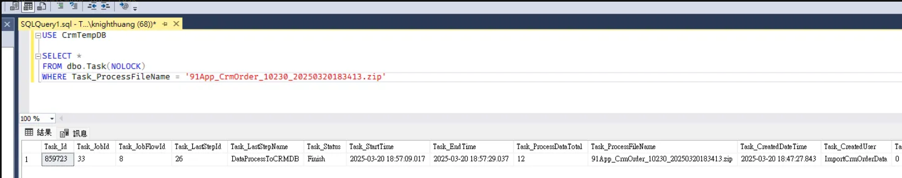
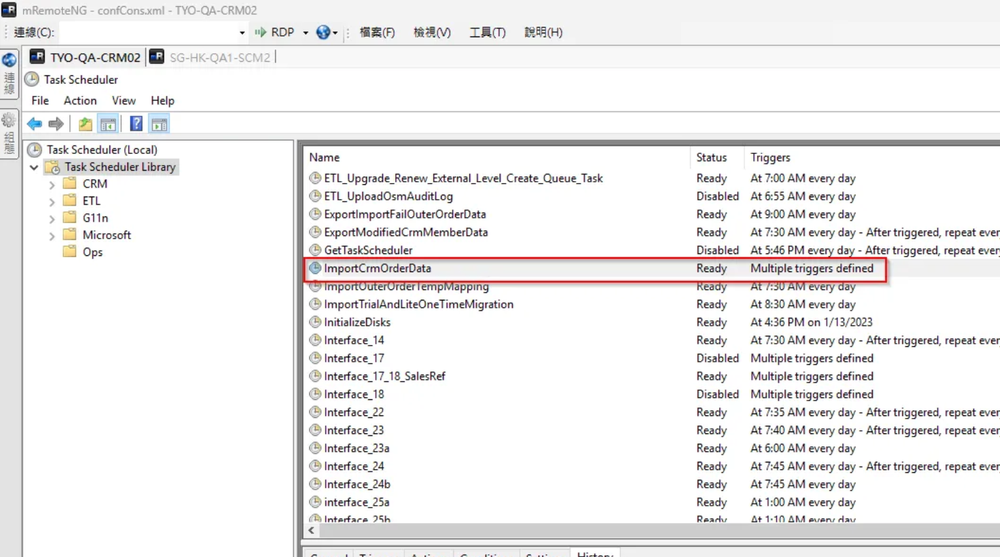
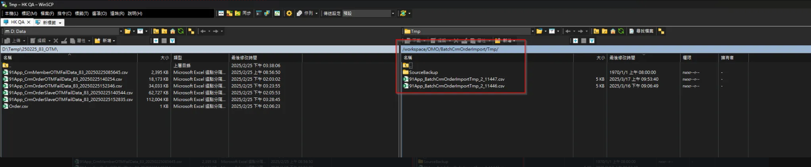
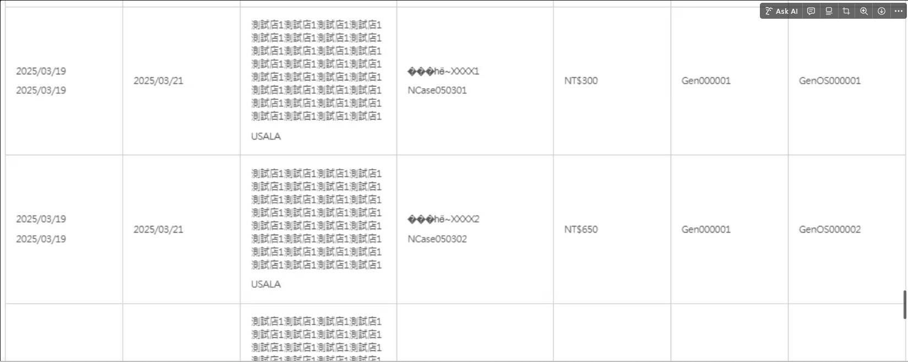

BatchCrmOrderImportTask 交易資料匯入


## 資料暫存位置

CreateBatchUploadNMQTask

SFTP: /workspace/OMO/BatchCrmOrderImport/Tmp (.csv)

```
::Received Job : {"Id":"6ca6572a-2f57-4125-a57b-f76cde5d2d8d","SourceId":"3328812","JobName":"BatchCrmOrderImportTask","Data":"{\"BatchUploadId\":11447,\"ProcessType\":\"ByProcessCount\",\"BatchUploadDataId\":0,\"ProcessCount\":10,\"UploadUser\":\"nancyyeh@nine-yi.com\"}"}
::Create job : BatchCrmOrderImportTask
::Set task CurrentUICulture to => en-US
::Doing
Start BatchUploadTaskProcess
ProcessType:ByProcessCount
BatchUploadDataId:0
ProcessCount:10
批次上傳 User : BatchUpload
目前 job 數 7, 最多執行 job 限制 10
大量上傳批次 Code:BA2503170900001, Type:BatchCrmOrderImport
批次執行記錄目錄路徑\\SG-HK-QA1-SCM2\Storage\Tmp\BatchUpload\ExecutedTasks\20250317
產生執行記錄檔案:\\SG-HK-QA1-SCM2\Storage\Tmp\BatchUpload\ExecutedTasks\20250317\3328812_2_BA2503170900001
更新批次上傳狀態:InProcess
取得待處理批次資料, 筆數:21
執行作業, nmqTaskId:3328812, BatchUploadDataId:0
大量上傳批次處理(多筆)
儲存檔案
儲存路徑:\\SG-HK-QA1-SCM2\Storage\Tmp\BatchCrmOrderImport\2\91App_BatchCrmOrderImportTmp_2_11447.csv
取FTP
取 AWS FTP
cmd 檔案檢查傳入參數：/C D:\Softwares\curl-7.33.0-win64-ssl-sspi\curl.exe --insecure --tlsv1.2 --ftp-ssl --list-only -u qahk91user:@By2FQiwACf@zg sftp://tfsftp-01.qa.hk.91dev.tw/workspace/OMO/BatchCrmOrderImport/Tmp/ | findstr /i _2_
File Name:91App_BatchCrmOrderImportTmp_2_11446.csv
Process ExitCode:0
在FTP上處理中的檔案數量，shopId:2，fileProcessingCount:1
上傳檔案
cmd 上傳傳入參數：/C D:\Softwares\curl-7.33.0-win64-ssl-sspi\curl.exe --insecure --tlsv1.2 --ftp-ssl -T \\SG-HK-QA1-SCM2\Storage\Tmp\BatchCrmOrderImport\2\91App_BatchCrmOrderImportTmp_2_11447.csv -u qahk91user:@By2FQiwACf@zg sftp://tfsftp-01.qa.hk.91dev.tw/workspace/OMO/BatchCrmOrderImport/Tmp/91App_BatchCrmOrderImportTmp_2_11447.csv --ftp-create-dirs
filePath:cmd.exe, ExitCode:0
檔案上傳結束
更新作業執行狀態, status:ReadyToProcess
更新BatchUpload筆數 成功:21, 失敗:0
End BatchUploadTaskProcess
::Finished
^200 OK
["e7f73825-302b-4777-9e4c-99213ae0d457"] Sending HTTP request. Path: "/api/v1/tasks/6ca6572a-2f57-4125-a57b-f76cde5d2d8d:finish"
["e7f73825-302b-4777-9e4c-99213ae0d457"] Received HTTP response. StatusCode: OK, ElapsedMilliseconds: 19.2599
End processing request. RequestId: "e7f73825-302b-4777-9e4c-99213ae0d457",CallerMemberName: "FinishedAsync", ElapsedMilliseconds: 19.5818, RequestMetadata: ""e7f73825-302b-4777-9e4c-99213ae0d457""

- BA2503162100001
- BA2503170900001
```


## BatchUpload Table

- BatchuploadId : 11447
- TypeDef : BatchCrmOrderImport
- BatchUpload_StatusDef = FinishWithError
- ShopEtlFlowId_48
- BatchCrmOrderImportTask


## BatchUploadData Table

- BatchUploadData_StatusDef = ValidateFailed
- BatchUploadData_CreatedUser = BulkInsertBatchUploadData
- BatchUploadData_UpdatedUser = ShopEtlFlowId_48
- BatchUploadData_TypeDef = BatchCrmOrderImport

## 吃檔的 ETL 排程 (接著等排程過來處理檔案)

ImportCrmOrderData FTP產品化串接-每日線下訂單匯入

- ETL (cron 4-59/10 * * * * )(\Order\OMO_Order_ETL_BatchCrmOrderImport, OMO_Order_CRM_PS_ImportCrmOrderData)
    - \Order\OMO_Order_ETL_BatchCrmOrderImport
    - SFTP: /workspace/OMO/BatchCrmOrderImport/2/ (.zip)
    - D:\Batch\EtlConsole\OSMPlusBatchRunFlowById\NineYi.OsmPlus.Batch.RunFlowById.exe
    - --flowname BatchCrmOrderImport
    - CrmTempDB Job / Task
    - 基本資訊 (ShopEtlSlow_Id = 48 , BatchCrmOrderImport, 交易資料匯入)


- JobName : OMO_Order_CRM_PS_ImportCrmOrderData
- 確認 : shopId / to_91APP  ==> shopId / to_91APP/CrmBackup 表示成功
- DB : CrmTempDB Job / Task




## ETLDB

```sql
use EtlDB

select *
from EtlFlowTask(nolock)
where EtlFlowTask_ShopEtlFlowId = 48
and EtlFlowTask_Id = 7888908
and EtlFlowTask_UpdatedDateTime between '2025-03-17' and '2025-03-18'
order by EtlFlowTask_CreatedDateTime desc

select *
from ShopEtlFlowStep(nolock)
where ShopEtlFlowStep_ValidFlag = 1
and ShopEtlFlowStep_ShopEtlFlowId = 48
order by ShopEtlFlowStep_Id 

select *
from EtlFlowTaskSlave(nolock)
where EtlFlowTaskSlave_ValidFlag = 1
and EtlFlowTaskSlave_EtlFlowTaskId = 7888908
--and EtlFlowTaskSlave_UpdatedDateTime  between '2025-03-17' and '2025-03-18'
order by EtlFlowTaskSlave_UpdatedDateTime desc
```


## 機器與確認位置

TWQA -  TYO-QA-CRM02



HKQA

E:/Files/OsmConsole/0/20250317/SalesOrder/100_BatchCrmOrderImport


## 異常原因

檔案未被搬移至 /workspace/OMO/ BatchCrmOrderImport /2




## QA FTPClient.CurlPathV2 登進去資訊

MachineConfig / Backend / QA300

```xml
<add key="QA.AWS.CrmSFTP.FTPServer" value="sftp://tfsftp-01.qa.hk.91dev.tw/"/>
<add key="QA.AWS.CrmSFTP.FTPUserName" value="qahk91user"/>
<add key="QA.AWS.CrmSFTP.FTPPassword" value="@By2FQiwACf@zg"/>
```

```csharp
var ftpFolder = string.Format("workspace/OMO/{0}/Tmp", this._ftpFolderName);
_ftpFolderName = "BatchCrmOrderImport";

string sourceFilePath = this.Save(batchUploadDataList, out shopId);
```

## 怎麼從 UI 看是否匯入

