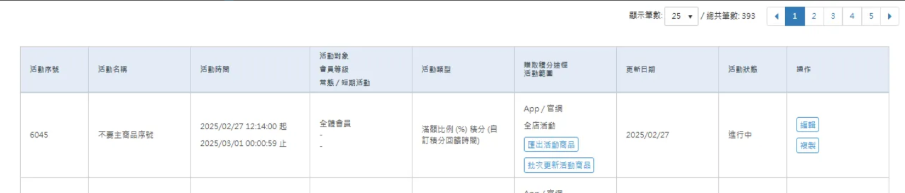

## UI



## OSM API

https://sms.qa1.hk.91dev.tw/api/PromotionEngine/CreateBatchExportDataTask

```json
{
    "BatchUploadType": 166,
    "BatchUploadExecuteTaskType": 149,
    "ExportCondition": {
        "PromotionEngineId": 6045,
        "ShopId": 2
    },
    "Password": "",
    "ShopId": 2
}
```

- BatchUploadType: 166 => ExportRewardPromotionSalePage
- BatchUploadExecuteTaskType: 149 => ExportRewardPromotionSalePageTask


塞 BatchUpload Table -> CreateBatchUploadNMQTask (BatchUpload)

```json
{
   "BatchUploadId":11269,
   "SupplierId":2,
   "UploadType":"ExportRewardPromotionSalePage",
   "UploadUser":"jackyhu@nine-yi.com",
   "FilePassword":"",
   "ExportDataCondition":{
      "ShopId":2,
      "PromotionEngineId":5801
   },
   "Country":null
}
```


## ExportRewardPromotionSalePageService.cs

-> SCMAPIV2

/v2/Promotion/GetPromotionSalePages

```csharp
public class GetPromotionSalePagesRequestEntity
{
    /// <summary>
    /// 商店代碼
    /// </summary>
    public long ShopId { get; set; }

    /// <summary>
    /// 活動序號
    /// </summary>
    public long Id { get; set; }

    /// <summary>
    /// 分區標籤
    /// </summary>
    public string Tag { get; set; }
}
```

-> PromotionWeb

/api/promotion-rules/salepage-list

- ShopId
- Id
- Tag

by 類型取得商品頁並回復類型