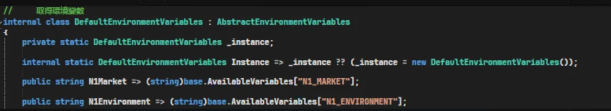
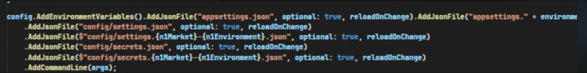

## 設計

- 功能性 or Domain 為第一個節點，要考慮未來好不好拔
- 輕易地進行調整或移除
- 不要有市場判斷寫死在程式碼中，應抽成 Config 來處理


## 商店 3 階段開關

#### example

```xml
<!-- 新版滿額贈商店清單-->
<!--全關："false|none|none"、全開："true|none|none"、部份開啟："true|0,8,233,236|none"、"true|none|20-40,50-55"、"true|0,8,233,236|20-40,50-55-->
<add key="Dev.Promotion.DiscountReachPriceWithFreeGift.Enabled" value="true|2|none"/>
```

- **全關**：`"false|none|none"`
- **全開**：`"true|none|none"`
- **部份開啟（依商店）**：`"true|0,8,233,236|none"`
- **部份開啟（依範圍）**：`"true|none|20-40,50-55"`
- **混合條件**：`"true|0,8,233,236|20-40,50-55"`


#### code

```csharp
var settings = this.ConfigService.GetAppSetting("Promotion.DiscountReachPriceWithFreeGift.Enabled");
bool isDiscountReachPriceWithFreeGiftEnabled = AppSetting.GetIsEnabledInSettingByShopId(shopId, settings);
```


##  Config 對應機器的方法

https://bitbucket.org/nineyi/nineyi.configuration/src/master/serverMaps.json


## base SDK





## DB 定義的 Config

```sql
csp_GetConfigDBAppSettingValue
```