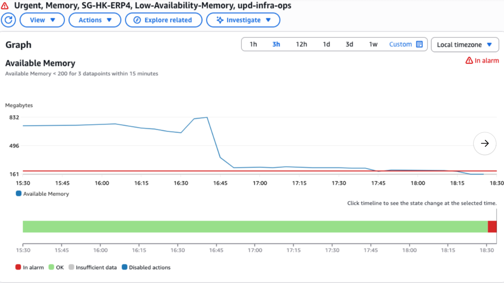
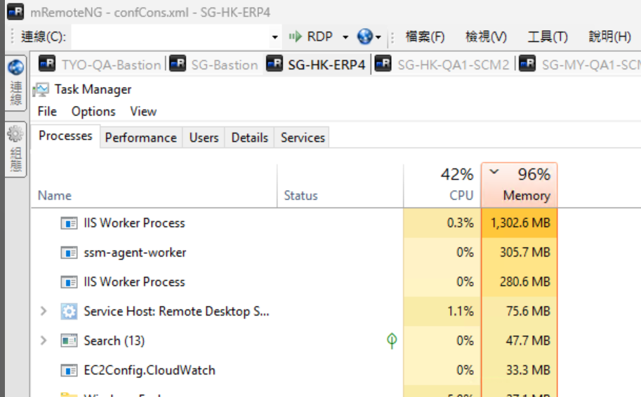
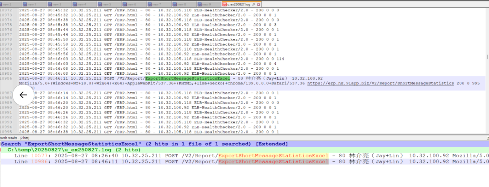

## 記憶體空間不足

https://91app.slack.com/archives/G06A3GDC7/p1756290999439559

SG-HK-ERP4 記憶體小於 160M

執行下線後 iisreset

C:\inetpub\logs\LogFiles\W3SVC1

16:26, 16:46 有操作二次以下功能，吃掉較大的記憶體

/V2/Report/ExportShortMessageStatisticsExcel

