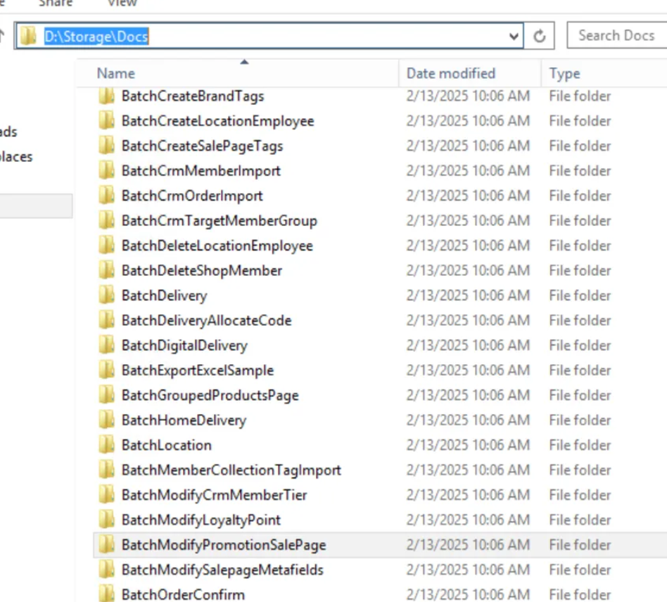

## 文件存放位置

#### HK/MY QA

\\SG-HK-QA1-SCM2\Storage\Docs

E:\Storage\Docs\ModifyRewardPromotionSalePage
E:\Storage\Docs\BatchModifyPromotionOuterId

#### TW QA

D:\Files\Docs\BatchModifyPromotionOuterId


#### 正式環境 by type




## ⚙️ config 檔寫的位置

#### HK QA

```xml
<!-- Filer 檔案路徑 -->
<add key="QA.File.Path" value="\\SG-HK-QA1-SCM2\Storage" xdt:Transform="Insert"/>
<add key="QA.File.Path.Docs" value="\\SG-HK-QA1-SCM2\Storage\Docs" xdt:Transform="Insert"/>
<add key="QA.File.Path.Image" value="\\SG-HK-QA1-SCM2\Storage\Images" xdt:Transform="Insert"/>
<add key="QA.File.Path.Tmp" value="\\SG-HK-QA1-SCM2\Storage\Tmp" xdt:Transform="Insert"/>
<add key="QA.File.Path.Tmp.BatchUpload" value="\\SG-HK-QA1-SCM2\Storage\Tmp\BatchUpload" xdt:Transform="Insert"/>
<add key="QA.File.Path.Tmp.Image" value="\\SG-HK-QA1-SCM2\Storage\Tmp\Images" xdt:Transform="Insert"/>
```

#### HK PROD

```xml
<add key="Prod.File.Path" value="\\SG-HK-Filer1\Storage" xdt:Transform="Insert" />
<add key="Prod.File.Path.Docs" value="\\SG-HK-Filer1\Storage\Docs" xdt:Transform="Insert" />
<add key="Prod.File.Path.Image" value="\\SG-HK-Filer1\Storage\Images" xdt:Transform="Insert" />
<add key="Prod.File.Path.Tmp" value="\\SG-HK-Filer1\Storage\Tmp" xdt:Transform="Insert" />
<add key="Prod.File.Path.Tmp.BatchUpload" value="\\SG-HK-Filer1\Storage\Tmp\BatchUpload" xdt:Transform="Insert" />
<add key="Prod.File.Path.Tmp.Image" value="\\SG-HK-Filer1\Storage\Tmp\Images" xdt:Transform="Insert" />
```


## 後台檔案下載機制


#### 按鈕 api

https://sms.qa1.hk.91dev.tw/CommerceCloud/Docs/BatchModifyPromotionOuterId/Batch update products in promotions template (Product part number).xlsx


#### Routing

```csharp
routes.MapRoute(
    "VirtualDirectoryDocuments",
    "Docs/{*pathInfo}",
    new { controller = "Document", action = "Get" });
```

- **路由名稱**：VirtualDirectoryDocuments
- **URL 模式**：Docs/{*pathInfo}
- **控制器**：Document
- **動作**：Get
- **功能**：處理所有以 "Docs/" 開頭的請求，將其導向 Document 控制器進行檔案存取處理


## Filter PR


#### 交易黑名單

https://bitbucket.org/nineyi/nineyi.files/pull-requests/464/diff