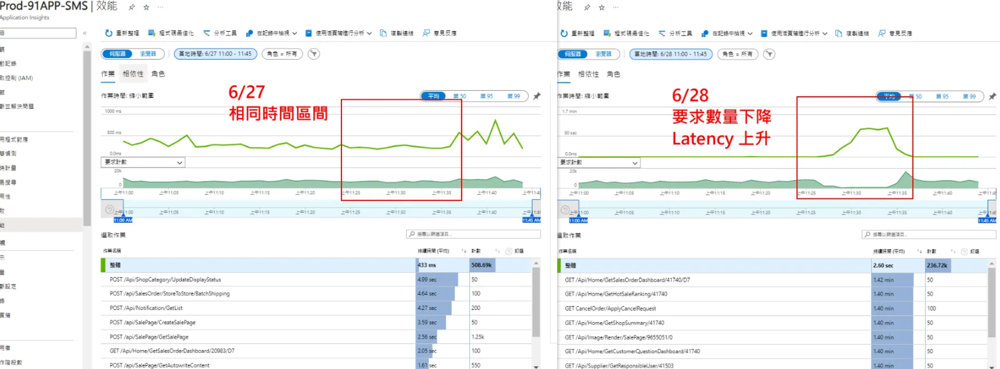

# 📊 Application Insights 監控文件

<br>

  - [🔗 Url](#-監控面板存取)
  - [📈 效能差異評估方法](#-效能差異評估方法)
  - [Latency 延遲評估](#latency-延遲評估)


---


## 🔗 Url

**HK SMS**

<br>

```
https://portal.azure.com/#@91app.biz/resource/subscriptions/a23bf8eb-057f-4ad3-83ad-e1002205aa29/resourceGroups/91APP-HK-SMS/providers/microsoft.insights/components/Prod-91APP-HK-SMS/performance
```

<br>

**URL 組成說明**：

<br>

- **Portal**：Azure 入口網站
- **Tenant**：91app.biz 租戶
- **Subscription ID**：a23bf8eb-057f-4ad3-83ad-e1002205aa29
- **Resource Group**：91APP-HK-SMS
- **Component**：Prod-91APP-HK-SMS
- **View**：performance（效能監控頁面）

<br>

---

## 📈 效能差異評估方法

**回應時間分析範例**：

<br>

以下是實際的效能差異分析案例，展示如何評估系統上線前後的效能變化：

<br>

**TradesOrder/TradesOrderList**：

<br>

- **上線前回應時間**：141.1ms
- **上線後回應時間**：314.8ms
- **效能變化**：上升約 55.2%
- **評估結果**：回應時間明顯增加，需要進一步調查

<br>

**TradesOrder/TradesOrderDetail**：

<br>

- **上線前回應時間**：130.5ms
- **上線後回應時間**：288.0ms
- **效能變化**：上升約 54.7%
- **評估結果**：回應時間顯著延長，影響使用者體驗

<br>

**效能差異計算公式**：

<br>

```
效能變化百分比 = ((新回應時間 - 原回應時間) / 原回應時間) × 100%
```

<br>

## Latency 延遲評估

<br>

Application Insights 也能有效評估系統的 latency（延遲）指標，提供全面的效能分析：

<br>

**Latency 評估項目**：

<br>

- **網路延遲**：用戶端到伺服器的網路傳輸時間
- **處理延遲**：伺服器端處理請求的時間
- **資料庫延遲**：資料庫查詢和回應時間
- **依賴服務延遲**：外部 API 或服務的回應時間

<br>

**Latency 分析範例**：

<br>

```
平均 Latency 變化評估：
- 資料庫查詢延遲：25ms → 68ms（上升 172%）
- API 回應延遲：45ms → 89ms（上升 97.8%）
- 整體服務延遲：120ms → 280ms（上升 133.3%）
```

<br>



<br>

---
