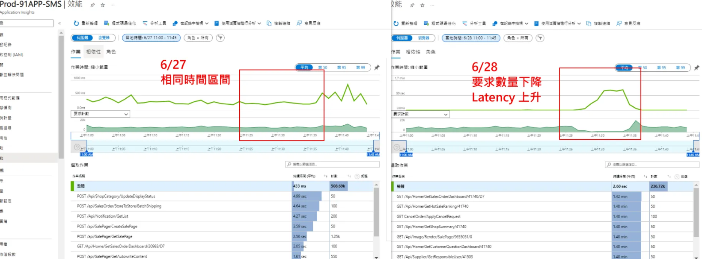
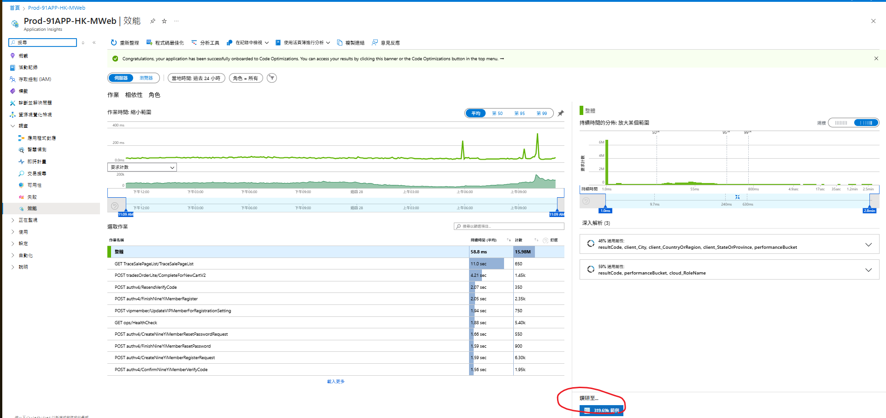
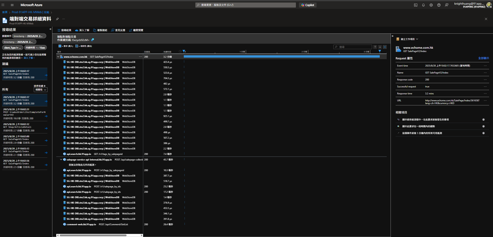

## 連結

[URL](https://portal.azure.com/#view/HubsExtension/ServiceMenuBlade/~/browseAll/extension/Microsoft_Azure_Resources/menuId/ResourceManager/itemId/recents)

---

## 上線前後的效能變化分析

**TradesOrder/TradesOrderList**

- **上線前回應時間**：141.1ms
- **上線後回應時間**：314.8ms
- **效能變化**：上升約 55.2%
- **評估結果**：回應時間明顯增加，需要進一步調查

**TradesOrder/TradesOrderDetail**：

- **上線前回應時間**：130.5ms
- **上線後回應時間**：288.0ms
- **效能變化**：上升約 54.7%
- **評估結果**：回應時間顯著延長，影響使用者體驗

效能變化百分比 = ((新回應時間 - 原回應時間) / 原回應時間) × 100%

<br>
<br>

## Latency 延遲案例

```
平均 Latency 變化評估：
- 資料庫查詢延遲：25ms → 68ms（上升 172%）
- API 回應延遲：45ms → 89ms（上升 97.8%）
- 整體服務延遲：120ms → 280ms（上升 133.3%）
```

<br>



<br>

---

確認個別案例慢在哪裡




## ApplicationInsights 看 API RPS


https://91app.slack.com/archives/G06A3GDC7/p1731317796981559
