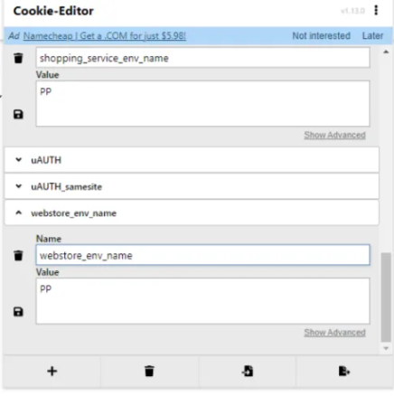

## PP 環境測試設定

在測試 PP 環境時，需要在瀏覽器做以下 Cookie 設定來鎖定特定的機器
```
webstore_env_name : PP
shopping_service_env_name : PP
```


<br>

#### Cookie 設定步驟

1. 開啟瀏覽器開發者工具 (F12)
2. 導航至 Application 或 Storage 頁籤
3. 找到 Cookies 選項
4. 新增上述兩個 Cookie 設定
5. 重新整理頁面即可生效  