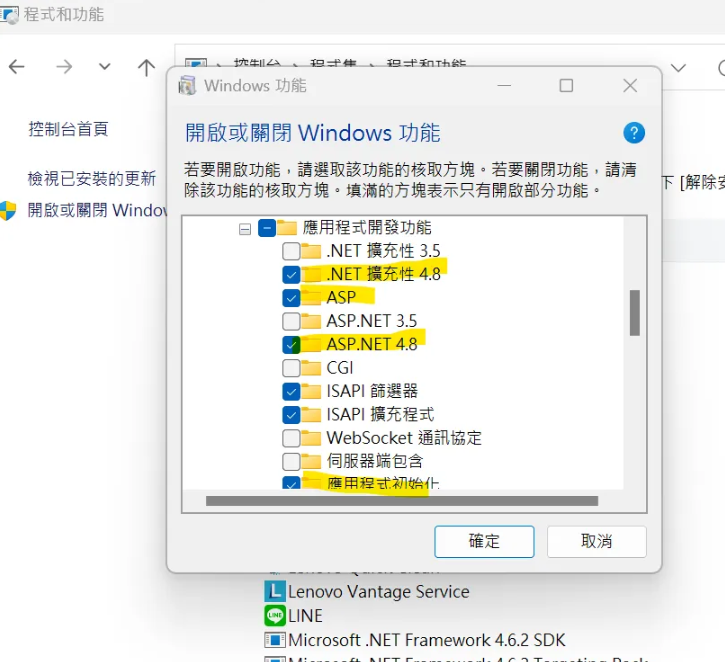

## local log

C:\Files\Log
C:\inetpub\logs\FailedReqLogFiles

## 紀錄

connectionstring
auth cookie


在 QA 先隨便點一個商品頁
登入取得:
 uAUTH
 uAUTH_samesite
 AUTH
 AUTH_samesite
把他們的 Cookie 值複製下來，
4個值好像是一樣的
然後再把 url 改成 dev，
如果被登出了
那就新增這4個 Cookie
重新整理就會變登入狀態


要設定 npm build 相關
要記得改目前專案的config環境


處理一些 npm modules 問題
csproj 問題
nuget 要讓他先登入


## MWEB 會員登入頁面設定

1. 會員頁面是另外一個 domain，host file 記得鎖本機
2. 不安全進入後密碼是：`thisisunsafe`

webapi 是否登入是看 cookie 的 auth / auth_samesite

<br>
<br>

## 重新建置步驟

1. 開啟或關閉 Windows 功能 (windows features on and off)



2. https 要編輯 https binding 的 ssl certificate ==> Default

<br>

#### 確認 Node 版本

```powershell
PS C:\91APP\nineyi.webstore.mobilewebmall> cd .\WebStore\Frontend\
PS C:\91APP\nineyi.webstore.mobilewebmall\WebStore\Frontend> cd .\MobileWebMallV2\
PS C:\91APP\nineyi.webstore.mobilewebmall\WebStore\Frontend\MobileWebMallV2> node -v
v18.18.2
```

<br>

#### 在 V2 執行 npm install

PS C:\91APP\nineyi.webstore.mobilewebmall\WebStore\Frontend\MobileWebMallV2> npm i

<br>

#### 在 V2 執行 build-ts

PS C:\91APP\nineyi.webstore.mobilewebmall\WebStore\Frontend\MobileWebMallV2> npm run build-ts

<br>

#### 在 ClientApp 執行 npm install

```powershell
PS C:\91APP\nineyi.webstore.mobilewebmall\WebStore\Frontend\MobileWebMallV2> cd .\ClientApp\
PS C:\91APP\nineyi.webstore.mobilewebmall\WebStore\Frontend\MobileWebMallV2\ClientApp> npm i
```

#### 在 ClientApp 執行 build:dev

```powershell
PS C:\91APP\nineyi.webstore.mobilewebmall\WebStore\Frontend\MobileWebMallV2\ClientApp> npm run build:dev
```

####　MY MWeb Config 設定

connectionString 只有 V1 proj & WebAPI proj 有 WEBAPI & MVC 要一起加

```xml
<add name="Dev.WebStore" connectionString="Data Source=SG-MY-QA-DB1.sg.91app.corp;Initial Catalog=WebStoreDB;Persist Security Info=True;User ID=webstoredbuser;Password=nTxg4F7U;Application Name=NineYi.MobileWebMall;MultiSubnetFailover=Yes;"/>
```

```xml
<add name="Dev.WebStore" connectionString="Data Source=SG-MY-QA-DB1.sg.91app.corp;Initial Catalog=WebStoreDB;Persist Security Info=True;User ID=webstoredbuser;Password=nTxg4F7U;Application Name=NineYi.MobileWebMall;multipleactiveresultsets=True;MultiSubnetFailover=Yes;"/>
```

前端要 build 過一次

#### hosts

HOST : 127.0.0.1 goldenhorse.91app.tw.dev / goldenhorse.shop.dev.91dev.tw


## npm ci 需要「package-lock.json」存在，但你把它刪掉了

npm ci 必須要有 package-lock.json，如果沒有 → 直接報錯
「我需要 package-lock.json（也叫 shrinkwrap file），但找不到。」

clean-install, ic, install-clean, isntall-clean 
loadVirtual requires existing shrinkwrap file 
The command "npm ci --verbose" exited with code 1.

在 ClientApp 目錄手動執行：npm install


會重新生成
package-lock.json
node_modules/


## 刪除 node_modules 時失敗

```bash
The command "npm ci --verbose" exited with code -4051.
directory not empty, rmdir '...\node_modules\react-native\ReactCommon\logger'
ENOTEMPTY: directory not empty, rmdir ...
```

這是 npm ci 在刪除 node_modules 時失敗 的典型案例，特別常發生在

- Windows 檔案系統（NTFS）
- 有 React Native、ReactCommon、metro 等套件
- 有檔案被 lock、占用、殘留 symlink、或 Windows index/防毒卡住

這並不是你的命令寫錯，而是 npm ci 的特性 在 Windows 上天生比較脆弱

#### 🚨 為什麼 npm ci 會報 ENOTEMPTY？

npm ci = 刪掉整個 node_modules → 重新安裝

流程如下：

1. npm ci 嘗試 rimraf(node_modules)
2. Windows 會拒絕刪掉部分資料夾（最常見原因如下）
3. npm 出現 ENOTEMPTY 或 EPERM → 即使你根本沒有對該資料夾開檔

#### ✅ 方法 手動刪除 node_modules + package-lock.json

關閉 Visual Studio（很重要！VS 會 lock node_modules）

然後
C:\91APP\NineYi.WebStore.MobileWebMall\WebStore\Frontend\MobileWebMallV2\ClientApp\


刪掉

- node_modules
- package-lock.json


然後執行 : npm ci


## Rebuild 時自動執行 npm 指令 的來源問題

```bash
npm config set cache %LOCALAPPDATA%\npm-cache\MWEB\$(EnvMachine)-cache -location project
```

#### ❌ 錯誤 1：-location project 是 Yarn 的參數，但 NPM 不支援

npm 不存在：

--location
-location


所以每次執行必定 Fail → code 1

👉 這是主因

#### ❌ 錯誤 2：路徑寫法中 \$(EnvMachine)-cache 會被 CMD 誤解析

MWEB\DEV-cache


CMD 看到 \D 會把 D 當 escape（取決於字元）。更糟的是你還有這種 MWEB\$(EnvMachine) -cache
\ （反斜線加空白）會破壞整個 Command Parser

#### ❌ 錯誤 3：你的 cache path 拼錯兩種版本（未必是你本意）

A. 有 -cache
npm-cache\MWEB\$(EnvMachine)-cache

B. 少了反斜線，變成 $(EnvMachine) -cache（多一個空白）
npm-cache\MWEB\$(EnvMachine) -cache


這會變成 MWEB\DEV -cache，導致空白後面的會被當成另一個參數 → parser error

#### ✅ 完全修正版（最乾淨、建議採用）

你真正想做的是設定 npm cache 目錄、不要使用 Yarn 才有的 --location project

```xml
<Target Name="Npm_CI" BeforeTargets="PreComputeCompileTypeScriptWithTSConfig;CompileTypeScriptWithTSConfig;CompileTypeScript" Condition="'$(Configuration)|$(Platform)' != 'Debug|AnyCPU'">
  
  <!-- 正確的 npm cache 設定 -->
  <Exec Command="npm config set cache &quot;%LOCALAPPDATA%\npm-cache\MWEB\$(EnvMachine)-cache&quot;" WorkingDirectory="$(ProjectDir)" />
  <Exec Command="npm config set cache &quot;%LOCALAPPDATA%\npm-cache\MWEB\$(EnvMachine)-cache&quot;" WorkingDirectory="$(ProjectDir)\ClientApp" />
  <Exec Command="npm config set cache &quot;%LOCALAPPDATA%\npm-cache\MWEB\$(EnvMachine)-cache&quot;" WorkingDirectory="$(ProjectDir)\CartClientApp" />

  <!-- 執行 npm ci -->
  <Exec Command="npm ci --verbose" WorkingDirectory="$(ProjectDir)" />
  <Exec Command="npm ci --verbose" WorkingDirectory="$(ProjectDir)\ClientApp" />
  <Exec Command="npm ci --verbose" WorkingDirectory="$(ProjectDir)\CartClientApp" />

  <!-- build -->
  <Exec Command="npm run template" WorkingDirectory="$(ProjectDir)" />
  <Exec Command="npm run build:all" WorkingDirectory="$(ProjectDir)\ClientApp" />

</Target>
```


## log 注入解析


builder.RegisterModule<NLogLoggerAutofacModule>();

「跟 Autofac 說：請載入 NLogLoggerAutofacModule 這個模組，裡面怎麼註冊元件你自己去跑。」


接著 Autofac 會去 new 一個 NLogLoggerAutofacModule，然後依序呼叫它內部的一些 lifecycle 方法，其中就包含你 override 的：

Load(ContainerBuilder builder)

AttachToComponentRegistration(IComponentRegistry registry, IComponentRegistration registration)（搭配 Autofac 內部機制）

看欄位：loggerParameter

private readonly Parameter loggerParameter = new ResolvedParameter(
    (ParameterInfo p, IComponentContext c) => p.ParameterType == typeof(ILogger),
    (ParameterInfo p, IComponentContext c) => c.Resolve<ILoggerFactory>().GetLogger(p.Member.DeclaringType));

這行在做兩件事：

匹配條件（第一個 lambda）

(p, c) => p.ParameterType == typeof(ILogger)


意思是：

「如果某個建構子參數的型別是 Utility.Logging.ILogger，就套用這個規則。」

如何產生參數值（第二個 lambda）

(p, c) => c.Resolve<ILoggerFactory>().GetLogger(p.Member.DeclaringType)


c.Resolve<ILoggerFactory>()：向 DI container 取出 ILoggerFactory

p.Member.DeclaringType：這個參數所屬的類別（例如 ReturnGoodsConfirmEntityValidator）

GetLogger(DeclaringType)：根據類別型別建立一個 logger

👉 翻成白話：

「遇到建構子裡有 ILogger 參數時，就用 ILoggerFactory 幫你生出一個『針對該 class 的 logger』塞進去。」

看 AttachToComponentRegistration
protected override void AttachToComponentRegistration(
    IComponentRegistry registry,
    IComponentRegistration registration)
{
    registration.Preparing += (s, e) =>
    {
        e.Parameters = new Parameter[1] { loggerParameter }
            .Concat(e.Parameters);
    };
}


這段是在「攔截每一個被註冊到容器的 Component」，做事的地方：

Autofac 每註冊一個元件（例如 ReturnGoodsConfirmEntityValidator、PayProcessContextValidator、YourService），
就會呼叫一次 AttachToComponentRegistration。

這裡又做了：

registration.Preparing += ...


Preparing 事件會在：

Autofac 準備要 new 出這個元件「實例」之前觸發。

裡面這行：

e.Parameters = new Parameter[1] { loggerParameter }.Concat(e.Parameters);


意思是：

把我們剛才定義的 loggerParameter 放到「這個元件的建構子參數決議規則」的最前面。

以後這個元件在被 new 的時候，Autofac 會先用 loggerParameter 規則去試著解 ILogger 類型的參數。

👉 翻成白話：

「之後只要 container 要 new 任何一個註冊過的類別，我都先幫你掛上這個『ILogger 自動注入規則』。
如果建構子裡有 ILogger，我就會幫你自動生一個對應型別的 logger 丟進去。」

重點：這裡只有處理「建構子參數注入」，完全沒有註冊 ILogger 本身作為 service。

🔍 看 Load(ContainerBuilder builder)
protected override void Load(ContainerBuilder builder)
{
    builder.RegisterType<NLogLoggerFactory>()
           .As<ILoggerFactory>()
           .SingleInstance();
}


這個就單純多了：

註冊 NLogLoggerFactory 為 ILoggerFactory

SingleInstance() → singleton，一個容器只會有一個 factory

所以在整個容器裡，真正被註冊的是：

✅ ILoggerFactory

❌ ILogger（完全沒有註冊）

2️⃣ 那 Module 什麼時候生效？「只要後續 Module.Load 就會被註冊了嗎？」

你問：

「只要後續 Module.Load 就會被註冊了嗎？」

這裡有兩個層次要拆開來講：

(A) builder.RegisterModule<NLogLoggerAutofacModule>() 會發生什麼事？

當你呼叫這行時，Autofac 大致做這幾件事：

建立一個 NLogLoggerAutofacModule 實例

呼叫 module 的：

Load(builder) → 立刻註冊 ILoggerFactory

AttachToComponentRegistry(componentRegistry)（在 Autofac 內部）
→ 進而讓 AttachToComponentRegistration 在每個之後的 registration 上被呼叫

所以回答你的問題：

✅ 是的，當這個 Module 被註冊之後：

ILoggerFactory 立刻就被註冊（因為在 Load 裡）

之後容器新增的 component registration 都會被套上「自動注入 ILogger」的 Preparing 規則

(B) 「後續 Module.Load」是什麼意思？

如果你是指：

「我有很多 module，例如：
DA 模組、BLV2 模組、Utility 模組、Logging 模組，
只要在 Web.config 或程式碼裡列出 <module ... />，這些 Load 都會執行嗎？」

答案是：

✅ 是，所有被 RegisterModule 或 Web.config <module> 指定的 Module 都會執行它們的 Load。

執行順序大部分時候不是你太需要緊張的事，除非有互相依賴。

但這個 NLogLoggerAutofacModule 的特性是：

它在 AttachToComponentRegistry 時，註冊 Registered 事件（讓每個新註冊元件都被掛上準備規則）

所以只要 Module 不是在「所有註冊都做完之後才註冊」，通常都可以涵蓋住大多數元件。

3️⃣ 回到你的核心疑惑：為什麼「不能 _lifetimeScope.Resolve<ILogger>()，但建構子注入可以？」

因為上面這個 module：

✅ 註冊了 ILoggerFactory

✅ 幫「任何有 ILogger 建構子參數的類別」動態塞 logger

❌ 從頭到尾都沒有註冊過 ILogger 這個型別本身

所以：

// ❌ 這會噴「沒有註冊 ILogger」
var logger = _lifetimeScope.Resolve<ILogger>();

// ✅ 這會成功，因為建構子參數會被 NLogLoggerAutofacModule 自動處理
public class FooService
{
    public FooService(ILogger logger) { ... }
}


這是「設計上就故意這樣」，不是你用錯。

✅ 總結幫你整理一下

builder.RegisterModule<NLogLoggerAutofacModule>() 做了兩件事：

在 Load() 裡註冊 NLogLoggerFactory → ILoggerFactory

在 AttachToComponentRegistration() 裡幫所有元件掛上「自動注入 ILogger」規則

它只會讓「建構子有 ILogger 參數的類別」可以自動拿到 logger

不會讓 _lifetimeScope.Resolve<ILogger>() 成功

因為 ILogger 根本沒有被註冊成 service

是的，只要這個 Module 有被註冊（不管是程式碼 RegisterModule 或 Web.config module），它的 Load 就會被執行，註冊會生效。

如果你接下來想搞清楚：

要怎麼讓 所有 Validator 都能用建構子注入 ILogger

要不要 / 要怎麼把 ILogger 也註冊成可 Resolve 的 service

或想看一個「專門給 91APP WebAPI 用的 LoggingModule + Validator 整合」範例

你可以跟我說你比較在意哪一塊，我可以幫你整理一個完整、可以直接貼進專案的版本。


## The command "npm ci --verbose" exited with code 1.

👉 npm ci 執行失敗了（非正常結束）
👉 --verbose 代表「詳細 log 已經印出來了」，但你現在只貼到最後一行

npm i 一下


## webapi 一直掛掉


看 event viewer

發現 Dev.WebStore 重複


C:\91APP\nineyi.webstore.mobilewebmall\WebStore\Frontend\BL.Test\App.config
