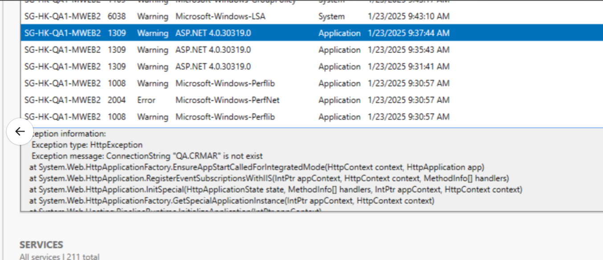

## HK QA 前台連線異常

HK QA 前台今天壞了，只有首頁進得去，其他頁面都不行

#### 排查步驟

1. **Event Viewer 檢查**：
   - 路徑：Windows Logs -> Application
   - 發現連線字串未加讀取問題

2. **根因分析**：
   - 資料庫連線字串配置問題
   - 讀取權限未正確設定

**相關討論**：
[Slack 討論串](https://91app.slack.com/archives/C63SH8G3D/p1737595898823709)

## 購物車無法進入 - SPL API 404 錯誤

 

**問題描述**：
購物車進不去，發現有一個打 SPL API 404，TW 沒有做好跨環境部署

 

#### 排查步驟

1. **檢查 API 呼叫狀態**：
   - 查看瀏覽器開發者工具 Network 頁籤
   - 確認 SPL API 回傳 404 狀態碼

2. **根因分析**：
   - 跨環境部署配置問題
   - TW 環境 SPL API 服務未正確建置或配置

3. **解決方案**：
   - 確認 TW 環境 SPL API 服務狀態
   - 檢查跨環境部署配置檔案
   - 重新部署相關服務

## 網頁失效 - IIS 服務停止

網頁失效，有時是 IIS 關掉了

 

#### 排查步驟

1. **檢查 IIS 服務狀態**：
   - 開啟 IIS Manager
   - 確認應用程式集區狀態
   - 檢查網站服務是否執行中

2. **常見原因**：
   - 應用程式集區自動回收
   - 記憶體不足導致服務停止
   - 設定檔錯誤導致服務無法啟動

3. **解決方案**：
   - 重新啟動 IIS 服務
   - 檢查應用程式集區設定
   - 查看 Windows Event Viewer 相關錯誤訊息