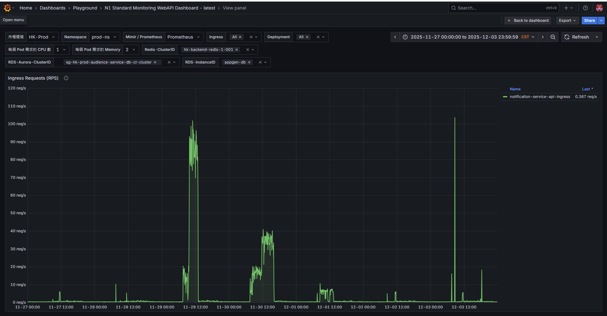

## NMQ 機器消化通知信

- 升級機器至 c5.4xlarge
- 餘 161 萬，RPS 100，預計 18:30 ~ 19:00 左右發送完畢
- SG-HK-NMQ[3-4] 加開上線 掛上 group9005
- SQL 語法查看 NNQV2 task 的總數量（ReadyToSwitch ＋ Switched）
- 觀察 NS 流量，查看 RPS
- （Task 總數量 + NmqV3 SendTemplateMailPriorityLow 堆積數量）/ [RPS 數量] / 60 (秒) / 60 (分鐘) == 完成發送還需多少小時


## ns dashboard

https://monitoring-dashboard.91app.io/d/eeewc4p6nwnwgb/n1-standard-monitoring-webapi-dashboard-latest?orgId=2&from=2025-11-26T16:00:00.000Z&to=2025-12-03T15:59:59.000Z&timezone=Asia%2FTaipei&var-MarketENV=HK-Prod&var-Namespace=prod-ns&var-is_mimir=Prometheus&var-Cluster=dfHnWT74z&var-CloudWatch=9jOlsfnVk&var-ingress=$__all&var-deployment=$__all&var-Per_Pod_CPU_Request=1&var-Per_Pod_Mem_Request=2&var-Service_Catalog=&var-topk_1_node=ip-10-32-230-46.ap-southeast-1.compute.internal&var-Quey_Taints=&var-Query_Taints_For_ASG=Worker&var-ASG=SG-HK-EKS-Worker-v2&var-DBClusterIdentifier=sg-hk-prod-audience-service-db-cl-cluster&var-CacheClusterID=hk-backend-redis-1-001&var-DBInstanceIdentifier=appgen-db&viewPanel=panel-275



## 語法

2025/09/29 當天，JobId = 112 的任務，在每一分鐘內被建立了幾筆（只算有效、且狀態為 ReadyToSwitch 或 Switched 的任務）

```SQL

-- 「無條件捨去秒數」
-- | 原始時間     | 轉換後      |
-- | -------- | -------- |
-- | 09:15:03 | 09:15:00 |
-- | 09:15:59 | 09:15:00 |
-- | 09:16:01 | 09:16:00 |
-- 讓「同一分鐘內的所有資料，都長成一樣的時間值」，方便後面 GROUP BY

use NMQV2DB;
with prequery as (
SELECT 
    DATEADD(MINUTE, DATEDIFF(MINUTE, 0, Task_CreatedDatetime), 0) AS  MinuteInterval,*
FROM dbo.Task WITH (NOLOCK)
WHERE Task_ValidFlag = 1
  AND Task_CreatedDatetime BETWEEN '2025/09/29 00:00:00' AND '2025/09/29 23:59:59'
  AND Task_JobId = 112
  AND Task_Data LIKE N'%折價券到期通知信%'
)
select MinuteInterval,count(*) as totalCount
from prequery
group by MinuteInterval
order by MinuteInterval
```