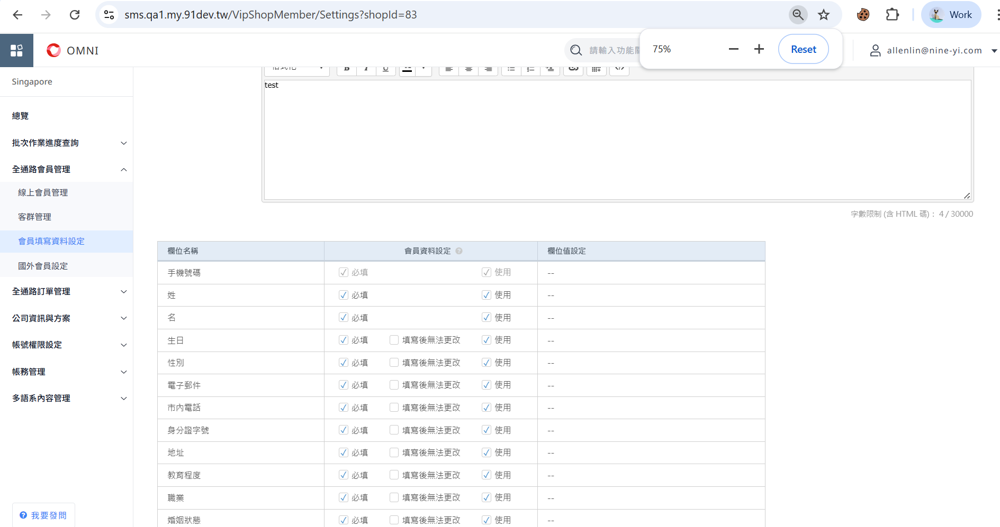

## 怎麼開啟要顯示那些

https://sms.qa1.my.91dev.tw/VipShopMember/Settings?shopId=83

前台會員中心就會看到

## 基本資料預設國別

地址 會根據依據國碼自動帶上

===============================================

代辦

- 會員中心基本資料新增地址是否可以正確儲存並給別人拿取
- 會員中心基本資料電話號碼後端驗證
- 常用收件人電話
- 常用收件人地址

## 會員中心基本資料新增地址 - 會阻擋要叫你填 LocationAddress, LocationState

要改 必填 LocationState 這件事情

https://mytestmina.shop.qa1.my.91dev.tw/webapi/VIPMember/InsertOrUpdateVIPMember?lang=zh-TW&shopId=83

{
    "vipMemberInfo": {
        "AnnualIncomeTypeDef": "200kOrLess",
        "Birthday": "2025-11-30T16:00:00.000Z",
        "BirthdayString": "2025-12-01",
        "CellPhone": "87829286",
        "CountryCode": "65",
        "CountryProfileId": "35",
        "Custom1": null,
        "Custom2": null,
        "Custom3": null,
        "Custom4": null,
        "Custom5": null,
        "DependentsTypeDef": "None",
        "EducationTypeDef": "PrimaryOrBelow",
        "Email": "g@gmail.com",
        "FirstName": "FE",
        "FullName": null,
        "GenderTypeDef": "Male",
        "IdentityCardId": "F121112221",
        "LastName": "FE",
        "LocalPhone": "89391183",
        "LocationCountryAliasCode": "SG",
        "LocationAddress": "efefe",
        "LocationCity": null,
        "LocationCountry": "Singapore 新加坡",
        "LocationDistrict": null,
        "LocationState": "ffef",
        "LocationZipCode": "88881992",
        "MarialStatusTypeDef": "Single",
        "OuterAccount": null,
        "OuterId": null,
        "OuterPassword": null,
        "ProfessionTypeDef": "FinanceOrInsurance"
    },
    "shopId": 83,
    "memberCardId": 59,
    "Token": "6474f13b-6a22-46d5-9d79-a6fa753104af"
}

會存到

use WebStoreDB

select VipMemberInfo_LocationAddress,*
from VipMemberInfo(nolock)
where VipMemberInfo_ValidFlag = 1

## 必填不必田

VipShopMemberInfoRule

var localCountryCode = this._configService.GetAppSetting("SystemDefault.Local.CountryCode");

要改用銷售市場

#### 訪問

https://mytestmina.shop.qa1.my.91dev.tw/V2/VipMember/Profile#/ 

React 元件載入 Profile 元件
從 Redux/Props 取得資料:
countryCityList: 國家城市列表（包含 MY 的地址欄位設定）
vipMemberProfiles: 會員資料（包含現有地址值）
isLocationBindingFlow: 是否為綁定流程

https://mytestmina.shop.qa1.my.91dev.tw/webapi/VIPMember/GetVIPMemberItemV2?memberCardId=59&lang=zh-TW&shopId=83

{
    "VipMemberInfoRuleId": 0,
    "ColumnName": "LocationDistrict",
    "ColumnHint": null,
    "CustomName": "鄉鎮市區",
    "IsRequire": true,
    "IsBound": false,
    "IsReadOnly": false,
    "IsReadOnlyAfterWrite": false,
    "IsUsing": true,
    "Value": null,
    "Display": null
}
{
    "VipMemberInfoRuleId": 0,
    "ColumnName": "LocationCity",
    "ColumnHint": null,
    "CustomName": "城市",
    "IsRequire": true,
    "IsBound": false,
    "IsReadOnly": false,
    "IsReadOnlyAfterWrite": false,
    "IsUsing": true,
    "Value": null,
    "Display": null
}

資料庫中 VipShopMemberInfoRule 表的 Address 欄位規則設定了 IsRequired = true

這個規則會套用到所有地址相關的子欄位，包括：

LocationCountry (國家)
LocationAddress (地址)
LocationState (城市)
LocationCity (鄉鎮市區)
LocationZipCode (郵遞區號)

// VIPMemberService.cs Line 2933
var memberRule = this.VIPMemberRepository
    .GetVIPMemberInfoRule(shopId, memberInfo.VipShopMemberCardId)
    .Where(x => x.ColumnCode == "Address")  // ← 只查詢一筆 "Address" 規則
    .FirstOrDefault();

// VIPMemberService.cs Line 3428-3432
private VIPMemberWithRuleEntity<object> SetVipMemberInfoLocationForAppEntity(...)
{
    var item = new VIPMemberWithRuleEntity<object>();
    
    // 從 memberRule 複製屬性到每個地址欄位
    item.IsRequire = vipMemberInfoRule.IsRequired;  // ← 所有欄位都繼承相同的值
    item.IsBound = vipMemberInfoRule.IsBound;      // ← 所有欄位都繼承相同的值
    item.IsUsing = vipMemberInfoRule.IsUsing;
    
    // ...
    return item;
}

只有少數欄位會在特定條件下覆寫這些規則：

// LocationDistrict: MY 市場不顯示
if (isUsingDistrict == false && columnCode == "LocationDistrict")
{
    item.IsUsing = false;   // ← 強制設為不顯示
    item.IsBound = false;   // ← 強制設為非必填
}

// LocationZipCode: HK 市場不顯示且非必填
if (countryProfileId == hkCountryProfileId && columnCode == "LocationZipCode")
{
    item.IsUsing = false;
    item.IsRequire = false;  // ← 強制設為非必填
    item.IsBound = false;
}

