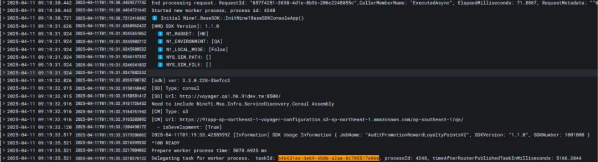
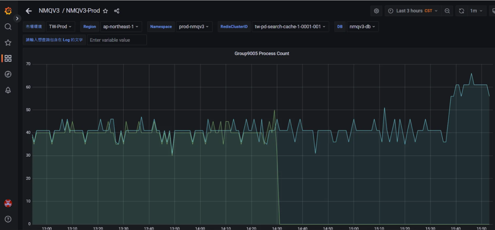
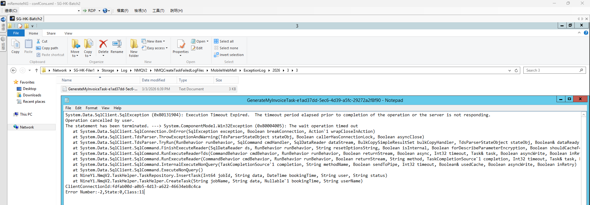

## 空間不足

跑 treesiefree

SG-HK-NMQ3，C 曹已經塞爆，主要都是 _SendTemplateMailPriorityLow log
我先刪舊log


## 2. Job 無法啟動出現 null

**可能原因**：可能沒有加 Job 進 Dashboard 或沒上程式碼
**正常 log 範例示意圖**：


<br>
<br>

## 3. NMQ 卡住 Ready

**解決方法**：到 Rancher 對該 Group 執行 Redeploy


## 7. Job Group 處理狀況

**關鍵字**：
```
group9005
SendTemplateMailShopMemberPresent
```




## SG-HK-Batch Save job fail

SG-HK-Filer1/Storage/Log/NMQV2/NMQCreateTaskFailedLogFiles/MobileWebMall/ExceptionLog/2026/3/3





```bash
ERROR|Exception has occurred - Message: Save job error, job data: GenerateMyInvoiceTask;{"ShopId":22,"TradesOrderGroupCode":"TG260303U00043"};3/3/2026 6:41:56 PM;3239512|System.AggregateException
```


```bash
at NineYi.NmqV2.TaskHelper.TaskHelper.CreateTask(String jobName, String data, Nullable`1 bookingTime, String userName)
at NineYi.WebStore.Frontend.BLV2.NmqV2TaskHelper.TaskHelperService.CreateTask(String jobName, String taskData, Nullable`1 bookingTime, String createUser) in D:\ws\workspace\yi.webstore.mobilewebmall_master\WebStore\Frontend\BLV2\NmqV2TaskHelper\TaskHelperService.cs:line 39
at NineYi.WebStore.Frontend.BLV2.PayProcesses.Processors.CreateGlobalInvoiceProcessor.Process(PayProcessContextEntity context) in D:\ws\workspace\yi.webstore.mobilewebmall_master\WebStore\Frontend\BLV2\PayProcesses\Processors\CreateGlobalInvoiceProcessor.cs:line 64
at NineYi.WebStore.Frontend.BLV2.ThirdPartyPay.TradesOrderPaymentService.FinishPayment(Int64 shopId, Int64 memberId, String payChannel, String payMethod, String tgCode, String k, String queryString, Boolean isFromWorker, IDictionary`2 extendData) in D:\ws\workspace\yi.webstore.mobilewebmall_master\WebStore\Frontend\BLV2\ThirdPartyPay\TradesOrderPaymentService.cs:line 436
at NineYi.WebStore.Frontend.MobileWebMallV2.Controllers.PayChannelController.PayChannelReturn(String payMethod, String payChannel, String tgCode, String k, IDictionary`2 extendData) in D:\ws\workspace\yi.webstore.mobilewebmall_master\WebStore\Frontend\MobileWebMallV2\Controllers\PayChannelController.cs:line 95
```


## 怎麼搜尋到這個 exception?

他在 mweb 非 api

ERROR|Exception has occurred - Message: Save job error, job data: GenerateMyInvoiceTask;{"ShopId":22,"TradesOrderGroupCode":"TG260303U00043"};3/3/2026 6:41:56 PM;3239512|System.AggregateException Details


http://elmahdashboard.91app.hk/?Page=1&Pagesize=1000&App=MobileWebMall&App=WebApi&Type=System.AggregateException&Host=&Keyword=&ExceptMessage=&StartTime=03%2F03%2F2026+18%3A00&EndTime=03%2F03%2F2026+18%3A50


## 觸發點

C:\91APP\nineyi.webstore.mobilewebmall\WebStore\Frontend\BLV2\ThirdPartyPay\TradesOrderPaymentService.cs

FinishPayment

```csharp
//// 付款成功後的 Processor
var processorList = this._lifetimeScope.ResolveKeyed<IEnumerable<Lazy<IPayProcessProcessor, ProcessorMetadata>>>(PayProcessProcessorModule.ThirdPartyFinishProcess);
foreach (var processor in processorList.OrderBy(i => i.Metadata.Order))
{
    this._logger.Info(processor.Metadata.Description);

    //// 執行流程工作
    processor.Value.Process(context);
}
```


## 複習付款開始


C:\91APP\nineyi.webstore.mobilewebmall\WebStore\Frontend\BLV2\PayProcesses\PayProcessService.cs


CreateTradesOrder
var processName = context.PayProcessFlowType.ToString();
this.ExecuteProcess(context, processName, true);