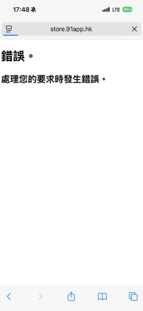
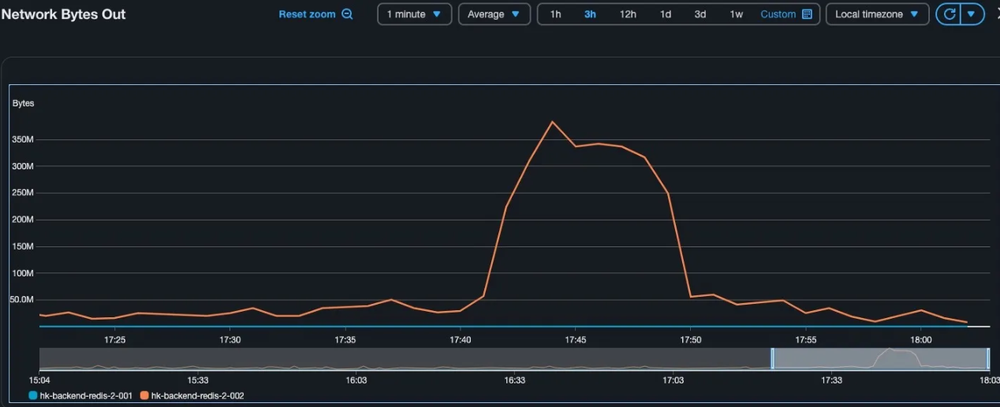
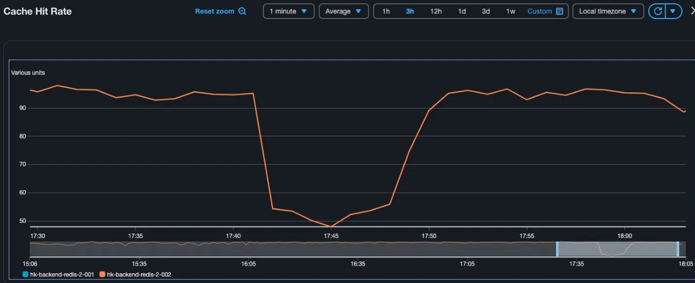
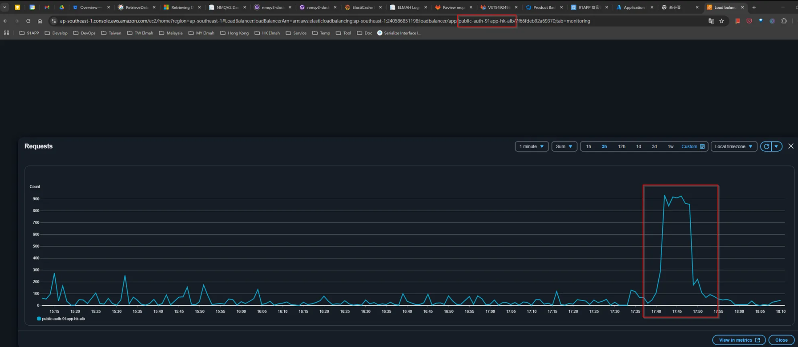
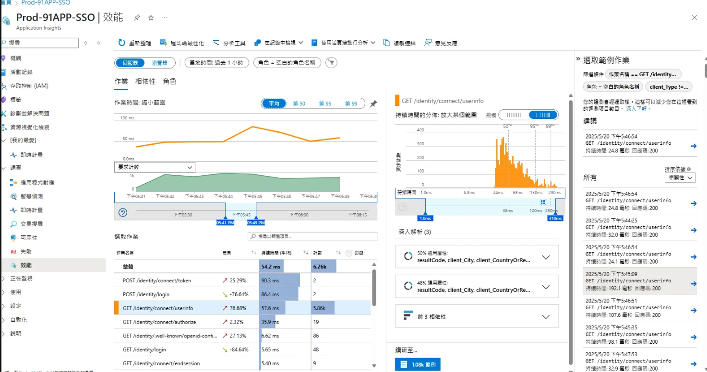
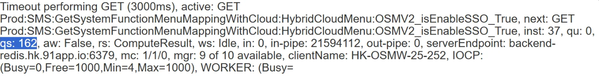
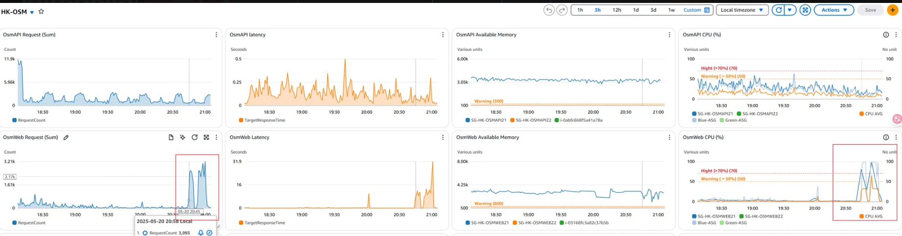

## HK ERP 無法仿登 OSM 後台



**發生時間**：2025-05-20 17:39:07.520 ~ 17:50
**問題描述**：HK ERP 無法仿登 OSM 後台，系統出現 Redis 連線異常
**確認步驟**：
1. RD 實測進 Web / APP
2. 檢查 elmah 錯誤記錄
**Elmah 錯誤連結**：
```
http://elmahdashboard.91app.hk/Log/Details/0d21dbbc-2440-4a5f-bed4-c4f82e760b2f
```
**錯誤類型**：RedisTimeoutException
**Infra 確認結果**：
- 有大量流量拉取 Redis 快取
- 瞬間流量過大導致部分機器 timeout
- Auth (SSO) 觀察到大量 Requests







**異常流量分析**：
- **時間區間**：17:41 ~ 17:48
- **API 呼叫**：Auth 的 GET /identity/connect/userinfo
- **頻率**：約 RPM 900 次
- **來源**：大量 request 從 https://analytics.91app.hk/ 呼叫



**問題根因**：
- Market Claude 在 17:41 ~ 17:49 大量呼叫 `/identity/connect/userinfo`
- 該 API 會存取 Redis 的 session key
- 導致 backend redis 管線阻塞
- qs: 162 (已有 162 未回應的命令)


**影響範圍**：
1. 17:41 ~ 17:49 從 `analytics.91app.hk` 大量呼叫 `https://auth.91app.hk/identity/connect/userinfo`，約 RPM 900 次
2. Backend redis 處理不及，造成阻塞
3. 影響 OsmWeb 其他功能也無法存取 redis
4. 造成 OsmWeb 的 Redis 連線異常
**詳細統計**：
- **OsmWeb GET /api/Mimir/GetShopInfoList**：RPM 約 2000 次
- **Auth GET /identity/connect/userinfo**：RPM 約 900 次
- **Redis 輸出量**：每次回傳 160 KB，每分鐘 2000 次請求（2000 x 0.16 mb = 320 mb）
**Cache Key 分析**：
```
Prod:SMS:Permission:RolePermission:{rolesId}-{memberId}-{language}
```
- 每一包約 160 KB（權限資料）

**緊急處理**：
- OSM Web CPU High 時手動加機器
- 來源 IP 確認：18.138.33.149（我們自己的 NAT IP）

**後續行動**：
1. 釐清 Market Claude 異常呼叫的原因（5/21）
2. 確認是否需要從 Redis / Application 端優化，或是前告警（5/21）

**結論**：
主要是 OsmWeb 的 `/api/Mimir/GetShopInfoList` 的高頻請求造成伺服器異常



## 硬碟滿了

- 可先刪掉去年的Nlog資料
- 路徑：`E:\log\ny-log\Common\NLog\ScmApiV2\NLog`
- 路徑：`E:\log\ny-log\Common\NLog\ScmApi\NLog`


系統有排程會定期清理 log 並且上傳至 S3

#### 排程

Task Scheduler --> Task Schedule Library --> Push Log to S3