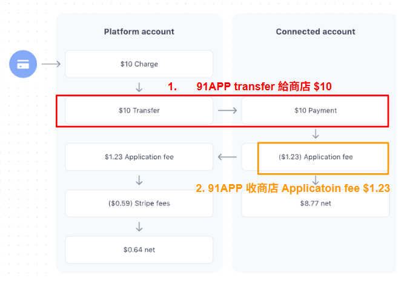

# 支付風控與流程管理

## 目錄
1. [信用卡徵信 / 平台徵信](#1-信用卡徵信--平台徵信)
2. [交易風控](#2-交易風控)
3. [Paymentmiddleware 訂單流程狀態](#3-paymentmiddleware-訂單流程狀態)
4. [Payment Middleware Role](#4-payment-middleware-role)
5. [商店處理退款](#5-商店處理退款)
6. [請款單 (PaymentRequest)](#6-請款單-paymentrequest)
7. [Stripe 的 Destination mode 金流帳務流向](#7-stripe-的-destination-mode-金流帳務流向)
8. [Custom mode 與 Standard Mode 差異](#8-custom-mode-與-standard-mode-差異)

 

---

## 1. 信用卡徵信 / 平台徵信

### 銀行做的「徵信」：是金融風險層面的授權機制

這個是你熟悉的那種「信用卡徵信」，是由銀行或金流商（例如藍新、綠界、歐付寶）在付款當下進行的

 

確認「這張信用卡」是不是合法、額度夠不夠、有沒有被盜刷

 

消費者輸入信用卡資料，平台把資料交給金流商／銀行

 

銀行會進行：

 

卡號、有效期、安全碼檢查

 

卡片是否掛失、停卡

 

有沒有超出信用額度

 

有無風控警示

 

銀行回傳「授權成功」或「拒絕」這層徵信的目的：保護銀行的錢，確認卡可用

 

### 平台（例如 91APP）做的「徵信」：是商店／交易風險控管機制

TradesOrderService.IsNeedCreditCheckInfo 講的「徵信」，不是信用卡金融徵信，而是「平台內部的商店風險徵信」

 

平台在讓商店使用「信用卡付款服務」前，要確認該商店本身是否可信、風險是否可控，平台有時會走「代收代付」或「大特店模式」，

 

在這些模式下：錢會先經過平台的系統（或至少交易記錄是由平台建立）

 

如果商店是詐騙商家、洗錢商家，消費者退貨、爭議、洗卡風險都可能會回到平台頭上！所以平台必須自己對「商店」做一層徵信。

 

| 步驟       | 檢查重點                | 本質                   |
| -------- | ------------------- | -------------------- |
| Step 1   | 信用卡是否空白／是否需要徵信      | 判斷是否走信用卡流程           |
| Step 2   | 是否 3D 驗證（3D Secure） | 若有 3D 安全機制就較安全，可略過徵信 |
| Step 3   | 是否在白名單              | 若商店是可信的老客戶，就不重複徵信    |
| Step 4–7 | 檢查商店累積金額是否超過門檻      | 金額太大可能風險高，要重新徵信      |

 

它不是在查「信用卡」，而是在查「這個商店的信用狀況」。

 

這家商店過去有沒有退貨、洗錢、爭議紀錄

 

總交易額是否異常（超過設定門檻）

 

是否曾經被列入觀察名單（黑名單）

 

是否是 3D 驗證的安全商店

 

銀行只認得「卡」，不認得「商店」。但平台是「集合了成千上萬商家的電商中心」。如果平台讓一個可疑的商店開立帳戶、代收金流，那商店刷假單、洗錢、倒帳，銀行退刷時是退給消費者、但從平台帳戶扣回。

 

---

## 2. 交易風控

### 第一個風控分流點

如果是「票券類商品」（像電子票券、序號、課程券等）

 

→ 因為商品無法退回、有詐騙風險高，通常禁止或加強風控。

 

→ 所以會直接走紅線「Y → 終止交易（高風險）」。

 

### 是否有「定期購」商品

如果是定期購（Subscription、Recurring Payment），

 

→ 風險較高，要特殊金流處理（紅線）。

 

→ 例如銀行需支援 recurring 授權、不能一般信用卡授權。

 

### 服務供應商是否為 NCCC

（NCCC 是國內信用卡金流清算中心）

 

若使用 NCCC 通道 → 視為銀行主導風控，平台可略過部分檢查。

 

若不是（例如 TapPay、91APPPayment 等第三方）

 

→ 就要平台自己處理風控邏輯。

 

### 商店是否為「指定收款銀行」

這是 平台風控 vs 商店指定金流 的分流點。

 

如果商店走自己的金流（例如：自己申請 TapPay 或綠界），

 

→ 由商店自行承擔風險。

 

否則 → 由平台（91APP）接手風控。

 

### 累計訂單門檻 >= 1

這是金額判斷關卡。

 

系統會檢查商店的交易金額是否超過風控設定的門檻（例如一次訂單超過 $5,000）。

 

若高於門檻 → 進一步檢查商店風險。

 

若低於 → 視為低風險，可略過部分驗證。

 

### 是否在白名單

白名單 = 可信商店或客戶（過往徵信正常、風險低）。

 

若在白名單 → 可略過徵信。

 

若不在白名單 → 檢查是否外國卡／發卡銀行風控。

 

### 發卡國家代碼是否為 TW

若不是台灣（TW），代表外卡交易。

 

外卡 → 風險高、退刷率高 → 必須強制做 3D 驗證。

 

若是台灣卡 → 繼續往下判斷。

 

### 發卡銀行是否指定 3D 驗證

若銀行要求此卡必須走 3D Secure（像 Visa Secure / Mastercard ID Check）

 

→ 一律走 3D 驗證流程。

 

若銀行沒指定，或查不到 → 由平台依金額與商店風控再決定。

 

### 是否 3D 交易異常

若上一次 3D 驗證出錯（例如 3D 伺服器超時、卡號錯誤），

 

系統會記錄為「異常」。

 

若再次發生 → 強制走 3D 流程，以保安全。

 

---

## 3. Paymentmiddleware 訂單流程狀態

https://app.diagrams.net/#G1eUZ-EHMtYZnOWgzXQh1jIlaIazfvuM6G#%7B%22pageId%22%3A%220783ab3e-0a74-02c8-0abd-f7b4e66b4bec%22%7D

 

### 三個階段

建立訂單（下單）

 

發動付款（導向金流）

 

回傳付款結果（成功 / 失敗）

 

### 角色

NMQV2：內部 API Gateway 或後端模組，處理訂單資料

 

MMWeb：商店網站前端／商城平台

 

External Websites：外部金流網頁（例如信用卡輸入頁、3D 驗證頁）

 

Payment Middleware：金流中介層，封裝各家金流商 API（像 TapPay、NCCC、PayNow）

 

### 金流

Pay：發動付款

 

3D Auth / PayCode：進行安全驗證

 

Return / Callback：金流商通知結果

 

Query / Cancel：查詢或取消交易

 

### 🟢 Step 1：使用者建立購物車並下單

位置：MMWeb

 

使用者在網站結帳 → 觸發 API /WebApi/TransOrderLite/Send

 

系統呼叫 ThirdPartyProcess（第三方金流初始化流程）

 

這個步驟會把：

 

訂單明細

 

金額

 

付款方式

 

打包好準備送給金流服務

 

這是「交易起始點」，建立一筆「待付款訂單」

 

### 🟡 Step 2：呼叫金流中介層發動付款

位置：Payment Middleware → External Websites

 

MMWeb 呼叫 Payment Middleware 的 Pay()

 

middleware會：

 

產生交易序號（Trade ID）

 

呼叫外部金流商的付款 API

 

取得金流導向網址（例如 TapPay 的 PayUrl 或 3D 驗證頁面）

 

接著，使用者會被導向金流商頁面，進行：

 

信用卡輸入

 

3D 驗證（如果有開啟）

 

### 3D 驗證或 PayCode 流程（安全驗證）

位置：External Websites

 

若銀行要求 3D 驗證（例如 Visa Secure / MasterCard ID Check）：

 

使用者會跳轉至銀行頁面，輸入 OTP 或驗證碼

 

驗證成功後 → 回傳結果給平台的回呼網址（Callback URL）

 

若是非 3D 模式（一般授權）：由金流商直接回傳結果給平台（免跳頁）

 

### 金流回傳付款結果（Callback → PayChannelReturn）

位置：/V2/PayChannel/PayChannelReturn

 

這是金流最重要的回呼點：

 

外部金流網站會呼叫此 API，把交易結果回報給平台：

 

成功 → 回傳授權碼、交易序號

 

失敗 → 回傳錯誤代碼（例如授權拒絕、逾時）

 

平台接到回傳後會呼叫 ThirdPartyFinishProcess 處理後續：

 

更新訂單狀態（成功 / 失敗）

 

記錄金流交易紀錄（PaymentLog）

 

若成功 → 發票與庫存流程啟動

 

### 🔘 Step 5：判斷付款結果

系統根據回傳結果分兩種：

 

成功 → 結束流程，回傳成功頁面

 

失敗 / 逾時 / 錯誤 → 顯示付款失敗頁，允許重新付款

 

若平台沒收到金流回傳（例如使用者中途關掉頁面），系統可呼叫 QueryPayment 主動向金流商查詢付款狀態。

 

### 🔴 Step 6：例外處理：Query / Cancel

QueryPayment（查詢交易）

 

用交易編號問金流商：「這筆交易到底成功沒？」

 

避免 Callback 遺漏的狀況。

 

Cancel（取消交易）

 

若金流授權成功但後來需要撤銷（例如使用者取消訂單），

 

就會呼叫取消 API 通知金流商撤回授權。

 

---

## 4. Payment Middleware Role

消費者於 MWeb 結帳時，發送結帳相關資訊至 Payment Middleware ，再根據付款方式呼叫至對應的第三方付款服務

 

### PayProcesses (結帳)

正向表列金流，訂單相關邏輯建立，根據 PSP 以及 PayChannel 走 tw / hk..., Paymentmiddleware 會根據 paymethod 做處理

 

轉導

 

PayChannelReturn

 

### 退款流程

取消、退貨流程發動後，由 NMQ 發送退款相關資訊至 Payment Middleware ，再根據付款方式呼叫至對應的第三方付款服務

 

建立退款單後會被每小時定期排程撈到

 

NMQV2_GeneratePaymentMiddleWareRefundRequestGrouping (HH:02)

 

退款表就會開始轉狀態

 

Grouping -> 建立退款 Task -> PaymentMiddle

 

### 補單機制

消費者於 MWeb 結帳時的頁面轉導流程一旦中斷(3D 驗證 or QR Code)，將由 Push Worker 上的 Console Application 定時啟動，查詢付款狀態仍然停留在 WaitingToPay 的訂單付款狀態，透過 Payment Middleware 呼叫對應的第三方付款服務相關訂單狀態。

 

---

## 5. 商店處理退款

通知信: 為了避免商店延誤退款處理，每天 10:20 am 將發送前10天的累計待處理退款單，提醒商店有待處理的退款單以及退款失敗的

 

OSM 功能位置: 帳務處理 > 第三方金流退款單查詢 (/RefundRequest/List)

 

此功能可以讓商店處理:

 

### 退款失敗處理

由於商店自行申請的第三方金流帳號產生的訂單 91APP 無權限查看第三方後台實際的退款狀態，為了避免重複退款，須請商店自行至第三方後台查看實際退款狀態後，再到OSM更新退款單狀態。

 

### 自行匯款給消費者

超過第三方金流退款時效的訂單，將無法直接退回消費者，加上正向金流已撥款給商店，需請商店自行匯款給消費者，並透過此功能匯出消費者回填的匯款資訊，並於匯款完成後更新退款狀態

 

退款方式為【匯款】且退款單狀態為【退款中】的待處理訂單

 

至OSM查看訂單資訊 並 匯出消費者匯款資訊

 

商店需要自己去匯款給消費者，可查看消費填寫的銀行帳戶，並執行匯款

 

---

## 6. 請款單 (PaymentRequest)

 

---

## 7. Stripe 的 Destination mode 金流帳務流向

7.1 detination charge

Full charge amount (10.00 USD) → added to connected account's pending balance

 

Application fee (1.23 USD) → subtracted from the charge and transferred to platform

 

Stripe fees (0.59 USD) → subtracted from platform account's balance

 

Platform 最後淨得 = 1.23 - 0.59 = 0.64 USD

 

| 階段                    | Stripe 內部帳務邏輯                         | 實際金流意義        |
| --------------------- | ------------------------------------- | ------------- |
| 1️⃣ 顧客付款              | $10 → 加到商家 pending                    | 顧客付款成功        |
| 2️⃣ 扣 Application Fee | 商家 -$1.23 → 平台 +$1.23                 | Stripe 自動幫你抽成 |
| 3️⃣ 扣 Stripe Fee      | 平台 -$0.59（手續費）                        | Stripe 收走手續費  |
| ✅ 結果                  | 商家 +$8.77 / 平台 +$0.64 / Stripe +$0.59 | 一次結算完成        |

 

7.2 91 application fee

Application Fee 91向客戶每筆訂單的收費 =
91APP 收客戶的系統使用費 (X%) +
91APP 收客戶的金流手續費利率 (Y%) +
91APP 收客戶的金流手續費固定費用 (HK$Z.ZZ)
*客戶金流手續費每個客戶都不同，由 91APP 在 ERP 設定。

Stripe Fees Stripe 收 91APP 的金流手續費 =
Stripe 收 91APP 利率 (R%)+
Stripe 收 91APP 固定費用 (HK$U.UU)
*此費用由 Stripe 設定

---

## 8. Custom mode 與 Standard Mode 差異

### 8.1 開店流程新增子帳號、第三方金物流資料設定填寫帳號資料

**建立 Stripe 帳號流程**：

 

打 Stripe API 建立 ACC ID → 打 API 取得資料填寫連結 → 填寫完畢帳號啟用

 

**第三方金物流資料設定**：

 

第三方金物流資料設定_金流資料設定，新增判斷「商店預設值」後台第三方帳號類型

 

若為 Standard 則維持現有架構

 

若為 Custom 則顯示新架構

 

**帳號狀態判定**：

 

狀態為填寫完成 = 該子帳號的回傳值 `"charges_enabled": true`

 

**KYC 表單填寫**：

 

點擊「Stripe 子帳號頁面」轉導到「Stripe KYC form」

 

由客戶填寫 KYC 表單（公司、代表人資訊、聯絡方式）

 

### 8.2 金流手續費費率新增國別和卡別維度

**費率計算維度擴展**：

 

新增國別維度計算

 

新增卡別維度計算

 

支援更細緻的手續費費率設定

 

### 8.3 結帳判斷商店 Stripe 帳號類型

**結帳流程判斷**：

 

判斷商店 Stripe 帳號類型

 

使用 Custom 新架構

 

根據信用卡國別和卡別計算金流手續費用

 

### 8.4 對帳報表和入賬明細表

**報表功能**：

 

對帳報表支援 Custom mode

 

入賬明細表支援新架構

 

### 8.5 Statement Descriptor 設定

**描述符規則**：

 

`statement descriptor` 的值來自於商店合約申請單的「公司英文名稱」

 

`statement descriptor` 的值限制是 22 個字

 

若超過 22 個字，只會顯示前 22 個字元

 
