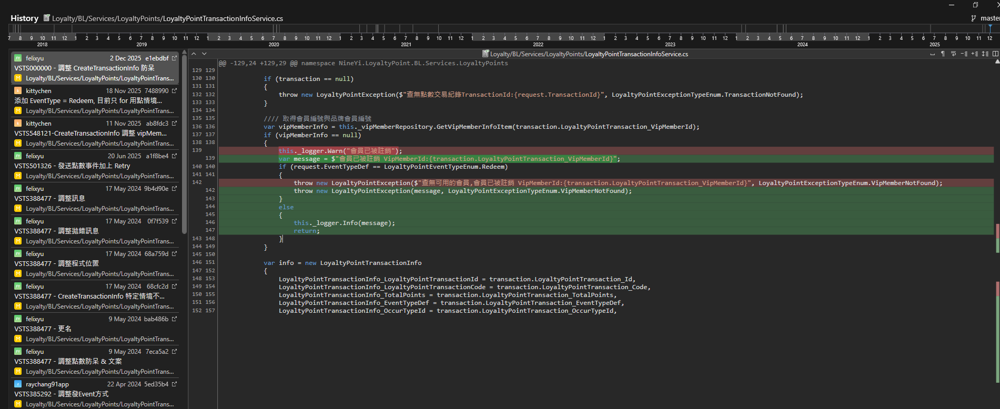

https://91app.slack.com/archives/C7T5CTALV/p1764892802246459


NineYi.SCM.Frontend.NMQV2.LoyaltyPoints.CreateLoyaltyPointTransactionInfoProcess.DoJob(TaskInfoEntity data) 


【2025-12-04T16:50:30.5763841Z】【SG-MY-NMQ1】【bfdaec72-c0ee-4bbc-9621-4753769c7e8e】【70115636】 Object reference not set to an instance of an object. {"ClassName":"System.NullReferenceException","Message":"Object reference not set to an instance of an object.","Data":null,"InnerException":null,"HelpURL":null,"StackTraceString":" at NineYi.LoyaltyPoint.BL.Services.LoyaltyPoints.LoyaltyPointTransactionInfoService.CreateTransactionInfo(TransactionInfoTaskEntity request)\r\n at NineYi.SCM.Frontend.NMQV2.LoyaltyPoints.CreateLoyaltyPointTransactionInfoProcess.DoJob(TaskInfoEntity data) in D:\\ws\\workspace\\on_Build_nineyi.scm.nmqv2_master\\SCM\\Frontend\\NMQV2\\LoyaltyPoints\\CreateLoyaltyPointTransactionInfoProcess.cs:line 53\r\n at NMQ.Core.Worker.Service.WorkerProcess.DoJob(StdIOTask task) in C:\\workspace\\src\\task\\NMQ.Core.Worker\\Service\\WorkerProcess.cs:line 105","RemoteStackTraceString":null,"RemoteStackIndex":0,"ExceptionMethod":"8\nCreateTransactionInfo\nNineYi.LoyaltyPoint.BL.Services, Version=1.0.0.0, Culture=neutral, PublicKeyToken=null\nNineYi.LoyaltyPoint.BL.Services.LoyaltyPoints.LoyaltyPointTransactionInfoService\nVoid CreateTransactionInfo(NineYi.LoyaltyPoint.BE.LoyaltyPoints.TransactionInfoTaskEntity)","HResult":-2147467261,"Source":"NineYi.LoyaltyPoint.BL.Services","WatsonBuckets":null}


{"TransactionId":8661573,"OccurType":"SystemSchedule","OccurDateTime":"2025-12-04T23:59:59","EventTypeDef":"Expire","StatusTypeDef":"Normal","OccurDescription":null,"CrmShopMemberCardId":null,"TotalAmount":null}


【2025-12-04T16:50:30.5755007Z】【SG-MY-NMQ1】【bfdaec72-c0ee-4bbc-9621-4753769c7e8e】【70115636】 會員已被註銷


C:\91APP\NMQ\nineyi.scm.nmqv2\SCM\Frontend\NMQV2\LoyaltyPoints\CreateLoyaltyPointTransactionInfoProcess.cs


```sql
SELECT *
FROM "view_worker_log"
WHERE date = '2025/12/04'
--and _msg like '%cs:line 53%'
and _hid = 'SG-MY-NMQ1'
AND json_extract(_props, '$.taskid') = CAST('4b6f5b04-2807-4bd8-9847-970b81756cf9' as JSON)
limit 10;
```


C:\91APP\NMQ\nineyi.scm.nmqv2\Loyalty\BL\Services\LoyaltyPoints\LoyaltyPointTransactionInfoService.cs


看起來一樣的問題不會發生了

