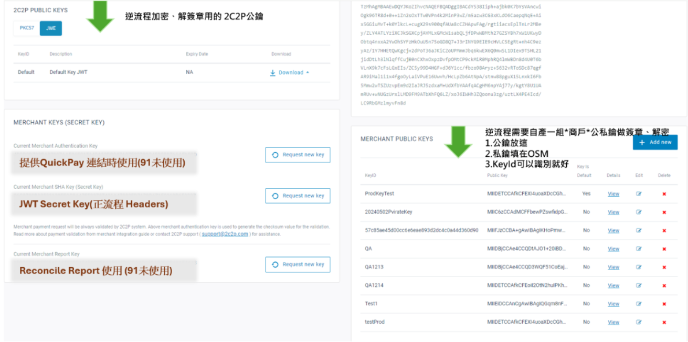
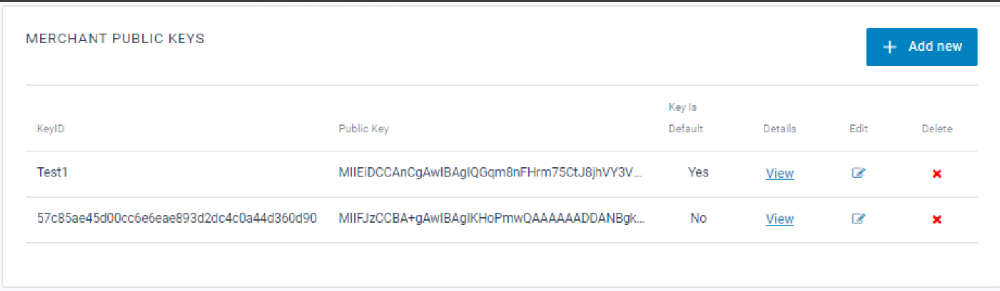

# 2C2P

2C2P 是一個支援多種支付方式的金流服務商，透過 Hosted Payment Page 提供付款處理


## 目錄
1. [支援的支付方式](#支援的支付方式)
2. [環境配置](#環境配置)
3. [退款處理](#退款處理)
4. [支付方式識別](#支付方式識別)
5. [Error Codes](#error-codes)
6. [安全設定](#安全設定)
7. [API 參考文件](#api-參考文件)

<br>

## 支援的支付方式

- 信用卡付款 (Visa, Mastercard)
- Alipay Hong Kong

<br>
<br>

## 環境配置

| 環境 | 商戶後台 URL | 說明 |
|------|-------------|------|
| 沙盒環境 | https://my.2c2p.com/2.0/Login | 測試環境 |
| 正式環境 | https://demo2.2c2p.com/My2C2P/client/2.0/Login | 生產環境 |

**識別碼**: `TwoCTwoP`

<br>
<br>

## 退款處理

<br>

#### 退款前置條件
退款操作僅允許對已結算 (Settled) 的交易執行，交易狀態必須為 `S`。

<br>

#### 退款 Error Codes
| 代碼 | 說明 | 處理狀態 |
|------|------|----------|
| 46 | 餘額不足，無法執行退款 | RefundPending |

> **注意**: Settled 狀態表示銀行或金流商已完成清算，實際資金已從消費者轉入商家帳戶。

<br>

#### NMQ Job


| Job_Id | Job_Name | Job_Description | Job_ClassName |
|------|------|----------|------|
| 440 | TwoCTwoPRefundRequestFinish | PaymentMiddleware退款完成 | NineYi.SCM.Frontend.NMQV2.ThirdPartyPayments.PaymentMiddleWareRefundRequestFinishProcess | RefundPending |

```json
{"RefundRequestIds":[121537],"TradesOrderGroupId":1476443,"PayType":"TwoCTwoP"}
```


<br>
<br>

## 支付方式識別

ERP 第三方金流付款查詢紀錄的欄位（根據『信用卡一次付清』、『信用卡分期付款』、『AlipayHK』）

<br>

#### 支付方案代碼對照表
| 支付方式 | agentCode | channelCode | paymentScheme |
|----------|-----------|-------------|---------------|
| 信用卡一次付清 | UOBT | VI | VI |
| 信用卡分期付款 | UOBT | VI | VI |
| Alipay HK | ALIPAY | AH | AH |

<br>

#### 回應格式範例
```json
{
    "AgentCode": "UOBT",
    "ChannelCode": "VI",
    "CardType": "CREDIT",
    "IssuerCountry": "US",
    "IssuerBank": "FIRST DATA CORPORATIONS",
    "InstallmentPeriod": null,
    "PaymentScheme": "VI"
}
```

> 參考文件: [2C2P Payment Scheme Codes](https://developer.2c2p.com/docs/reference-codes-payment-scheme)

<br>
<br>

## Error Codes

<br>

#### 付款與查詢
| 代碼 | 描述 | 說明 |
|------|------|------|
| 0000 | Successful | 付款成功 |
| 2001 | Transaction in progress | 取得付款連結 |
| 0003 | Transaction is cancelled | 用戶取消付款 |
| 4081 | Unable to Authenticate Card Holder | 3D 驗證失敗或取消 |

> 完整 Error Codes 請參考: [Response Codes](https://developer.2c2p.com/docs/response-code-payment)
> 
<br>

#### 退款與取消
| 代碼 | 描述 | 說明 |
|------|------|------|
| 00 | Successful | 操作成功 |
| 12 | Transaction in progress | 交易狀態不允許執行此操作 |
| 99 | Unable to Authenticate Card Holder | 3D 驗證失敗 |

> 完整 Error Codes 請參考: [Reverse Process Codes](https://developer.2c2p.com/docs/response-code-payment-maintenance-result-code)


<br>
<br>

## 安全設定

<br>

#### 金鑰產生

**方法一：使用官方工具**

使用 2C2P 官方提供的 Key Generation 工具: [Certificate Generation Guide](https://developer.2c2p.com/docs/certificate-generation-guide)

**方法二：使用 OpenSSL**

下載 OpenSSL 後，在 PowerShell 執行以下語法：

- `.key` 檔為商戶私鑰
- `.crt` 檔為商戶公鑰

```powershell
# 請一行一行執行並輸入每個 Command 所需資訊
# 僅識別使用 KeyName = $"S{SupplierId}S{ShopId}"
$KeyName="S12S34"
  
# 產生 key (這就是商戶私鑰)
&"C:\Program Files\OpenSSL-Win64\bin\openssl.exe" genrsa -out "$KeyName.key" 2048
  
# 產生 csr (後續相關參數可以直接 Enter 跳過)
# 相關參數說明可以參考 https://blog.miniasp.com/post/2022/06/14/How-to-request-new-tls-certificate-using-OpenSSL
&"C:\Program Files\OpenSSL-Win64\bin\openssl.exe" req -new -key "$KeyName.key" -out "$KeyName.csr"
  
# 產生 crt(這就是商戶公鑰)
&"C:\Program Files\OpenSSL-Win64\bin\openssl.exe" x509 -req -in "$KeyName.csr" -signkey "$KeyName.key" -out "$KeyName.crt" -days 365
 
# 產生 cer
&"C:\Program Files\OpenSSL-Win64\bin\openssl.exe" x509 -inform PEM -in "$KeyName.crt" -outform DER -out "$KeyName.cer"
 
# 產生 pem
&"C:\Program Files\OpenSSL-Win64\bin\openssl.exe" x509 -pubkey -in "$KeyName.cer" -noout > "$KeyName.pem"
```

<br>

#### 金鑰配置說明
- ( 左上 ) receiverPubKey : 逆流程加密用，因此 2C2P 會用另外一把解密
- ( 左中 ) JWT Secret Key : 正流程加密用
- ( 右下角 ) PubKey / Private : 逆流程簽章





<br>
<br>

## API 參考文件

<br>

#### 官方文件
- [API Payment Inquiry Response Parameter](https://developer.2c2p.com/docs/general)
- [正流程](https://developer.2c2p.com/docs/redirect-api-integrate-with-payment)
- [逆流程](https://developer.2c2p.com/docs/payment-maintenance-refund-guide)
- [回應參數](https://developer.2c2p.com/docs/api-payment-inquiry-response-parameter)

<br>

#### 測試資源
- [沙盒環境](https://developer.2c2p.com/docs/sandbox)
- [測試卡號](https://developer.2c2p.com/docs/reference-testing-information)

<br>

#### 官方網站
- [2C2P 官網](https://2c2p.com/accept-payments)

<br>

#### 其他
- [專案規劃](https://docs.google.com/presentation/d/1X5YyfOXTNJGXxA7C3gZutQVGzCJRJbZ-Z1A-gQqcDsY/edit#slide=id.gb6f87d9610_0_87)
- [設計稿](https://docs.google.com/presentation/d/1X5YyfOXTNJGXxA7C3gZutQVGzCJRJbZ-Z1A-gQqcDsY/edit#slide=id.gb6f87d9610_0_87)
- [上線說明文件](https://docs.google.com/presentation/d/1X5YyfOXTNJGXxA7C3gZutQVGzCJRJbZ-Z1A-gQqcDsY/edit#slide=id.gb6f87d9610_0_87)
- [Knight note](https://docs.google.com/presentation/d/1X5YyfOXTNJGXxA7C3gZutQVGzCJRJbZ-Z1A-gQqcDsY/edit#slide=id.gb6f87d9610_0_87)
- [串接問題清單](https://docs.google.com/presentation/d/1X5YyfOXTNJGXxA7C3gZutQVGzCJRJbZ-Z1A-gQqcDsY/edit#slide=id.gb6f87d9610_0_87)