# Stripe 文件

## 目錄
1. [異常案例紀錄](#1-異常案例紀錄)
2. [帳戶類型](#2-帳戶類型)
3. [ApplicationFee / Refund / TransferReversal](#3-applicationfee--refund--transferreversal)
4. [系統使用費 / 金流手續費](#4-系統使用費--金流手續費)
5. [publishableKey](#5-publishablekey)
6. [App 設定值處理](#6-app-設定值處理)
7. [第三方金物流 pk + acct 設定根據帳戶類型差異](#7-第三方金物流-pk--acct-設定根據帳戶類型差異)
8. [Stripe 後台操作](#8-stripe-後台操作)
9. [帳戶類型與 Key 整理](#9-帳戶類型與-key-整理)
10. [技術文件與資源](#10-技術文件與資源)
11. [OAuth 整合與前台認證](#11-oauth-整合與前台認證)
12. [信用卡付款流程](#12-信用卡付款流程)
13. [記住信用卡功能](#13-記住信用卡功能)
14. [帳戶切換與管理](#14-帳戶切換與管理)
15. [支援信用卡類型](#15-支援信用卡類型)
16. [3D Secure 驗證失敗處理](#16-3d-secure-驗證失敗處理)

<br>

---

## 1. 技術文件與資源

#### Stripe Custom Account 需求規劃

**主要文件**：

| 文件類型 | 連結 | 用途 |
|----------|------|------|
| **需求規劃簡報** | [Stripe Custom Account-需求規劃](https://docs.google.com/presentation/d/1rf8MKdV2Vh6ofZq6repFjUd-2DUYjhpv9I2ppT0rSYI/edit?slide=id.p#slide=id.p) | Custom Account 的完整需求規劃與技術設計 |

---

## 2. 帳戶類型與金鑰

### 2.1 帳戶類型對比

| 類型 | 說明 | 費率設定 | 適用對象 | 範例 |
|------|------|----------|----------|------|
| **Custom** | 平台統一費率 | 由平台設定統一費率 | 小型商店 | 在 OSM 按按鈕即可開設帳戶 |
| **Standard** | 個別談判費率 | 商店自行與 Stripe 談判 | 大型商店 | SASA 等大型零售商 |

### 2.2 系統帳戶類型清單

#### 帳戶類型分類
- **Custom 系列**
  - `Custom` - Custom 正式環境
  - `CustomTest` - Custom 測試環境
  - `CustomUAT` - Custom UAT 環境
  - `CustomUATTest` - Custom UAT 測試環境

- **Standard 系列**
  - `Standard` - Standard 正式環境
  - `StandardUAT` - Standard UAT 環境

### 2.3 帳戶類型查詢

#### 資料庫查詢語法
```sql
-- 查詢商店的 Stripe 帳戶類型
SELECT *
FROM ShopDefault (NOLOCK)
WHERE ShopDefault_ValidFlag = 1
  AND ShopDefault_ShopId = @shopId
  AND ShopDefault_Key = 'StripeAccountType'
```

### 2.4 系統設定管理

#### 取得商店 Stripe 設定
```csharp
public StripeSettingsEntity GetShopStripeSetting(long shopId, bool cleanCache = false)
{
    // 從資料庫取得 Stripe 相關設定
    IEnumerable<ShopDefaultEntity> shopDefault = 
        this.ShopDefaultRepository.GetShopDefaultListByGroupTypeDef(shopId, new List<string> { "Stripe" });

    return new StripeSettingsEntity
    {
        StripeAccountType = shopDefault.SingleOrDefault(x => x.Key == "StripeAccountType").NewValue,
        StripeAccountSettingType = shopDefault.SingleOrDefault(x => x.Key == "StripeAccountSettingType").NewValue,
        StripeSubAccount = shopDefault.SingleOrDefault(x => x.Key == "StripeSubAccount").NewValue,
        StripeCustomSubAccount = shopDefault.SingleOrDefault(x => x.Key == "StripeCustomSubAccount").NewValue,
        StripeCustomTestSubAccount = shopDefault.SingleOrDefault(x => x.Key == "StripeCustomTestSubAccount").NewValue,
        EnableCustomDate = shopDefault.SingleOrDefault(x => x.Key == "EnableCustomDate").NewValue,
    };
}
```

### 2.5 執行時期帳戶類型邏輯

#### 動態帳戶類型切換
```csharp
private string GetRuntimeAccountType()
{
    // 確保 Account Type 不會因為時間差而有所變動
    if (string.IsNullOrEmpty(this._runtimeStripeAccountType))
    {
        this._runtimeStripeAccountType = this._stripeAccountType;

        // Account Type 由 Custom 改為 Standard 的條件
        // 1. EnableCustomDate 未指定時間
        // 2. EnableCustomDate 未達指定時間
        if (this._runtimeStripeAccountType.StartsWith(StripeAccountTypeConstants.Custom, StringComparison.OrdinalIgnoreCase)
            && (DateTime.TryParse(this.EnableCustomDate, out DateTime enableCustomDate) == false
                || enableCustomDate > DateTime.Now))
        {
            // 將 Custom 替換為 Standard
            this._runtimeStripeAccountType = this._runtimeStripeAccountType.Replace(
                StripeAccountTypeConstants.Custom, StripeAccountTypeConstants.Standard);
            this._runtimeStripeAccountType = this._runtimeStripeAccountType.Replace(
                StripeAccountTypeConstants.Test, string.Empty);
        }
    }

    return this._runtimeStripeAccountType;
}
```

### 2.6 帳戶類型判斷與設定

#### 帳戶類型判斷方法
```csharp
// 判斷是否為 Custom 類型帳戶
public bool IsCustomAccountType() => 
    this.StripeAccountType.StartsWith(StripeAccountTypeConstants.Custom, StringComparison.OrdinalIgnoreCase);
```

#### 付款流程決定
```csharp
public string GetStripePaymentFlow()
{
    // Custom 帳戶使用 DestinationCharge，Standard 使用 DirectCharge
    return this.IsCustomAccountType() ? "DestinationCharge" : "DirectCharge";
}
```

#### 子帳戶選擇
```csharp
public string GetSubAccount()
{
    if (this.IsCustomAccountType())
    {
        // Custom 帳戶：根據測試模式選擇對應子帳戶
        return this.IsTestMode() ? this.StripeCustomTestSubAccount : this.StripeCustomSubAccount;
    }
    else
    {
        // Standard 帳戶：使用標準子帳戶
        return this.StripeSubAccount;
    }
}
```

### 2.7 API 金鑰管理

#### 根據帳戶類型取得 API 金鑰
```csharp
private string GetStripeApiKey(long shopId, string accountType)
{
    return accountType switch
    {
        // Custom 系列
        StripeAccountTypeConstants.Custom => 
            this._stripeConfigurations.CustomAcctLiveSecretKey,
        StripeAccountTypeConstants.CustomTest => 
            this._stripeConfigurations.CustomAcctTestSecretKey,
        StripeAccountTypeConstants.CustomUAT => 
            this._stripeConfigurations.CustomUATAcctLiveSecretKey,
        StripeAccountTypeConstants.CustomUATTest => 
            this._stripeConfigurations.CustomUATAcctTestSecretKey,
        
        // Standard 系列
        StripeAccountTypeConstants.Standard => 
            this._stripeConfigurations.StandardAcctLiveSecretKey,
        StripeAccountTypeConstants.StandardUAT => 
            this._stripeConfigurations.StandardUATAcctLiveSecretKey,
        
        // 預設使用 Standard Live Key
        _ => this._stripeConfigurations.StandardAcctLiveSecretKey
    };
}
```

#### API 金鑰對應表
| 帳戶類型 | 對應 API 金鑰 |
|----------|---------------|
| Custom | CustomAcctLiveSecretKey |
| CustomTest | CustomAcctTestSecretKey |
| CustomUAT | CustomUATAcctLiveSecretKey |
| CustomUATTest | CustomUATAcctTestSecretKey |
| Standard | StandardAcctLiveSecretKey |
| StandardUAT | StandardUATAcctLiveSecretKey |

<br>

---

## 1. 異常案例紀錄

### 1.1 特定消費者無法完成信用卡付款 - CU APP

#### 基本資訊
- **VSTS**：https://91appinc.visualstudio.com/DailyResource/_workitems/edit/512563
- **客戶序號**：25
- **商店序號**：28
- **商店名稱**：CU APP

#### 問題概述
消費者使用 HSBC MasterCard 付款失敗，系統顯示「暫不支援此信用卡，請更換信用卡重新結帳」。該卡在其他平台使用正常，但在我們平台重複嘗試都失敗。

#### 異常資訊
| 項目 | 詳情 |
|------|------|
| 會員電話 | +852-91832120 |
| 訂單時間 | 2025/07/16 上午 11:00-12:00 |
| 信用卡類型 | HSBC MasterCard |
| 驗證方式 | 跳轉至 HSBC 銀行 App 授權 |

#### 調查步驟

##### 1.1.1 確認會員資料
```sql
USE WebStoreDB

SELECT *
FROM VipMemberInfo(NOLOCK)
WHERE VipMemberInfo_ValidFlag = 1
  AND VipMemberInfo_CellPhone = '91832120'
  AND VipMemberInfo_CountryCode = 852
  AND VipMemberInfo_ShopId = 28
```


##### 1.1.2 查詢第三方支付紀錄
```sql
SELECT *
FROM TradesOrderThirdPartyPayment(NOLOCK)
WHERE TradesOrderThirdPartyPayment_ValidFlag = 1
  AND TradesOrderThirdPartyPayment_ShopId = 28
  AND TradesOrderThirdPartyPayment_TypeDef = 'CreditCardOnce_Stripe'
  AND TradesOrderThirdPartyPayment_CreatedDateTime >= '2025/07/16 00:00'
  AND TradesOrderThirdPartyPayment_CreatedDateTime <= '2025/07/17 00:00'
  AND TradesOrderThirdPartyPayment_CreatedUser = '1751836' -- MemberId
```
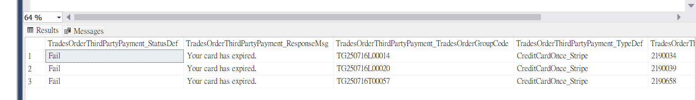

##### 1.1.3 Stripe 後台查詢
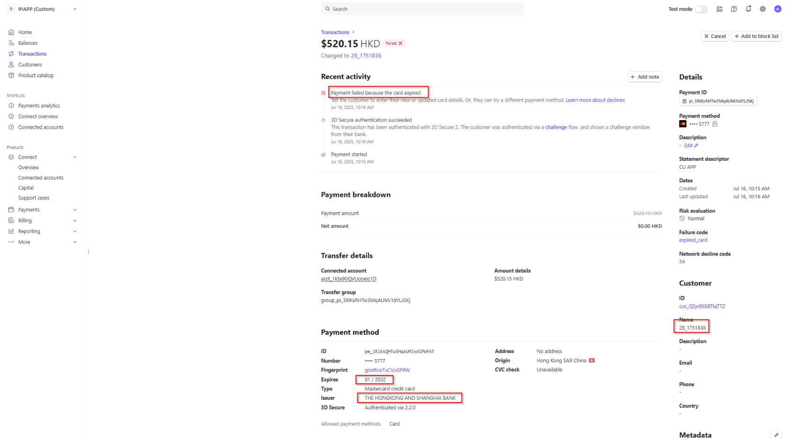
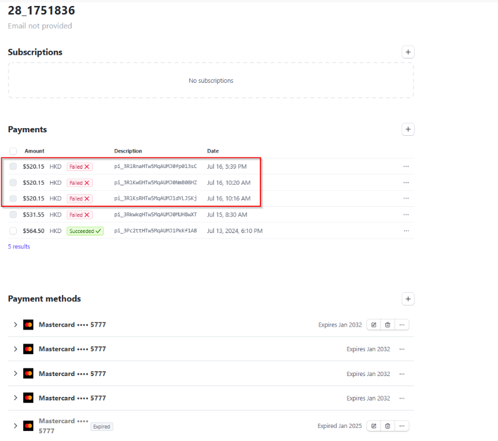
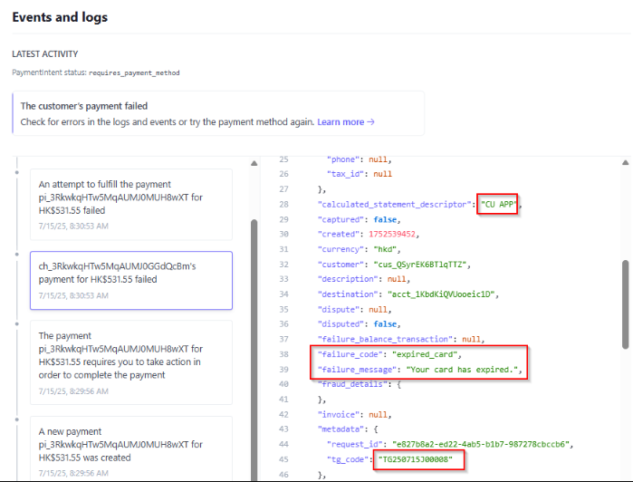

##### 1.1.4 信用卡驗證 Log 查詢
```sql
SELECT * FROM "hk_prod_webstore"."webstore_web_iislog"
WHERE date = '2025/07/16'
  AND cs_uri_stem = '/webapi/CreditCard/Validate'
  AND cs_uri_query LIKE '%ShopId=83%';
```
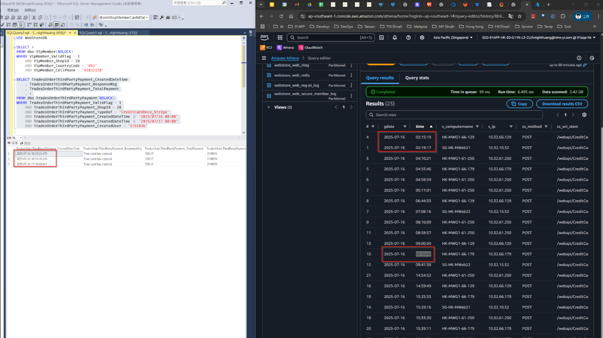

##### 1.1.5 確認記住信用卡狀態
```sql
SELECT *
FROM PayTypeExpress(nolock)
WHERE PayTypeExpress_ValidFlag = 1
  AND PayTypeExpress_ShopId = 28
  AND PayTypeExpress_MemberId = 1751836
```

#### 分析結果
- 實際交易時間：10:00
- 卡片到期日：2032/01（尚未到期）
- Stripe 系統認定卡片過期
- **後續處理**：需聯繫 Stripe 釐清該交易問題

<br>

### 1.2 3D 驗證失敗後資料庫更新異常

#### 基本資訊
- **Slack 連結**：https://91app.slack.com/archives/C7T5CTALV/p1738461751955299
- **VSTS**：https://91appinc.visualstudio.com/DailyResource/_workitems/edit/324367
- **Elmah Log**：http://elmahdashboard.91app.hk/Log/Details/f5682e60-a253-4acf-8525-e6745c54a8e6

#### 問題概述
3D Secure 驗證失敗後，Stripe 回傳 `"status":"canceled"`，但系統在處理取消操作時發生資料庫更新異常。

#### 時間軸分析
| 時間 | 事件 | 狀態說明 |
|------|------|----------|
| 01:16:55.049 | 建立支付方式 | 建立 payment_method 和 payment_intent |
| 01:16:58.780 | 等待 3D 驗證 | WaitingToPay，等待用戶完成 3D Secure 認證 |
| 01:21:10.334 | 查詢狀態 | `"requires_action"`，amount_received = 0 |
| 01:27:37.290 | 驗證失敗 | `payment_intent_authentication_failure` |
| 01:27:37.350 | 取消成功 | Stripe API Cancel success |
| 01:31:07.879 | 最終狀態 | `"canceled"`（交易已取消） |

#### 問題分析

##### 資料庫狀態異常
| 欄位 | 目前狀態 | 預期狀態 |
|------|----------|----------|
| OrderSlaveFlow | WaitingTo3DAuth | 應更新為失敗狀態 |
| TradesOrderThirdPartyPayment | WaitingToPay | 應更新為取消狀態 |

##### 異常詳情
```
Type: System.Transactions.TransactionException
Message: The operation is not valid for the state of the transaction.
Time: 2025/02/02 1:27:37 AM
```

##### 異常發生流程
1. **API 端點**：`/webapi/PayChannel/InternalFinishPayment` 處理支付完成請求
2. **服務層**：進入 `TradesOrderPaymentService.FinishPayment` 方法
3. **資料層**：嘗試更新 `TradesOrderThirdPartyPaymentRepository.Update()`
4. **異常點**：EntityFramework 在 `SaveChanges()` 時發生 TransactionException

##### 相關程式碼位置
| 檔案 | 行數 | 異常點 |
|------|------|---------|
| TradesOrderThirdPartyPaymentRepository.cs | 140 | SaveChanges() 執行失敗 |
| TradesOrderPaymentService.cs (CancelTradeOrder) | 546 | 取消操作異常 |
| TradesOrderPaymentService.cs (FinishPayment) | 425 | 處理完成異常 |
| PayChannelController.cs | 128 | API 入口異常 |

#### 根本原因分析

##### 系統問題
1. **PMW 處理邏輯**：`"status":"canceled"` 不在 PMW 預期處理範圍內
2. **無限迴圈**：MWeb 收到異常回覆後進入「由 Console 處理」的循環
3. **快取過期**：Redis cache 過期後持續拋出 `GetPayProcessDataProcessorException`

##### 技術原因
- SQL 連線池存在交易狀態異常
- 分散式交易無法正常升級
- EntityFramework 交易範圍管理問題

#### 解決方案
- **立即處理**：將狀態更新為 WaitingToPay，讓 Re-Check 重新執行
- **補償處理**：補還點還券轉單（已在 VSTS 追蹤）
- **長期修復**：改善 PMW 對 `"canceled"` 狀態的處理邏輯

<br>

### 1.3 App 轉導後白頁異常事件

#### 基本資訊
- **Slack 連結**：https://91app.slack.com/?redir=%2Farchives%2FCMY85JQLC%2Fp1742887474296019%3Fname%3DCMY85JQLC%26perma%3D1742887474296019
- **發生時間**：2025/03/25 上午 9:00-11:00
- **影響範圍**：Android（Mobile 及 APP）

#### 問題概述
多間 HK 商店反映 Android 平台使用信用卡結帳時，用戶按送出後出現白頁，無法完成交易。

#### 異常證據

##### Stripe 官方公告
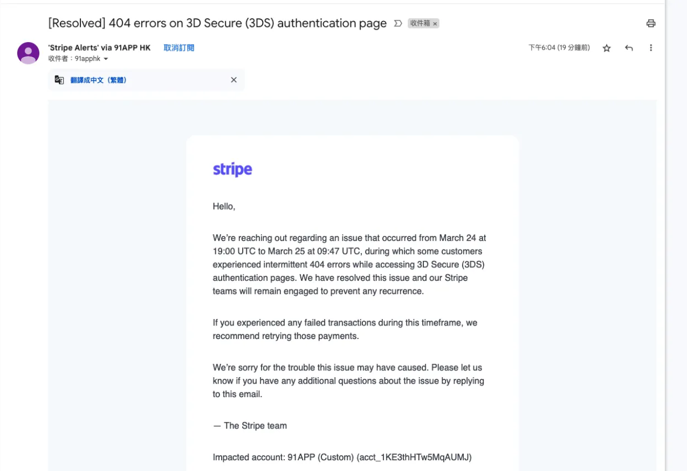

##### 每小時 Timeout 監控數據
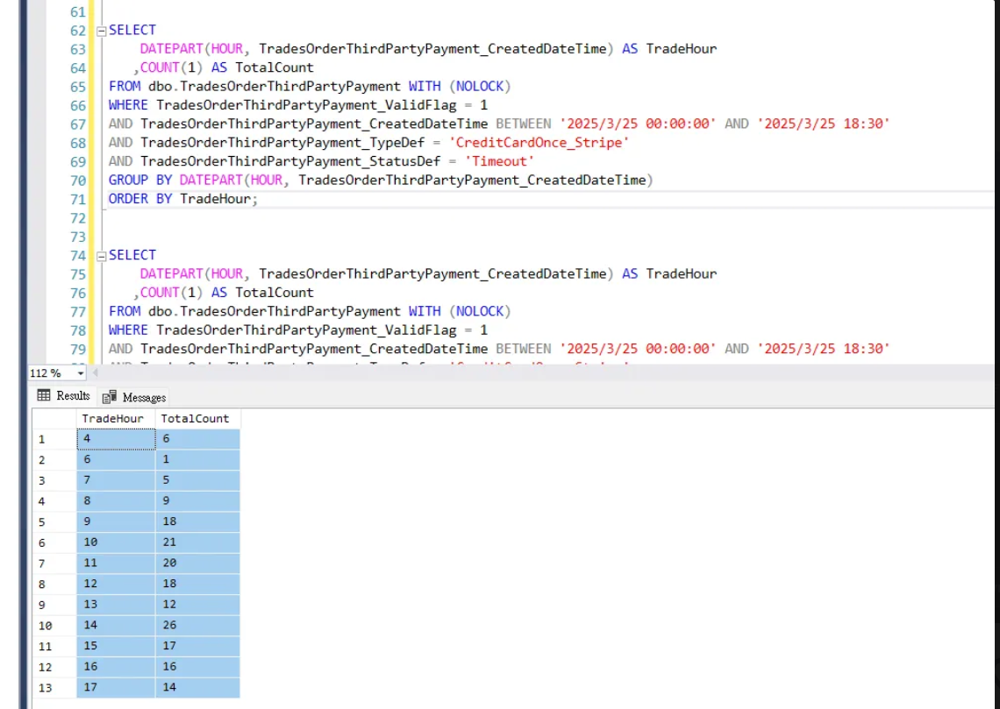

#### 影響範圍

##### 受影響商店
| 商店名稱 | 商店 ID | 備註 |
|----------|---------|------|
| Eu Yan Sang | 12 | Android 平台 |
| 繽粉 | 67 | Android 平台 |
| CUAPP | 28 | 第三方 App 使用 MWeb 付款 |

##### 異常訂單範例
| 訂單號 | 銀行 | 卡別 |
|--------|------|------|
| TG250325Q00033 | HSBC | VISA |
| TG250325E00015 | CHINA CITIC BANK INTERNATIONAL | MASTER |
| TG250325K00083 | STANDARD CHARTERED BANK (HONG) | MASTER |
| TG250325L00120 | HANG SENG BANK LIMITED | MASTER |
| TG250325M00006 | HANG SENG BANK LIMITED | MASTER |

##### 典型案例資訊
- **商店**：80 Melvita HK
- **訂單號**：TG250325R00077
- **平台**：iOS App
- **付款方式**：信用卡 - VISA
- **下單時間**：2025/03/25 15:43:04

#### 監控查詢語法
用於分析每小時成功率的 SQL：

```sql
USE WebStoreDB;

WITH HourlyStats AS (
    SELECT 
        DATEADD(SECOND, 58, 
            DATEADD(MINUTE, 1, 
                DATEADD(HOUR, 
                    DATEDIFF(HOUR, 0, TradesOrderThirdPartyPayment_CreatedDateTime), 0
                )
            )
        ) AS HOURLY,
        SUM(CASE 
            WHEN TradesOrderThirdPartyPayment_StatusDef NOT IN ('WaitingToPay', 'Hidden') 
            THEN 1 ELSE 0 
        END) AS Total_Count,
        SUM(CASE 
            WHEN TradesOrderThirdPartyPayment_StatusDef IN ('Success', 'RePaySuccess', 'AuthSuccess', 'CancelAfterSuccess') 
            THEN 1 ELSE 0 
        END) AS Success_Count,
        SUM(CASE 
            WHEN TradesOrderThirdPartyPayment_StatusDef = 'Fail' 
            THEN 1 ELSE 0 
        END) AS Fail_Count,
        SUM(CASE 
            WHEN TradesOrderThirdPartyPayment_StatusDef = 'Timeout' 
            THEN 1 ELSE 0 
        END) AS Timeout_Count,
        SUM(CASE 
            WHEN TradesOrderThirdPartyPayment_StatusDef = 'CancelRequest' 
            THEN 1 ELSE 0 
        END) AS CancelRequest_Count
    FROM TradesOrderThirdPartyPayment (NOLOCK)
    WHERE TradesOrderThirdPartyPayment_ValidFlag = 1
      AND TradesOrderThirdPartyPayment_TypeDef = 'CreditCardOnce_Stripe'
      AND TradesOrderThirdPartyPayment_DateTime BETWEEN '2024-03-23' AND '2024-03-24'
    GROUP BY DATEADD(SECOND, 58, 
        DATEADD(MINUTE, 1, 
            DATEADD(HOUR, 
                DATEDIFF(HOUR, 0, TradesOrderThirdPartyPayment_CreatedDateTime), 0
            )
        )
    )
)
SELECT 
    HOURLY,
    Total_Count,
    Success_Count,
    Fail_Count,
    Timeout_Count,
    CancelRequest_Count,
    CAST(Success_Count * 100 / Total_Count AS VARCHAR(20)) + '%' AS Success_Rate
FROM HourlyStats
ORDER BY HOURLY;
```

#### 後續處理
- 確認 Stripe 服務狀態
- 監控系統恢復情況
- 分析白頁原因並提供解決方案

<br>

---

## 3. ApplicationFee / Refund / TransferReversal

### 3.1 適用範圍
- **專用於**：DestinationCharge 付款模式
- **適用帳戶類型**：Custom 帳戶（使用 DestinationCharge 流程）

### 3.2 功能對比

| 功能 | 說明 | 資金流向 | 適用場景 |
|------|------|----------|----------|
| **Refund** | 退款給客戶 | 商家 → 客戶 | 客戶要求退貨、取消訂單 |
| **Application Fee Refund** | 退還平台手續費 | 平台 → 賣家 | 平台費用調整、爭議處理 |
| **Transfer Reversal** | 資金回收 | 賣家 → 平台 | 撤銷轉帳、資金重新分配 |

### 3.3 Transfer Reversal 詳細說明

#### 核心功能
從關聯帳戶（賣家）收回資金到平台帳戶，可同時決定是否退還相關的 Application Fee。

#### 執行結果
- **平台帳戶**：餘額增加
- **賣家帳戶**：餘額減少
- **Application Fee**：可選擇是否一併退還

### 3.4 限制條件

#### 金額限制
| 限制類型 | 說明 | 影響 |
|----------|------|------|
| **Destination Charge** | 撤銷金額 ≤ 原始收費金額 | 不能撤銷超過原本收費的金額 |
| **Transfer Group** | 目標帳戶需有足夠餘額 | 餘額不足時撤銷失敗 |

### 3.5 實際應用案例

#### 基礎交易情境
假設電商平台上的一筆交易：
- **商品價值**：$100
- **平台抽成**：10%（$10 Application Fee）
- **賣家實收**：$90

#### 操作案例對比

##### 情況 1：全額撤銷
```
執行動作：Transfer Reversal $90
選項：同時退還 $10 Application Fee

結果：
- 平台帳戶：+$90（可選 +$10）
- 賣家帳戶：-$90
- Application Fee：可選退還 $10
```

##### 情況 2：部分撤銷
```
執行動作：Transfer Reversal $45
選項：按比例退還 Application Fee

結果：
- 平台帳戶：+$45（可選 +$5）
- 賣家帳戶：-$45
- Application Fee：可選退還 $5（比例計算）
```

### 3.6 資金流向圖解

```
原始交易：
客戶 --$100--> 平台 --$90--> 賣家
              └─$10 Application Fee

Refund：
客戶 <--$100-- 平台（退款給客戶）

Application Fee Refund：
平台 --$10--> 賣家（退還手續費）

Transfer Reversal：
平台 <--$90-- 賣家（資金回收）
```

### 3.7 使用時機

| 操作類型 | 使用時機 | 業務場景 |
|----------|----------|----------|
| **Refund** | 客戶退貨/取消 | 正常退款流程 |
| **Application Fee Refund** | 費用調整 | 促銷活動、爭議處理 |
| **Transfer Reversal** | 資金重新分配 | 帳戶調整、錯誤修正 |

### 3.8 注意事項
- **執行順序**：建議先處理 Transfer Reversal，再進行 Refund
- **餘額檢查**：執行前需確認賣家帳戶有足夠餘額
- **費用處理**：Application Fee 的退還是可選項，需要明確指定

<br>

---

## 4. 系統使用費 / 金流手續費

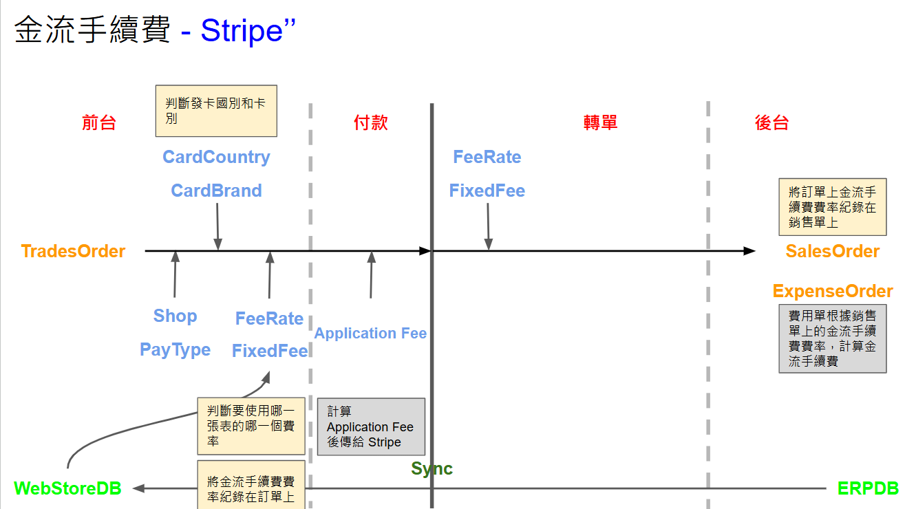

### 4.1 概述

在 Stripe 支付系統中，總費用由兩個部分組成：
- **系統使用費**：平台對商家收取的服務費用
- **金流手續費**：支付通道的交易處理費用

### 4.2 費用計算處理器

| 處理器名稱 | 功能說明 |
|-----------|----------|
| `GetOrderProcessingFeeProcessor` | 負責計算及取得訂單處理費用的核心處理器 |

### 4.3 費率取得方式

#### 4.3.1 系統使用費 (SalesFeeInfo)

##### 影響因素
| 參數 | 說明 |
|------|------|
| `sourceCategoryId` | 來源分類編號 |
| `SupplierId` | 供應商編號 |

##### 預設費率
```csharp
decimal salesFeeRate = 0.05m; // 預設 5%
```

##### 相關資料表
| 資料表名稱 | 用途 |
|-----------|------|
| `SupplierContract` | 供應商合約主表 |
| `SupplierContract_IsDefaultSalesFeeRate` | 預設費率設定 |
| `SupplierContractSalesFeeRate` | 供應商費率設定 |
| `SupplierContractSalesFeeRate_Rate` | 費率數值 |

#### 4.3.2 金流手續費 (PayProfileFeeInfo)

##### 影響因素
| 參數 | 說明 | 範例 |
|------|------|------|
| `shopId` | 商店編號 | 28 |
| `payprofile` | 付款方式 | GooglePay, Stripe |
| `country` | 發卡國家 | HK, TW, US |
| `brand` | 卡片品牌 | Visa, MasterCard |

##### 資料查詢

**預存程序**：`csp_GetPayProfileProcessingFee`

**查詢語法**：
```sql
USE WebStoreDB

DECLARE @shopId BIGINT = 0,
        @payProfileTypeDef NVARCHAR(MAX) = 'GooglePay',
        @cardIssueCountry NVARCHAR(MAX) = 'HK',
        @cardBrand NVARCHAR(MAX) = 'Visa',
        @now DATETIME = GETDATE();

SELECT 
    PayProfileProcessingFee_ShopId,
    PayProfileProcessingFee_SupplierFixedFee,
    PayProfileProcessingFee_SupplierFeeRate,
    PayProfileProcessingFee_CardIssueCountry,
    PayProfileProcessingFee_CardBrand,
    *
FROM dbo.PayProfileProcessingFee WITH (NOLOCK)
WHERE PayProfileProcessingFee_ValidFlag = 1
    AND PayProfileProcessingFee_ShopId = @shopId
    -- 可選條件：
    -- AND PayProfileProcessingFee_PayProfileTypeDef = @payProfileTypeDef
    -- AND PayProfileProcessingFee_CardIssueCountry = @cardIssueCountry
    -- AND PayProfileProcessingFee_CardBrand = @cardBrand
    AND PayProfileProcessingFee_StartDateTime <= @now;
    -- AND PayProfileProcessingFee_EndDateTime >= @now
```

##### 基本費用欄位
| 欄位名稱 | 說明 |
|----------|------|
| `PayProfileProcessingFee_SupplierFeeRate` | 供應商費率（百分比） |
| `PayProfileProcessingFee_SupplierFixedFee` | 供應商固定費用 |


### 4.4 費用計算流程

#### 4.4.1 MWeb 計算費率

**處理位置**：`StripePayChannelService.GetStripeApplicationFee`

**資料傳遞**：計算結果會放入 `ExtendInfo.application_fee_amount`

#### 4.4.2 費用計算公式

| 費用類型 | 計算公式 | 說明 |
|----------|----------|------|
| **系統使用費** | `SalePageGroup.TotalPayment × salesProcessingFee.Rate` | 一般費率為 0.05 (5%) |
| **運費使用費** | `TradesOrderGroup.TotalFee × salesProcessingFee.Rate` | 運費部分的系統使用費 |

#### 4.4.3 Custom 帳戶類型額外費用

當商店使用 **Custom Type** 帳戶時，需額外計算金流手續費：

```csharp
// 金流手續費計算公式
decimal paymentProcessingFee = (TradesOrderGroup_TotalPayment × payProfileProcessingFee.Rate) 
                             + payProfileProcessingFee.FixedFee;
```

**費用組成**：
- **比例費用**：交易金額 × 費率百分比
- **固定費用**：每筆交易固定收取的費用

### 4.5 轉單後資料處理

#### 4.5.1 轉單處理流程

**主要 Job**：`TransferOrderToERP`

| 步驟 | 處理程序 | 功能說明 |
|------|----------|----------|
| **Step 1** | `csp_ImportWebStoreDBTradesOrdersToERPDBSourceTablesByOrderId_Mall` | 將 WebStoreDB 資料轉移至 ERPDB 暫存表 |
| **Step 2** | `dbo.csp_TradesOrderTransToSalesOrderWithFlow_Mall` | 生成 SalesOrderGroup |
| **Step 3** | `ERPDB.dbo.csp_UpdateDataAfterTradesOrderTransToSalesOrderWithFlow` | 更新 SalesOrder 相關資料 |

#### 4.5.2 轉單參數

**傳入參數**（以 TradesOrderGroupId 為基礎）：

| 參數名稱 | 資料來源 | 說明 |
|----------|----------|------|
| `@shopPayProfileSupplierFixedFee` | `PayProfileProcessingFee_SupplierFixedFee` | 供應商固定手續費（優先取用） |
| `@salesOrderGroupPaymentFixedFee` | 計算結果 | 銷售訂單群組付款固定費用 |
| `@cardIssueCountry` | 信用卡資訊 | 發卡國家代碼 |
| `@cardBrand` | 信用卡資訊 | 卡片品牌 |

#### 4.5.3 資料對應關係

**執行 `UpdateSalesOrderSlaveFeeRateByGroupId` 時的資料對應**：

從 `ThirdPartyPayment_Info` 取得資訊並對應至以下欄位：

| 來源欄位 | 目標欄位 | 說明 |
|----------|----------|------|
| **FeeRate** | `SalesOrderSlave_SCMCreditCardFeeRate`<br>`SalesOrderSlave_SCMCreditCardFeeRate2` | 信用卡手續費率 |
| **SCMSalesFeeRate** | `SalesOrderSlave_SCMSalesFeeRate` | 系統使用費率 |
| **FixedFee** | `SalesOrderGroup_PaymentFixedFee` | 付款固定費用 |

**相關開發資源**：[BitBucket PR #7564](https://bitbucket.org/nineyi/nineyi.databases/pull-requests/7564/diff)

#### 4.5.4 費用單生成

轉單完成後會生成 `ExpenseOrder`（費用單），該費用單將作為其他報表的資料來源。

### 4.6 手續費退款處理

#### 4.6.1 退款判斷邏輯

**主要判斷條件**：
```csharp
request.ExtendInfo.IsRefundApplicationFee // 判斷 Stripe 是否需要退手續費
```

**檢查條件清單**：
| 條件 | 程式碼檢查 | 說明 |
|------|------------|------|
| 1 | `this.IsSalesOrderFee(refundRequest.RefundRequest_SourceDef)` | 判斷是否為運費相關退款 |
| 2 | `salesOrderSlaveDateTime >= new DateTime(2020, 7, 1) \|\| Config : Charge.SalesOrderFee.Shop` | 檢查訂單時間或商店設定 |
| 3 | `request.ExtendInfo.ApplicationFeeAmount > 0` | 確認有應用程式費用需要退還 |

#### 4.6.2 退款金額計算

**基本計算公式**：
```csharp
decimal refundApplicationFee = this.CalculateFee(refundAmount, feeRate);
```

**退貨子單特殊處理**：

當處理退貨子單且有補收單時，需要進行調整計算：
```csharp
// 取得補收金額及其手續費
var rechargeAmount = rechargeReceipt.RechargeReceipt_RechargeAmount;
var rechargeAmountFee = this.CalculateFee(rechargeAmount, feeRate);

// 計算實際退還的手續費
refundApplicationFee = totalPaymentFee - rechargeAmountFee;
```

#### 4.6.3 API 呼叫

**Stripe 退款 API 端點**：
```http
POST /v1/application_fees/{applicationFeeId}/refunds
```

**官方文件**：[Stripe Application Fee Refunds API](https://docs.stripe.com/api/fee_refunds/create)

#### 4.6.4 退款類型對比

| 退款類型 | 定義 | 資金流向 | 適用場景 |
|----------|------|----------|----------|
| **普通退款**<br>(Refund) | 將交易金額退還給客戶 | 商家賬戶 → 客戶支付方式 | 客戶退貨、取消訂單 |
| **應用程式費用退款**<br>(Application Fee Refund) | 退還平台收取的服務費用 | 平台賬戶 → 賣家賬戶 | 費用調整、爭議處理 |

#### 4.6.5 兩種退款的關鍵差異

| 比較項目 | 普通退款 | 應用程式費用退款 |
|----------|----------|-------------------|
| **資金流向** | 商家賬戶 → 客戶 | 平台賬戶 → 賣家賬戶 |
| **影響對象** | 直接影響客戶 | 影響平台和賣家，不直接影響客戶 |
| **關聯交易** | 與客戶的原始支付交易相關 | 與平台收取的費用相關 |
| **執行時機** | 客戶退款請求 | 平台費用政策調整 |

#### 4.6.6 實際應用場景

**基礎交易範例**：
```
客戶支付金額：$100
平台應用程式費用：$10 (10%)
賣家實際收到：$90
```

##### 場景 1：客戶要求全額退款
| 操作步驟 | 執行動作 | 金額 | 影響對象 |
|----------|----------|------|----------|
| 1 | 執行普通退款 | $100 | 客戶收到退款 |
| 2 | 執行應用程式費用退款 | $10 | 賣家收回手續費 |

**結果**：客戶拿回 $100，賣家收回被扣的 $10 手續費

##### 場景 2：平台費用調整
| 操作步驟 | 執行動作 | 金額 | 影響對象 |
|----------|----------|------|----------|
| 1 | 僅執行應用程式費用退款 | $5 | 賣家獲得部分手續費返還 |

**結果**：客戶不受影響，賣家獲得 $5 手續費減免

#### 4.6.7 退款限制與特點

| 特點 | 說明 | 注意事項 |
|------|------|----------|
| **部分退款** | 應用程式費用可分次退還 | 直到全額退還為止 |
| **退款上限** | 不能超過原始費用金額 | 超額退款會導致 API 錯誤 |
| **單次性** | 全額退還後不能再次操作 | 需要謹慎規劃退款策略 |

#### 4.6.8 商業價值

| 優勢 | 說明 |
|------|------|
| **彈性收費模式** | 平台可根據情況調整收入策略 |
| **爭議處理** | 有效處理商家與平台間的費用爭議 |
| **商家激勵** | 可作為獎勵優質商家的工具 |
| **關係維護** | 增強平台與商家的合作關係 |

---


---


---

## 8. Stripe 後台操作

### 8.1 概述

Stripe 後台管理介面提供豐富的功能來監控和管理付款流程，包括支付方式狀態檢查、帳戶資訊查看、API 金鑰管理和交易記錄查詢。

### 8.2 支付方式狀態管理

#### 8.2.1 GooglePay / ApplePay 啟用狀態檢查

**用途**：確認數位錢包支付方式是否已正確啟用

**操作步驟**：
1. 登入 Stripe Dashboard
2. 導航至「Settings」→「Payment methods」
3. 檢查 Google Pay 和 Apple Pay 的啟用狀態


**檢查項目**：
| 支付方式 | 檢查重點 | 狀態指標 |
|----------|----------|----------|
| **Google Pay** | 是否已啟用且配置正確 | 綠色勾選表示啟用 |
| **Apple Pay** | 商家識別碼設定 | 顯示「Active」狀態 |
| **Card payments** | 信用卡支付基本設定 | 確認可接受的卡片品牌 |

#### 8.2.2 支付方式配置建議

**最佳實務**：
- 定期檢查支付方式狀態
- 確保測試環境與正式環境設定一致
- 記錄設定變更的時間和原因

### 8.3 帳戶資訊管理

#### 8.3.1 帳戶資訊查看

**用途**：監控帳戶狀態、餘額和基本設定資訊

**操作路徑**：Dashboard → Account settings → Account details


**重要資訊項目**：
| 項目 | 說明 | 重要性 |
|------|------|--------|
| **Account ID** | 帳戶唯一識別碼 | 用於 API 呼叫和技術支援 |
| **Account status** | 帳戶狀態 | 影響付款處理能力 |
| **Available balance** | 可用餘額 | 監控資金流動 |
| **Pending balance** | 待結算餘額 | 了解資金結算時程 |

#### 8.3.2 帳戶監控建議

**監控重點**：
- **帳戶狀態**：確保帳戶處於正常狀態
- **餘額變化**：定期檢查餘額異常
- **結算周期**：了解資金結算時程

### 8.4 API 金鑰管理

#### 8.4.1 API 金鑰查看與管理

**用途**：管理用於系統整合的 API 金鑰

**操作路徑**：Dashboard → Developers → API keys

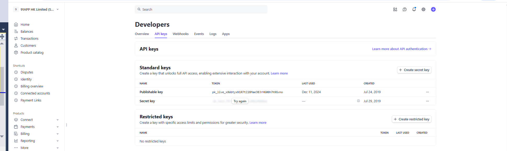

**金鑰類型說明**：
| 金鑰類型 | 用途 | 安全等級 | 使用場景 |
|----------|------|----------|----------|
| **Publishable key** | 前端 SDK 初始化 | 公開安全 | 客戶端應用程式 |
| **Secret key** | 後端 API 呼叫 | 高度機密 | 伺服器端操作 |
| **Restricted key** | 限制權限操作 | 中等安全 | 特定功能存取 |

#### 8.4.2 金鑰安全管理

**安全建議**：
- **定期輪換**：定期更換 Secret key
- **權限控制**：使用 Restricted key 限制存取範圍
- **環境隔離**：測試和正式環境使用不同金鑰

### 8.5 交易記錄與日誌

#### 8.5.1 交易日誌查看

**用途**：追蹤和除錯付款交易問題

**操作路徑**：Dashboard → Payments → Logs

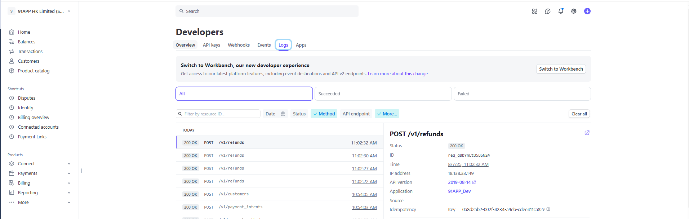

**日誌資訊項目**：
| 欄位 | 說明 | 用途 |
|------|------|------|
| **Event type** | 事件類型 | 識別交易階段 |
| **Status** | 處理狀態 | 確認成功或失敗 |
| **Created** | 建立時間 | 時間軸分析 |
| **Request ID** | 請求識別碼 | 問題追蹤 |

#### 8.5.2 日誌分析技巧

**分析重點**：
- **錯誤模式**：識別常見錯誤類型
- **時間分布**：分析交易時間模式
- **成功率**：監控交易成功率趨勢

### 8.6 測試環境管理

#### 8.6.1 測試模式切換

**用途**：在測試和正式環境之間切換

**操作方式**：使用後台右上角的切換開關

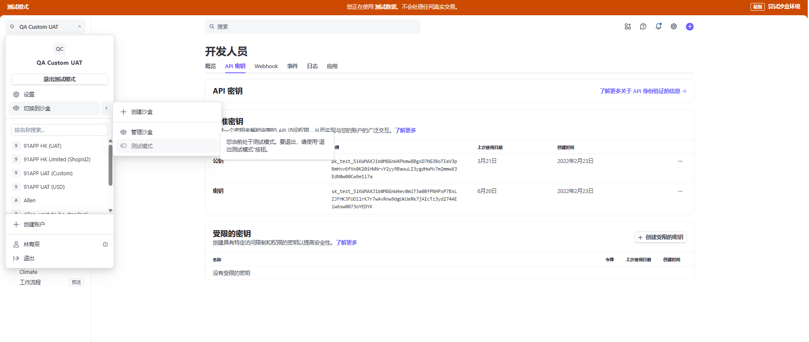

**環境對比**：
| 環境 | 用途 | 特點 | 注意事項 |
|------|------|------|----------|
| **Test mode** | 開發測試 | 使用測試金鑰和假資料 | 不會產生實際交易 |
| **Live mode** | 正式運營 | 使用正式金鑰和真實資料 | 產生實際的金錢交易 |

#### 8.6.2 測試最佳實務

**測試建議**：
- **完整測試**：在上線前完整測試所有付款流程
- **環境同步**：確保測試環境設定與正式環境一致
- **資料隔離**：測試資料不應混入正式環境

### 8.7 QA 環境配置狀況

#### 8.7.1 目前測試商店連結狀況

| 商店 ID | 帳戶類型 | 連結狀況 | 帳戶名稱 |
|---------|----------|----------|----------|
| **11** | CustomUATTest | QA Custom UAT 的 ConnectedAccount | Custom UAT 測試帳戶 |
| **2** | Standard | 91APP HK UAT 的 ConnectedAccount | 91APP HK Limited(ShopId2) |

#### 8.7.2 連結驗證方法

**驗證步驟**：
1. 登入對應的 Stripe 帳戶
2. 檢查 Connected accounts 清單
3. 確認商店 ID 與帳戶名稱匹配
4. 驗證帳戶狀態為 Active

### 8.8 後台操作常用功能

#### 8.8.1 搜尋關鍵字（中文介面）

**常用搜尋詞**：
| 中文關鍵字 | 英文對應 | 用途 |
|-----------|----------|------|
| 开发人员 | Developers | 進入開發者設定區域 |
| API 密钥 | API keys | 查看和管理 API 金鑰 |
| 令牌 | Tokens | 管理支付令牌 |

#### 8.8.2 快捷操作指南

**常用操作流程**：
1. **檢查交易狀態**：Payments → 搜尋交易 ID
2. **查看錯誤詳情**：Logs → 篩選錯誤事件
3. **管理 Webhook**：Developers → Webhooks
4. **檢視報表**：Reports → 選擇報表類型

### 8.9 問題排查工具

#### 8.9.1 除錯工具使用

| 工具 | 用途 | 使用時機 |
|------|------|----------|
| **Events & logs** | 查看 API 呼叫記錄 | 追蹤交易問題 |
| **Webhook logs** | 檢查 Webhook 傳送狀態 | 整合問題除錯 |
| **Request logs** | 分析 API 請求詳情 | 技術問題診斷 |

#### 8.9.2 常見問題處理

**問題類型與解決方案**：
- **金鑰錯誤**：檢查 API key 設定和權限
- **Webhook 失敗**：驗證端點 URL 和回應格式
- **帳戶狀態異常**：聯繫 Stripe 支援團隊

---

---

## 9. 帳戶類型與 Key 整理

### 9.1 概述

本章節提供 Stripe 帳戶類型與 API 金鑰的完整配置管理資訊，包括測試環境設定、金鑰管理和帳戶文件整理。

### 9.2 HK QA 測試商店配置

#### 9.2.1 配置管理中心

**主要參考文件**：Notion 配置管理頁面

| 資源 | 連結 | 用途 |
|------|------|------|
| **Stripe 配置 Notion** | [STRIPE-24e558dd52a9800fb4cfefcc627101d9](https://www.notion.so/STRIPE-24e558dd52a9800fb4cfefcc627101d9) | 完整的測試商店配置表 |

#### 9.2.2 測試商店配置內容

**包含資訊**：
- 各測試商店的帳戶類型設定
- PublishableKey 和 SecretKey 對應關係
- 環境別配置差異（QA、UAT、Production）
- Connected Account 設定狀態

#### 9.2.3 配置管理最佳實務

| 管理項目 | 建議作法 | 注意事項 |
|----------|----------|----------|
| **定期更新** | 每月檢查配置狀態 | 確保測試環境與正式環境同步 |
| **文件維護** | 即時更新 Notion 文件 | 變更時同步更新所有相關文件 |
| **存取控制** | 限制配置文件存取權限 | 僅授權相關開發人員存取 |

### 9.3 API 金鑰配置管理

#### 9.3.1 Secret Key 設定位置

**設定檔路徑**：
```
MachineConfig/Frontend/AppSettings.QA300.config
```

**檔案結構**：
| 設定項目 | 說明 | 範例 |
|----------|------|------|
| **CustomAcctLiveSecretKey** | Custom 帳戶正式環境金鑰 | `sk_live_...` |
| **CustomAcctTestSecretKey** | Custom 帳戶測試環境金鑰 | `sk_test_...` |
| **StandardAcctLiveSecretKey** | Standard 帳戶正式環境金鑰 | `sk_live_...` |

#### 9.3.2 金鑰管理流程

**配置步驟**：
1. **取得金鑰**：從 Stripe Dashboard 複製對應的 Secret Key
2. **更新配置**：修改 AppSettings.QA300.config 檔案
3. **重新部署**：重新部署應用程式使設定生效
4. **功能測試**：驗證金鑰設定是否正確

#### 9.3.3 金鑰安全管理

**安全措施**：
| 措施 | 說明 | 重要性 |
|------|------|--------|
| **版本控制** | 不將 Secret Key 納入 Git | 防止金鑰洩露 |
| **環境隔離** | 測試與正式環境使用不同金鑰 | 降低安全風險 |
| **定期輪換** | 定期更換 Secret Key | 維護系統安全 |

### 9.4 帳戶管理文件整理

#### 9.4.1 主要管理文件

**Google Sheets 帳戶整理**：

| 文件 | 連結 | 內容 |
|------|------|------|
| **帳戶配置總表** | [Google Sheets](https://docs.google.com/spreadsheets/d/1Wc3SB8I2qlHJ5xw2JzrOuXZVUpKAAHs7OsbJAUVeG0A/edit?gid=0#gid=0) | 完整的帳戶類型與金鑰對應表 |

#### 9.4.2 文件管理內容

**包含資訊**：
- **帳戶類型對照表**：Custom vs Standard 帳戶差異
- **金鑰對應關係**：PublishableKey 與 SecretKey 配對
- **環境配置**：各環境的設定參數
- **商店對應表**：ShopId 與帳戶類型的對應關係

#### 9.4.3 文件維護規範

| 維護項目 | 頻率 | 負責人員 | 注意事項 |
|----------|------|----------|----------|
| **定期檢查** | 每季 | 技術負責人 | 確保資訊正確性 |
| **即時更新** | 變更時 | 開發人員 | 變更後立即更新文件 |
| **權限管理** | 按需求 | 系統管理員 | 控制存取權限 |

---

## 11. OAuth 整合與前台認證

### 11.1 概述

Stripe OAuth 整合提供安全的帳戶連接機制，讓商家可以透過標準的 OAuth 2.0 流程將其 Stripe 帳戶與平台系統連接。

### 11.2 OAuth 控制器

#### 11.2.1 控制器基本資訊

**控制器名稱**：`StripeOAuthController`

**主要功能**：
- 處理 OAuth 授權流程
- 管理 Authorization Code 兌換
- 處理 Access Token 取得

#### 11.2.2 OAuth 流程架構

```
商家 → Stripe授權頁面 → 同意授權 → 回調平台 → 取得Access Token → 完成連接
```

### 11.3 Token 交換 API

#### 11.3.1 API 端點資訊

**端點 URL**：
```
https://connect.stripe.com/oauth/token
```

**HTTP 方法**：`POST`

#### 11.3.2 請求參數

**必要參數**：

| 參數名稱 | 說明 | 範例值 |
|----------|------|--------|
| **client_secret** | 應用程式密鑰 | `sk_live_...` |
| **code** | 授權代碼 | 從回調 URL 取得的 code |
| **grant_type** | 授權類型 | `authorization_code` |

#### 11.3.3 完整 API 呼叫格式

```http
POST https://connect.stripe.com/oauth/token
Content-Type: application/x-www-form-urlencoded

client_secret={secret}&code={code}&grant_type=authorization_code
```

### 11.4 OAuth 整合流程

#### 11.4.1 授權流程步驟

| 步驟 | 動作 | 說明 |
|------|------|------|
| **1** | 導向授權頁面 | 將商家導向 Stripe OAuth 授權頁面 |
| **2** | 商家授權** | 商家在 Stripe 頁面上同意授權 |
| **3** | 接收回調 | 平台接收帶有 authorization code 的回調 |
| **4** | 交換 Token | 使用 code 向 Stripe 請求 access token |
| **5** | 儲存連接資訊 | 將取得的帳戶資訊儲存到系統中 |

#### 11.4.2 回應處理

**成功回應範例**：
```json
{
  "access_token": "sk_live_...",
  "scope": "read_write",
  "livemode": true,
  "token_type": "bearer",
  "refresh_token": "rt_...",
  "stripe_user_id": "acct_...",
  "stripe_publishable_key": "pk_live_..."
}
```

**回應欄位說明**：
| 欄位 | 說明 | 用途 |
|------|------|------|
| **access_token** | 存取令牌 | 用於 API 呼叫的認證 |
| **stripe_user_id** | Stripe 帳戶 ID | Connected Account 識別碼 |
| **stripe_publishable_key** | 公開金鑰 | 前端 SDK 使用 |

### 11.5 安全考量

#### 11.5.1 安全措施

| 安全項目 | 實作方式 | 重要性 |
|----------|----------|--------|
| **HTTPS 強制** | 所有 OAuth 端點使用 HTTPS | 防止資料洩露 |
| **State 參數** | 使用隨機 state 防止 CSRF | 驗證請求來源 |
| **Token 加密** | 加密儲存 access token | 保護敏感資料 |

#### 11.5.2 錯誤處理

**常見錯誤**：
- **invalid_grant**：authorization code 無效或過期
- **invalid_client**：client_secret 錯誤
- **access_denied**：商家拒絕授權

### 11.6 整合測試

#### 11.6.1 測試檢查項目

| 測試項目 | 驗證重點 | 預期結果 |
|----------|----------|----------|
| **授權流程** | 完整的 OAuth 流程 | 成功取得 access token |
| **錯誤處理** | 各種錯誤情況 | 適當的錯誤訊息和處理 |
| **安全驗證** | State 參數和 HTTPS | 安全機制正常運作 |

---

---

## 12. 信用卡付款流程

### 12.1 概述

信用卡付款是 Stripe 系統的核心功能，包含付款前驗證、支付處理和結果確認等完整流程。系統會在付款前進行信用卡驗證，確保交易安全性和成功率。

### 12.2 付款前信用卡驗證

#### 12.2.1 驗證機制概述

**用途**：在正式付款前驗證信用卡資訊的有效性，降低付款失敗率

**執行時機**：用戶輸入信用卡資訊後，正式付款前

#### 12.2.2 技術實作

**控制器位置**：
```
C:\91APP\NineYi.WebStore.MobileWebMall\WebStore\WebAPI\Controllers\CreditCardController.cs
```

**API 端點**：`/webapi/CreditCard/Validate`

#### 12.2.3 驗證流程實作

```csharp
public CreditCardValidationResponseEntity CreditCardValidation(CreditCardValidationRequestEntity infoDate)
{
    CreditCardValidationResponseEntity resultResponse = null;

    // 1. 預設使用 Standard 帳戶金鑰
    var key = this._stripeConfigurations.StandardAcctLiveSecretKey;

    // 2. 根據商店 ID 動態選擇適當的 API 金鑰
    if (infoDate.ShopId.HasValue && infoDate.ShopId.Value > 0)
    {
        StripeSettingsEntity settings = this._shopDefaultService.GetShopStripeSetting(infoDate.ShopId.Value);
        key = this.GetStripeApiKey(infoDate.ShopId.Value, settings.StripeAccountType);
    }

    // 3. 建立 Stripe API 請求參數
    var pairs = new List<KeyValuePair<string, string>>
    {
        new KeyValuePair<string, string>("type", infoDate.Type),
        new KeyValuePair<string, string>("card[number]", infoDate.Number),
        new KeyValuePair<string, string>("card[exp_month]", infoDate.ExpiryMonth),
        new KeyValuePair<string, string>("card[exp_year]", infoDate.ExpiryYear),
        new KeyValuePair<string, string>("card[cvc]", infoDate.CVC)
    };

    // 4. 設定 HTTP 請求標頭和內容
    var content = new FormUrlEncodedContent(pairs);
    var apiUrl = new Uri("https://api.stripe.com/v1/payment_methods");
    
    httpClient.DefaultRequestHeaders.Accept.Clear();
    httpClient.DefaultRequestHeaders.Authorization = new AuthenticationHeaderValue("Bearer", key);
    httpClient.DefaultRequestHeaders.Accept.Add(new MediaTypeWithQualityHeaderValue("application/json"));

    // 5. 執行 API 呼叫並處理回應
    var result = httpClient.PostAsync(apiUrl, content);
    var response = result.Result.Content.ReadAsStringAsync();
    resultResponse = JsonConvert.DeserializeObject<CreditCardValidationResponseEntity>(response.Result);

    return resultResponse;
}
```

#### 12.2.4 驗證參數說明

| 參數 | 說明 | 必填 | 範例 |
|------|------|------|------|
| **type** | 支付方式類型 | ✓ | `card` |
| **card[number]** | 信用卡號碼 | ✓ | `4242424242424242` |
| **card[exp_month]** | 到期月份 | ✓ | `12` |
| **card[exp_year]** | 到期年份 | ✓ | `2025` |
| **card[cvc]** | 安全驗證碼 | ✓ | `123` |

#### 12.2.5 API 金鑰選擇邏輯

| 條件 | 使用金鑰 | 說明 |
|------|----------|------|
| **無 ShopId** | `StandardAcctLiveSecretKey` | 使用預設的 Standard 帳戶金鑰 |
| **有 ShopId** | `GetStripeApiKey()` 結果 | 根據商店的帳戶類型動態選擇 |

### 12.3 驗證結果處理

#### 12.3.1 成功回應範例

```json
{
  "id": "pm_1234567890",
  "type": "card",
  "card": {
    "brand": "visa",
    "country": "HK",
    "exp_month": 12,
    "exp_year": 2025,
    "last4": "4242"
  }
}
```

#### 12.3.2 錯誤處理

**常見錯誤類型**：
- **卡號無效**：信用卡號格式錯誤或不存在
- **到期日錯誤**：卡片已過期或日期格式錯誤
- **CVC 錯誤**：安全驗證碼不正確
- **API 金鑰錯誤**：使用的金鑰無效或權限不足

---

## 13. 記住信用卡功能

### 13.1 概述

記住信用卡功能讓用戶可以安全地儲存信用卡資訊，提升後續付款的便利性。系統透過 `Identity` 機制來識別和管理已儲存的信用卡資訊。

### 13.2 功能架構

#### 13.2.1 資料流程

```
前端選擇已儲存卡片 → Identity 傳遞 → 購物車處理 → PayTypeExpress 查詢 → 付款執行
```

#### 13.2.2 核心組件

| 組件 | 功能 | 位置 |
|------|------|------|
| **Identity 傳遞** | 識別已儲存的信用卡 | Checkout/Complete API |
| **PayTypeExpress 管理** | 儲存和查詢信用卡資訊 | 資料庫服務層 |
| **ExtendInfo 處理** | 信用卡資訊傳遞 | 付款處理流程 |

### 13.3 前端 Identity 傳遞

#### 13.3.1 API 參數傳遞

**用途**：前端選擇已儲存信用卡時，透過 API 傳遞對應的 Identity 識別碼

**傳遞方式**：
- **Checkout API**：結帳時傳入 Identity 參數
- **Complete API**：完成付款時使用 Identity 識別

**Identity 格式**：唯一識別字串，對應到 `PayTypeExpress` 資料表中的記錄

### 13.4 購物車處理流程

#### 13.4.1 GetPayDataProcessor 處理器

**處理器功能**：`GetPayDataProcessor.AssignPaymentMiddlewareCreditCardInfo`

**核心邏輯**：
```csharp
// 從請求中取得信用卡 Identity 資訊
var requestCreditCardInfo = checkoutContext.Request.PaymentMiddlewareCreditCardInfo;

// 將 Identity 加入擴展資訊
extendInfo.Add("identity", requestCreditCardInfo.Identity);
payProcessContext.ThirdPartyPaymentInfo.ExtendInfo = extendInfo;
```

**處理結果**：將 Identity 資訊傳遞到付款處理上下文

### 13.5 PayTypeExpress 資料管理

#### 13.5.1 ArrangePayTypeExpressInfoProcessor 處理器

**處理位置**：MWeb `CompleteforNewCart` 中的 `ArrangePayTypeExpressInfoProcessor`

**核心功能**：查詢並載入已儲存的信用卡資訊

#### 13.5.2 詳細處理邏輯

```csharp
case PayProfileTypeDefEnum.CreditCardOnce_Stripe:
{
    // 1. 取得基本參數
    var shopId = context.ShoppingCartV2.ShopId;
    var memberId = int.Parse(context.MemberId);
    var identity = this.GetIdentityFromContext(context.ThirdPartyPaymentInfo);

    if (string.IsNullOrWhiteSpace(identity) == false)
    {
        // 2. 查詢會員的 PayTypeExpress 記錄
        var payTypeExpressEntity = this._payTypeExpressService.GetPayTypeExpressList(
            memberId, 
            context.PayProfileType.ToString(), 
            shopId
        );

        if (payTypeExpressEntity.Any())
        {
            // 3. 找到匹配的 Identity 記錄
            var sameIdentity = payTypeExpressEntity.Single(i => i.Identity == identity);
            
            this._logger.Info($"已取得相同 identity 的 payTypeExpress, payTypeExpressId : {sameIdentity.Id}");

            // 4. 反序列化並載入機密資訊
            var payTypeExpressInfo = this._payTypeExpressService.GetPayTypeExpressInfo(sameIdentity);

            if (payTypeExpressInfo == null)
            {
                throw new ShoppingCartV2Exception(
                    Translation.Backend.Webapi.TradesOrderV2.IncorrectPayTypeExpress, 
                    ShoppingCartV2ExceptionTypeEnum.InvalidPayTypeExpress
                );
            }

            // 5. 建立擴展資訊並注入上下文
            var extendInfo = new Dictionary<string, object>
            {
                { "identity", sameIdentity.Identity },
                { "paytype_express_info", payTypeExpressInfo.ExtendInfo }
            };

            context.ThirdPartyPaymentInfo.ExtendInfo = extendInfo;
            
            this._logger.Info($"已將 payTypeExpress 放入 context");

            // 6. Stripe 專用：保留 Brand 和 Country 資訊
            if (context.PayProfileType == PayProfileTypeDefEnum.CreditCardOnce_Stripe)
            {
                context.CreditCardInfo.Brand = payTypeExpressInfo.Association.ToEnum<CreditCardBrandEnum>();
                context.CreditCardInfo.IssueCountryCode = payTypeExpressInfo.ExtendInfo
                    .GetValueOrDefault("country")?.ToString();
            }
        }
    }
}
```

#### 13.5.3 處理步驟說明

| 步驟 | 動作 | 說明 |
|------|------|------|
| **1** | 參數取得 | 從上下文中取得 shopId、memberId、identity |
| **2** | 記錄查詢 | 查詢該會員的 PayTypeExpress 清單 |
| **3** | Identity 匹配 | 找到與 Identity 匹配的記錄 |
| **4** | 資料反序列化 | 載入完整的信用卡資訊 |
| **5** | 上下文注入 | 將資訊注入付款處理上下文 |
| **6** | Stripe 專用處理 | 保留 Brand 和 Country 資訊供手續費計算 |

### 13.6 付款執行階段

#### 13.6.1 ExtendInfo 資料讀取

**執行時機**：正式付款處理時

**處理方法**：`GetPayExtendInfo` 會讀取 `paytype_express_info` 中的資訊

**資料用途**：
- 信用卡 Token 資訊
- 卡片品牌和發卡國家
- 其他付款相關的擴展資訊

#### 13.6.2 安全機制

| 安全措施 | 實作方式 | 目的 |
|----------|----------|------|
| **資料加密** | PayTypeExpress 中敏感資料加密儲存 | 保護信用卡資訊 |
| **Identity 驗證** | 確認 Identity 屬於正確的會員 | 防止跨用戶存取 |
| **權限檢查** | 驗證會員對信用卡的使用權限 | 確保存取安全 |

---

## 14. 帳戶切換與管理

### 14.1 概述

帳戶切換功能允許系統在不同的 Stripe 帳戶間進行切換，以支援多環境部署、商店遷移和帳戶升級等需求。

### 14.2 HK QA 125 美金站帳戶異動

#### 14.2.1 異動概述

**背景**：HK QA 環境中 125 號商店（美金站）進行 Stripe 帳戶切換

**異動時間**：根據業務需求進行的帳戶變更

#### 14.2.2 帳戶變更詳情

| 項目 | 異動前 | 異動後 |
|------|--------|--------|
| **StripeSubAccount** | `acct_1OINwsHK7varnAps` | `acct_1Q7SPiFGfUIK2bE1` |
| **適用環境** | HK QA | HK QA |
| **影響商店** | 125 (美金站) | 125 (美金站) |
| **帳戶類型** | Stripe SubAccount | Stripe SubAccount |

#### 14.2.3 異動影響範圍

**技術影響**：
- SubAccount ID 變更
- Connected Account 連結更新
- 相關設定檔更新

**業務影響**：
- 交易處理帳戶變更
- 資金流向調整
- 報表資料源更新

### 14.3 帳戶切換流程

#### 14.3.1 切換前準備

**檢查清單**：
- [ ] 確認新帳戶設定完成
- [ ] 備份原帳戶設定資料
- [ ] 準備回滾計畫
- [ ] 通知相關團隊

#### 14.3.2 設定更新步驟

| 步驟 | 動作 | 負責人 | 驗證方式 |
|------|------|--------|----------|
| **1** | 更新 ShopDefault 設定 | 開發團隊 | 資料庫查詢確認 |
| **2** | 更新設定檔 | 系統管理員 | 設定檔內容檢查 |
| **3** | 重新部署應用程式 | DevOps | 部署成功確認 |
| **4** | 功能測試 | 測試團隊 | 交易流程驗證 |

#### 14.3.3 切換後驗證

**驗證項目**：
- 付款流程正常運作
- 帳戶連結狀態正確
- 交易資料正確記錄
- 報表資料正常產生

---

## 15. 支援信用卡類型

### 15.1 概述

Stripe 支援多種主流信用卡品牌，每種卡片品牌都有不同的處理方式和手續費率，系統需要正確識別卡片類型以提供最佳的付款體驗。

### 15.2 支援的信用卡品牌

#### 15.2.1 主要信用卡類型

| 卡片品牌 | Stripe 識別碼 | 說明 | 地區支援 |
|----------|---------------|------|----------|
| **Visa** | `visa` | 全球最廣泛接受的信用卡 | 全球 |
| **MasterCard** | `mastercard` | 國際主流信用卡品牌 | 全球 |
| **American Express** | `american_express` | 美國運通信用卡 | 主要市場 |
| **銀聯卡** | `union_pay` | 中國銀聯信用卡 | 亞太地區 |

#### 15.2.2 卡片識別機制

**識別方式**：
- **卡號前綴**：根據信用卡號前幾位數字識別品牌
- **Stripe API**：透過 Stripe API 自動識別卡片類型
- **品牌驗證**：確認卡片品牌的有效性

### 15.3 卡片處理差異

#### 15.3.1 手續費差異

| 卡片品牌 | 基本費率 | 特殊費率 | 備註 |
|----------|----------|----------|------|
| **Visa** | 標準費率 | - | 最常見的處理費率 |
| **MasterCard** | 標準費率 | - | 與 Visa 相近 |
| **American Express** | 較高費率 | 商戶直連優惠 | 費率通常較高 |
| **Union Pay** | 地區費率 | 跨境交易費 | 依地區有不同費率 |

#### 15.3.2 處理時程差異

| 卡片品牌 | 授權時間 | 結算時間 | 特殊處理 |
|----------|----------|----------|----------|
| **Visa** | 即時 | 1-2 個工作日 | 標準流程 |
| **MasterCard** | 即時 | 1-2 個工作日 | 標準流程 |
| **American Express** | 即時 | 2-3 個工作日 | 可能需要額外驗證 |
| **Union Pay** | 略慢 | 2-5 個工作日 | 跨境處理時間較長 |

### 15.4 技術實作考量

#### 15.4.1 卡片驗證

**驗證項目**：
- 卡號格式驗證（Luhn 算法）
- 到期日檢查
- CVC 驗證
- 品牌識別確認

#### 15.4.2 錯誤處理

**常見問題**：
- 不支援的卡片品牌
- 地區限制問題
- 卡片被拒絕
- 網路連線問題

---

## 16. 3D Secure 驗證失敗處理

### 16.1 概述

3D Secure 是信用卡的額外安全驗證機制，當驗證失敗時可能導致系統狀態異常。本章節詳述一個實際的 3D 驗證失敗案例及其處理方式。

### 16.2 問題監控與追蹤

#### 16.2.1 問題來源

**Slack 監控連結**：[3D 驗證失敗問題追蹤](https://91app.slack.com/archives/C7T5CTALV/p1738461751955299)

**問題分類**：資料庫更新異常、狀態處理錯誤

### 16.3 詳細時間軸分析

#### 16.3.1 交易流程時序

| 時間 | 狀態/事件 | 說明 | 系統反應 |
|------|----------|------|----------|
| **01:16:55.049** | 建立付款方式 | 建立 `payment_method` 和 `payment_intent` | 正常建立 |
| **01:16:58.780** | WaitingToPay | 等待 3D Secure 認證 (`next_action: redirect_to_url`) | 用戶導向銀行頁面 |
| **01:21:10.334** | requires_action | 仍需完成 3D Secure 驗證，`amount_received = 0` | 等待用戶操作 |
| **01:27:37.290** | 驗證失敗 | `payment_intent_authentication_failure` | PMW 回報失敗 |
| **01:27:37.350** | API 取消成功 | Stripe API Cancel success | MWeb 處理取消 |
| **01:31:07.879** | 狀態異常 | 狀態變為 `"canceled"`，系統無法處理 | 進入無限迴圈 |

#### 16.3.2 關鍵狀態轉換

```
建立付款 → 等待3D驗證 → 驗證失敗 → API取消 → 狀態異常 → 系統循環
```

### 16.4 技術問題分析

#### 16.4.1 核心問題

**主要問題**：Stripe 查詢返回 `"canceled"` 狀態，但系統 PMW（Payment Middleware）未處理此狀態

**問題影響**：
- PMW 返回錯誤碼 9999 給 MWeb
- MWeb 進入「由 Console 處理」的無限迴圈
- 資料庫狀態無法正確更新

#### 16.4.2 系統行為異常

| 組件 | 預期行為 | 實際行為 | 問題原因 |
|------|----------|----------|----------|
| **PMW** | 處理 `"canceled"` 狀態 | 返回 9999 錯誤碼 | 缺少狀態處理邏輯 |
| **MWeb** | 更新訂單狀態為取消 | 進入無限迴圈 | 收到未預期的錯誤回應 |
| **資料庫** | 狀態更新為 Canceled | 維持 WaitingToPay | 更新流程中斷 |

### 16.5 異常處理機制

#### 16.5.1 系統異常現象

**異常循環**：
```
Query狀態 → 收到"canceled" → PMW返回9999 → MWeb重試 → 無限循環
```

**最終結果**：
- Redis cache 過期
- WebAPI 持續拋出 `GetPayProcessDataProcessorException`
- 訂單處理卡死

#### 16.5.2 異常監控圖示

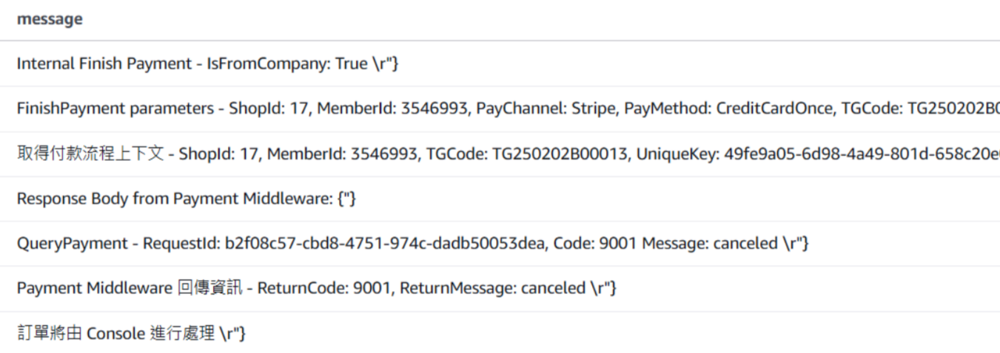

*圖：3D 驗證失敗後的系統狀態異常流程*

### 16.6 解決方案

#### 16.6.1 立即處理方案

**處理方式**：使用 Timeout 機制進行資料庫狀態更新

**執行步驟**：
1. **狀態重置**：將訂單狀態設為 Timeout
2. **資料壓制**：更新資料庫中的訂單狀態
3. **強制轉單**：執行轉單流程完成訂單處理

#### 16.6.2 長期修復方案

| 修復項目 | 修復內容 | 優先級 |
|----------|----------|--------|
| **PMW 狀態處理** | 加入 `"canceled"` 狀態的處理邏輯 | 高 |
| **錯誤處理機制** | 改善異常狀態的回復機制 | 高 |
| **監控告警** | 加強 3D 驗證失敗的監控 | 中 |
| **文件更新** | 更新異常處理操作手冊 | 低 |

### 16.7 預防措施

#### 16.7.1 監控改善

**監控項目**：
- 3D Secure 驗證失敗率
- `"canceled"` 狀態的處理次數
- PMW 錯誤碼 9999 的出現頻率

#### 16.7.2 系統改善

**改善方向**：
- 完善狀態處理邏輯
- 加強異常狀態的自動恢復
- 優化錯誤處理和用戶體驗

---