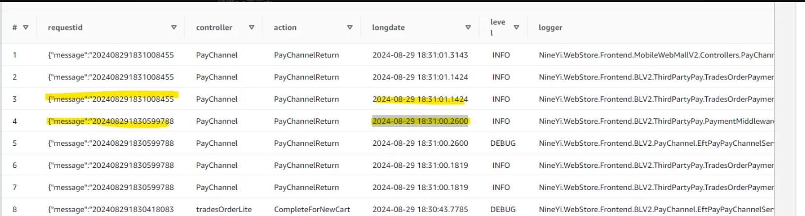
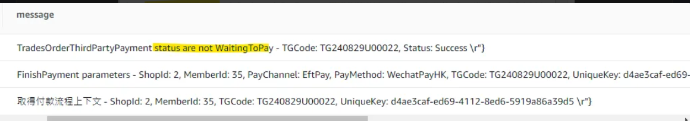

# 正流程文件

## 目錄
1. [最低金額判斷](#1-最低金額判斷)
2. [付款轉導](#2-付款轉導)
3. [轉導異常處理](#3-轉導異常處理)

<br>

---

## 1. 最低金額判斷

### 1.1 相關 PR

<br>

**MWeb**：https://bitbucket.org/nineyi/nineyi.webstore.mobilewebmall/pull-requests/43090

<br>

**Cart**：https://gitlab.91app.com/commerce-cloud/nine1.cart/-/merge_requests/2532


Stripe

- HK : 4
- US : 0.55

Razer

- MY : 1
- SG : 1

<br>

---

## 2. 付款轉導

### 2.1 基本機制說明

<br>

基本機制是，MWeb 在 Pay Request 的 ExtendoInfo 會帶上 Return to 91APP 的 URL，Pay PaymentMiddleware 會回覆一個 3-Party 頁面，付款完成或其他原因跳轉後會使用 Return to 91APP 的 URL，轉導 url 依照裝置與 Paytypes 會有所不同

<br>

### 2.2 一般三方頁面付款方式 (PayMe, QFPay , TwoCTwoP)

<br>

https://shop2.shop.qa1.hk.91dev.tw/V2/PayChannel/Default/QFPay/TG240618K00001?shopId=2&k=c44bc1b7-45e5-4d13-9a0f-c7658b1ee6fd&lang=zh-HK

/V2/PayChannel/{payMethod}/{payChannel}/{context.TradesOrderGroup.TradesOrderGroup_Code}

<br>

### 2.3 BoCPay_SwiftPass

<br>

/V2/PayChannel/{payMethod}/{payChannel}/{context.TradesOrderGroup.TradesOrderGroup_Code}/{shopId}/{context.UniqueKey}/{locale}

<br>

### 2.4 Cybersource

<br>

- PayRequest 時不帶上 ReutnrUrl
- Cybersource 頁面付款完後會自己 call 我們的 api
  - PayChannelController / PayChannelReturnPost
  - ✅ 有人呼叫這支 API（通常是 POST），你就直接回傳一整段 HTML 字串（不是 JSON，也不是檔案），而且是可以在瀏覽器中直接執行的 HTML
  - /V2/PayChannel/CreditCardOnce/Cybersource/{tgCode}?shopId={shopId}&k={uniqueKey}

<br>

### 2.5 Andriod

<br>

{appInitPath}-s{shopId:D6}://PayChannelReturn?url={encodedUri}

<br>

### 2.6 iOS

<br>

同官網

<br>

---

## 3. 轉導異常處理

### 3.1 Query正常但轉導異常

<br>

轉導3.5頁兩次

<br>



<br>



<br>

**處理**：

<br>

```csharp
//// VSTS422921 - 若 thirdPartyPayment 訂單已是成功，表示已轉導完成並處理過，直接導向付款完成頁 (處理因跨 APP 而多轉導一次情境)
if (thirdPartyPayment.TradesOrderThirdPartyPayment_StatusDef == nameof(TradesOrderThirdPartyPaymentStatusEnum.Success))
{
    return new QueryPaymentResultEntity() { ReturnCode = PaymentMiddlewareReturnCodeConstants.Success, TradeOrderGroupUniqueKey = context.UniqueKey};
}
```

<br>

---

## 4. 未轉單異常

### 4.1 ThirdPartyPayment 表更新中斷

<br>

**相關工作項目**：https://91appinc.visualstudio.com/G11n/_workitems/edit/536753

<br>