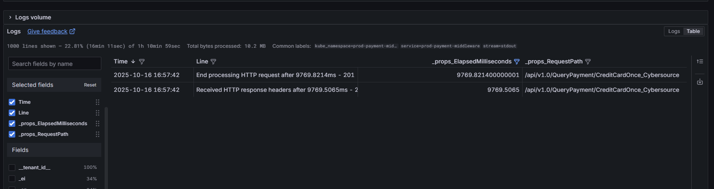

## ⏰ 查詢耗時方法

**基本查詢語法**：

```
{service="prod-payment-middleware"}
| json
|="Root=1-68f0b7b7-1cf9e63362ee8de07ac67bc3"
#|="End processing HTTP request"
#| json
#| line_format "{{._msg}}"
```

<br>

**介面操作參考**
_props_ElapsedMilliseconds
_props_RequestPath



<br>
<br>

## Dashboard

https://monitoring-dashboard.91app.io/d/Wc3ALtv4k/payment-middleware-monitor?orgId=2&refresh=1m

<br>


<br>


## LokiLog


https://monitoring-dashboard.91app.io/d/Wc3ALtv4k/payment-middleware-monitor?orgId=2&refresh=1m&from=now-15m&to=now&timezone=Asia%2FTaipei&var-MarketENV=HK-Prod&var-Loki=RjRcuuN4k&var-Cluster=dfHnWT74z&var-Namespace=prod-payment-middleware&var-CloudWatch=9jOlsfnVk&var-Message=&var-Level=Information&var-TGCode=&var-tid=&viewPanel=panel-2


## by jobName

```
{service="prod-promotion-service"} 
|json
# |= `504035_TG251103JA007P`
|_props_JobName =`PromotionRewardCoupon`
|json
| line_format "{{._msg}}"
```


## 耗時分析

{service="prod-payment-middleware"} 
|~ `` 
| json 
| _props_ElapsedMilliseconds > 10000
| line_format "{{._props_RequestPath}}, spend {{._props_ElapsedMilliseconds}}"


## 針對 requestPath


{service="prod-payment-middleware"} 
|~ `` 
| json 
| _props_RequestPath =`/api/v1.0/QueryPayment/CreditCardOnce_Cybersource`
| _props_ElapsedMilliseconds > 0
| line_format "{{._props_RequestPath}}, spend {{._props_ElapsedMilliseconds}}"


## requestpath


`/api/v1.0/pay/AliPayHK_EftPay/TG251106J00019`
`/api/v1.0/QueryPayment/CreditCardOnce_Cybersource`
`/api/v1.0/pay/CreditCardOnce_Razer`
`/api/v1.0/pay/CreditCardInstallment_Razer`
## by status code


{service="prod-payment-middleware"}
|json
|= ` - 50`
|json
| line_format "{{._msg}}"


## Razer 要看 pay response 則

HTTP Response - Status: OK, Body