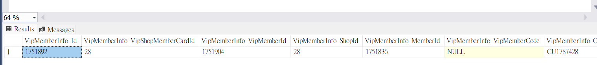

## 訂單列表頁的 toolTips



**1. 確認系統於 0 分鐘後自動取消訂單，若有使用折價券，將一併歸還至您的帳號。搜尋**
**2. 語系設定**

```
系統於 {0} 分鐘後自動取消訂單，若有使用折價券，將一併歸還至您的帳號。
==> languagetool ==> third_party_payment_tooltip_msg_2
```
**3. 前端實作**：

```javascript
toolTipData: this.$translate.instant('frontend.typescripts.trades_order.detail.third_party_payment_tooltip_msg_2', { val0: this.PaymentTimeOut / 60 })
```

**4. 追朔 this.PaymentTimeOut 怎麼塞的**：

```javascript
this.PaymentTimeOut = result.Data.PayInfo.PaymentTimeOut; // ==> result 怎麼來的
GetDetail ==> this.MemberTradesOrderService.GetDetail(TGId)
var url = this.config.webapiUrl + '/MemberTradesOrder/GetDetail/' + TGId;
```

<br>

**5. 後端實作**：

**MemberTradesOrderController >> GetDetail**：

```csharp
var tgDetail = this._memberTradesOrderService.GetMemberTradesOrderDetail(tgId, cleanCache);
this.ArrangePayInfo(tgDetailContext);
//// 取得PaymentTimeout資訊
payInfo.PaymentTimeOut = this._payChannelConfigurations.GetPaymentTimeout(tgDetailContext.PayInfo.PayProfileTypeDef);

public int? GetPaymentTimeout(PayProfileTypeDefEnum payType)
{
    var isShowPaymentTimeout =
        Enum.IsDefined(typeof(MemberTradesOrderGroupPaymentInfoAllowEnum), payType.ToString());

    if (isShowPaymentTimeout == true)
    {
        return this.GetTimeoutTimeInSeconds(payType);
    }
    else
    {
        return default(int?);
    }
}
```


## 進度條異常出現 SubMessage

**錯誤原因節點**

```csharp
slave.FlowStatusMessageInfo = memberTradesOrderSlaveFlowService.GetMemberTradesOrderSlaveFlowStatusMessage(paramsEntity);
```

<br>

**問題程式碼**：

```csharp
case MemberTradesOrderOrderSlaveFlowStatusForUserEnum.RefundProcessing:
{
    //// 退款中
    //// 如果是信用卡的退款訂單，不判斷退款單狀態直接顯示處理工作天
    if (paramsEntity.RefundTypeDef == RefundRequestTypeDefEnum.CreditCard ||
        paramsEntity.RefundTypeDef == RefundRequestTypeDefEnum.CreditCardOnce_Stripe ||
        paramsEntity.RefundTypeDef == RefundRequestTypeDefEnum.CreditCardOnce_CheckoutDotCom)
    {
        entity.MainMessage = string.Format("{0} " + Translation.Backend.Service.MemberTradesOrderSlaveReturnGoodsFlow.StartRefundProcessing, paramsEntity.OrderSlaveFlowUpdatedDateTime.ToString("yyyy/MM/dd"));

        if (SettingHelper.DefaultCountry == "TW")
        {
            entity.SubMessage = Translation.Backend.Service.MemberTradesOrderSlaveReturnGoodsFlow.SpendWorkingDays;
        }

        break;
    }
    //// 如果是退款中並且退款單中沒有匯款資訊要顯示提示文字，前端會轉成文字連結
    if (paramsEntity.HasRefundInfo == false)
    {
        entity.MainMessage = string.Format("{0} " + Translation.Backend.Service.MemberTradesOrderSlaveReturnGoodsFlow.StartRefundProcessing, paramsEntity.OrderSlaveFlowUpdatedDateTime.ToString("yyyy/MM/dd"));
        entity.SubMessage = Translation.Backend.Service.MemberTradesOrderSlaveReturnGoodsFlow.RefillRefundInfo;
    }
    else
    {
        entity.MainMessage = StringUtility.PeacefulFormat("{0} " + Translation.Backend.Service.MemberTradesOrderSlaveReturnGoodsFlow.StartRefundProcessing, paramsEntity.OrderSlaveFlowUpdatedDateTime.ToString("yyyy/MM/dd"));

        if (SettingHelper.DefaultCountry == "TW")
        {
            entity.SubMessage = Translation.Backend.Service.MemberTradesOrderSlaveReturnGoodsFlow.SpendWorkingDays;
        }
    }

    break;
}
```

<br>

**修法**

因為 GetList 的時候

**API**：https://shop2.shop.qa1.hk.91dev.tw/webapi/MemberTradesOrder/GetList?shopId=2&startIndex=0&maxCount=5&lang=zh-HK

**處理器**

```csharp
getMemberTradesOrderProcessFlow.Add(typeof(GetMemberTradesOrderRefundProcessor), "取得退款進度條資訊");

item.HasRefundInfo = this.CheckRefundInfo(refundRequestEntity);
```

**CheckRefundInfo 方法**

```csharp
//// Line Pay/CathayPay/PX Pay/街口支付/ icash Pay 刷退不需銀行資料
if (refundType == RefundRequestTypeDefEnum.LinePay ||
    refundType == RefundRequestTypeDefEnum.CathayPay ||
    refundType == RefundRequestTypeDefEnum.PXPay ||
    refundType == RefundRequestTypeDefEnum.JKOPay ||
    refundType == RefundRequestTypeDefEnum.EWallet_PayMe ||
    refundType == RefundRequestTypeDefEnum.Aftee ||
    refundType == RefundRequestTypeDefEnum.icashPay ||
    refundType == RefundRequestTypeDefEnum.AliPayHK_EftPay ||
    refundType == RefundRequestTypeDefEnum.WechatPayHK_EftPay ||
    refundType == RefundRequestTypeDefEnum.EasyWallet ||
    refundType == RefundRequestTypeDefEnum.PoyaPay ||
    refundType == RefundRequestTypeDefEnum.CreditCardOnce_Razer ||
    refundType == RefundRequestTypeDefEnum.CreditCardInstallment_Razer ||
    refundType == RefundRequestTypeDefEnum.OnlineBanking_Razer ||
    refundType == RefundRequestTypeDefEnum.Boost_Razer ||
    refundType == RefundRequestTypeDefEnum.TNG_Razer ||
    refundType == RefundRequestTypeDefEnum.GrabPay_Razer ||
    refundType == RefundRequestTypeDefEnum.BoCPay_SwiftPass ||
    refundType == RefundRequestTypeDefEnum.Atome ||
    refundType == RefundRequestTypeDefEnum.UnionPay_EftPay ||
    refundType == RefundRequestTypeDefEnum.PXPayPlus ||
    refundType == RefundRequestTypeDefEnum.PlusPay ||
    refundType == RefundRequestTypeDefEnum.Wallet ||
    refundType == RefundRequestTypeDefEnum.CreditCardOnce_AsiaPay ||
    refundType == RefundRequestTypeDefEnum.TNG_AsiaPay ||
    refundType == RefundRequestTypeDefEnum.GrabPay_AsiaPay ||
    refundType == RefundRequestTypeDefEnum.OpenWallet ||
    refundType == RefundRequestTypeDefEnum.FamilyMartOnlinePay ||
    refundType == RefundRequestTypeDefEnum.RazerPay ||
    refundType == RefundRequestTypeDefEnum.CreditCardOnce_Cybersource ||
    refundType == RefundRequestTypeDefEnum.QFPay ||
    refundType == RefundRequestTypeDefEnum.StoreCredit)
{
    return true;
}

if(refundType == RefundRequestTypeDefEnum.GooglePay ||
    refundType == RefundRequestTypeDefEnum.ApplePay)
{
    if(SettingHelper.DefaultCountry == "HK")
    {
        return true;
    }
    else
    {
        return false;
    }
}
```

<br>

## 退款進度條文案顯示

#### 節點設定

**HasRefundInfo**

```csharp
if (paramsEntity.HasRefundInfo == false)
{
    entity.MainMessage = string.Format("{0} " + Translation.Backend.Service.MemberTradesOrderSlaveReturnGoodsFlow.StartRefundProcessing, paramsEntity.OrderSlaveFlowUpdatedDateTime.ToString("yyyy/MM/dd"));
    entity.SubMessage = Translation.Backend.Service.MemberTradesOrderSlaveReturnGoodsFlow.RefillRefundInfo;
}
```

<br>

#### 顯示邏輯分岐程式碼

```csharp
slave.FlowStatusMessageInfo = memberTradesOrderSlaveFlowService.GetMemberTradesOrderSlaveFlowStatusMessage(paramsEntity);

case MemberTradesOrderOrderSlaveFlowStatusForUserEnum.RefundProcessing:
{
    //// 退款中
    //// 如果是信用卡的退款訂單，不判斷退款單狀態直接顯示處理工作天
    if (paramsEntity.RefundTypeDef == RefundRequestTypeDefEnum.CreditCard ||
        paramsEntity.RefundTypeDef == RefundRequestTypeDefEnum.CreditCardOnce_Stripe ||
        paramsEntity.RefundTypeDef == RefundRequestTypeDefEnum.CreditCardOnce_CheckoutDotCom)
    {
        entity.MainMessage = string.Format("{0} " + Translation.Backend.Service.MemberTradesOrderSlaveReturnGoodsFlow.StartRefundProcessing, paramsEntity.OrderSlaveFlowUpdatedDateTime.ToString("yyyy/MM/dd"));

        if (SettingHelper.DefaultCountry == "TW")
        {
            entity.SubMessage = Translation.Backend.Service.MemberTradesOrderSlaveReturnGoodsFlow.SpendWorkingDays;
        }

        break;
    }
    //// 如果是退款中並且退款單中沒有匯款資訊要顯示提示文字，前端會轉成文字連結
    if (paramsEntity.HasRefundInfo == false)
    {
        entity.MainMessage = string.Format("{0} " + Translation.Backend.Service.MemberTradesOrderSlaveReturnGoodsFlow.StartRefundProcessing, paramsEntity.OrderSlaveFlowUpdatedDateTime.ToString("yyyy/MM/dd"));
        entity.SubMessage = Translation.Backend.Service.MemberTradesOrderSlaveReturnGoodsFlow.RefillRefundInfo;
    }
    else
    {
        entity.MainMessage = StringUtility.PeacefulFormat("{0} " + Translation.Backend.Service.MemberTradesOrderSlaveReturnGoodsFlow.StartRefundProcessing, paramsEntity.OrderSlaveFlowUpdatedDateTime.ToString("yyyy/MM/dd"));

        if (SettingHelper.DefaultCountry == "TW")
        {
            entity.SubMessage = Translation.Backend.Service.MemberTradesOrderSlaveReturnGoodsFlow.SpendWorkingDays;
        }
    }

    break;
}
```


#### 訂單 GetList API

https://shop2.shop.qa1.hk.91dev.tw/webapi/MemberTradesOrder/GetList?shopId=2&startIndex=0&maxCount=5&lang=zh-HK

<br>

#### PR

https://bitbucket.org/nineyi/nineyi.webstore.mobilewebmall/pull-requests/43918/diff