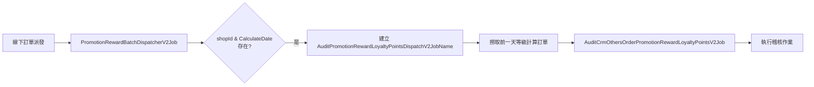

- TradesOrderGroupCode 為單位

**觸發流程**

#### 📊 觸發條件

| 階段 | 服務名稱 | 觸發條件 | 說明 |
|------|----------|----------|------|
| **1** | `PromotionRewardBatchDispatcherV2Job` | 線下訂單派發時 | 檢查是否有 `shopId` & `CalculateDate` |
| **2** | `AuditPromotionRewardLoyaltyPointsDispatchV2JobName` | 條件符合時建立 | 取得 `shopId` 進行訂單撈取 |
| **3** | `AuditCrmOthersOrderPromotionRewardLoyaltyPointsV2Job` | 撈取到訂單後 | 執行稽核 (不論是否有進行中活動) |

- **時間範圍**: 撈取前一天等級計算訂單
- **執行條件**: 不管是否有進行中活動都會執行稽核
- **觸發依據**: 基於 `shopId` 和 `CalculateDate` 參數