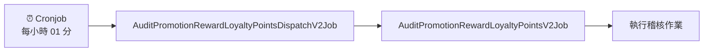

```json
//// tw qa
{"Data":"{\"Id\":\"ee932cc0-b476-4cc1-96d5-d7fb1900418c\",\"IdempotencyKey\":\"TG250411L00004\",\"EventName\":\"OrderCreated\",\"EventArgs\":{\"Market\":null,\"ShopId\":5},\"Source\":{\"ShopId\":5,\"PayType\":\"CreditCardOnce_Stripe\",\"TSCount\":1,\"MemberId\":32909,\"CellPhone\":\"88888888\",\"OrderCode\":\"TG250411L00004\",\"UserAgent\":\"Mozilla/5.0 (Windows NT 10.0; Win64; x64) AppleWebKit/537.36 (KHTML, like Gecko) Chrome/134.0.0.0 Safari/537.36\",\"CountryCode\":\"852\",\"HttpReferer\":\"https://cccrrrmmm1.shop.qa1.hk.91dev.tw/V2/ShoppingCart/Index?shopId=5\",\"TotalAmount\":200.0,\"CurrencyCode\":\"HKD\",\"OrderDateTime\":\"2025-04-11T02:20:41.7973958+00:00\"},\"SourceType\":\"Orders\",\"SourceKey\":\"TG250411L00004\",\"CreatedAt\":\"2025-04-11T02:20:42.6189354+00:00\"}"}

//// hk qa
{"Data":"{\"FirstTriggerTime\":\"2025-04-11T14:06:20.4337541+08:00\",\"Id\":\"3ab621a0-2c4a-47e5-9c0e-0d86086c9b46\",\"SourceType\":\"Orders\",\"EventName\":\"OrderCreated\",\"IdempotencyKey\":\"TG250411Q00001\",\"Version\":null,\"SourceKey\":\"TG250411Q00001\",\"CreatedAt\":\"2025-04-11T06:05:52.9052972+00:00\",\"EventArgs\":{},\"Source\":{\"ShopId\":2,\"MemberId\":33132,\"OrderCode\":\"TG250411Q00001\",\"TotalAmount\":721000.0,\"CurrencyCode\":\"HKD\",\"OrderDateTime\":\"2025-04-11T14:05:51.7550714+08:00\",\"PayType\":\"CreditCardOnce_Stripe\",\"CellPhone\":\"934565786\"}}"}
```

## 觸發機制



| 階段 | 服務名稱 | 觸發時機 | 說明 |
|------|----------|----------|------|
| **1** | `Cronjob` | 每小時 01 分 | 定時排程觸發 |
| **2** | `AuditPromotionRewardLoyaltyPointsDispatchV2Job` | 被 Cronjob 觸發 | 派發稽核作業 |
| **3** | `AuditPromotionRewardLoyaltyPointsV2Job` | 被 Dispatch 觸發 | 執行實際稽核 |

#### 檢查訂單

| 參數 | 說明 | 資料來源 |
|------|------|----------|
| **時間範圍** | 執行時間 -2 hr ~ +1 hr 的訂單 | `salesOrderGroup` |
| **有效性檢查** | 檢查 `SalesOrderGroup.IsValid` | 資料庫直接查詢 |
| **訂單時間** | `salesOrderGroup.SalesOrderGroupDateTime` | 訂單群組時間戳記 |


#### PromotionRewardLoyaltyPointsRecordAuditor

`LoyaltyPromotionRewards` 記錄與 `auditData` 現場撈取資料進行交叉驗證

#### ✅ 稽核項目清單

| 稽核類型 | 檢查內容 | 預期結果 | 異常處理 |
|----------|----------|----------|----------|
| **🚫 活動排除檢查** | 不應符合活動條件的訂單 | 未獲得點數獎勵 | 記錄誤發獎勵異常 |
| **✅ 活動符合檢查** | 應符合活動條件的訂單 | 正確獲得點數獎勵 | 記錄漏發獎勵異常 |
| **🔢 點數數量檢查** | 應發放點數 vs 實際發放點數 | 數量完全一致 | 記錄點數差異異常 |
| **📊 攤提結果檢查** | 多檔活動點數攤提計算 | 攤提邏輯正確 | 記錄攤提異常 |