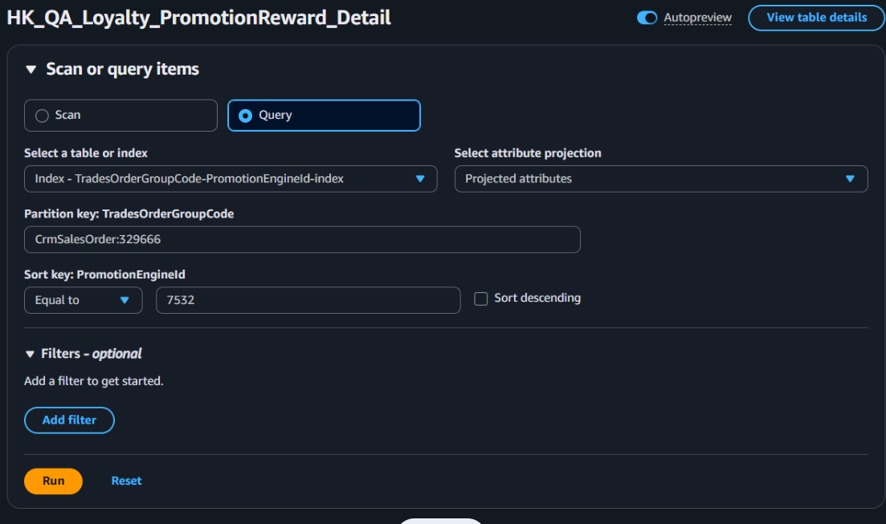

## Detail 快速查子單們有哪些

利用 Index 進行查詢操作

 
 

## 主單

`HK_QA_Loyalty_PromotionReward`

線上訂單：`25037_TG240710Q00025`
線下訂單：`31207_CrmSalesOrder:405587`

 
 

## 子單

`HK_Prod_Loyalty_PromotionReward_Detail`

線上訂單：`25721_TG250228N00007_TS250228N000025_1`
線下訂單：`31207_CrmSalesOrder:405587_test0003_0`

 

## 券

`HK_QA_Coupon_PromotionReward_Info`

`2_7292_2504`

## UpdateReason 彙總關鍵字

#### 主表

- 因訂單已全部取消，更新狀態為
- 因活動給予
- 給券異常，本次已給予
- 訂單逆流程進行中，順延一天
- 設定BookingDataTime:
- 活動優惠券回饋:
- 重新計算後優惠券數量為

 

#### 子表

- 整張訂單取消，更新狀態為
- 完成優惠券回饋，更新狀態為
- 給券異常，更新狀態為