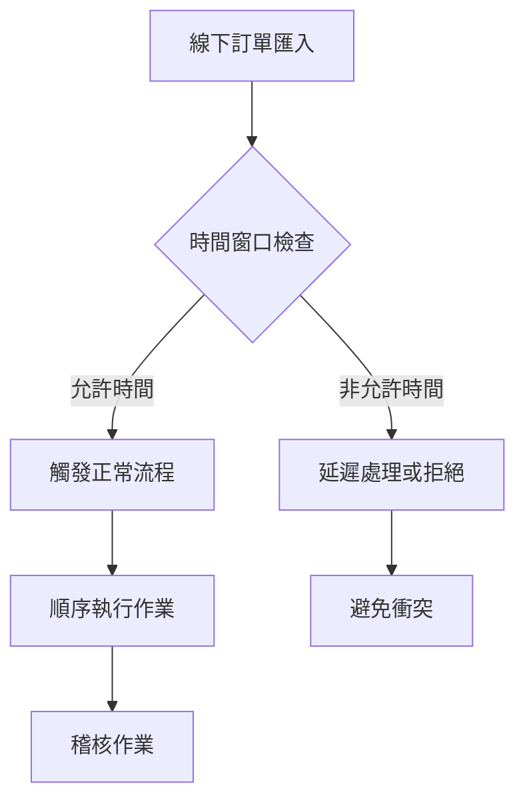

## 📅 事件觸發時間點

**異常觸發**: Shop 41332 在非預期時間匯入線下訂單
- **16:51** - 第一次匯入線下訂單
- **17:03** - 第二次匯入線下訂單  
- **觸發事件**: `Internal_MemberTierCalculateFinished`
- **後續影響**: 產生 `PromotionRewardBatchDispatcherV2` 作業

## ⚙️ 流程執行時序圖

```mermaid
gantt
    title 線下訂單匯入後的作業執行時序
    dateFormat HH:mm
    axisFormat %H:%M
    
    section 立即執行
    PromotionRewardLoyaltyPointsV2    :done, reward1, 16:51, 17:00
    PromotionRewardCoupon             :done, reward2, 16:51, 17:00
    AuditCrmOthersOrderReward         :done, audit1, 10:30, 11:00
    AuditCrmOthersOrderCoupon         :done, audit2, 10:30, 11:00
    AuditCrmOthersRecycleLoyalty      :done, audit3, 14:00, 14:30
    AuditCrmOthersRecycleCoupon       :done, audit4, 14:00, 14:30
    
    section 預約執行
    RecycleLoyaltyPointsV2            :booking1, 10:30, 11:00
    PromotionRecycleCoupon            :booking2, 10:30, 11:00
    AuditPromotionRewardDispatch      :booking3, 10:30, 11:00
    AuditPromotionRecycleDispatch     :booking4, 14:00, 14:30
    BatchAuditLoyaltyPoints           :booking5, 14:30, 15:00
```

## 📋 作業執行順序詳細

| 執行時機 | 作業名稱 | 預約時間 | 執行方式 | 衝突風險 |
|----------|----------|----------|----------|----------|
| **立即執行** | `PromotionRewardLoyaltyPointsV2` | - | 立即 | ⚠️ 與回收作業重疊 |
| **立即執行** | `PromotionRewardCoupon` | - | 立即 | ⚠️ 與回收作業重疊 |
| **預約執行** | `RecycleLoyaltyPointsV2` | 10:30 | 預約 | ⚠️ 時機不當 |
| **預約執行** | `PromotionRecycleCoupon` | 10:30 | 預約 | ⚠️ 時機不當 |
| **預約執行** | `AuditPromotionRewardDispatch` | 10:30 | 預約 | ❌ 正逆流程混雜 |
| **立即執行** | `AuditCrmOthersOrderReward` | - | 立即 | ❌ 稽核時序錯亂 |
| **預約執行** | `AuditPromotionRecycleDispatch` | 14:00 | 預約 | ❌ 正逆流程混雜 |
| **立即執行** | `AuditCrmOthersOrderRecycle` | - | 立即 | ❌ 稽核時序錯亂 |
| **預約執行** | `BatchAuditLoyaltyPoints` | 14:30 | 預約 | ⚠️ 誤判風險 |

## ⚠️ 問題影響

#### 🔄 流程衝突分析
1. **正逆流程重疊**: 發放和回收作業同時進行
2. **稽核時序錯亂**: 稽核在業務邏輯完成前執行
3. **大量誤判**: 稽核無法正確區分正逆流程狀態

## 💡 解決建議

#### 🛠️ 短期解決方案
- **時間管控**: 限制線下訂單匯入時間窗口
- **狀態檢查**: 稽核前確認相關作業完成狀態
- **異常過濾**: 識別並排除時機衝突的稽核結果

#### 📋 長期改善方案
- **流程隔離**: 將正逆流程稽核作業完全分離
- **依賴管理**: 建立作業間的依賴關係和順序控制
- **監控告警**: 設置時機異常的預警機制

