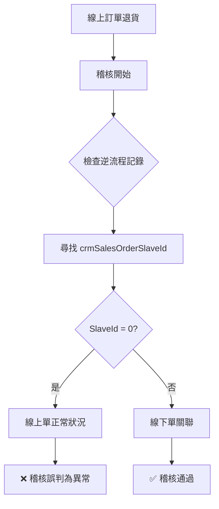

## 🚨 異常訊息

```bash
給券回收紀錄稽核監控到異常
市場環境: HK-Prod
TS Code: TS250722Q000299
稽核到下列異常:
DDB Detail找不到對應的退貨訂單明細
crmSalesOrderSlaveId: 0
DDB Keys: 34743_TG250722Q00126
```

## 📋 問題本質

| 稽核項目 | 稽核邏輯 | 實際狀況 | 結果 |
|----------|----------|----------|------|
| **訂單類型** | 線上訂單 | 線上訂單 | ✅ 正確 |
| **子單檢查** | 尋找線下子單 | 線上單無線下子單 | ❌ 邏輯錯誤 |
| **預期值** | `crmSalesOrderSlaveId = 0` | `crmSalesOrderSlaveId = 0` | ✅ 符合預期 |
| **稽核判定** | 異常 | 正常 | ❌ 誤判 |

## 🔄 稽核邏輯問題



## ⚠️ 稽核邏輯缺陷

#### 📝 問題分析
- **稽核目的**: 檢查逆流程是否正確記錄到子單資訊
- **邏輯錯誤**: 線上訂單本就不應有 `crmSalesOrderSlaveId`
- **誤判原因**: 稽核規則未區分線上/線下訂單類型

## 🔧 稽核邏輯修正
```csharp
// 建議的稽核邏輯調整
if (order.OrderType == "Online") 
{
    // 線上訂單：crmSalesOrderSlaveId 應為 0
    if (detail.crmSalesOrderSlaveId == 0) 
    {
        // 正常情況，無需異常警告
        return AuditResult.Pass;
    }
}
else if (order.OrderType == "Offline") 
{
    // 線下訂單：檢查是否有對應的子單記錄
    if (detail.crmSalesOrderSlaveId == 0) 
    {
        return AuditResult.Fail("找不到對應的退貨訂單明細");
    }
}
```