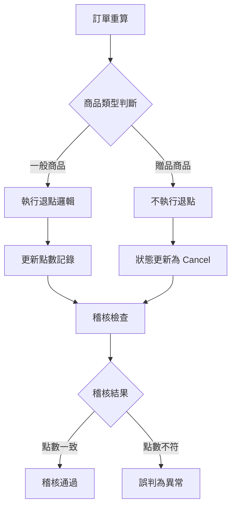

## 🚨 異常訊息


```bash
給點紀錄稽核監控到異常
市場環境: TW-Prod
TG Code: TG250722QA00W6
稽核到下列異常:
- 應給點數(200)與實際點數(0)不同
- 活動:472232 攤提結果不符預期
- 應給點數(60)與實際點數(0)不同  
- 活動:472125 攤提結果不符預期
```

## 📋 問題原因

| 異常項目 | 業務邏輯 | 稽核判定 | 實際狀況 |
|----------|----------|----------|----------|
| **Task ID** | `TS250722QA0020F` | 點數差異異常 | 贈品不退點屬正常 |
| **商品屬性** | `IsGift:True, IsSalePageGift:False, IsMajor:False` | 應給點數 > 0 | 贈品不執行退點 |
| **處理結果** | `重算後整單不滿額，更新回饋狀態為 Cancel` | 攤提異常 | 業務邏輯正確 |

#### ⚙️ 業務邏輯說明



## 💡 解決建議

#### 🔧 稽核邏輯調整
- **贈品檢查**: 稽核時需判斷 `IsGift` 屬性
- **業務規則**: 贈品商品不參與退點計算
- **狀態更新**: `Cancel` 狀態為正常業務流程

#### 📝 改善方案
```csharp
// 稽核邏輯建議調整
if (item.IsGift && !item.IsSalePageGift && !item.IsMajor) 
{
    // 贈品不執行退點，跳過點數差異檢查
    continue;
}
```