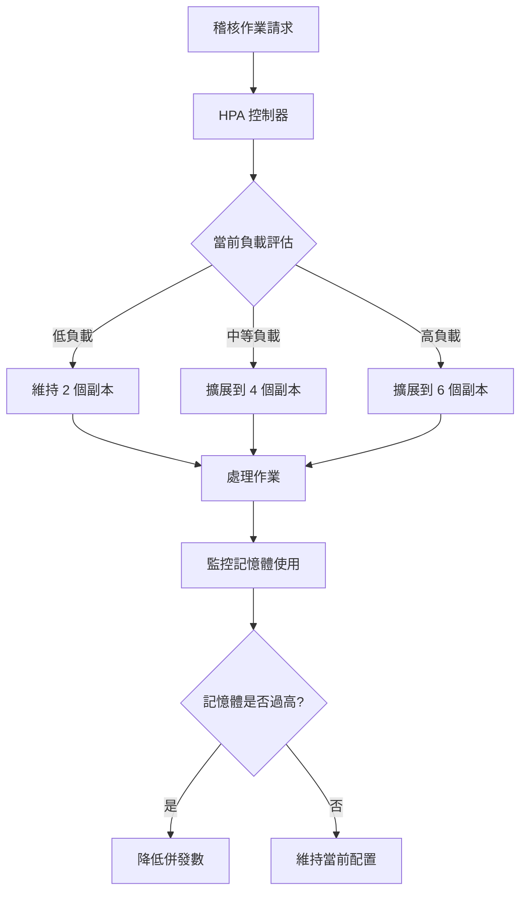

## 影響範圍

TW 生產環境 Promotion Group3  

## 🔍 問題背景

**Slack 討論記錄**: https://91app.slack.com/archives/G06A3GDC7/p1761364027990879

#### ⚠️ 系統壓力指標
- **服務名稱**: TW Promotion Group3
- **問題現象**: 稽核作業大量堆積
- **資源耗用**: 記憶體使用過高，面臨 OOM 風險

## 🛠️ 解決方案

#### 📊 水平擴展 (HPA)
**橫向擴展配置**:
```yaml
# HPA 配置調整
replicas:
  min: 2
  max: 6  # 從 2 調整為 6
```

| 配置項目 | 調整前 | 調整後 | 效果 |
|----------|--------|--------|------|
| **最大副本數** | 2 | 6 | 提升 3 倍處理能力 |
| **負載分散** | 有限 | 大幅改善 | 減少單一實例壓力 |
| **擴展彈性** | 低 | 高 | 快速應對流量高峰 |

## ⚙️ 作業併發控制
**AuditCrmOthersOrderPromotionRewardCoupon 配置調整**:

```csharp
// 併發處理數量調整
MaxProcessCount: 2 → 1
```

| 調整項目 | 調整前 | 調整後 | 目的 |
|----------|--------|--------|------|
| **最大處理數** | 2 | 1 | 避免 OOM |
| **記憶體使用** | 高風險 | 受控 | 提升穩定性 |
| **處理策略** | 併發優先 | 穩定優先 | 確保服務可用性 |

## 🔄 負載平衡機制


## 📋 配置最佳化

**短期調整**:
- ✅ **HPA 擴展**: 2 → 6 副本提升處理能力
- ✅ **併發限制**: 最大處理數 2 → 1 避免 OOM
- ✅ **資源監控**: 密切關注記憶體使用率

**長期優化**:
- **作業分批**: 將大量稽核作業拆分為更小批次
- **記憶體優化**: 優化稽核邏輯減少記憶體佔用
- **快取機制**: 實作適當的快取策略減少重複計算

