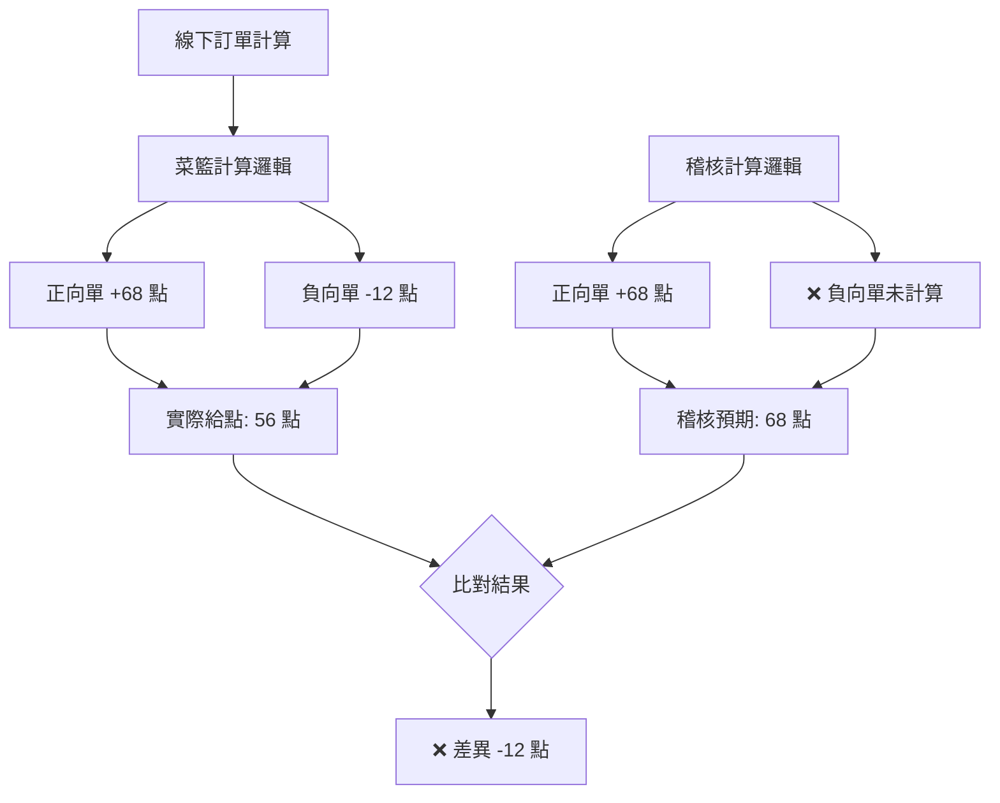

## 🚨 異常訊息

```log
線下訂單給點紀錄稽核監控到異常
應給點數: 68 點
實際給點點數: 56 點
差異: -12 點
```

## 📋 計算差異原因

| 計算項目 | 稽核計算 | 實際計算 | 差異說明 |
|----------|----------|----------|----------|
| **正向單計算** | ✅ 已納入 | ✅ 已納入 | 一致 |
| **負向單計算** | ❌ 未納入 | ✅ 已納入 | **稽核遺漏** |
| **最終結果** | 68 點 | 56 點 | -12 點差異 |

## ⚙️ 業務邏輯說明



## ⚠️ 稽核邏輯缺陷

#### 📝 問題分析
- **菜籃計算**: 正確計算了正向單和負向單的點數
- **稽核計算**: 僅計算正向單，忽略負向單的影響
- **結果差異**: 稽核預期值高於實際發放點數

## 🔧 稽核邏輯修正

**現有稽核邏輯**:
```csharp
// 僅計算正向單
var expectedPoints = positiveOrders.Sum(o => o.Points);
```

**建議修正邏輯**:
```csharp
// 同時計算正向單和負向單
var expectedPoints = positiveOrders.Sum(o => o.Points) 
                   + negativeOrders.Sum(o => o.Points); // 負向單為負數
```