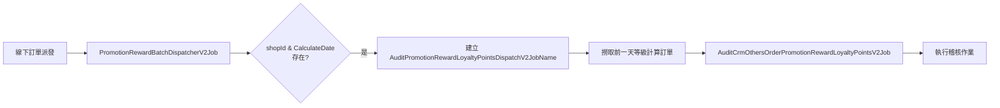
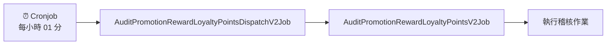

## 📋 目錄
1. [AuditPromotionRewardLoyaltyPointsDispatchV2Job](#auditpromotionrewardloyaltypointsdispatchv2job)
2. [AuditCrmOthersOrderPromotionRewardLoyaltyPointsV2Job](#auditcrmothersorderpromotionrewardloyaltypointsv2job)
3. [AuditPromotionRecycleDispatch](#auditpromotionrecycledispatch)
4. [AuditPromotionRecycleLoyaltyPoints / AuditPromotionRecycleCouponJob](#auditpromotionrecycleloyaltypoints--auditpromotionrecyclecouponjob)
5. [AuditCrmOthersOrderPromotionRecycleLoyaltyPointsJob](#auditcrmothersorderpromotionrecycleloyaltypointsjob)
6. [CheckPromotionRuleRecordJob](#checkpromotionrulerecordjob)
7. [BatchAuditLoyaltyPointsJob](#batchauditloyaltypointsjob)
8. [AuditPromotionRewardLoyaltyPointsV2Job](#auditpromotionrewardloyaltypointsv2job)

---

## AuditPromotionRewardLoyaltyPointsDispatchV2Job

- 會同時處理給點給券!!

#### 🛍️ 線上訂單處理

**Cronjob 定時觸發**: 每小時 01 分執行

| 參數 | 說明 | 資料來源 |
|------|------|----------|
| **時間範圍** | 執行時間前 2 小時內的訂單 | `salesOrderGroup` |
| **有效性檢查** | 檢查 `SalesOrderGroup.IsValid` | 資料庫驗證 |

**資料對應關係**
```
ShopId => salesOrderGroup.ShopId
MemberId => salesOrderGroup.MemberId  
OrderCode => salesOrderGroup.TradesOrderGroupCode
OrderDateTime => salesOrderGroup.OrderDateTime
```

#### 🛍️ 線下訂單處理

- PromotionRewardBatchDispatcherV2Job 線下訂單派發線下訂單回收點道具稽核當下 + 10.5hr

<br>

#### 🏪 線下訂單處理

**由 `PromotionRewardBatchDispatcherV2Job` 觸發**

**資料對應關係**

| 目標欄位 | 資料來源 | 說明 |
|----------|----------|------|
| `ShopId` | `CrmSalesOrderShopId` | 商店 ID |
| `CrmMemberId` | `CrmSalesOrderCrmMemberId` | CRM 會員 ID |
| `CrmSalesOrderId` | `CrmSalesOrderId` | CRM 訂單 ID |
| `TradesOrderFinishDatetime` | `CrmSalesOrderTradesOrderFinishDateTime` | 交易完成時間 |


<br>
<br>

## AuditCrmOthersOrderPromotionRewardLoyaltyPointsV2Job

- TradesOrderGroupCode 為單位

**觸發流程**



#### 📊 觸發條件

| 階段 | 服務名稱 | 觸發條件 | 說明 |
|------|----------|----------|------|
| **1** | `PromotionRewardBatchDispatcherV2Job` | 線下訂單派發時 | 檢查是否有 `shopId` & `CalculateDate` |
| **2** | `AuditPromotionRewardLoyaltyPointsDispatchV2JobName` | 條件符合時建立 | 取得 `shopId` 進行訂單撈取 |
| **3** | `AuditCrmOthersOrderPromotionRewardLoyaltyPointsV2Job` | 撈取到訂單後 | 執行稽核 (不論是否有進行中活動) |

- **時間範圍**: 撈取前一天等級計算訂單
- **執行條件**: 不管是否有進行中活動都會執行稽核
- **觸發依據**: 基於 `shopId` 和 `CalculateDate` 參數

<br>
<br>

## AuditPromotionRecycleDispatch

- 每小時 01 分

#### 線上訂單

- 撈前兩小時
- 建立 AuditPromotionRecycleLoyaltyPointsJob / AuditPromotionRecycleCouponJob

#### 線下訂單

- 撈前一天等級計算
- AuditCrmOthersOrderPromotionRecycleLoyaltyPointsJob / AuditCrmOthersOrderPromotionRecycleCouponJob

## AuditPromotionRecycleLoyaltyPoints / AuditPromotionRecycleCouponJob

- ts code 為單位

由 AuditPromotionRecycleDispatchJob 派發

- CancelOrderSlave
- returnGoodsSlave


**📋 訂單類型與條件**

| 訂單類型 | 資料表 | 時間欄位 | 狀態條件 |
|----------|--------|----------|----------|
| **🚫 取消訂單** | `CancelOrderSlave` | `CancelOrderSlave_UpdatedDateTime` | 狀態為 `Finish` |
| **📦 退貨訂單** | `ReturnGoodsOrderSlave` | `ReturnGoodsOrderSlaveStatusUpdatedDateTime` | 狀態為 `Finish` |

#### 🔍 查詢邏輯說明

- **取消訂單 (`cancelTsCodes`)**:
  - 查詢 `CancelOrderSlave` 表
  - 以 `CancelOrderSlave_UpdatedDateTime` 為時間基準
  - 篩選前兩小時內狀態為 `Finish` 的記錄

- **退貨訂單**:
  - 查詢 `ReturnGoodsOrderSlave` 表  
  - 以 `ReturnGoodsOrderSlaveStatusUpdatedDateTime` 為時間基準
  - 篩選前兩小時內狀態為 `Finish` 的記錄


orderSlaveFlow.OrderSlaveFlowReturnGoodsOrderSlaveIsClosed
orderSlaveFlow.OrderSlaveFlowReturnGoodsOrderSlaveStatusDef == "Finish"
orderSlaveFlow.OrderSlaveFlowSalesOrderSlaveStatusDef == "Cancel"
orderSlaveFlow.OrderSlaveFlowSalesOrderSlaveStatusDef == "Fail"


- PromotionRecycleReCalculatePointsRecordAuditor
- PromotionRecycleQuotaPointsRecordAuditor
- PromotionRecycleTGLimitationAuditor

## AuditCrmOthersOrderPromotionRecycleLoyaltyPointsJob

- CrmSalesOrderSlaveId 為單位

- PromotionRecycleReCalculatePointsRecordAuditor
- PromotionRecycleQuotaPointsRecordAuditor
- PromotionRecycleTGLimitationAuditor


## CheckPromotionRuleRecordJob

### ⚙️ 輸入參數

| 參數名稱 | 說明 | 格式範例 |
|---------|------|----------|
| `StartDatetime` | 活動時間區間起始 | `2025-03-07T02:00` |
| `EndDatetime` | 活動時間區間結束 | `2025-03-20T02:45` |


### 🔎 檢查範圍與項目

#### 📊 檢查資料來源

| 資料表 | 檢查範圍 | 說明 |
|--------|----------|------|
| **PromotionEngine** | 指定時間區間內尚未結束的活動 | 活動主表資料 |
| **PromotionRuleRecord** | 每檔活動最新一筆規則記錄 | 活動規則設定 |

#### ✅ 檢核項目清單

**🗃️ RuleRecord 存在性**
   - 檢查活動是否有對應的規則記錄

**🔑 S3 Key 完整性**
   - 驗證最新 RuleRecord 是否包含 S3 Key

**☁️ S3 資料可用性**
   - 確認 S3 檔案實際存在且可存取

**🏷️ ProductScope 標籤解析**
   - 解析 ProductScope 並驗證 OuterIdTag 能正確取得 promotionTagId

**🔗 資料一致性比對**
   - 比對 S3 的 `S3ProductSkuOuterIds` 與 `PromotionTagSlave_TargetTypeCode`

### ⚠️ 問題處理機制

#### 🚨 異常情況處理

當檢核發現問題活動時：

- **⚠️ 風險評估**: 新增/編輯活動時必定會上傳 S3 並產生對應 Record
- **🗑️ 資料清理**: 若無有效 Record 則視為髒資料，應移除該活動
- **🛡️ 風險防護**: 防止購物車無法進入等系統異常

<br>
<br>


## BatchAuditLoyaltyPointsJob

- AuditRecycleLoyaltyPointsV2 每小時 05 分 稽核前一小時
- PromotionRewardLoyaltyPointsV2 每小時 01 分 稽核前一小時


| 服務類型 | 服務名稱 | 適用環境 | 說明 |
|----------|----------|----------|------|
| **🛍️ 線上服務** | `AuditRecycleLoyaltyPointsV2Service` | 線上訂單 | 處理電商平台訂單的點數稽核 |
| **🏪 線下服務** | `AuditOfflineRecycleLoyaltyPointsV2Service` | 線下訂單 | 處理實體店面訂單的點數稽核 |
| **🎁 道具服務** | `BaseAuditLoyaltyPointsService.cs` | 道具相關 | 處理虛擬道具相關的點數稽核 |


#### AuditRecycleLoyaltyPointsV2Service

**實際回收點數**
```csharp
// 依活動 ID 取得實際回收點數
var actualRecyclePoints = detailEntities.Sum(detail => detail.LoyaltyPoint) - insufficientPoints;
```

<br>

#### 資料狀態不一致

**錯誤訊息:** `點數回收稽核錯誤：DDB 已還點而狀態未更新 IDs`

**檢查條件:**
```csharp
detail.Status != nameof(RewardDetailStatusEnum.NoReward) &&
detail.IsRecycle == false &&
detail.Status != nameof(RewardDetailStatusEnum.Recycle) &&
detail.Status != nameof(RewardDetailStatusEnum.Cancel)
```

<br>

##### 退點數量異常

**錯誤訊息:** `點數回收稽核錯誤：DDB 發現退點超過給點數量 IDs`

**檢查邏輯:**
```csharp
record.GivingPoints < record.RecyclePoints
```

**說明:** 確保回收點數不超過原始發放點數

<br>

#### 交易記錄完整性

| 欄位名稱 | 說明 | 必要性 |
|----------|------|--------|
| `LoyaltyPointTransactionOccurTypeId` | 交易發生類型 ID | ✅ 必須存在 |
| `LoyaltyPointTransactionEventTypeDef` | 交易事件類型定義 | ✅ 必須存在 |
| `VipmemberId` | VIP 會員 ID | ✅ 必須存在 |即觸發稽核異常


## AuditPromotionRewardLoyaltyPointsV2Job

<br>

#### 觸發機制



| 階段 | 服務名稱 | 觸發時機 | 說明 |
|------|----------|----------|------|
| **1** | `Cronjob` | 每小時 01 分 | 定時排程觸發 |
| **2** | `AuditPromotionRewardLoyaltyPointsDispatchV2Job` | 被 Cronjob 觸發 | 派發稽核作業 |
| **3** | `AuditPromotionRewardLoyaltyPointsV2Job` | 被 Dispatch 觸發 | 執行實際稽核 |

#### 檢查訂單

| 參數 | 說明 | 資料來源 |
|------|------|----------|
| **時間範圍** | 執行時間前 2 小時內的訂單 | `salesOrderGroup` |
| **有效性檢查** | 檢查 `SalesOrderGroup.IsValid` | 資料庫直接查詢 |
| **訂單時間** | `salesOrderGroup.SalesOrderGroupDateTime` | 訂單群組時間戳記 |


#### PromotionRewardLoyaltyPointsRecordAuditor

`LoyaltyPromotionRewards` 記錄與 `auditData` 現場撈取資料進行交叉驗證

#### ✅ 稽核項目清單

| 稽核類型 | 檢查內容 | 預期結果 | 異常處理 |
|----------|----------|----------|----------|
| **🚫 活動排除檢查** | 不應符合活動條件的訂單 | 未獲得點數獎勵 | 記錄誤發獎勵異常 |
| **✅ 活動符合檢查** | 應符合活動條件的訂單 | 正確獲得點數獎勵 | 記錄漏發獎勵異常 |
| **🔢 點數數量檢查** | 應發放點數 vs 實際發放點數 | 數量完全一致 | 記錄點數差異異常 |
| **📊 攤提結果檢查** | 多檔活動點數攤提計算 | 攤提邏輯正確 | 記錄攤提異常 |