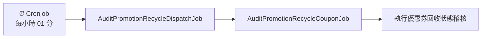

# 稽核文件

## 📋 目錄

### 🔄 正流程
1. [CheckPromotionRuleRecordJob](#1-checkpromotionrulerecordjob)
2. [AuditPromotionRewardLoyaltyPointsV2Job](#3-auditpromotionrewardloyaltypointsv2job)
3. [AuditCrmOthersOrderPromotionRewardLoyaltyPointsV2Job](#4-auditcrmothersorderpromotionrewardloyaltypointsv2job)
4. [AuditPromotionRewardLoyaltyPointsDispatchV2Job](#5-auditpromotionrewardloyaltypointsdispatchv2job)

### ↩️ 逆流程
1. [BatchAuditLoyaltyPointsJob](#2-batchauditloyaltypointsjob)
2. [AuditPromotionRecycleLoyaltyPoints](#6-auditpromotionrecycleloyaltypoints)
3. [AuditCrmOthersOrderPromotionRecycleLoyaltyPointsJob](#7-auditcrmothersorderpromotionrecycleloyaltypointsjob)
4. [PromotionRecycleReCalculatePointsRecordAuditor](#8-promotionrecyclerecalculatepointsrecordauditor)
5. [PromotionRecycleCouponDDBStatusAuditor](#9-promotionrecyclecouponddbstatusauditor)
6.  [BatchAuditLoyaltyPoints](#10-batchauditloyaltypoints)

 
 

## 7. AuditCrmOthersOrderPromotionRecycleLoyaltyPointsJob

#### 🔄 觸發流程

| 階段 | 服務名稱 | 說明 |
|------|----------|------|
| **1** | `PromotionRewardBatchDispatcherV2Job` | 線下訂單批次處理觸發 |
| **2** | `AuditPromotionRecycleDispatchJob` | 回收稽核派發作業 |
| **3** | `AuditCrmOthersOrderPromotionRecycleLoyaltyPointsJob` | 執行實際 CRM 訂單點數回收稽核 |

 

---

## 8. PromotionRecycleReCalculatePointsRecordAuditor

### ⚙️ 觸發來源

#### 🛍️ 線上觸發

**定時觸發**: 每小時 01 分執行
- `AuditPromotionRecycleDispatchJob` ➜ `AuditPromotionRecycleLoyaltyPointsJob`

#### 🏪 線下觸發

**等級計算觸發**: 等級計算完成後執行
- `等級計算` ➜ `AuditCrmOthersOrderPromotionRecycleLoyaltyPointsJob`

 

---

## 9. PromotionRecycleCouponDDBStatusAuditor

#### 🛍️ 線上觸發

**定時觸發**: 每小時 01 分執行

#### 🔄 觸發流程

 

---

## 10. BatchAuditLoyaltyPoints

#### 🔄 處理架構

**主要處理器**: `LoyaltyPointWorker`

#### ⏰ 執行時機

**點數回收稽核**: 每小時 01 分執行

### 🛠️ 服務類別

| 服務類型 | 服務名稱 | 適用環境 | 說明 |
|----------|----------|----------|------|
| **🛍️ 線上服務** | `AuditRecycleLoyaltyPointsV2Service` | 線上訂單 | 處理電商平台訂單的點數稽核 |
| **🏪 線下服務** | `AuditOfflineRecycleLoyaltyPointsV2Service` | 線下訂單 | 處理實體店面訂單的點數稽核 |
| **🎁 道具服務** | `BaseAuditLoyaltyPointsService.cs` | 道具相關 | 處理虛擬道具相關的點數稽核 |