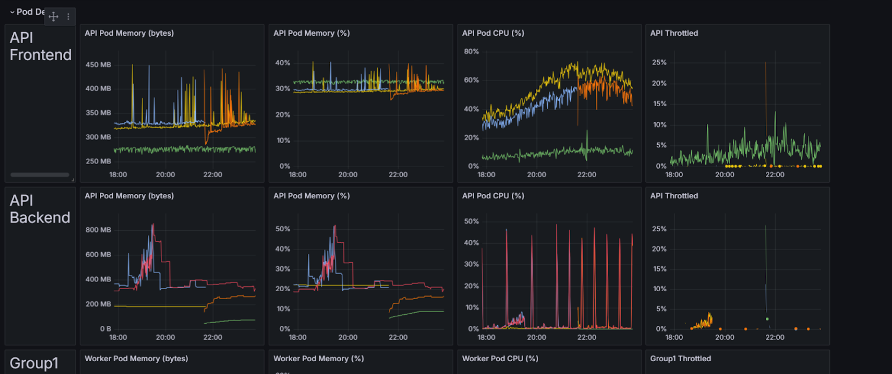
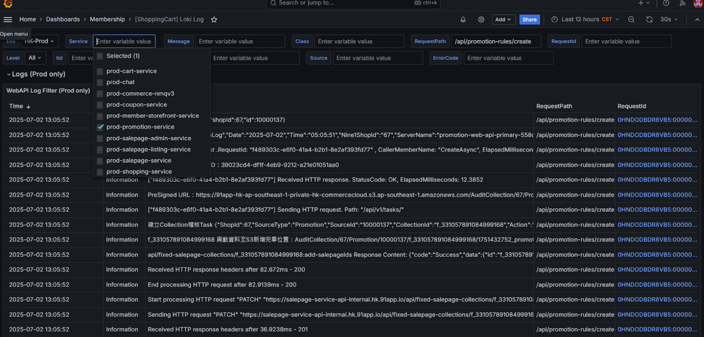

## 關鍵字

```
PromotionRewardLoyaltyPointsV2
RecycleLoyaltyPointsV2

|=`Request content: {\\\"promotionRules\\\`

::Received data

```

## BY TS 看 Recycle 跑幾次要對應 promotionId

```
{service="hk-qa-promotion-service"}
|json
|_props_JobName = `RecycleLoyaltyPointsV2`
|=`TS250710P000006`
|=`items:\"[]\`
|=`訂單編號:TS250710P000006，回饋活動序號：7541`
```

## by TaskId
```
{service="hk-qa-promotion-service"}
|json
| _props_TaskId = `ec72d512-a629-4478-b8b3-5e7275da2b98`


{service="prod-promotion-service"} 
|json
| _props_TaskId = `bf0f43ae-b413-4340-8585-14c6023799eb`
|json
| line_format "{{._msg}}"
```

## BY JOB + Key words
{service="prod-promotion-service"}
| json
|_props_JobName = `PromotionRewardBatchDispatcherV2`
| json
|=`200121`
| json
| line_format "{{._msg}}"


## Dashboard

**URL**：https://monitoring-dashboard.91app.io/d/kJHAWhwVk/promotion-service-monitor?orgId=2



<br>

**LOKI LOG**:https://monitoring-dashboard.91app.io/d/3dSbCsL4k/shoppingcart-loki-log?orgId=2&var-Level=All&var-Message=&var-RequestPath=%2Fapi%2Fpromotion-rules%2Fcreate&var-RequestId=&var-Class=&var-Loki=RjRcuuN4k&var-MarketENV=HK-Prod&var-Cluster=dfHnWT74z&var-tid=&from=now-12h&to=now&var-ExceptionType=&var-Source=&var-ErrorCode=&var-Service=prod-promotion-service&refresh=30s




## [Alerting]  -   Promotion Service Exception Alert


https://91app.slack.com/archives/C3DB30C3T/p1761831166311399


確認並非近期改動造成，是商店自行上傳批次作業(批次異動活動商品頁)，指定刪除沒有在該 collection 中的商品頁

原因說明
執行批次移除活動商品頁時，讀取商店上傳的 excel 資料表做異動，在遇到刪除不存在 collection 的商品頁時產生錯誤
建議優化方向
在執行移除 collection 內的商品頁前，應先檢查是否仍存在，目前的錯誤處理邏輯可再加強


都是促購後台發生的 原因跟之前的一樣 移除不存在collection的商品頁


https://91app.slack.com/archives/C3DB30C3T/p1761879650165349


## 稽核吃大量 CPU

TW Promotion Woker Pod CPU(%) High Alert (CPU可超頻2倍最高200%)


AuditPromotionRewardLoyaltyPointsDispatchV2

Worker Pod CPU > 200%

先調整了 limit 2000->4000

https://91app.slack.com/archives/C3DB30C3T/p1761881209623289


先改了一版 400% *0.7 threadhold版本
https://91app.slack.com/archives/C3DB30C3T/p1761881209623289


主因是跨國前陣子新增的回饋給點稽核，也會撈取現下訂單和眾多資料，前幾天釐清印象是跑到小北百貨就會發生….後續有請團隊帶回去看怎麼調整 cc @billchen @knighthuang

另一部分是因為這顆worker cpu只有開500，平時也確實用不到太多，所以先調整cpu limit讓它超頻可以跑完

目前group3都是稽核job 驗證並無影響商業情境以及稽核程式。Group3 limit 以及alert 水位都已經調整


- 調整 CPU Limit 讓他可以超頻
- 拉長 time frame
- 拉高監控水位門檻


## 指撈出 lock 失敗

{service="prod-promotion-service"} 
|= `Lock 失敗`
|json
|_props_JobName = `PromotionRewardCoupon`
|json
| line_format "{{._msg}}"
!= "_ts"
|json
# |= `TaskProcess is FAILED.`