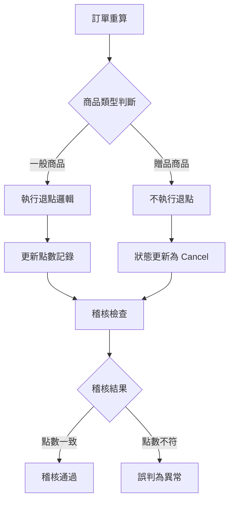
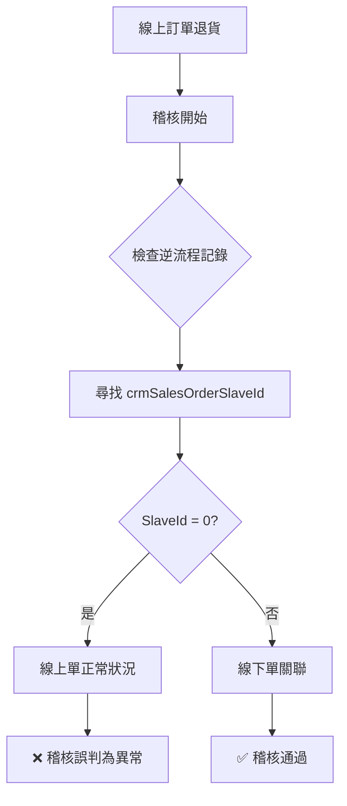
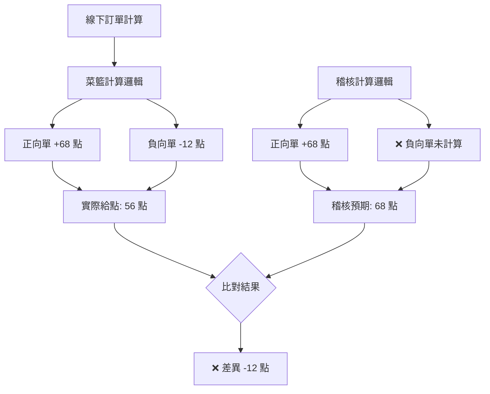
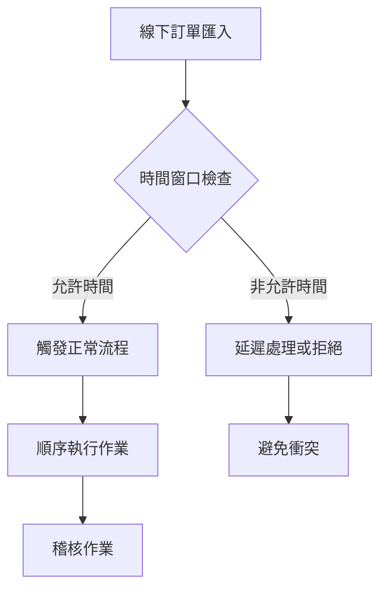
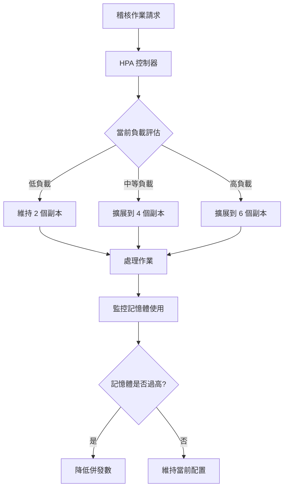

# 📋 稽核異常記錄文件

## 📑 目錄

### 🎫 優惠券相關異常
1. [DDB已發券序號為空](#1-ddb已發券序號為空)
2. [找不到對應的退貨訂單明細](#3-找不到對應的退貨訂單明細)

### 🔢 點數相關異常
1. [攤提結果因重算不符預期](#2-攤提結果因重算不符預期)
2. [線下訂單給點紀錄稽核監控到異常](#4-線下訂單給點紀錄稽核監控到異常)

### ⚙️ 流程相關異常
1. [匯入線下訂單時機不對導致稽核正逆流程混做](#5-匯入線下訂單時機不對導致稽核正逆流程混做大量誤判)
2. [線下稽核堆積](#6-線下稽核堆積)

<br>

---

## 1. DDB已發券序號為空

### 🚨 異常訊息

```log
@oversea_brd [MY][Prod]
優惠券紀錄稽核異常
ServiceName: AuditPromotionRewardCouponService
ShopId: 200009
異常項目:
DDBKey: 8444_MG250722L00007
ECouponId: 222755
MemberId: 549049
錯誤: DDB 已發券序號為空
```

### 🔍 根因分析

| 問題面向 | 詳細說明 |
|----------|----------|
| **預期行為** | 應發送 3 張優惠券並記錄 SlaveIdList |
| **實際狀況** | `"GivenCouponSlaveIdList": []` 為空陣列 |
| **系統判定** | 稽核系統認為發券失敗 |
| **實際情況** | 優惠券可能已正常發放，但記錄缺失 |

### ⚠️ 技術問題

#### 📋 問題點整理
1. **API 日誌缺失**: SCMAPIV2 無法從 Grafana 查詢 API 日誌
2. **程式版本問題**: `GivenCouponSlaveIdList` 記錄功能為新版程式才支援
3. **稽核誤判**: 舊版程式發放的券無此記錄，導致稽核誤判為異常

#### 🔧 手動驗證方法

**查詢實際發券狀況**:
```sql
USE WebStoreDB

SELECT ECoupon_Code, ECoupon_Modes, ECouponSlave_MemberId, *
FROM ECoupon(NOLOCK)
INNER JOIN ECouponSlave(NOLOCK) ON ECoupon_Id = ECouponSlave_ECouponId
WHERE ECoupon_ValidFlag = 1
  AND ECoupon_ShopId = 200009
  AND ECoupon_Id = 222755
```

### 💡 解決建議
- **短期**: 手動查詢資料庫確認實際發券狀況
- **長期**: 調整稽核邏輯，兼容新舊版程式的記錄格式

<br>

---

## 2. 攤提結果因重算不符預期

### 🚨 異常訊息

```log
給點紀錄稽核監控到異常
市場環境: TW-Prod
TG Code: TG250722QA00W6
稽核到下列異常:
- 應給點數(200)與實際點數(0)不同
- 活動:472232 攤提結果不符預期
- 應給點數(60)與實際點數(0)不同  
- 活動:472125 攤提結果不符預期
```

### 🔍 根因分析

#### 📋 問題原因

| 異常項目 | 業務邏輯 | 稽核判定 | 實際狀況 |
|----------|----------|----------|----------|
| **Task ID** | `TS250722QA0020F` | 點數差異異常 | 贈品不退點屬正常 |
| **商品屬性** | `IsGift:True, IsSalePageGift:False, IsMajor:False` | 應給點數 > 0 | 贈品不執行退點 |
| **處理結果** | `重算後整單不滿額，更新回饋狀態為 Cancel` | 攤提異常 | 業務邏輯正確 |

#### ⚙️ 業務邏輯說明



### 💡 解決建議

#### 🔧 稽核邏輯調整
- **贈品檢查**: 稽核時需判斷 `IsGift` 屬性
- **業務規則**: 贈品商品不參與退點計算
- **狀態更新**: `Cancel` 狀態為正常業務流程

#### 📝 改善方案
```csharp
// 稽核邏輯建議調整
if (item.IsGift && !item.IsSalePageGift && !item.IsMajor) 
{
    // 贈品不執行退點，跳過點數差異檢查
    continue;
}
```

<br>

## 3. 找不到對應的退貨訂單明細

### 🚨 異常訊息

```log
給券回收紀錄稽核監控到異常
市場環境: HK-Prod
TS Code: TS250722Q000299
稽核到下列異常:
DDB Detail找不到對應的退貨訂單明細
crmSalesOrderSlaveId: 0
DDB Keys: 34743_TG250722Q00126
```

### 🔍 根因分析

#### 📋 問題本質

| 稽核項目 | 稽核邏輯 | 實際狀況 | 結果 |
|----------|----------|----------|------|
| **訂單類型** | 線上訂單 | 線上訂單 | ✅ 正確 |
| **子單檢查** | 尋找線下子單 | 線上單無線下子單 | ❌ 邏輯錯誤 |
| **預期值** | `crmSalesOrderSlaveId = 0` | `crmSalesOrderSlaveId = 0` | ✅ 符合預期 |
| **稽核判定** | 異常 | 正常 | ❌ 誤判 |

#### 🔄 稽核邏輯問題



### ⚠️ 稽核邏輯缺陷

#### 📝 問題分析
- **稽核目的**: 檢查逆流程是否正確記錄到子單資訊
- **邏輯錯誤**: 線上訂單本就不應有 `crmSalesOrderSlaveId`
- **誤判原因**: 稽核規則未區分線上/線下訂單類型

### 💡 解決建議

#### 🔧 稽核邏輯修正
```csharp
// 建議的稽核邏輯調整
if (order.OrderType == "Online") 
{
    // 線上訂單：crmSalesOrderSlaveId 應為 0
    if (detail.crmSalesOrderSlaveId == 0) 
    {
        // 正常情況，無需異常警告
        return AuditResult.Pass;
    }
}
else if (order.OrderType == "Offline") 
{
    // 線下訂單：檢查是否有對應的子單記錄
    if (detail.crmSalesOrderSlaveId == 0) 
    {
        return AuditResult.Fail("找不到對應的退貨訂單明細");
    }
}
```

<br>

---

## 4. 線下訂單給點紀錄稽核監控到異常

### 🚨 異常訊息

```log
線下訂單給點紀錄稽核監控到異常
應給點數: 68 點
實際給點點數: 56 點
差異: -12 點
```

### 🔍 根因分析

#### 📋 計算差異原因

| 計算項目 | 稽核計算 | 實際計算 | 差異說明 |
|----------|----------|----------|----------|
| **正向單計算** | ✅ 已納入 | ✅ 已納入 | 一致 |
| **負向單計算** | ❌ 未納入 | ✅ 已納入 | **稽核遺漏** |
| **最終結果** | 68 點 | 56 點 | -12 點差異 |

#### ⚙️ 業務邏輯說明



### ⚠️ 稽核邏輯缺陷

#### 📝 問題分析
- **菜籃計算**: 正確計算了正向單和負向單的點數
- **稽核計算**: 僅計算正向單，忽略負向單的影響
- **結果差異**: 稽核預期值高於實際發放點數

### 💡 解決建議

#### 🔧 稽核邏輯修正

**現有稽核邏輯**:
```csharp
// 僅計算正向單
var expectedPoints = positiveOrders.Sum(o => o.Points);
```

**建議修正邏輯**:
```csharp
// 同時計算正向單和負向單
var expectedPoints = positiveOrders.Sum(o => o.Points) 
                   + negativeOrders.Sum(o => o.Points); // 負向單為負數
```

#### 📊 驗證步驟
1. **識別負向單**: 檢查訂單中的負向明細
2. **計算調整**: 將負向金額納入點數計算
3. **比對驗證**: 確保稽核邏輯與業務邏輯一致

<br>

## 5. 匯入線下訂單時機不對導致稽核正逆流程混做大量誤判

### 🔍 根因分析

#### 📅 事件觸發時間點
**異常觸發**: Shop 41332 在非預期時間匯入線下訂單
- **16:51** - 第一次匯入線下訂單
- **17:03** - 第二次匯入線下訂單  
- **觸發事件**: `Internal_MemberTierCalculateFinished`
- **後續影響**: 產生 `PromotionRewardBatchDispatcherV2` 作業

#### ⚙️ 流程執行時序圖

```mermaid
gantt
    title 線下訂單匯入後的作業執行時序
    dateFormat HH:mm
    axisFormat %H:%M
    
    section 立即執行
    PromotionRewardLoyaltyPointsV2    :done, reward1, 16:51, 17:00
    PromotionRewardCoupon             :done, reward2, 16:51, 17:00
    AuditCrmOthersOrderReward         :done, audit1, 10:30, 11:00
    AuditCrmOthersOrderCoupon         :done, audit2, 10:30, 11:00
    AuditCrmOthersRecycleLoyalty      :done, audit3, 14:00, 14:30
    AuditCrmOthersRecycleCoupon       :done, audit4, 14:00, 14:30
    
    section 預約執行
    RecycleLoyaltyPointsV2            :booking1, 10:30, 11:00
    PromotionRecycleCoupon            :booking2, 10:30, 11:00
    AuditPromotionRewardDispatch      :booking3, 10:30, 11:00
    AuditPromotionRecycleDispatch     :booking4, 14:00, 14:30
    BatchAuditLoyaltyPoints           :booking5, 14:30, 15:00
```



#### 📋 作業執行順序詳細

| 執行時機 | 作業名稱 | 預約時間 | 執行方式 | 衝突風險 |
|----------|----------|----------|----------|----------|
| **立即執行** | `PromotionRewardLoyaltyPointsV2` | - | 立即 | ⚠️ 與回收作業重疊 |
| **立即執行** | `PromotionRewardCoupon` | - | 立即 | ⚠️ 與回收作業重疊 |
| **預約執行** | `RecycleLoyaltyPointsV2` | 10:30 | 預約 | ⚠️ 時機不當 |
| **預約執行** | `PromotionRecycleCoupon` | 10:30 | 預約 | ⚠️ 時機不當 |
| **預約執行** | `AuditPromotionRewardDispatch` | 10:30 | 預約 | ❌ 正逆流程混雜 |
| **立即執行** | `AuditCrmOthersOrderReward` | - | 立即 | ❌ 稽核時序錯亂 |
| **預約執行** | `AuditPromotionRecycleDispatch` | 14:00 | 預約 | ❌ 正逆流程混雜 |
| **立即執行** | `AuditCrmOthersOrderRecycle` | - | 立即 | ❌ 稽核時序錯亂 |
| **預約執行** | `BatchAuditLoyaltyPoints` | 14:30 | 預約 | ⚠️ 誤判風險 |

### ⚠️ 問題影響

#### 🔄 流程衝突分析
1. **正逆流程重疊**: 發放和回收作業同時進行
2. **稽核時序錯亂**: 稽核在業務邏輯完成前執行
3. **大量誤判**: 稽核無法正確區分正逆流程狀態

### 💡 解決建議

#### 🛠️ 短期解決方案
- **時間管控**: 限制線下訂單匯入時間窗口
- **狀態檢查**: 稽核前確認相關作業完成狀態
- **異常過濾**: 識別並排除時機衝突的稽核結果

#### 📋 長期改善方案
- **流程隔離**: 將正逆流程稽核作業完全分離
- **依賴管理**: 建立作業間的依賴關係和順序控制
- **監控告警**: 設置時機異常的預警機制



<br>

---

## ⚙️ 6. 線下稽核堆積

**影響範圍**: TW 生產環境 Promotion Group3  

### 🔍 問題背景

#### 📅 異常發生
**Slack 討論記錄**: https://91app.slack.com/archives/G06A3GDC7/p1761364027990879

#### ⚠️ 系統壓力指標
- **服務名稱**: TW Promotion Group3
- **問題現象**: 稽核作業大量堆積
- **資源耗用**: 記憶體使用過高，面臨 OOM 風險

### 🛠️ 解決方案

#### 📊 水平擴展 (HPA)
**橫向擴展配置**:
```yaml
# HPA 配置調整
replicas:
  min: 2
  max: 6  # 從 2 調整為 6
```

| 配置項目 | 調整前 | 調整後 | 效果 |
|----------|--------|--------|------|
| **最大副本數** | 2 | 6 | 提升 3 倍處理能力 |
| **負載分散** | 有限 | 大幅改善 | 減少單一實例壓力 |
| **擴展彈性** | 低 | 高 | 快速應對流量高峰 |

#### ⚙️ 作業併發控制
**AuditCrmOthersOrderPromotionRewardCoupon 配置調整**:

```csharp
// 併發處理數量調整
MaxProcessCount: 2 → 1
```

| 調整項目 | 調整前 | 調整後 | 目的 |
|----------|--------|--------|------|
| **最大處理數** | 2 | 1 | 避免 OOM |
| **記憶體使用** | 高風險 | 受控 | 提升穩定性 |
| **處理策略** | 併發優先 | 穩定優先 | 確保服務可用性 |

### 📈 效能優化策略

#### 🔄 負載平衡機制


#### 📋 配置最佳化

**短期調整**:
- ✅ **HPA 擴展**: 2 → 6 副本提升處理能力
- ✅ **併發限制**: 最大處理數 2 → 1 避免 OOM
- ✅ **資源監控**: 密切關注記憶體使用率

**長期優化**:
- **作業分批**: 將大量稽核作業拆分為更小批次
- **記憶體優化**: 優化稽核邏輯減少記憶體佔用
- **快取機制**: 實作適當的快取策略減少重複計算


## BookingTime與預期不符

給點紀錄稽核監控到異常
市場環境: HK-Prod
TG Code: TG251028Z00085
稽核到下列異常:
35248_TG251028Z00085 BookingTime與預期不符，時間差異: 24.00 小時，超過允許範圍 1 小時


## 已達給券時間但狀態未更新，狀態為：Occupy

狀況 1

2025-10-22 22:26:03.917 成立訂單
OrderSlaveFlow_StatusDef: WaitingToPay
還未付款成功，不給券
因為是誤判

狀況 2

正流程的 job 可能 Failed, 需 redo


## 已達給券時間但狀態未更新

AuditPromotionRewardCouponService.cs

record.RewardStatus != nameof(RewardStatusEnum.Reward)

現在給券失敗會 catch 起來


{
  "_ts": "2025-11-07T21:32:13.8932294Z",
  "_msg": "呼叫 ECoupon API失敗，不進行重試：Something went wrong while processing your request. Please contact system administrator.",
  "_lvl": "Error",
  "_srctx": "Nine1.Promotion.Console.BL.Services.PromotionReward.CouponService",
  "_lt": "Common",
  "_hid": "promotion-console-nmqv3worker-group4-586fc678bc-rdfzg",
  "_props": {}
}


這個處理的有點間接 給券異常被lock => 重發勸的排程lock 失敗 => 稽核抓到狀態未更新


## 回饋活動 - 稽核誤判：逆流程重新計算後優惠券應給數量為 0, 且目前未給任何優惠券，狀態更新為 Cancel

RewardHistory: 
[{"TotalCouponQty":1,"GivenCouponQty":0,"RewardStatus":"Occupy","RewardTime":"0001-01-01T00:00:00","UpdateUser":"PromotionRewardCoupon","UpdateReason":"活動優惠券回饋:509755，成功佔額","UpdateTime":"2025-11-12T19:31:39.4131304+08:00"},{"TotalCouponQty":0,"GivenCouponQty":0,"RewardStatus":"Cancel","RewardTime":"0001-01-01T08:06:00+08:06","UpdateUser":"PromotionRecycleCoupon","UpdateReason":"逆流程重新計算後優惠券應給數量為 0, 且目前未給任何優惠券，狀態更新為 Cancel","UpdateTime":"2025-11-12T21:38:12.6457264+08:00"}]


## 回饋活動 - Promotion.Group3 CPU High


在大量資料時 CPU 飆高，主因是它在每次迴圈中同步地呼叫 request.ToJson() 與 INMQv3Client.Task.CreateAsync 兩次，等於把所有 JSON 序列化與 HTTP 請求排成單線程順序執行，壓在單一執行緒上；而且建立 tasks 清單卻沒有任何並行控制。當輸入清單很大時，就形成密集的 CPU 工作與 thread blocking。
改善方向如下：
避免重複序列化
先在迴圈內把 request.ToJson() 結果暫存，兩個任務共用，能明顯降低 CPU 的 JSON 序列化成本。
參考：Nine1.Promotion.Console.NMQv3Worker.Jobs.PromotionRewardAudit.AuditPromotionRewardLoyaltyPointsDispatchV2Job.ProcessAuditPromotionRewardsAsync
真正併發處理且限制併發數
把 CreateAsync 呼叫加入 List<Task> 後用 Task.WhenAll 執行，並透過 SemaphoreSlim 等方式限制同時度，例如 8~16，兼顧併發與外部服務壓力，避免單線程逐筆等待造成 CPU 忙碌。
批次提交或重試策略
如果任務量極大，考慮批次送出（例如每 100 筆一次），或利用批次 API 降低迴圈次數。
總結：先消除重複序列化，再以受控併發送出請求，就能把 ProcessAuditPromotionRewardsAsync 的 CPU 使用率大幅降到合理水位。

## 回饋活動 - 線下訂單整單退貨稽核誤判

https://91app.slack.com/archives/C7T5CTALV/p1761804397028649
線下訂單點數回收紀錄稽核監控到異常
市場環境: HK-Prod
CrmSalesOrderSlaveId: 87339016
稽核到下列異常:
訂單36681_CrmSalesOrder:26394997給點後:重新計算預期給點490 與實際回收後點數 0 不同


稽核不看退款狀態


## 訂單寫入時間超過排成回饋時間

https://91app.slack.com/archives/C08BE4B4KQW/p1763039843576529

https://91appinc.visualstudio.com/DailyResource/_workitems/edit/548260


## 查無成效

_nineYiDWContext
PromotionEnginePerformance


佔額完就取消 沒有寫成效