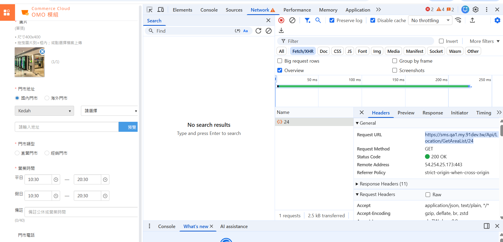

## Context.Receiver.ZipCode 從 mapper 來

MemberLocation => MemberLocationEntity
TradesOrderReceiverEntity => MemberLocationEntity


## 門市怎麼建立的


sms :
https://sms.qa1.my.91dev.tw/Api/Location/Create


```json
{
    "ShopId": 4,
    "Name": "新門市看下",
    "TypeDef": "直營門市",
    "Domestic": 1,
    "TelPrepend": "",
    "Tel": "",
    "Mobile": null,
    "Address": "新山區",
    "AreaId": 374,
    "CityId": 23,
    "CountryProfileId": 30,
    "Longitude": null,
    "Latitude": null,
    "NormalStartTime": "10:30",
    "NormalEndTime": "20:30",
    "WeekendStartTime": "10:30",
    "WeekendEndTime": "20:30",
    "RetailStoreStartTime": "Invalid date",
    "RetailStoreEndTime": "Invalid date",
    "OperationTime": "",
    "CreditCard": 1,
    "Wifi": null,
    "Parking": null,
    "Remark": "",
    "Introduction": "門市",
    "Status": null,
    "Sequence": 0,
    "StartDateTime": "0001-01-01T00:00:00+08:00",
    "EndDateTime": "0001-01-01T00:00:00+08:00",
    "IsAvailableLocationPickup": null,
    "OuterLocationCode": "englishonl",
    "UniqueKey": "22f38b4d-59b9-45b7-992f-2a7e4d6ed989",
    "MainImage": {
        "Type": 2,
        "Operation": 0,
        "FileName": "2fba544f-ff4c-475f-a9e1-c28223774579.jpg",
        "Group": "Location",
        "Key": "22f38b4d-59b9-45b7-992f-2a7e4d6ed989"
    },
    "GalleyImageList": [],
    "BaseImageUrl": "https://img3.cdn.qa1.my.91dev.tw/o2o/image",
    "SetAsDefault": false,
    "Id": null,
    "VerificationToken": "",
    "AcceptTravelCard": false,
    "IsInvisibleLocation": false,
    "EnableRetailStoreDef": 0,
    "ShopLocationGroupId": null,
    "AdditionalSettings": {}
}
```

response

```json
{
    "DuplicatedOuterCodeLocation": null,
    "HasNotAssignedEmployeeOrManager": true,
    "ShopId": 4,
    "LocationId": 316
}
```


看起來建立門市的時候

先取 arealist



直接拿第一個 area?


new LocationId => 關聯 LocationAreaId => Area_ZipCode


測試


https://lilychuang2.shop.qa1.my.91dev.tw/SalePage/Index/1968


```json
{
  "Location_Id": 317,
  "Location_Domestic": true,
  "Location_Name": "塞areacode_for_Johor_Ayer Baloi",
  "Location_Gallery": null,
  "Location_TelPrepend": null,
  "Location_Tel": null,
  "Location_Address": "新山區, Ayer Baloi, Johor",
  "Location_CityId": 23,
  "Location_AreaId": 374
}
```


把 checkoutuk 砍一砍就有ㄌ


checkoutUniqueKey
: 
"d236d806-c145-4347-8f9c-0b3496a2c9f5"


```sql
use WebStoreDB

--MG260202N00001
-- 完整交易訂單結構查詢
SELECT 
    TradesOrderGroup_Code AS 訂單群組編號,
    TradesOrderSlave_Qty AS 商品數量,
    TradesOrder_Id AS 訂單ID,
    TradesOrderSlave_Id AS 明細ID,
    *
FROM TradesOrderGroup(NOLOCK)
INNER JOIN TradesOrder(NOLOCK)
    ON TradesOrder_TradesOrderGroupId = TradesOrderGroup_Id
INNER JOIN TradesOrderSlave(NOLOCK)
    ON TradesOrderSlave_TradesOrderId = TradesOrder_Id
WHERE TradesOrderGroup_ValidFlag = 1
    AND TradesOrderGroup_Code = 'MG260202N00001'
    --AND TradesOrderGroup_Code >= 'TG250808BA00LN'  -- 訂單編號範圍
    --AND TradesOrderGroup_ShopId = 41571  -- 指定店鋪
    --AND TradesOrderGroup_CrmShopMemberCardId IN (4521,4522,4523)  -- 指定會員卡
    --AND TradesOrderGroup_TotalPayment >= 8800  -- 最小金額
    --AND TradesOrderGroup_TrackSourceTypeDef IN ('AndriodApp','iOSApp')  -- 行動裝置來源
    -- AND TradesOrderGroup_CreatedDateTime >= '2025-08-08 11:00'  -- 可選：時間篩選


select TradesOrderReceiver_ZipCode,*
from TradesOrderReceiver(nolock)
where TradesOrderReceiver_TradesOrderId = 16396
```

還是沒有 zipcode


新增門市有一個自取要打勾!! 不然前台長不出來


var isLocationPickup = context.Receiver.DeliveryTypeDef == ShippingProfileTypeDefEnum.LocationPickup.ToString();

ArrangeReceiver
//// MappingProfile: TradesOrderMappingProfile
Mapper.Map(tradesOrderReceiver, context.Receiver);


## 可能要參照去洗資料


```sql
USE WebStoreDB
SELECT AdministrativeRegion_Postcode,AdministrativeRegion_State,AdministrativeRegion_City,*
FROM AdministrativeRegion
WHERE AdministrativeRegion_CountryProfileAliasCode = 'MY'
```


## PMW


QA : https://api.apaylater.net
PROD : https://api.apaylater.co


## qa twst 無法復現

Hi, We use https://api.apaylater.net/v2/payments for our Atome sandox payment testing
, we found that in this environment , there is no need of postcode to get successful payment result

request
{
  "ReferenceId": "MG260202T00001",
  "Currency": "MYR",
  "Amount": 16.00,
  "CallbackUrl": "",
  "PaymentResultUrl": "https://lilychuang2.shop.qa1.my.91dev.tw/V2/PayChannel/Default/Atome/MG260202T00001?shopId=4&k=2d66988a-2fc8-41d6-b600-fde54280b4a2&lang=zh-TW",
  "MerchantReferenceId": "MG260202T00001",
  "CustomerInfo": {
    "MobileNumber": "+600131313132"
  },
  "ShippingAddress": {
    "CountryCode": "SG",
    "Lines": [
      "1 หน้าพระธาตุ บาเจาะ นราธิวาส Thailand"
    ],
    "PostCode": ""
  },
  "BillingAddress": {
    "CountryCode": "SG",
    "Lines": [
      "1 หน้าพระธาตุ บาเจาะ นราธิวาส Thailand"
    ],
    "PostCode": ""
  },
  "Items": [
    {
      "ItemId": "MS260202TA00001",
      "Name": "atome",
      "Quantity": 1,
      "Price": 5.00
    },
    {
      "ItemId": "MS260202TA00002",
      "Name": "atome",
      "Quantity": 1,
      "Price": 5.00
    },
    {
      "ItemId": "MS260202TA00003",
      "Name": "atome",
      "Quantity": 1,
      "Price": 5.00
    }
  ],
  "AdditionalInfo": {
    "ShopName": "LilyTestssssss"
  }
}
response
{
"referenceId": "MG260202T00001",
"currency": "MYR",
"amount": 1600,
"refundableAmount": 1600,
"paymentTransaction": null,
"refundTransactions": [],
"status": "PROCESSING",
"redirectUrl": "https://sandbox-gateway.apaylater.net/en-MY/payment/gateway?token=a1b523791a3a452dab3584ed81821b37",
"qrCodeUrl": "https://sandbox-app.apaylater.net/qr/image/a1b523791a3a452dab3584ed81821b37",
"appPaymentUrl": "https://sandbox-app.apaylater.net/entry?q=eyJpZCI6IjY5ODA2YTZlYzE2NWY1MDdmNGRiZWVkOSIsInR5cGUiOiJQQVlfVE9fUEFZTUVOVCIsInN0YXR1cyI6IkVOQUJMRUQiLCJtZXNzYWdlIjoiIiwiY291bnRyeUNvZGUiOiJNWSIsImxhbmd1YWdlIjoiZW4tbXkiLCJxdWVyeSI6eyJ0b2tlbiI6ImExYjUyMzc5MWEzYTQ1MmRhYjM1ODRlZDgxODIxYjM3In19",
"qrCodeContent": "https://sandbox-app.apaylater.net/qr/a1b523791a3a452dab3584ed81821b37",
"merchantReferenceId": "MG260202T00001",
"additionalInfo": null
}


## 自己先用 pmw 戳


https://doc.apaylater.com/v2/#operation/createPayment


## 轉 json


CreatePaymentRequestEntity apiRequest = new CreatePaymentRequestEntity
{ 
    ReferenceId = request.TradesOrderGroupCode,
    Currency = request.Currency,
    Amount = this.GetAmountByCurrency(request.Currency, request.Amount),
    CallbackUrl = request.ExtendInfo.CallbackUrl,
    PaymentResultUrl = request.ExtendInfo.PaymentResultUrl,
    MerchantReferenceId = request.TradesOrderGroupCode,
    CustomerInfo = new CustomerInfoEntity { MobileNumber = request.ExtendInfo.MobileNumber },
    ShippingAddress = new ShippingAddressInfoEntity 
    { 
        CountryCode = request.ExtendInfo.ShippingCountryCode,
        Lines = new List<string> { request.ExtendInfo.ShippingAddress },
        PostCode = request.ExtendInfo.ShippingPostCode
    },
    BillingAddress = new AddressInfoEntity
    { 
        CountryCode = request.ExtendInfo.BillingCountryCode,
        Lines = new List<string> { request.ExtendInfo.BillingAddress },
        PostCode = request.ExtendInfo.BillingPostCode
    },
    Items = PaymentRequestItemEntity.SetItems(request.ExtendInfo.Items.ToString()).ToList(),
    AdditionalInfo = new PaymentRequestAdditionalInfoEntity { ShopName = request.ExtendInfo.ShopName }
};


## 事發地址

PT 60303, Jalan KPB 2, Kawasan Perindustrian Kg. Baru Balakong, 43300, Seri Kembangan, Selangor