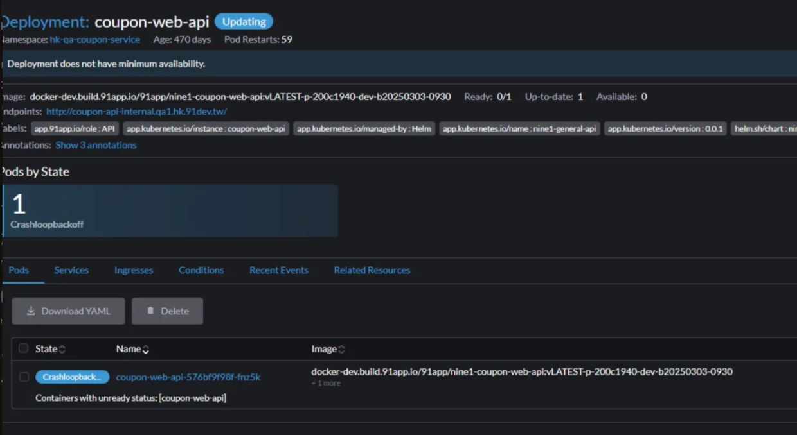

## RequestBody

- Shopping 才有 RequestBody
- `path : http:`
- `Request body` 

## Rancher 確認 Pods 的活存情況

當三中心站台出現異常或壞掉時，可以透過 



## 簡單看特定 requestId


```bash
{service=~"prod-cart-service"}
|~ `0HNII9GDSEG7R:00000001`
|json
|line_format "{{._msg}}"
```

## 查看特定錯誤

```bash
{service="prod-cart-service"}
|json
|=`0HNINOJ9UD6NE:00000308`
|=`Error`
|json
| line_format "{{._msg}}"

```

## 耗時分析


```bash
{service="prod-shopping-service"}
|=`Nine1HttpLog`
|json
| line_format "{{._msg}}"
| json
# | TimeTaken > 10000
# | UriStem = `/api/checkout/create`
# | UriStem = `/api/carts/create`
# | UriStem = `/api/checkout/complete`
 | UriStem = `/api/carts/create`
| line_format "{{.UriStem}} {{.TimeTaken}}"
```

## 錯誤請求來源 IP 追蹤

```bash
{service=~"prod-cart-service", container=~".*api.*|.*nmqv3worker.*", container!~".*pp-.*|monitor|aws-config-loader"}
|~ `Error`
| json
| line_format "{{._msg}}"
| json
| line_format "{{._props_RemoteAddress}} {{_props_RequestPath}}"
```

<br>
<br>

## 耗時分析

```bash
{service="prod-shopping-service"}
|=`Nine1HttpLog`
|json
| line_format "{{._msg}}"
| json
| line_format "{{.UriStem}} {{.TimeTaken}}"
```

## 可能可以看出 shopIds or memberIds 是哪些

{service=~"prod-shopping-service"}
|~ `Error`


## 針對 Nine1HttpLog 4xx 的解析特定欄位

```bash
{service=~"prod-shopping-service"}
|=`Nine1HttpLog`
|=`\"ProtocolStatus\":\"4`
|json
| line_format "{{._msg}}"
| json
| line_format "{{.Host}} {{.Referer}}"
```


```json
{
  "LogType": "Nine1HttpLog",
  "Date": "2025-12-11",
  "Time": "00:11:34",
  "ServerName": "shopping-web-api-primary-7b857dd665-9z56h",
  "ClientIpAddress": "::ffff:10.32.231.215",
  "ServerIpAddress": "::ffff:10.32.232.215",
  "ServerPort": "5566",
  "ProtocolVersion": "HTTP/1.1",
  "Method": "GET",
  "UriStem": "/api/carts/salepage-add-ons",
  "UriQuery": "?cartUniqueKey=313999c8-5375-464d-bed6-05870ef8b4ba&skuId=3893820&salepageId=530487&optionalTypeDef=&optionalTypeId=0&cartExtendInfoItemGroup=0&lang=zh-HK&shopId=17",
  "Host": "shopping-api.hk.91app.io",
  "UserAgent": "Amazon CloudFront",
  "UserName": "",
  "ProtocolStatus": "400",
  "TimeTaken": "8.6243"
}
```

**看到 Referer** : \":\"https://www.google.com/search?hl=en\\u0026q=testing\
**看攻擊 ip** : https://www.abuseipdb.com/

HK Prod Shopping 服務受到攻擊
185.225.234.107 (HK)
經由 hk.melvita.com 發動，可以阻擋嗎?