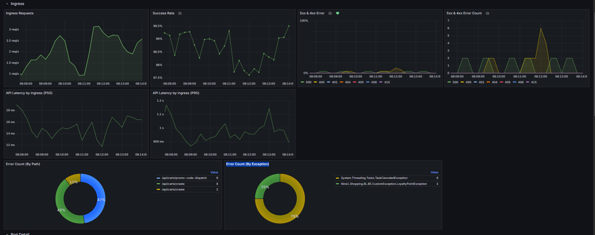
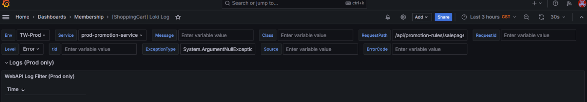
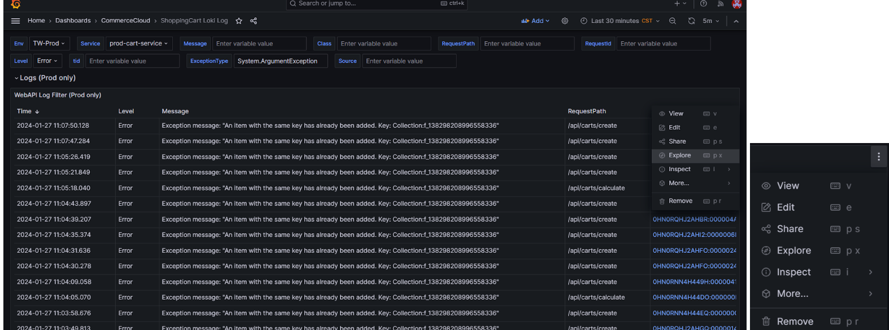
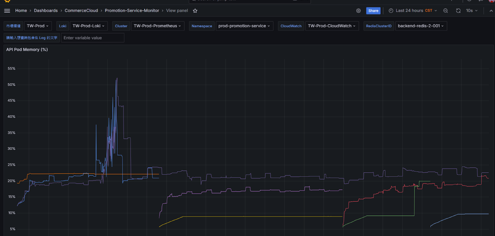

## Shopping&Cart-Service-Monitor

- 5xx & 4xx Error
- P50, P95
- Error Count (By Path)
- Error Count (By Exception)
- Memory / CPU

[Shopping&Cart-Service-Monitor](https://monitoring-dashboard.91app.io/d/YzFsgpXVk/shoppingandcart-service-monitor?orgId=2&from=2025-12-11T00:07:41.312Z&to=2025-12-11T00:14:08.944Z&timezone=Asia%2FTaipei&var-MarketENV=HK-Prod&var-Loki=RjRcuuN4k&var-Cluster=dfHnWT74z&var-Namespace=prod-shopping-service&var-CloudWatch=9jOlsfnVk&var-CacheClusterID=hk-backend-redis-1-001&var-LOG_CONTAIN_STRING=)

## Explore

- 打開 log Volumns 可以看時間條柱圖
- 右邊 wrap lines 可以讓訊息包成一列
- 右邊 Show unique lables 就是左邊第二欄左右會修出是 shopping 還是怎樣

[Explore by error](https://monitoring-dashboard.91app.io/explore?schemaVersion=1&panes=%7B%227de%22:%7B%22datasource%22:%22RjRcuuN4k%22,%22queries%22:%5B%7B%22datasource%22:%7B%22type%22:%22loki%22,%22uid%22:%22RjRcuuN4k%22%7D,%22direction%22:%22backward%22,%22editorMode%22:%22code%22,%22expr%22:%22%7Bservice%3D~%5C%22prod-shopping-service%5C%22%7D%5Cn%7C~%20%60Error%60%22,%22maxLines%22:500,%22queryType%22:%22range%22,%22refId%22:%22A%22%7D%5D,%22range%22:%7B%22from%22:%221765411200000%22,%22to%22:%221765412159000%22%7D,%22panelsState%22:%7B%22logs%22:%7B%22columns%22:%7B%220%22:%22Time%22,%221%22:%22Line%22%7D,%22visualisationType%22:%22logs%22,%22labelFieldName%22:%22labels%22%7D%7D%7D%7D&orgId=2)

## ShoppingCart Loki Log

- Service：`prod-cart-service`
- Level：`Error`
- ExceptionType：`System.ArgumentException`

[ShoppingCart Loki Log](https://monitoring-dashboard.91app.io/d/3dSbCsL4k/shoppingcart-loki-log?orgId=2&refresh=30s&var-MarketENV=TW-Prod&var-Service=prod-promotion-service&var-Message=&var-Class=&var-RequestPath=%2Fapi%2Fpromotion-rules%2Fsalepage-update&var-RequestId=&var-Level=Error&var-Loki=ZIOlfD44k&var-Cluster=hxdP8t7Vz&var-tid=&var-ExceptionType=System.ArgumentNullException&var-Source=&var-ErrorCode=&from=now-3h&to=now)

## Shopping Service Alert 完整監控面板

[監控中心 URL](https://monitoring-dashboard.91app.io/d/aen3tgg0mmvpcd/shopping-service-alert?orgId=2&from=now-6h&to=now&timezone=Asia%2FTaipei&var-MarketENV=TW-Prod&var-Loki=ZIOlfD44k&var-Cluster=hxdP8t7Vz&var-Namespace=prod-shopping-service&var-Sandbox_Namespace=sandbox-api-gateway&var-CacheClusterID=backend-redis-2-001&var-CloudWatch=kYZD-B7Vk&var-LOG_CONTAIN_STRING=&var-topk_1_node=ip-10-2-218-109.ap-northeast-1.compute.internal&var-Quey_Taints=sg&var-Service_Catalog=appgen)

## 5. API Pod Memory

**URL**：https://monitoring-dashboard.91app.io/d/kJHAWhwVk/promotion-service-monitor?orgId=2&refresh=10s&from=now-24h&to=now&viewPanel=182

