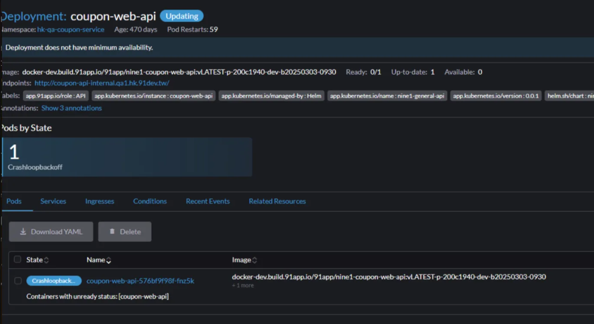

# 🛒 三中心開發維護文件

<br>

## 📖 目錄

- [🛒 三中心開發維護文件](#-三中心開發維護文件)
  - [📖 目錄](#-目錄)
  - [🔧 重新建置](#-重新建置)
  - [🍰 Cake Tool 安裝與使用](#-cake-tool-安裝與使用)
  - [🌐 語系工具安裝](#-語系工具安裝)
  - [📝 系統多語系](#-系統多語系)
  - [🖥️ 本機測試設定](#️-本機測試設定)
  - [🔐 CI/CD NuGet 設定](#-cicd-nuget-設定)
  - [⚠️ 異常處理](#️-異常處理)

<br>

---

## 🔧 重新建置

**重要提醒**：三步驟要記得重頭走過一次

<br>

**常見問題**：找不到檔案的原因通常是因為語系沒弄好

<br>

**建置指令**：

<br>

```bash
dotnet restore
dotnet build
dotnet clean
```

<br>

---

## 🍰 Cake Tool 安裝與使用

**安裝步驟**：

<br>

1. 移至專案目錄
   ```bash
   cd C:\91APP\Cart\nine1.cart\src
   ```

<br>

2. 建立工具清單
   ```bash
   dotnet new tool-manifest
   ```

<br>

3. 安裝 Cake Tool
   ```bash
   dotnet tool install Cake.Tool --version 3.0.0
   ```

<br>

4. 安裝 Runtime 3.1

<br>

5. 執行語系初始化 (方法一)
   ```bash
   dotnet cake ".\translation.cake" --target="Init Translation" --verbosity=diagnostic
   ```

<br>

**或者 (方法二)**：
```bash
dotnet dotnet-cake ".\translation.cake" --target="Init Translation" --verbosity=diagnostic
```

<br>

---

## 🌐 語系工具安裝

**缺少 autogen tool 時的解決方案**：

<br>

參考文件：https://wiki.91app.com/pages/viewpage.action?pageId=162759405

<br>

**安裝指令**：
```bash
dotnet tool install --add-source http://master.build.91app.io:8081/repository/nineyi-release-nuget-hosted/ -g nineyi.translations.client.tools.autogen
```

<br>

**系統需求**：記得要有 .NET Core 3.1 Runtime 才能運行

<br>

**新版安裝指令**：
```bash
dotnet tool install --add-source https://entry.build.91app.io/repository/nineyi-release-nuget-hosted/ -g dotnet-translations-autogen
```

<br>

**移除舊來源**：
```bash
dotnet nuget remove source NineYi.Nuget.Release
```

<br>

---

## 📝 系統多語系

**語系 README 參考**：
https://gitlab.91app.com/commerce-cloud/nine1.promotion/nine1.promotion.web.api/-/merge_requests/950/diffs

<br>

**Code Template 參閱**：http://www.91dev.tw/nineyi.general/

<br>

**系統多語系文件**：https://gitlab.91app.com/translation/nine1.translation.client

<br>

**系統需求**：
- .NET Runtime 3.1

<br>

**安裝 Tool**：
```bash
dotnet new tool-manifest
dotnet tool install Cake.Tool --version 3.0.0
```

<br>

**產生語系資料**：

<br>

移至專案目錄：
```bash
cd D:\Code\Service\Nine1.Promotion.Web.Api\src
```

<br>

產生語系：
```bash
dotnet-cake.exe "D:\Code\Service\Nine1.Promotion.Web.Api\src\translation.cake" --target="Init Translation" --verbosity=diagnostic
```

<br>

**相關服務**：AbstractTranslateSettingService

<br>

---

## 🖥️ 本機測試設定

**launchsettings.json 設定**：

<br>

連接埠配置：
- Shopping：5566
- Cart：5567

<br>

**Settings.json 設定**：

<br>

往外打的 API 要設定連接埠 5567

<br>

**HK QA 設定**：

<br>

settings.json 需要設定 HK QA 相關參數

<br>

**Visual Studio 設定調整**：

<br>

在 VS 上要去調整 HK-Dev 設定，才會去連 HK 資料庫

<br>

**Timeout 設定**：

<br>

Timeout 不能設定太短，避免連線逾時問題

<br>

**Header 設定**：

<br>

shopId = 2 要設定在 header 中

<br>

---

## 🔐 CI/CD NuGet 設定

**問題描述**：

<br>

若站台本身跑 CI/CD 時沒有 NuGet 的帳號密碼導致 Build 不過

<br>

**解決方案**：

<br>

需要在相關程式設定檔中加入 NuGet 認證資訊

<br>

**設定檔案**：
```
nine1.utility.auditcollection.gitlab-ci.yml
```

<br>

**環境變數設定**：

<br>

```yaml
variables:
    FEED_ENDPOINTS: '{"endpointCredentials": [{"endpoint":"$NINEYI_NUGET_GROUP", "username":"$NYP_AM_USER", "password":"$NYP_AM_PASSWORD"},{"endpoint":"$NINEYI_NUGET_RELEASE", "username":"$NYP_AM_USER", "password":"$NYP_AM_PASSWORD"},{"endpoint":"$NINEYI_NUGET_DEVELOP", "username":"$NYP_AM_USER", "password":"$NYP_AM_PASSWORD"}]}'
```

<br>

**設定說明**：

<br>

- `$NINEYI_NUGET_GROUP`：NuGet Group 端點
- `$NINEYI_NUGET_RELEASE`：NuGet Release 端點  
- `$NINEYI_NUGET_DEVELOP`：NuGet Develop 端點
- `$NYP_AM_USER`：NuGet 使用者名稱變數
- `$NYP_AM_PASSWORD`：NuGet 密碼變數

<br>

**注意事項**：

<br>

確保在 GitLab CI/CD 環境變數中正確設定了相關的認證資訊，避免 Build 過程中發生認證失敗

<br>

---

## ⚠️ 異常處理

**站台異常確認**：

<br>

當三中心站台出現異常或壞掉時，可以透過 Rancher 確認 Pods 的活存情況

<br>

**Rancher 檢查步驟**：

<br>

1. **檢查 Pods 狀態**
   - 查看 Pods 的運行狀態
   - 確認是否有 Pods 處於異常狀態
   - 檢查 Pods 的重啟次數和運行時間

<br>

4. **查看 Pods 詳細資訊**
   - 點選異常的 Pods 查看詳細資訊
   - 檢查 Events 和 Logs
   - 確認資源使用情況

<br>