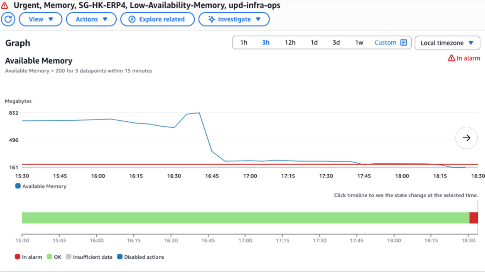
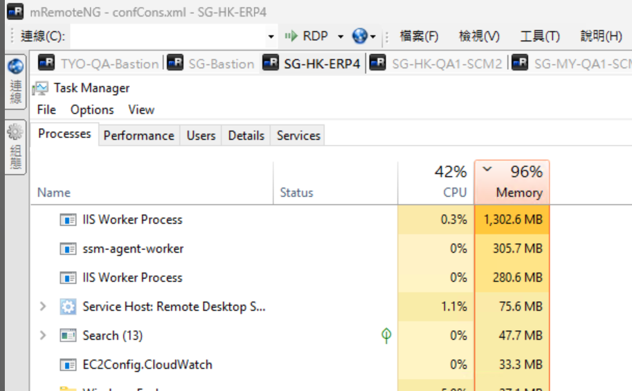
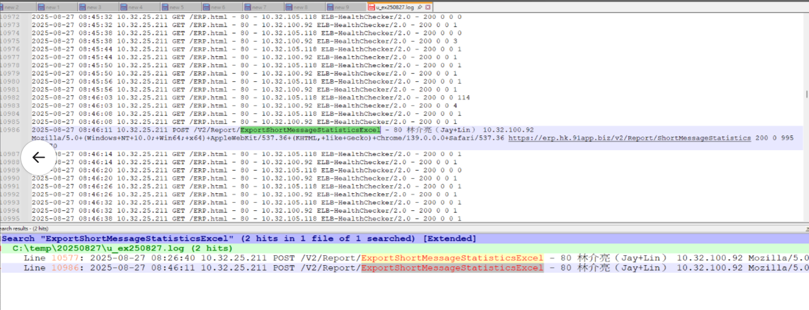

# General 維護指南

## 目錄
1. [空間不足](#1-空間不足)
2. [記憶體空間不足](#2-記憶體空間不足)

<br>

---

## 1. 空間不足

當系統發生空間不足問題時，可以執行以下清理操作：

### 移除舊檔案
- **OmniCRMConsole半年以上Log**
  - 清理超過半年的日誌檔案
  
- **QA HK 後台硬碟滿了**
  - 可先刪掉去年的Nlog資料
  - 路徑：`E:\log\ny-log\Common\NLog\ScmApiV2\NLog`
  - 路徑：`E:\log\ny-log\Common\NLog\ScmApi\NLog`

### 自動清理機制
系統有排程會定期清理 log 並且上傳至 S3

**排程位置：**
```
Task Scheduler --> Task Schedule Library --> Push Log to S3
```

這個排程會自動：
- 清理舊的日誌檔案
- 將日誌備份上傳到 S3
- 釋放本地儲存空間

<br>

---

## 2. 記憶體空間不足

https://91app.slack.com/archives/G06A3GDC7/p1756290999439559

<br>

SG-HK-ERP4 記憶體小於 160M

<br>



<br>

**處理**

<br>

執行下線後 iisreset

<br>



<br>

**原因**

<br>

C:\inetpub\logs\LogFiles\W3SVC1

<br>

16:26, 16:46 有操作二次以下功能，吃掉較大的記憶體

<br>

/V2/Report/ExportShortMessageStatisticsExcel

<br>



<br>