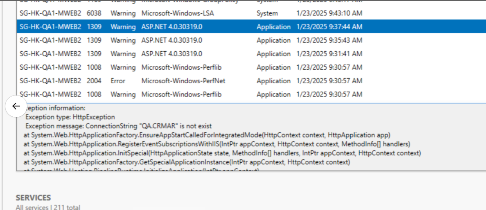
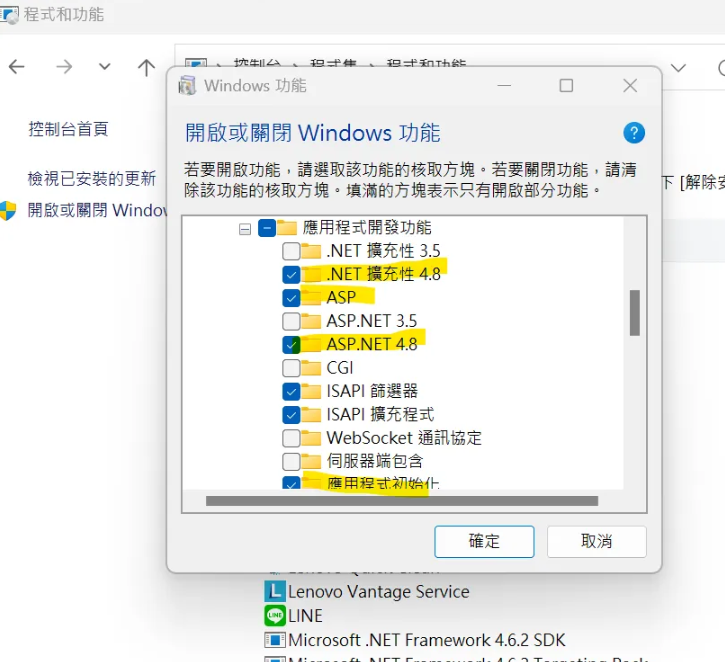
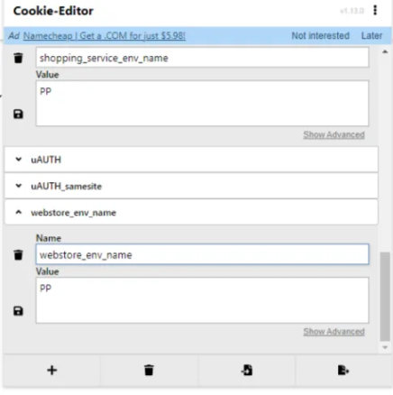

# 🚀 MWeb 維護文件

<br>

## 📖 目錄

  - [🔍 異常處理與排查](#-異常處理與排查)
    - [📋 ELMAH 異常分析](#-elmah-異常分析)
    - [📋 異常案例紀錄](#-異常案例紀錄)
  - [🚀 部署流程](#-部署流程)
  - [⚠️ 部署異常紀錄](#️-部署異常紀錄)
  - [🔍 Health Check API](#-health-check-api)
  - [🌐 關於 Web API](#-關於-web-api)
  - [📁 IIS LOG 查找方式](#-iis-log-查找方式)
  - [💻 本機開發環境建置](#-本機開發環境建置)

<br>

---

## 🔍 異常處理與排查

### 📋 ELMAH 異常分析

**特定異常類型影響分析**：

<br>

在 ELMAH 中鎖定特定 Exception Type 可以確認功能會影響到哪些 API 和相關頁面

<br>

**SearchException 分析範例**：

<br>

**異常類型**：SearchException

<br>

**錯誤描述**：search error

<br>

**影響的 API**：

<br>

錯誤大多來自以下 API：

<br>

- 商品搜尋相關 API
- 商品排序相關 API
- 首頁內容載入 API
- 自訂頁面內容 API

<br>

**可能影響的功能頁面**：

<br>

1. **商品卡相關顯示**：
   - 熱銷排行頁面
   - 首頁商品展示
   - 自訂頁面商品列表

<br>

2. **商品頁功能**：
   - 商品頁活動列表可能不會顯示
   - 相關商品推薦異常
   - 商品詳情載入問題

<br>

### 📋 異常案例紀錄

**案例 1：HK QA 前台連線異常**

<br>

**發生時間**：2025/01/23

<br>

**問題描述**：
HK QA 前台今天壞了，只有首頁進得去，其他頁面都不行

<br>

**排查步驟**：

<br>

1. **Event Viewer 檢查**：
   - 路徑：Windows Logs -> Application
   - 發現連線字串未加讀取問題

<br>

2. **根因分析**：
   - 資料庫連線字串配置問題
   - 讀取權限未正確設定

<br>

**相關討論**：
[Slack 討論串](https://91app.slack.com/archives/C63SH8G3D/p1737595898823709)

<br>



<br>

**案例 2：購物車無法進入 - SPL API 404 錯誤**

<br>

**問題描述**：
購物車進不去，發現有一個打 SPL API 404，TW 沒有做好跨環境部署

<br>

**排查步驟**：

<br>

1. **檢查 API 呼叫狀態**：
   - 查看瀏覽器開發者工具 Network 頁籤
   - 確認 SPL API 回傳 404 狀態碼

<br>

2. **根因分析**：
   - 跨環境部署配置問題
   - TW 環境 SPL API 服務未正確建置或配置

<br>

3. **解決方案**：
   - 確認 TW 環境 SPL API 服務狀態
   - 檢查跨環境部署配置檔案
   - 重新部署相關服務

<br>

**案例 3：網頁失效 - IIS 服務停止**

<br>

**問題描述**：
網頁失效，有時是 IIS 關掉了

<br>

**排查步驟**：

<br>

1. **檢查 IIS 服務狀態**：
   - 開啟 IIS Manager
   - 確認應用程式集區狀態
   - 檢查網站服務是否執行中

<br>

2. **常見原因**：
   - 應用程式集區自動回收
   - 記憶體不足導致服務停止
   - 設定檔錯誤導致服務無法啟動

<br>

3. **解決方案**：
   - 重新啟動 IIS 服務
   - 檢查應用程式集區設定
   - 查看 Windows Event Viewer 相關錯誤訊息

<br>

**案例 4：Redis Key 環境辨識**

<br>

**問題描述**：
Redis key 可能看到不同機器的資訊，例如 QA2，就可以得知 QA 在不同環境做的情境

<br>

**排查方式**：

<br>

1. **Redis Key 命名規則檢查**：
   - 檢查 Redis key 的命名模式
   - 確認環境標識符是否正確嵌入 key 中

<br>

2. **環境識別方法**：
   - 透過 Redis key 前綴或後綴識別環境
   - 常見格式：`{環境名稱}:{功能}:{識別碼}`
   - 範例：`QA2:cart:user123`、`PROD:session:abc456`

<br>

3. **應用場景**：
   - 問題追蹤時可透過 key 判斷發生環境
   - 資料隔離驗證
   - 跨環境問題排查

<br>

4. **查詢指令範例**：
   ```bash
   # 查看特定環境的 keys
   redis-cli KEYS "QA2:*"
   redis-cli KEYS "PROD:*"
   
   # 查看 key 的詳細資訊
   redis-cli GET "QA2:cart:user123"
   ```

<br>

---

## 🚀 部署流程

**Build 注意事項**：
VersionId 日期+01 (第一次)

<br>

**第一步開始通知訊息**：
```
[HK]WebStore Release ，第一步開始
@channel [HK]WebStore Release ，第一步ASG機器已準備完畢(若不需鎖Hosts測試，請確認Job有確實跑完)
[HK]WebStore Release ，第一步已將新Code佈署至第一台機器，請鎖Hosts測試(若不需鎖Hosts測試，請確認Job有確實跑完)
```

<br>

**第一步完成後**：
MWeb 第一步完成，QA 會鎖 host 測試，確認 ok 就可以走第二步

<br>

**第一步結束時狀態**：
- Blue 抓一台下線鎖 host 測試
- 然後流量 --> Green

<br>

**CDN 確認語法**：
```sql
SELECT ShopStaticSetting_Value FROM WebStoreDB.dbo.ShopStaticSetting (NOLOCK)
WHERE 1 = 1
AND ShopStaticSetting_ShopId = 0
AND ShopStaticSetting_ValidFlag = 1
AND ShopStaticSetting_GroupName = 'CssJsCdn'
AND ShopStaticSetting_Key = 'EnabledStatus'
```

<br>

期望結果：
```json
{"red":false,"blue":true,"green":true}
```

<br>

**第一步完成狀態確認**：
- GREEN 22,23,ASG
- 確認 CDN (可以在網頁全部看到 CDN)
- 連到 DB 2 WebstoreDB
- CDN Distribution

<br>

**第二步結束時**：
- 藍色重新上線
- 綠色下來

<br>

**第三步完成**：
- 綠色部署完

<br>

**第四步恢復機器配置完成**：
- ecregister 21
- eciffservice 23
- #overeas_info 確認機器狀態的訊息打勾

<br>

---

## ⚠️ 部署異常紀錄

**異常 1：Step 1 - Prepare first machine 錯誤**

<br>

錯誤描述：
```
An error occurred when executing task 'Step 1 - Prepare first machine'
目前流量是80 20 不能重跑!!
目前HK 前台Release 第一步發生異常，疑似是ASG 啟動有問題，但流量部分已經切換
可以協助幫忙回復配置，我們這邊可能要重新執行第一步
```

<br>

詳細錯誤訊息：
```
Step 1 - Prepare first machine
powershell.exe : Cake.exe : An error occurred when executing task 'Step 1 - Prepare first machine'.
At D:\ws\workspace\.webstore.mobilewebmall_master_4@tmp\durable-9d460c1d\powershellWrapper.ps1:3 char:1
+ & powershell -NoProfile -NonInteractive -ExecutionPolicy Bypass -Comm ...
+ ~~~~~~~~~~~~~~~~~~~~~~~~~~~~~~~~~~~~~~~~~~~~~~~~~~~~~~~~~~~~~~~~~~~~~
    + CategoryInfo          : NotSpecified: (Cake.exe : An e...first machine'.:String) [], RemoteException
    + FullyQualifiedErrorId : NativeCommandError
```

<br>

**異常 2：AWS ASG Launch Template 過多**

<br>

問題描述：
MWeb 第二步，Launch Template 過多未刪，停在 Sync First Branch

<br>

解決方案：
請 INFRA 恢復流量並移除舊 template

<br>

---

## 🔍 Health Check API

**一般 Health Check 指令**：

<br>

```powershell
(1) Invoke-WebRequest 'http://shop2.91app.hk/v2/ops/HealthCheck' -Proxy 'http://10.32.10.52'
(2) Invoke-WebRequest 'http://shop2.91app.hk/ops/HealthCheck' -Proxy 'http://10.32.10.52'
(3) Invoke-WebRequest 'http://shop2.91app.hk/webapi/ops/HealthCheck' -Proxy 'http://10.32.10.52'
(4) Invoke-WebRequest 'http://shop2.91app.hk/admin/check' -Proxy 'http://10.32.10.52'
(5) Invoke-WebRequest 'http://shop2.91app.hk/webapi/auth/islogin' -Proxy 'http://10.32.10.52'
(6) Invoke-WebRequest 'http://shop2.91app.hk/v2/Official/BrandStory' -Proxy 'http://10.32.10.52'
```

<br>

**特定機器 Health Check**：

<br>

**mweb21**：
```powershell
Invoke-WebRequest 'http://shop2.9lapp.hk/webapi/ops/HealthCheck' -Proxy 'http://10.32.15.52'
```

<br>

**mweb22**：
```powershell
Invoke-WebRequest 'http://shop2.9lapp.hk/webapi/ops/HealthCheck' -Proxy 'http://10.32.16.52'
```

<br>

---

## 🌐 關於 Web API

**登入驗證機制**：
webapi 是否登入是看 cookie 的 auth / auth_samesite

<br>

**WebAPI 錯誤 LOG 查詢**：

<br>

機器位置：`E:\log\ny-log\Common\NLog\WebApi`

<br>

**ATHENA 查詢範例**：

<br>

```sql
select * from "hk_prod_webstore"."webstore_web_nlog"
where date = '2024/12/23'
and controller = 'tradesOrderLite'
and action = 'CompleteForNewCart'
and requestid = '{"message":"202412230856540938'
limit 100;
```

<br>

```sql
SELECT * FROM "hk_prod_webstore"."webstore_web_nlog"
where controller = 'PayChannel'
and action = 'InternalFinishPayment'
and date = '2025/02/01'
limit 6000;
```

<br>

---

## 📁 IIS LOG 查找方式

**NLog 配置查找**：

<br>

在 IIS 中可以查看 NLog 設定檔的位置：

<br>

```
IIS --> MQweb2 --> QA.MobileWebMall --> WebAPI --> Explore --> 可以找到 Nlog.config
```

<br>

**伺服器 LOG 路徑**：

<br>

```
D:\QA\NineYi\WebAPI.WebStore
```

<br>

**本機開發 LOG 位置**：

<br>

本機開發環境的 LOG 檔案通常位於：

<br>

```
C:\inetpub\logs\LogFiles\W3SVC4
```

<br>

**生產環境 IIS LOG 位置**：

<br>

```
E:\log\ny-log\Common\IISLog\W3SVC1
```

<br>

**LOG 分析工具**：

<br>

推薦使用以下工具進行 LOG 分析：

<br>

```
https://www.finalanalytics.com/
```

<br>

---

## 💻 本機開發環境建置

**MWEB 會員登入頁面設定**：

<br>

1. 會員頁面是另外一個 domain，host file 記得鎖本機
2. 不安全進入後密碼是：`thisisunsafe`

<br>

**重新建置步驟**：

<br>

1. 開啟或關閉 Windows 功能 (windows features on and off)

1. https 要編輯 https binding 的 ssl certificate ==> Default

<br>

**確認 Node 版本**：
```powershell
PS C:\91APP\nineyi.webstore.mobilewebmall> cd .\WebStore\Frontend\
PS C:\91APP\nineyi.webstore.mobilewebmall\WebStore\Frontend> cd .\MobileWebMallV2\
PS C:\91APP\nineyi.webstore.mobilewebmall\WebStore\Frontend\MobileWebMallV2> node -v
v18.18.2
```

<br>

**在 V2 執行 npm install**：
```powershell
PS C:\91APP\nineyi.webstore.mobilewebmall\WebStore\Frontend\MobileWebMallV2> npm i
```

<br>

**在 V2 執行 build-ts**：
```powershell
PS C:\91APP\nineyi.webstore.mobilewebmall\WebStore\Frontend\MobileWebMallV2> npm run build-ts
```

<br>

**在 ClientApp 執行 npm install**：
```powershell
PS C:\91APP\nineyi.webstore.mobilewebmall\WebStore\Frontend\MobileWebMallV2> cd .\ClientApp\
PS C:\91APP\nineyi.webstore.mobilewebmall\WebStore\Frontend\MobileWebMallV2\ClientApp> npm i
```

<br>

**在 ClientApp 執行 build:dev**：
```powershell
PS C:\91APP\nineyi.webstore.mobilewebmall\WebStore\Frontend\MobileWebMallV2\ClientApp> npm run build:dev
```

<br>

**MY MWeb Config 設定**：

<br>

**重要說明**：

<br>

connectionString 只有 V1 proj & WebAPI proj 有

<br>

WEBAPI & MVC 要一起加：

<br>

```xml
<add name="Dev.WebStore" connectionString="Data Source=SG-MY-QA-DB1.sg.91app.corp;Initial Catalog=WebStoreDB;Persist Security Info=True;User ID=webstoredbuser;Password=nTxg4F7U;Application Name=NineYi.MobileWebMall;MultiSubnetFailover=Yes;"/>
```

<br>

```xml
<add name="Dev.WebStore" connectionString="Data Source=SG-MY-QA-DB1.sg.91app.corp;Initial Catalog=WebStoreDB;Persist Security Info=True;User ID=webstoredbuser;Password=nTxg4F7U;Application Name=NineYi.MobileWebMall;multipleactiveresultsets=True;MultiSubnetFailover=Yes;"/>
```

<br>

**前端建置**：
前端要 build 過一次

<br>

**hosts 設定**：
```
HOST : 127.0.0.1 goldenhorse.91app.tw.dev / goldenhorse.shop.dev.91dev.tw
```

<br>

**商店對應頁面**：
可以切到商品頁再找

<br>

**PP 環境測試設定**：

<br>

在測試 PP 環境時，需要在瀏覽器做以下 Cookie 設定來鎖定特定的機器：

<br>

```
webstore_env_name : PP
shopping_service_env_name : PP
```


<br>

**Cookie 設定步驟**：

<br>

1. 開啟瀏覽器開發者工具 (F12)
2. 導航至 Application 或 Storage 頁籤
3. 找到 Cookies 選項
4. 新增上述兩個 Cookie 設定
5. 重新整理頁面即可生效

<br>

---
