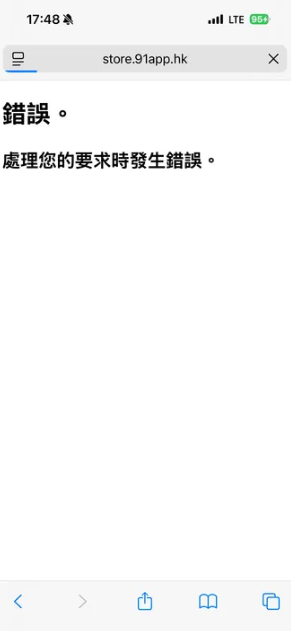
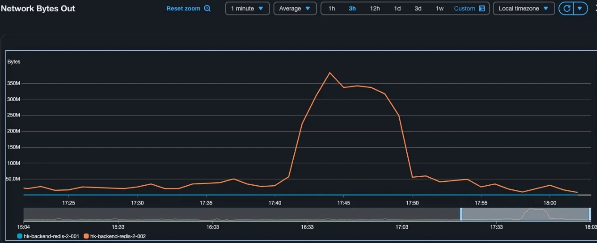
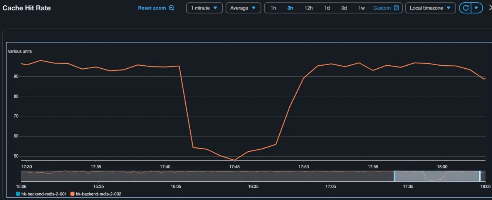
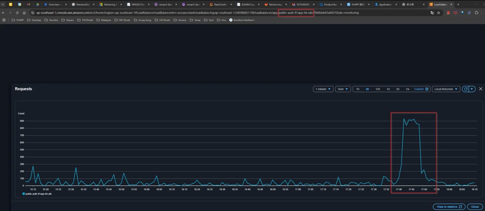
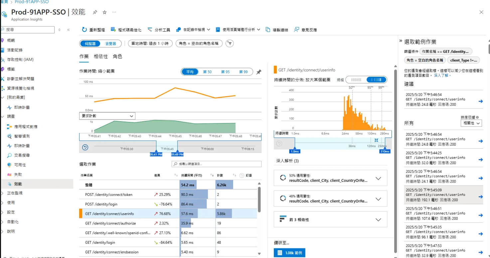
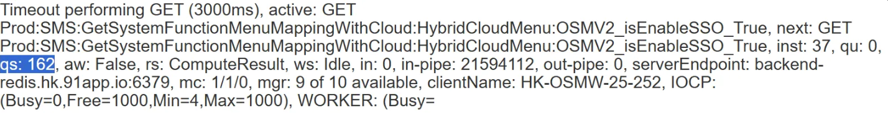
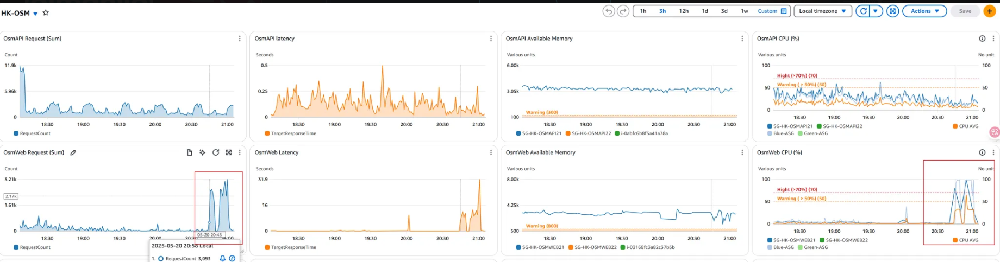

# 🚀 OSM 維護文件

## 📖 目錄

  - [⚙️ TypeScript 檔案產生](#️-typescript-檔案產生)
  - [🔐 API 測試與驗證](#-api-測試與驗證)
  - [🚀 部署流程](#-部署流程)
  - [📊 Athena LOG 查詢](#-athena-log-查詢)
  - [🩺 Health Check 檢查方式](#-health-check-檢查方式)
  - [⚠️ 異常紀錄](#️-異常紀錄)
        - [MachineConfig 咬檔問題](#machineconfig-咬檔問題)
        - [DbContext 新增後 CrmdbUser 權限問題](#dbcontext-新增後-crmdbuser-權限問題)
        - [HK ERP 無法仿登 OSM 後台](#hk-erp-無法仿登-osm-後台)
  - [🛠️ 環境建置問題紀錄](#️-環境建置問題紀錄)

---


## ⚙️ TypeScript 檔案產生

產生 .tt 檔名稱：`TypeLite.Net4.tt`

> ⚠️ **重要警告**：現在產了站台會壞掉，TypeScript 會出現問題


**當 TypeScript 壞掉時的修復步驟**：

1. 清除 node_modules 資料夾
   ```bash
   C:\91APP\NineYi.Sms\WebSite\WebSite
   ```

2. 重新安裝套件
   ```bash
   npm i
   ```

---

## 🔐 API 測試與驗證

測試 API 時需要自己組 Verification Token


**HK QA Key 設定**：

MachineConfig/Backend/AppSettings.QA300.config

```xml
<add key="QA.SHA512.KeyVersion" value="1"/>
<add key="QA.SHA512.Key_1" value="8167b887"/>
```


**驗證 Token 產生程式碼**：

```csharp
void Main()
{
    var apiToken = "123456782";
    var source = "7594";
    var all = $"{source}{apiToken}";
    var key = "8167b887";
    
    byte[] sha512key = new System.Text.UTF8Encoding().GetBytes(key);
    HMACSHA512 sha512 = new HMACSHA512(sha512key);
    var signatureContent = new System.Text.UTF8Encoding().GetBytes(all);
    byte[] result = sha512.ComputeHash(signatureContent);
    
    StringBuilder validate = new StringBuilder();
    foreach (byte item in result)
    {
        validate.Append(item.ToString("x2")); // hex format
    }

    validate.ToString().Dump();
}
```

---
## 🚀 部署流程

**第一步：確認 Blue 環境狀態**

確認 blue 是否是 21、22

如果有異常可以去網頁版檢查，看到 22 異常時，請到 OSM 後台確認有沒有 21、22


**第一步結束時的狀態**：

- **GREEN 環境**
- **22 + ASG**


<br>
<br>

**部署完成後的預期狀態**：

2457 deploy 完應該要只剩 osm22

<br>
<br>

---

## 📊 Athena LOG 查詢

**OSM Web LOG 查詢語法**：

<br>

透過以下 Athena 查詢語法可以查詢 OSM Web 的相關記錄：

<br>

**取得商品選項**：

<br>

```sql
SELECT * 
FROM "tw_prod_osm"."osm_web_nlog" 
WHERE date = '2025/01/16'
    and controller = 'SalePage'
    and action = 'GetSalePageSku'
    and message like '%31502348%'
    -- and requestid like '%202501161528480463%'
limit 100;
```

<br>

**上傳圖片**：

<br>

```sql
SELECT * 
FROM "tw_prod_osm"."osm_web_nlog" 
WHERE date = '2025/01/16'
    and controller = 'Image'
    -- and action = 'UploadImage'
    -- and message like '%31502348%'
    -- and requestid like '%202501161528480463%'
limit 100;
```

<br>

**更新商品選項**：

<br>

```sql
SELECT * 
FROM "tw_prod_osm"."osm_web_nlog" 
WHERE date = '2025/01/16'
    -- and longdate >= '2025-01-16 15:24:12.9832'
    -- and controller = 'SalePage'
    -- and action = 'UpdateSalePageInfoWithSku'
    -- and message like '%10454276%'
    and requestid like '%202501161525254407%'
limit 100;
```

<br>
---

## 🩺 Health Check 檢查方式

**OSM Health Check 方式**：

<br>

```powershell
# HK OSM
Invoke-WebRequest 'http://store.91app.hk/ops/healthcheck' -Proxy 'http://10.32.20.53'

# MY OSM Web
Invoke-WebRequest 'http://osm2.91app.com.my/api/health/check' -Proxy 'http://10.1.20.63'
```

<br>

**Auth SSO Health Check 方式**：

<br>

```powershell
Invoke-WebRequest -Uri "http://auth.91app.hk/api/ops/healthcheck" -Proxy 'http://10.32.21.221'
invoke-webrequest -Uri 'http://erp.hk.91app.biz/v2/api/health/check' -Proxy 'http://10.32.21.211/v2/api/health/check'
Test-Connection -ComputerName "SG-HK-SSO3" -Count "1" -Quiet
```

<br>

**ERP Health Check 方式**：

<br>

```powershell
# MY ERP
Invoke-WebRequest -Uri "http://erp2.my.91app.biz/v2/api/Ops/healthcheck" -Proxy "http://10.1.21.105"

# HK ERP - 方式 1
Invoke-WebRequest -Uri "http://erp.hk.91app.biz/Health/Check" -Proxy "http://10.2.18.57"

# HK ERP - 方式 1.2
Invoke-WebRequest -Uri "http://erp.hk.91app.biz/ops/healthcheck" -Proxy "http://10.32.21.211"

# HK ERP - 方式 2
Invoke-WebRequest -Uri 'http://erp.hk.91app.biz/v2/api/health/check' -Proxy 'http://10.32.21.211/v2/api/health/check'

# HK ERP - 方式 1.2 (V2 版本)
Invoke-WebRequest -Uri 'http://erp.hk.91app.biz/v2/api/ops/healthcheck' -Proxy 'http://10.32.21.211/v2/api/ops/healthcheck'
```

<br>

**Expense Health Check 方式**：

<br>

```powershell
invoke-webrequest -Uri http://erp.hk.91app.biz/v2/api/health/check -Proxy http://10.32.25.215/v2/api/health/check
```

<br>

---

<br>
<br>

## ⚠️ 異常紀錄

<br>

##### MachineConfig 咬檔問題
   
   錯誤訊息：`the process cannot access the file because it is used by another process`
   
   > 💡 **說明**：這是因為檔案被其他程序佔用導致的存取問題

<br>
<br>

##### DbContext 新增後 CrmdbUser 權限問題

<br>

   **發生時間**：2025-01-23 09:57:24 AM

<br>

   **問題描述**：有開發者新增了 DbContext，上線時發現 CrmdbUser 沒有權限

<br>

   **錯誤訊息**：
   ```
   Login failed for user 'crmdbardbuser'
   異常類型: System.Data.SqlClient.SqlException
   錯誤代碼: 18456 (SQL Server 登入失敗)
   ```

<br>

   **影響的相關資訊**：
   - Prod.CRMAR
   - Prod.CRMARReadOnly
   - 相關伺服器：SG-MY-DBLstn1.sg.91app.corp
   - 影響系統：NineYi SCM API V2

<br>

   **討論串**：https://91app.slack.com/archives/G04TVB3KW/p1737598056960449

<br>

   **當下確認事項**：
   - 確認目前線上機器無影響，新程式碼未在線上
   - 確認目前各站台 release 步驟進度
   - 確認各站台 login user 權限問題排除
   - 統控確認上述無誤

<br>

   **原因釐清**：
   - HK / MY 的密碼帶反了
   - 目前是請 DBA 直接改成反的
   - 因為 REPO 是 CRMDBAR，可能很多 Console 都在用，改不完，維持現狀重新 release

<br>

   **修正驗證**：
   修正後重打 Health Check 成功
   ```powershell
   Invoke-WebRequest 'http://shop2.91app.hk/webapi/ops/HealthCheck' -Proxy 'http://10.32.15.52'
   ```

<br>

##### HK ERP 無法仿登 OSM 後台

<br>

   **發生時間**：2025-05-20 17:39:07.520 ~ 17:50

<br>

   **問題描述**：HK ERP 無法仿登 OSM 後台，系統出現 Redis 連線異常

<br>

   **確認步驟**：
   1. RD 實測進 Web / APP
   2. 檢查 elmah 錯誤記錄

<br>

   **Elmah 錯誤連結**：
   ```
   http://elmahdashboard.91app.hk/Log/Details/0d21dbbc-2440-4a5f-bed4-c4f82e760b2f
   ```

<br>

   **錯誤類型**：RedisTimeoutException

<br>

   **Infra 確認結果**：
   - 有大量流量拉取 Redis 快取
   - 瞬間流量過大導致部分機器 timeout
   - Auth (SSO) 觀察到大量 Requests



<br>

   **異常流量分析**：
   - **時間區間**：17:41 ~ 17:48
   - **API 呼叫**：Auth 的 GET /identity/connect/userinfo
   - **頻率**：約 RPM 900 次
   - **來源**：大量 request 從 https://analytics.91app.hk/ 呼叫

<br>

   **問題根因**：
   - Market Claude 在 17:41 ~ 17:49 大量呼叫 `/identity/connect/userinfo`
   - 該 API 會存取 Redis 的 session key
   - 導致 backend redis 管線阻塞
   - qs: 162 (已有 162 未回應的命令)

<br>

   **影響範圍**：
   1. 17:41 ~ 17:49 從 `analytics.91app.hk` 大量呼叫 `https://auth.91app.hk/identity/connect/userinfo`，約 RPM 900 次
   2. Backend redis 處理不及，造成阻塞
   3. 影響 OsmWeb 其他功能也無法存取 redis
   4. 造成 OsmWeb 的 Redis 連線異常

<br>

   **詳細統計**：
   - **OsmWeb GET /api/Mimir/GetShopInfoList**：RPM 約 2000 次
   - **Auth GET /identity/connect/userinfo**：RPM 約 900 次
   - **Redis 輸出量**：每次回傳 160 KB，每分鐘 2000 次請求（2000 x 0.16 mb = 320 mb）

<br>

   **Cache Key 分析**：
   ```
   Prod:SMS:Permission:RolePermission:{rolesId}-{memberId}-{language}
   ```
   - 每一包約 160 KB（權限資料）

<br>

   **緊急處理**：
   - OSM Web CPU High 時手動加機器
   - 來源 IP 確認：18.138.33.149（我們自己的 NAT IP）

<br>

   **後續行動**：
   1. 釐清 Market Claude 異常呼叫的原因（5/21）
   2. 確認是否需要從 Redis / Application 端優化，或是前告警（5/21）

<br>

   **結論**：
   主要是 OsmWeb 的 `/api/Mimir/GetShopInfoList` 的高頻請求造成伺服器異常

<br>
<br>

---

<br>
<br>

## 🛠️ 環境建置問題紀錄

<br>

**問題 1：線上訂單查詢頁面錯誤**

<br>

**問題描述**：
進入主頁可以成功，但是進入線上訂單查詢頁會有問題跑出錯誤

<br>

**原因**：
AngularJS 沒有編譯過

<br>

**解決方法**：

<br>

若環境被玩壞掉，可以 clone 全新專案

<br>

**Angular 編譯步驟**：
1. `npm i`
2. `npm run test2` (scripts 裡面加上 test2 : tsc)

<br>

**React 編譯步驟**：
1. `npm i`
2. `npm run build`

<br>

**回到 VS 執行**：
Rebuild

<br>

**TypeScript 版本問題處理**：

<br>

如果把 TypeScript 版本玩壞，記得重新拔掉 TypeScript 要用指定版本：

<br>

- WebStore 要用 2.8 版本
- SMS 要用 1.8 版本

<br>

**TypeScript 路徑**：
```
file:///C:/Program%20Files%20(x86)/Microsoft%20SDKs/TypeScript/
```

---