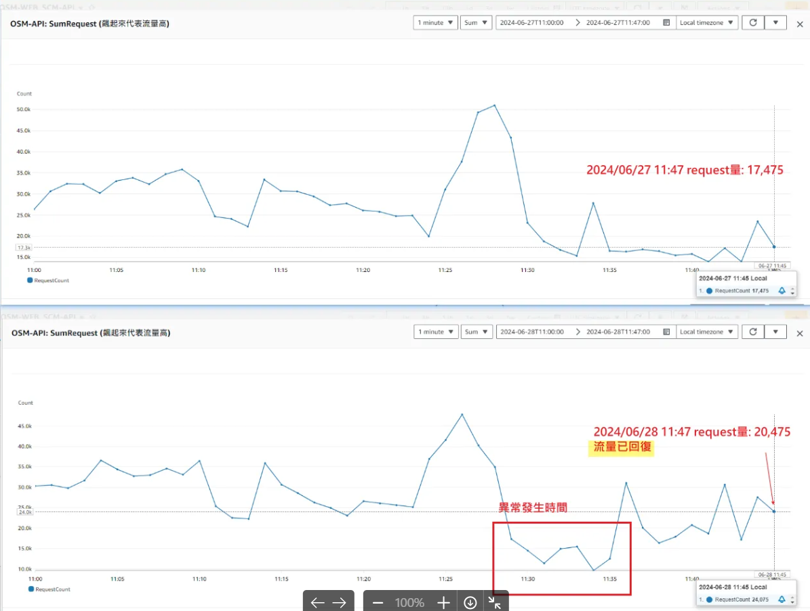

# 🔧 SCM API V2 維護文件

> 📚 這是 SCM API V2 系統的完整維護指南，包含本機開發環境設定和啟動配置等重要資訊

<br>

## 📖 目錄

- [🔧 SCM API V2 維護文件](#-scm-api-v2-維護文件)
  - [📖 目錄](#-目錄)
  - [🖥️ 本機開發設定](#️-本機開發設定)
  - [🌐 IIS 瀏覽設定](#-iis-瀏覽設定)
  - [🧹 硬碟空間清理](#-硬碟空間清理)
  - [🔍 Elmah 錯誤查閱](#-elmah-錯誤查閱)
  - [📊 Athena 資料查詢](#-athena-資料查詢)
  - [🗄️ 資料庫查詢](#️-資料庫查詢)
  - [🔗 API 相關資源](#-api-相關資源)
  - [⚠️ 常見問題排除](#️-常見問題排除)

<br>

---

## 🖥️ 本機開發設定

**設定啟動專案**：

<br>

在 Visual Studio 中進行以下設定：

<br>

```
Config Startup Projects => Nineyi.Scm.ApiV2.WebSite
```

<br>

**操作步驟**：

<br>

1. 在 Visual Studio 中右鍵點選方案
2. 選擇「Set Startup Projects」或「設定為啟始專案」
3. 選擇 `Nineyi.Scm.ApiV2.WebSite` 作為啟動專案
4. 確認設定並儲存

<br>

---

## 🌐 IIS 瀏覽設定

**IIS 瀏覽配置**：

<br>

使用以下路徑進行瀏覽：

<br>

```
iis => V2 => Browse
```

<br>

**操作說明**：

<br>

1. 開啟 IIS Manager
2. 導航至 V2 應用程式
3. 點選 Browse 選項進行瀏覽測試

<br>

**注意事項**：

<br>

確保 IIS 已正確配置且 V2 應用程式已部署完成

<br>

---

## 🧹 硬碟空間清理

**NLog 資料夾清理**：

<br>

當硬碟空間不足時，可以清理去年的 NLog 記錄檔案：

<br>

**清理路徑**：

<br>

```
E:\log\ny-log\Common\NLog\ScmApiV2\NLog
E:\log\ny-log\Common\NLog\ScmApi\NLog
```

<br>

**查找相關 LOG**：

<br>

需要查看特定的記錄檔案時，可以參考以下路徑結構：

<br>

```
E:/log/ny-log/Commin/NLog/ScmApiV2/NLog/202505/20250515/EcouponLite/Dispatch/16
```

<br>

**路徑說明**：

<br>

- `202505`：年月資料夾（2025年5月）
- `20250515`：具體日期資料夾（2025年5月15日）
- `EcouponLite/Dispatch/16`：功能模組和詳細分類路徑

<br>

**操作步驟**：

<br>

1. 開啟檔案總管
2. 導航至上述 NLog 資料夾路徑
3. 識別去年的記錄檔案（通常以日期命名）
4. 選擇並刪除舊的記錄檔案
5. 清空資源回收筒以釋放硬碟空間

<br>

**注意事項**：

<br>

- 建議保留最近 3-6 個月的記錄檔案以供除錯使用
- 刪除前確認沒有正在進行的問題調查需要舊記錄
- 定期清理可避免硬碟空間不足的問題

<br>

---

## 🔍 Elmah 錯誤查閱

**錯誤詳情查詢**：

<br>

透過以下連結可以查看具體的錯誤詳情：

<br>

```
http://elmahdashboard.91app.hk/Log/Details/38860fdb-750d-44dd-a2b9-bb6f2fc4e1b0
```

<br>

**條件篩選查詢**：

<br>

可以使用條件篩選來查詢特定類型的錯誤：

<br>

```
http://elmahdashboard.91app.hk/?Page=1&Pagesize=500&App=NineYi.ScmApiV2&Type=System.Data.SqlClient.SqlException&StartTime=11%2F30%2F2023+10%3A50&EndTime=11%2F30%2F2023+10%3A55
```

<br>

**Token 資訊**：

<br>

相關 Token：`30671037`

<br>

---

## 📊 Athena 資料查詢

**查詢歷史記錄**：

<br>

可以透過以下 Athena 查詢歷史連結查看相關資料：

<br>

```
https://ap-southeast-1.console.aws.amazon.com/athena/home?region=ap-southeast-1#/query-editor/history/31275af0-b8cb-4f3e-af32-cc57ba3b6176
```

<br>

```
https://ap-southeast-1.console.aws.amazon.com/athena/home?region=ap-southeast-1#/query-editor/history/4a679630-e999-43b8-a820-b86b8368bce9
```

<br>

**特定 API 時間區間查詢**：

<br>

查詢特定 API 在某時間區間的狀況：

<br>

```sql
SELECT *
FROM "tw_prod_osm"."osm_api_nlog"
WHERE DATE BETWEEN '2024/11/11' AND '2024/11/12'
AND longdate >= '2024-11-12 08:00'
AND longdate < '2024-11-12 09:00'
and controller = 'SalesOrder'
and action = 'GetListByCustomerlizedFilter'
```

<br>

---

## 🗄️ 資料庫查詢

**SupplierApiProfile 查詢**：

<br>

使用以下 SQL 查詢 SupplierApiProfile 資料：

<br>

```sql
use ERPDB

select top 10 *
from SupplierApiProfile(nolock)
where SupplierApiProfile_ValidFlag = 1
```

<br>

**依 Token 查詢**：

<br>

```sql
select top 100 * from dbo.SupplierApiProfile with(nolock)
where SupplierApiProfile_ValidFlag = 1
and SupplierApiProfile_Token = '30671037';
```

<br>

---

## 🔗 API 相關資源

**測試工具站台**：

<br>

API 小工具站台測試 URL：

<br>

```
https://api.qa1.hk.91dev.tw//Scm/V1/Sample
```

<br>

**HK 生產環境 Domain**：

<br>

```
HK_Prod : https://api.91app.hk/scm
```

<br>

**Swagger 文件**：

<br>

```
http://api.dev.91dev.tw/Scm/V2/swagger/ui/index
```

<br>

**Application Insights**：

<br>

```
https://portal.azure.com/#view/AppInsightsExtension/DetailsV2Blade/ComponentId~/{"SubscriptionId"%3A"a23bf8eb-057f-4ad3-83ad-e1002205aa29"%2C"ResourceGroup"%3A"91APP-HK-OSMAPI"%2C"Name"%3A"Prod-91APP-HK-OSMAPI"%2C"LinkedApplicationType"%3A0%2C"ResourceId"%3A"%252Fsubscriptions%252Fa23bf8eb-057f-4ad3-83ad-e1002205aa29%252FresourceGroups%252F91APP-HK-OSMAPI%252Fproviders%252Fmicrosoft.insights%252Fcomponents%252FProd-91APP-HK-OSMAPI"%2C"ResourceType"%3A"microsoft.insights%252Fcomponents"%2C"IsAzureFirst"%3Afalse}/DataModel~/{"eventId"%3A"34dcb91a-8e92-11ee-8bc4-00224859dfb4"%2C"timestamp"%3A"2023-11-29T08%3A34%3A35.498Z"%2C"cacheId"%3A"1daac255-b44e-464f-b95f-33679e916b7c"%2C"eventTable"%3A"requests"}
```

<br>

**OSMAPI 失敗查詢**：

<br>

當 OSMAPI 有大量失敗時，可以透過以下 ApplicationInsights 連結查看失敗詳情：

<br>

```
https://portal.azure.com/#@91app.biz/resource/subscriptions/a23bf8eb-057f-4ad3-83ad-e1002205aa29/resourceGroups/91APP-HK-OSMAPI/providers/microsoft.insights/components/Prod-91APP-HK-OSMAPI/failures
```

<br>

**API 區間流量異常監控**：

<br>

當 API 出現區間流量異常時，可以查閱 CloudWatch 的 SUMREQUEST 指標來分析流量模式：



<br>

---

## ⚠️ 常見問題排除

**商店錯誤使用案例**：

<br>

**API 路徑**：`V1/SalePage/SubmitMain`

<br>

**發生時間**：02/21 15:18:32.203 ~ now

<br>

**商店資訊**：ShopId: 50 (ZAKURA櫻花薈)

<br>

**錯誤 Request 範例**：

<br>

```json
{
  "salepage": {
    "MirrorCategoryIdList": [],
    "MirrorShopCategoryIdList": [],
    "Title": "Curel珂潤 輕透清爽防曬乳液SPF3030ml",
    "ApplyType": "一般",
    "HasSku": false,
    "SkuList": [],
    "SuggestPrice": 180.0,
    "Price": 180.0,
    "Cost": 1.0,
    "OnceQty": 5,
    "Qty": 0,
    "OuterId": "4901301274335",
    "SafetyStockQty": 3,
    "ShopId": 50,
    "CategoryId": 0,
    "ShopCategoryId": 0,
    "Status": "Hidden"
  }
}
```

<br>

**錯誤回應**：

<br>

```
ShopCategoryId => 'Shop Category Id' should not be empty.
ShopCategoryId, MirrorShopCategoryIdList => 商店類目或分身類目不存在
```

<br>

**RD 建議解決方案**：

<br>

請按照 API 文件，將 Request 中的 `"MirrorCategoryIdList":[]` 改為 `"MirrorCategoryIdList":null`

<br>

**修正重點**：

<br>

- 空陣列 `[]` 應改為 `null`
- 確保 ShopCategoryId 不為空值
- 驗證商店類目或分身類目是否存在

<br>

---