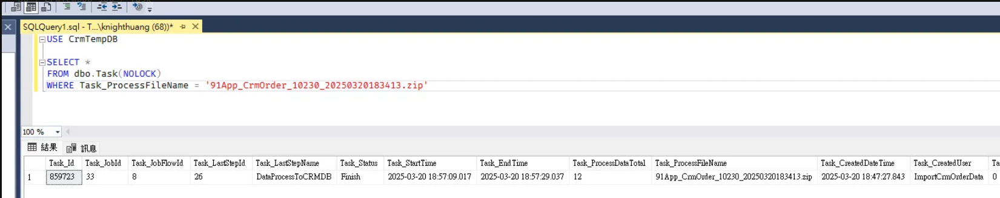
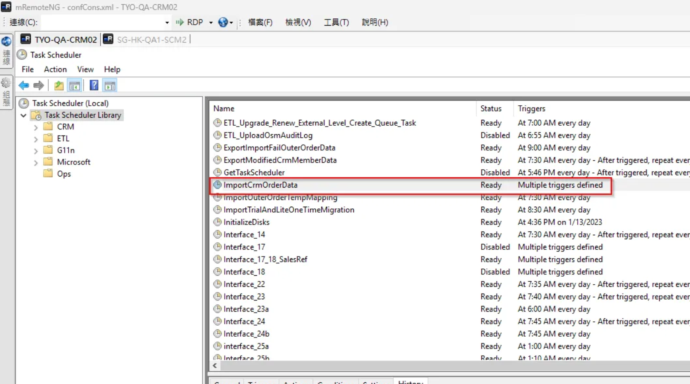
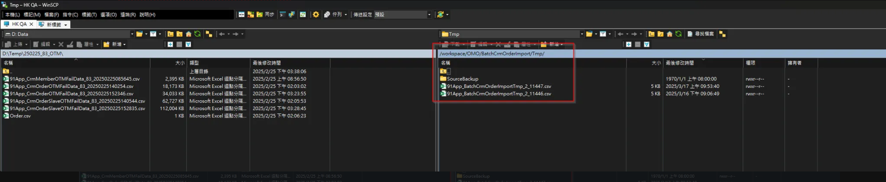
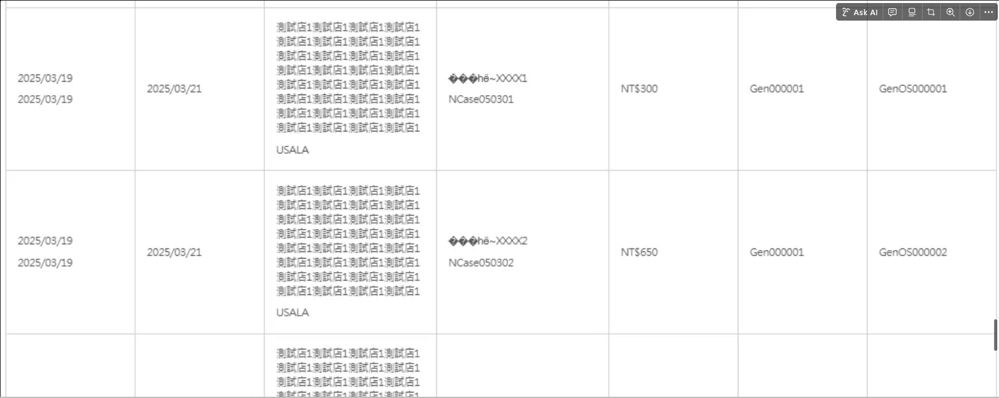
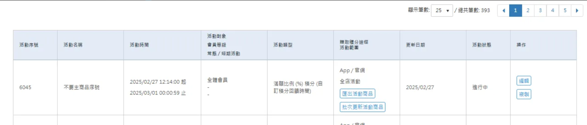
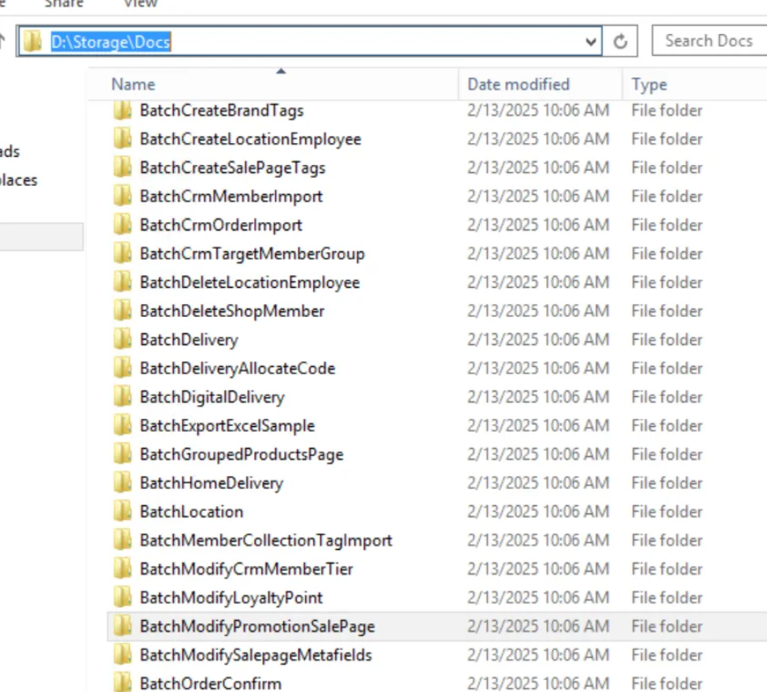

# Categories 批次作業類別文件

## 目錄
1. [其他交易資料匯入](#1-其他交易資料匯入)
   - 1.1 [Log 流程分析](#11-log-流程分析)
   - 1.2 [查 BatchUpload Table](#12-查-batchupload-table)
   - 1.3 [查 BatchUploadData Table](#13-查-batchuploaddata-table)
   - 1.4 [吃檔的 ETL 排程](#14-吃檔的-etl-排程)
   - 1.5 [QA FTPClient.CurlPathV2 登進去資訊](#15-qa-ftpclientcurlpathv2-登進去資訊)
   - 1.6 [怎麼從 UI 看是否匯入](#16-怎麼從-ui-看是否匯入)
2. [匯出活動商品](#2-匯出活動商品)
3. [匯出活動料號](#3-匯出活動料號)
4. [批次更新序號 / 料號](#4-批次更新序號--料號)
   - 4.1 [OSM](#41-osm)
     - 4.1.1 [檔案](#411-檔案)
     - 4.1.2 [關鍵字](#412-關鍵字)
     - 4.1.3 [API](#413-api)
     - 4.1.4 [主流程](#414-主流程)
     - 4.1.5 [CreateBatchTask (產生 Job 入口)](#415-createbatchtask-產生-job-入口)
   - 4.2 [主 BatchUploadProcess NMQ](#42-主-batchuploadprocess-nmq)
     - 4.2.1 [Task Data](#421-task-data)
     - 4.2.2 [DB Job 設定](#422-db-job-設定)
     - 4.2.3 [機器檔案](#423-機器檔案)
     - 4.2.4 [LoadData](#424-loaddata)
     - 4.2.5 [LoadExcel](#425-loadexcel)
     - 4.2.6 [DoValidate (二次驗證)](#426-dovalidate-二次驗證)
     - 4.2.7 [Insert BatchUploadData Table 並建立子 NMQ](#427-insert-batchuploaddata-table-並建立子-nmq)
   - 4.3 [BatchUploadTaskProcess](#43-batchuploadtaskprocess)
   - 4.4 [SCMAPIV2](#44-scmapiv2)
   - 4.5 [API 錯誤釐清案例](#45-api-錯誤釐清案例)
     - 4.5.1 [批次更新料號，要上傳 10 萬個，只上傳了6萬多就終止問題](#451-批次更新料號要上傳-10-萬個只上傳了6萬多就終止問題)
     - 4.5.2 [API 回 null!? 導致錯誤明細顯示異常](#452-api-回-null-導致錯誤明細顯示異常)

<br>

---

## 1. 其他交易資料匯入

### 1.1 Log 流程分析

BatchCrmOrderImportTask 交易資料匯入

<br>

會先將資料放在一個暫時的位置
CreateBatchUploadNMQTask
<br>

SFTP: /workspace/OMO/BatchCrmOrderImport/Tmp (.csv)

<br>

```
::Received Job : {"Id":"6ca6572a-2f57-4125-a57b-f76cde5d2d8d","SourceId":"3328812","JobName":"BatchCrmOrderImportTask","Data":"{\"BatchUploadId\":11447,\"ProcessType\":\"ByProcessCount\",\"BatchUploadDataId\":0,\"ProcessCount\":10,\"UploadUser\":\"nancyyeh@nine-yi.com\"}"}
::Create job : BatchCrmOrderImportTask
::Set task CurrentUICulture to => en-US
::Doing
Start BatchUploadTaskProcess
ProcessType:ByProcessCount
BatchUploadDataId:0
ProcessCount:10
批次上傳 User : BatchUpload
目前 job 數 7, 最多執行 job 限制 10
大量上傳批次 Code:BA2503170900001, Type:BatchCrmOrderImport
批次執行記錄目錄路徑\\SG-HK-QA1-SCM2\Storage\Tmp\BatchUpload\ExecutedTasks\20250317
產生執行記錄檔案:\\SG-HK-QA1-SCM2\Storage\Tmp\BatchUpload\ExecutedTasks\20250317\3328812_2_BA2503170900001
更新批次上傳狀態:InProcess
取得待處理批次資料, 筆數:21
執行作業, nmqTaskId:3328812, BatchUploadDataId:0
大量上傳批次處理(多筆)
儲存檔案
儲存路徑:\\SG-HK-QA1-SCM2\Storage\Tmp\BatchCrmOrderImport\2\91App_BatchCrmOrderImportTmp_2_11447.csv
取FTP
取 AWS FTP
cmd 檔案檢查傳入參數：/C D:\Softwares\curl-7.33.0-win64-ssl-sspi\curl.exe --insecure --tlsv1.2 --ftp-ssl --list-only -u qahk91user:@By2FQiwACf@zg sftp://tfsftp-01.qa.hk.91dev.tw/workspace/OMO/BatchCrmOrderImport/Tmp/ | findstr /i _2_
File Name:91App_BatchCrmOrderImportTmp_2_11446.csv
Process ExitCode:0
在FTP上處理中的檔案數量，shopId:2，fileProcessingCount:1
上傳檔案
cmd 上傳傳入參數：/C D:\Softwares\curl-7.33.0-win64-ssl-sspi\curl.exe --insecure --tlsv1.2 --ftp-ssl -T \\SG-HK-QA1-SCM2\Storage\Tmp\BatchCrmOrderImport\2\91App_BatchCrmOrderImportTmp_2_11447.csv -u qahk91user:@By2FQiwACf@zg sftp://tfsftp-01.qa.hk.91dev.tw/workspace/OMO/BatchCrmOrderImport/Tmp/91App_BatchCrmOrderImportTmp_2_11447.csv --ftp-create-dirs
filePath:cmd.exe, ExitCode:0
檔案上傳結束
更新作業執行狀態, status:ReadyToProcess
更新BatchUpload筆數 成功:21, 失敗:0
End BatchUploadTaskProcess
::Finished
^200 OK
["e7f73825-302b-4777-9e4c-99213ae0d457"] Sending HTTP request. Path: "/api/v1/tasks/6ca6572a-2f57-4125-a57b-f76cde5d2d8d:finish"
["e7f73825-302b-4777-9e4c-99213ae0d457"] Received HTTP response. StatusCode: OK, ElapsedMilliseconds: 19.2599
End processing request. RequestId: "e7f73825-302b-4777-9e4c-99213ae0d457",CallerMemberName: "FinishedAsync", ElapsedMilliseconds: 19.5818, RequestMetadata: ""e7f73825-302b-4777-9e4c-99213ae0d457""

- BA2503162100001
- BA2503170900001
```

<br>

接著等排程過來處理檔案

<br>

### 1.2 查 BatchUpload Table

- BatchuploadId : 11447
- TypeDef : BatchCrmOrderImport
- BatchUpload_StatusDef = FinishWithError
- ShopEtlFlowId_48
- BatchCrmOrderImportTask

<br>

### 1.3 查 BatchUploadData Table

有 21 筆資料

<br>

- BatchUploadData_StatusDef = ValidateFailed
- BatchUploadData_CreatedUser = BulkInsertBatchUploadData
- BatchUploadData_UpdatedUser = ShopEtlFlowId_48
- BatchUploadData_TypeDef = BatchCrmOrderImport

<br>

### 1.4 吃檔的 ETL 排程

ImportCrmOrderData FTP產品化串接-每日線下訂單匯入

<br>

- ETL (cron 4-59/10 * * * * )(\Order\OMO_Order_ETL_BatchCrmOrderImport, OMO_Order_CRM_PS_ImportCrmOrderData)
    - \Order\OMO_Order_ETL_BatchCrmOrderImport
    - SFTP: /workspace/OMO/BatchCrmOrderImport/2/ (.zip)
    - D:\Batch\EtlConsole\OSMPlusBatchRunFlowById\NineYi.OsmPlus.Batch.RunFlowById.exe
    - --flowname BatchCrmOrderImport
    - CrmTempDB Job / Task
    - 基本資訊 (ShopEtlSlow_Id = 48 , BatchCrmOrderImport, 交易資料匯入)

<br>

ImportCrmOrderData FTP產品化串接-每日線下訂單匯入

<br>

- JobName : OMO_Order_CRM_PS_ImportCrmOrderData
- 確認 : shopId / to_91APP  ==> shopId / to_91APP/CrmBackup 表示成功
- DB : CrmTempDB Job / Task

<br>



<br>

機器與確認位置

<br>

TWQA -  TYO-QA-CRM02

<br>



<br>

HKQA

<br>

E:/Files/OsmConsole/0/20250317/SalesOrder/100_BatchCrmOrderImport

<br>

異常原因

<br>

檔案未被搬移至 /workspace/OMO/ BatchCrmOrderImport /2

<br>



<br>

相關語法

<br>

```sql
use EtlDB

select *
from EtlFlowTask(nolock)
where EtlFlowTask_ShopEtlFlowId = 48
and EtlFlowTask_Id = 7888908
and EtlFlowTask_UpdatedDateTime between '2025-03-17' and '2025-03-18'
order by EtlFlowTask_CreatedDateTime desc

select *
from ShopEtlFlowStep(nolock)
where ShopEtlFlowStep_ValidFlag = 1
and ShopEtlFlowStep_ShopEtlFlowId = 48
order by ShopEtlFlowStep_Id 

select *
from EtlFlowTaskSlave(nolock)
where EtlFlowTaskSlave_ValidFlag = 1
and EtlFlowTaskSlave_EtlFlowTaskId = 7888908
--and EtlFlowTaskSlave_UpdatedDateTime  between '2025-03-17' and '2025-03-18'
order by EtlFlowTaskSlave_UpdatedDateTime desc
```

<br>

### 1.5 QA FTPClient.CurlPathV2 登進去資訊

MachineConfig / Backend / QA300

<br>

```xml
<add key="QA.AWS.CrmSFTP.FTPServer" value="sftp://tfsftp-01.qa.hk.91dev.tw/"/>
<add key="QA.AWS.CrmSFTP.FTPUserName" value="qahk91user"/>
<add key="QA.AWS.CrmSFTP.FTPPassword" value="@By2FQiwACf@zg"/>
```

<br>

```csharp
var ftpFolder = string.Format("workspace/OMO/{0}/Tmp", this._ftpFolderName);
_ftpFolderName = "BatchCrmOrderImport";

string sourceFilePath = this.Save(batchUploadDataList, out shopId);
```

<br>

### 1.6 怎麼從 UI 看是否匯入



<br>

---

## 2. 匯出活動商品



<br>

**API**

<br>

https://sms.qa1.hk.91dev.tw/api/PromotionEngine/CreateBatchExportDataTask

<br>

```json
{
    "BatchUploadType": 166,
    "BatchUploadExecuteTaskType": 149,
    "ExportCondition": {
        "PromotionEngineId": 6045,
        "ShopId": 2
    },
    "Password": "",
    "ShopId": 2
}
```

<br>

- BatchUploadType: 166 => ExportRewardPromotionSalePage
- BatchUploadExecuteTaskType: 149 => ExportRewardPromotionSalePageTask

<br>

**流程**

<br>

塞 BatchUpload Table -> CreateBatchUploadNMQTask (BatchUpload)

<br>

```json
{
   "BatchUploadId":11269,
   "SupplierId":2,
   "UploadType":"ExportRewardPromotionSalePage",
   "UploadUser":"jackyhu@nine-yi.com",
   "FilePassword":"",
   "ExportDataCondition":{
      "ShopId":2,
      "PromotionEngineId":5801
   },
   "Country":null
}
```

<br>

ExportRewardPromotionSalePageService.cs

<br>

-> SCMAPIV2

<br>

/v2/Promotion/GetPromotionSalePages

<br>

```csharp
public class GetPromotionSalePagesRequestEntity
{
    /// <summary>
    /// 商店代碼
    /// </summary>
    public long ShopId { get; set; }

    /// <summary>
    /// 活動序號
    /// </summary>
    public long Id { get; set; }

    /// <summary>
    /// 分區標籤
    /// </summary>
    public string Tag { get; set; }
}
```

<br>

-> PromotionWeb

<br>

/api/promotion-rules/salepage-list

<br>

- ShopId
- Id
- Tag

<br>

by 類型取得商品頁並回復類型

<br>

---

## 3. 匯出活動料號

ExportRewardPromotionOuterId = 174

<br>

**DB 設定**

<br>

- JobId : 487
- name : ExportRewardPromotionOuterIdTask

<br>

**PromotionAPI**

<br>

productsku-outerid-list

<br>

ExportRewardPromotionOuterIdService.cs

<br>

---

## 4. 批次更新序號 / 料號

### 4.1 OSM

#### 4.1.1 檔案

**手動上傳檔案**

<br>

https://sms.qa1.hk.91dev.tw/Api/UploadFile

<br>

(FormData)

<br>

```
file: (binary)
uniqueKey: f9d48752-e06c-48e7-a021-f78e42d983fa
type: 2
singleFile: false
flowFilename: Batch update products in promotions template (1).xlsx
flowIdentifier: 11956-Batchupdateproductsinpromotionstemplate(1)xlsx
flowTotalChunks: 1
flowChunkNumber: 1
flowChunkSize: 52428800
flowTotalSize: 11956
```

<br>

(this._tmpFolder, type, uniqueKey

<br>

c file temp, 2號店 , f9d48752-e06c-48e7-a021-f78e42d983fa guid!!

<br>

製作測試 Excel

<br>

- promotionid : 5978
- GUID

<br>

**正式環境 Filer by type**

<br>



<br>

**範例檔**

<br>

https://sms.qa1.hk.91dev.tw/Docs/ModifyRewardPromotionSalePage/Batch%20update%20products%20in%20promotions%20template.xlsx

<br>

#### 4.1.2 關鍵字

- BatchUploadType
- BatchModifyPromotionOuterId
- ModifyRewardPromotionSalePage
- ModifyPromotionSalePagesRequestEntity
- BatchModifyPromotionOuterIdService
- BatchModifyPromotionOuterIdDataEntityValidator
- BatchModifyPromotionOuterIdTaskProcess
- BatchUploadTypeDefEnum
- BatchUploadExecuteTaskTypeEnum

<br>

**對應到批次類型**

<br>

```csharp
case BatchUploadTypeDefEnum.
```

<br>

**對應 Service**

<br>

BatchModifyPromotionSalePageService

<br>

**行為 (繼承自 AbstractCreateBatchTaskBaseService)**

<br>

```csharp
batchService.ProcessCreateBatchTask(entity);
```

<br>

**批次類型**

<br>

BatchModifyPromotionOuterId

<br>

**Service**

<br>

BatchModifyPromotionOuterIdService

<br>

**行為 (繼承自 AbstractCreateBatchTaskBaseService)**

<br>

```csharp
batchService.ProcessCreateBatchTask(entity);
```

<br>

#### 4.1.3 API

https://sms.qa1.hk.91dev.tw/Api/BatchUpload/CreateBatchTask

<br>

```json
{
    "FileName": "Batch update products in promotions template.xlsx",
    "FileGuid": "9a684a4d-8bbb-475b-845c-9c53ecacae4a",
    "BatchUploadType": 164,
    "NeedAdvancedVerify": false,
    "ShopId": 2,
    "ScheduleDateTime": null
}
```

<br>

#### 4.1.4 主流程

<br>

**會分類跑對應的 Process**

<br>

```csharp
case BatchUploadTypeDefEnum.BatchModifyPromotionOuterId
```

<br>

**第一道驗證**

<br>

```csharp
this.GetFilePath();
this.VerifyFile();
```

<br>

- .xlsx
- tw : sheetName = 批次更新活動商品範例檔
- others : Update
- BatchUpload.{this.GetBatchUploadType()}.MaxCount 預設 500
- BatchUpload.{this.GetBatchUploadType()}.SoonestScheduleOffsetInMinutes 預設 30
- HasMappingError
- PromotionId / ScheduleTime / SalePageIds / ModifyStatus 有空
- PromotionId 格式
- IsSalePageIdsValid
- ValidModifyStatuses

<br>

**Load Excel 檔**

**建立 mappingProfile**

<br>

```csharp
using NineYi.Common.Utility.Upload.Mappers;
using NineYi.Sms.BL.BE.BatchUploads;
using NineYi.Sms.Utilities.Helpers;

namespace NineYi.Sms.Mappers.BatchUploads
{
    /// <summary>
    /// 批次新增商品標籤
    /// </summary>
    public class BatchModifyPromotionSalePageMappingProfile : IColumnMapping<BatchModifyPromotionOuterIdEntity>, IColumnMapping<ModifyRewardPromotionSalePageEntity>
    {
        #region Implementation of IColumnMapping<BatchModifyPromotionSalePageExcelEntity>
        /// <summary>
        /// MapExcelToEntity
        /// </summary>
        /// <param name="excelFile">MappingDefinition</param>
        public void MapExcelToEntity(MappingDefinition<BatchModifyPromotionOuterIdEntity> excelFile)
        {
            //// 語系 Hard Code
            //// 除台灣以外, 其他國家一律預設英文
            switch (SettingHelper.DefaultCountry)
            {
                case "TW":
                    excelFile.Add(a => a.ScheduleTime, "期望生效時間");
                    excelFile.Add(a => a.PromotionId, "活動序號");
                    excelFile.Add(a => a.SalePageIds, "商品頁序號");
                    excelFile.Add(a => a.ModifyStatus, "異動狀態");
                    break;

                default:
                    excelFile.Add(a => a.ScheduleTime, "Execution Time");
                    excelFile.Add(a => a.PromotionId, "Promotion ID");
                    excelFile.Add(a => a.SalePageIds, "Product Page ID");
                    excelFile.Add(a => a.ModifyStatus, "Update");
                    break;
            }
        }
        #endregion
        
        /// <summary>
        /// MapExcelToEntity
        /// </summary>
        /// <param name="excelFile">MappingDefinition</param>
        public void MapExcelToEntity(MappingDefinition<ModifyRewardPromotionSalePageEntity> excelFile)
        {
            //// 語系 Hard Code
            //// 除台灣以外, 其他國家一律預設英文
            switch (SettingHelper.DefaultCountry)
            {
                case "TW":
                    excelFile.Add(a => a.ScheduleTime, "期望生效時間");
                    excelFile.Add(a => a.PromotionId, "活動序號");
                    excelFile.Add(a => a.SalePageIds, "商品頁序號");
                    excelFile.Add(a => a.ModifyStatus, "異動狀態");
                    break;

                default:
                    excelFile.Add(a => a.ScheduleTime, "Effective Time");
                    excelFile.Add(a => a.PromotionId, "Promotion ID");
                    excelFile.Add(a => a.SalePageIds, "Product Page ID");
                    excelFile.Add(a => a.ModifyStatus, "Action");
                    break;
            }
        }
    }
}
```

<br>

使用 LinqToExcel 套件的 ExcelQueryFactory 來執行 Excel 讀取操作

<br>

**Step 1. 建立 ExcelQueryFactory**

<br>

```csharp
// 使用 LinqToExcel 套件建立 excelQueryFactory，並指定要讀取的 fileName
ExcelQueryFactory excelQueryFactory = new ExcelQueryFactory(fileName);

// 設定 TrimSpaces 為 Both，以自動修剪字串前後的空白
Type typeFromHandle = typeof(ExcelQueryFactory);

// typeFromHandle 用於後續透過反射取得方法
excelQueryFactory.TrimSpaces = TrimSpacesType.Both;
```

<br>

**Step 2. 取得對應介面與對應定義 (Mapping Definition)**

<br>

```csharp
Type typeFromHandle2 = typeof(IColumnMapping<>);
Type type = typeFromHandle2.MakeGenericType(dataType);
object obj = LifetimeScope.Resolve(type);
```

<br>

IColumnMapping<> 是一個泛型介面，程式透過 MakeGenericType 產生對應 dataType 的型別。使用 LifetimeScope.Resolve(type) 來解析出對應的物件，這通常是 Dependency Injection (DI) 容器的操作。

<br>

**Step 3. 建立 MappingDefinition**

<br>

```csharp
Type typeFromHandle3 = typeof(MappingDefinition<>);
Type type2 = typeFromHandle3.MakeGenericType(dataType);
object obj2 = Activator.CreateInstance(type2);

// 建立出針對 dataType 的 MappingDefinition，用來描述 Excel 欄位與類別屬性的對應關係
```

<br>

**Step 4. 執行映射邏輯**

<br>

```csharp
MethodInfo method = type.GetMethod("MapExcelToEntity");
method.Invoke(obj, new object[1] { obj2 });
```

<br>

**Step 5. 取得對應資訊**

<br>

```csharp
PropertyInfo property = type2.GetProperty("Mappings");
object value = property.GetValue(obj2);
// 取得 Mappings 屬性：
// Mappings 是 obj2 中的欄位對應資訊，通常是 Dictionary<string, string> 格式，Key 是 Excel 欄位，Value 是 .NET 屬性
```

<br>

**Step 6. 建立映射至 ExcelQueryFactory**

<br>

```csharp
foreach (object item in value as IEnumerable)
{
    Type type3 = item.GetType();
    object value2 = type3.GetProperty("Key").GetValue(item);
    object value3 = type3.GetProperty("Value").GetValue(item);
    
    MethodInfo methodInfo = (from i in typeFromHandle.GetMethods()
                             where i.Name == "AddMapping" && i.GetGenericArguments().Count() == 1 && i.GetParameters().Count() == 2
                             select i).First();
    methodInfo = methodInfo.MakeGenericMethod(dataType);
    methodInfo.Invoke(excelQueryFactory, new object[2] { value2, value3 });
}

// 逐一從 Mappings 中取出每個項目 (Excel 欄位與屬性對應)
// 使用反射找到 AddMapping 方法，並指定 dataType
// 呼叫 AddMapping(value2, value3)：
// value2：Excel 欄位名稱
// value3：.NET 類別的屬性名稱
```

<br>

**Step 7. 呼叫 Worksheet 取得資料**

<br>

```csharp
MethodInfo methodInfo2 = (from i in typeFromHandle.GetMethods()
                          where i.Name == "Worksheet" && i.GetGenericArguments().Count() == 1 && i.GetParameters().Count() == 1 && i.GetParameters().First().ParameterType == typeof(string)
                          select i).First();
MethodInfo methodInfo3 = methodInfo2.MakeGenericMethod(dataType);
object obj3 = methodInfo3.Invoke(excelQueryFactory, new object[1] { worksheetName });

// 透過反射取得泛型的 Worksheet<T> 方法
// 呼叫 Worksheet<T>(worksheetName)，讀取指定工作表的資料
```

<br>

**Step 8. 回傳**

<br>

```csharp
return obj3 as IEnumerable<object>;
// 將讀取到的資料轉型為 IEnumerable<object>，以便後續使用
```

<br>

#### 4.1.5 CreateBatchTask (產生 Job 入口)

**方法層次**

<br>

- CreateBatchUploadNMQTask (墊一層)
    - CreateBatchUploadNMQTaskInner (又墊一層)
        - CreateBatchUploadEntity **(狀態 : WaitingToLoadData)**
        - 產一個 BatchuploadCode = **this._dbContext.Csp_GetSequencesCode("BatchUpload_Code")**
        - **塞 batchUpload Table**
        - **CreateBatchUploadNMQTask** : BatchUpload

<br>

**Batch Upload 資料結構**

<br>

| 欄位名稱 | 資料 |
|---------|------|
| BatchUpload_Id | 10457 |
| BatchUpload_SupplierId | 2 |
| BatchUpload_TypeDef | ModifyRewardPromotionSalePage |
| BatchUpload_FileName | 未命名的試算表 (52).xlsx |
| BatchUpload_StatusDef | Finish |
| BatchUpload_Code | BA2405281000001 |
| BatchUpload_TotalCount | 2 |
| BatchUpload_SuccessCount | 2 |
| BatchUpload_FailCount | 0 |
| BatchUpload_UploadDateTime | 2024-05-28 10:06:22.483 |
| BatchUpload_StartDateTime | 2024-05-28 10:06:43.530 |
| BatchUpload_FinishDateTime | 2024-05-28 10:21:03.003 |
| BatchUpload_Note | NULL |
| BatchUpload_UploadGuid | ad7df7b4-3da5-44c1-8c2a-7445e9c24e90 |
| BatchUpload_HasDetail | 0 |
| BatchUpload_FailDownloadPath | NULL |
| BatchUpload_EstimateFinishMinutes | 5 |
| BatchUpload_AverageSecondsPerRecord | 440 |
| BatchUpload_CreatedDateTime | 2024-05-28 10:06:22.497 |
| BatchUpload_CreatedUser | nancyyeh@nine-yi.com |
| BatchUpload_UpdatedTimes | 5 |
| BatchUpload_UpdatedDateTime | 2024-05-28 10:21:03.257 |
| BatchUpload_UpdatedUser | BatchUpload |
| BatchUpload_ValidFlag | 1 |
| BatchUpload_Rowversion | 0x00000003C315068C |
| BatchUpload_ExecuteTaskType | BatchModifyPromotionSalePageTask |
| BatchUpload_ExportFileDownloadPath | NULL |
| BatchUpload_ShopId | 2 |
| BatchUpload_ScheduledDateTime | 2024-05-28 10:20:00.000 |

<br>

### 4.2 主 BatchUploadProcess NMQ

#### 4.2.1 Task Data

```json
{
   "BatchUploadId":11229,
   "SupplierId":2,
   "UploadType":"ModifyRewardPromotionSalePage",
   "UploadUser":"allenlin@nine-yi.com",
   "FilePassword":"",
   "ExportDataCondition":null,
   "Country":"HK"
}

{"BatchUploadId":11519,"SupplierId":2,"UploadType":"BatchModifyPromotionOuterId","UploadUser":"ellygong@nine-yi.com","FilePassword":"","ExportDataCondition":null,"Country":"HK"}

```

<br>

#### 4.2.2 DB Job 設定

- JOBID : 49
- Path : NineYi.SCM.Frontend.NMQV2.BatchUpload.BatchUploadProcess

<br>

#### 4.2.3 機器檔案

E:\Storage\Docs\ModifyRewardPromotionSalePage
E:\Storage\Docs\BatchModifyPromotionOuterId

url要求
https://sms.qa1.hk.91dev.tw/CommerceCloud/Docs/BatchModifyPromotionOuterId/Batch update products in promotions template (Product part number).xlsx

href
Docs/BatchModifyPromotionOuterId/Batch update products in promotions template (Product part number).xlsx

實際
E:\Storage\Docs\BatchModifyPromotionOuterId\Batch update products in promotions template (Product part number).xlsx

商品頁
/Docs/ModifyRewardPromotionSalePage/Batch update products in promotions template.xlsx (edited)


以後上檔案要給前端路徑 前端 要加上 / 才會抓到正確的路徑

**TW_QA**

<br>

```
\\TYO-QA-Filer1\Files\Tmp\BatchUpload
```

<br>

**HK_QA**

<br>

```
"\\SG-HK-QA1-SCM2\Storage\Tmp\BatchUpload" 
E:\Storage\Tmp\BatchUpload\2
```

<br>

**HK_Prod**

<br>

```
\\SG-HK-Filer1\Storage\Tmp\BatchUpload
```

<br>

#### 4.2.4 LoadData

(`BatchModifyPromotionSalePageService`)
(`BatchModifyPromotionOuterId`)

<br>

初始化行為 BatchUploadService

<br>

位置在 BatchUploadProcess.InitContainerBuilder

<br>

```csharp
.RegisterBatchUploadService<BatchModifyPromotionSalePageService>(BatchUploadTypeEnum.ModifyRewardPromotionSalePage) //// 批次更新點數折扣活動可使用商品
```

<br>

#### 4.2.5 LoadExcel

使用 LinqToExcel 套件的 ExcelQueryFactory 來執行 Excel 讀取操作

<br>

- Step 1. 建立 ExcelQueryFactory
- Step 2. 取得對應介面與對應定義 (Mapping Definition)
- Step 3. 建立 MappingDefinition
- Step 4. 執行映射邏輯
- Step 5. 取得對應資訊
- Step 6. 建立映射至 ExcelQueryFactory
- Step 7. 呼叫 Worksheet 取得資料
- Step 8. 回傳

<br>

appSetting : BatchUpload.Storage.Floder

<br>

預設 : C:\Temp\UploadData

<br>

```
C:\Temp\UploadData / supplierId / BatchUpload_UploadGuid
```

<br>

驗證檔案是否存在 (System.IO.File.Exists)

<br>

**取 excel 欄位資料**

<br>

```csharp
ScheduleTime = x.ScheduleTime,
PromotionId = int.Parse(x.PromotionId),
ModifyStatus = x.ModifyStatus,
SalePageIds = x.GetSalePageIds()
```

<br>

**by excelData 包成 List<BatchUploadDataWrapperEntities>**

<br>

- BatchUploadData(大量上傳資料, BatchUploadDataEntity)

<br>

```csharp
BatchUploadDataEntity
{
    BatchUploadData_Id
    BatchUploadData_BatchUploadId
    BatchUploadData_SupplierId
    BatchUploadData_TypeDef
    BatchUploadData_TypeDefDesc
    ...
}
```

<br>

- DataEntity(資料內容，用於與 BatchUploadData 一對一的情境)
- DataEntityList(資料內容 Entity List)

<br>

每一列 excel 長一個 wrapper, 每一個 wrapper 有一組 BatchUploadData, DataEntityList, DataEntity

<br>

#### 4.2.6 DoValidate (二次驗證)

**DoValidate**

<br>

1. by PromotionId 分群
2. 集合驗證

<br>

BatchModifyPromotionOuterIdDataEntityValidator

<br>

UploadFailedMessageList

<br>

**DoValidate**

<br>

- FlentValidation : using ValidationEntity = NineYi.WebStore.Backend.BE.BatchUpload.GroupedBatchUploadDataValidationEntity<int, NineYi.WebStore.Backend.BE.BatchUpload.BatchModifyPromotionOuterIdDataEntity>;
- BatchModifyPromotionOuterIdDataEntityValidator
- 驗重複料號
- 驗證活動序號
- 驗證料號字元
- 驗證異動狀態

<br>

**為什麼要包 wrapper**

<br>

一個 wrapper 是一個 promotion 維度

<br>

this.BatchUploadDataList = 一堆 wrapper

<br>

wrapper 主要分兩個節點,

<br>

- BatchUploadData = BatchUploadDataEntity, 紀載 title, data, status…等等
- DataEntityList = 一組 promotion 的資料

<br>

看起來一個 batchuploadData 就是一筆 promotion 維度的資料, 也就是 excel 某一列

<br>

#### 4.2.7 Insert BatchUploadData Table 並建立子 NMQ

取得 this.BatchUploadDataList 來自 List<BatchUploadDataWrapperEntity<BatchModifyPromotionSalePageDataEntity>>

<br>

**依 Supplier 決定是否 Bulk Insert BatchUploadData**

<br>

- shopId = 0
- groupname = BatchUpload
- key = BulkInsert.Enable.SupplierIds

<br>

**開關有開 (var bulkLimit = 10000)**

<br>

```csharp
this.BatchUploadRepository.BulkInsertBatchUploadData(batchUploadDataList);
```

<br>

**開關沒開 (WebStoreDB csp_InsertBatchUploadData)**

<br>

```csharp
this.BatchUploadRepository.CreateBatchUploadData(batchUploadDataList)
```

<br>

**塞入 BatchUploadData**

<br>

BatchUpload_TotalCount = 共幾列

<br>

- dataList.Count == 0, 更新批次上傳狀態 : Finish
- dataList.Count > 0, 更新批次上傳狀態 : WaitingToProces
- 檢查 dataList 有 BatchUploadData_StatusDef == ValidateFailed 更新狀態

<br>

**組織 taskNMQDataEntity**

<br>

```csharp
taskNMQDataEntity.BatchUploadId = this.BatchUploadEntity.BatchUpload_Id;
taskNMQDataEntity.ProcessType = BatchUploadTaskProcessTypeEnum.ByProcessCount.ToString();  //// 多筆, 依定義筆數執行 Task
string typeProcessCountSetting = string.Format("BatchUpload.{0}.TaskProcessCount", this.BatchUploadEntity.BatchUpload_TypeDef);
taskNMQDataEntity.ProcessCount = Convert.ToInt32(AppSetting.GetAppSetting(typeProcessCountSetting, "10"));
taskNMQDataEntity.UploadUser = nmqDataEntity.UploadUser;
```

<br>

- 本案為 : BatchModifyPromotionSalePageTask (仍有繼承 BatchUploadTask)
- 一般為 : BatchUploadTask

<br>

### 4.3 BatchUploadTaskProcess

每 10 為一組 產生一個 BatchModifyPromotionOuterIdTask / BatchModifyPromotionSalePageTask

<br>

**Task Data**

<br>

```json
{
   "BatchUploadId":11221,
   "ProcessType":"ByProcessCount",
   "BatchUploadDataId":0,
   "ProcessCount":10,
   "UploadUser":"yujiechen@nine-yi.com"
}

{"BatchUploadId":11519,"ProcessType":"ByProcessCount","BatchUploadDataId":0,"ProcessCount":10,"UploadUser":"ellygong@nine-yi.com"}
{"BatchUploadId":11519,"ProcessType":"ByProcessCount","BatchUploadDataId":0,"ProcessCount":10,"UploadUser":"ellygong@nine-yi.com"}
{"BatchUploadId":11519,"ProcessType":"ByProcessCount","BatchUploadDataId":0,"ProcessCount":10,"UploadUser":"ellygong@nine-yi.com"}
{"BatchUploadId":11519,"ProcessType":"ByProcessCount","BatchUploadDataId":0,"ProcessCount":10,"UploadUser":"ellygong@nine-yi.com"}
{"BatchUploadId":11519,"ProcessType":"ByProcessCount","BatchUploadDataId":0,"ProcessCount":10,"UploadUser":"ellygong@nine-yi.com"}
```

<br>

**DB 設定**

<br>

商品頁

<br>

JobId : 334

<br>

料號

<br>

486

<br>

位置 : NineYi.SCM.Frontend.NMQV2.BatchUpload.BatchModifyPromotionSalePageTaskProcess

<br>

**批次異動商品頁子檔 TASK 狀態**

<br>

```sql
USE NMQV2DB
SELECT *
FROM Task(NOLOCK)
WHERE Task_ValidFlag = 1
AND Task_JobId = 334
ORDER BY Task_CreatedDatetime DESC
```

<br>

**確認 BatchUpload Data**

<br>

- 尋找 BatchUpload ( `BatchUpload` DB)
- 狀態是否 BatchUploadStatusEnum.WaitingToProcess,BatchUploadStatusEnum.InProcess

<br>

**判斷廠商是否超過最多執行 job 限制**

<br>

判斷廠商是否超過最多執行 job 限制

<br>

key : BatchUpload.Supplier.JobLimit

<br>

預設 : 10

<br>

撈取 BatchUpload 的 BatchUpload_StatusDef = "InProcess"

<br>

==> 發動 Task 重新排隊 再產一次 BatchUploadTask

<br>

delay 多久

<br>

key : BatchUpload.JobLimit.DelaySeconds

<br>

預設 : 120

<br>

**IsBatchTaskExecuted (短時間內重複執行 直接中斷)**

<br>

檢查是否 IsBatchTaskExecuted

<br>

批次執行記錄目錄 : config : BatchUpload.Storage.Floder 預設 C:\Temp\UploadData

<br>

```
C:\Temp\UploadData \ ExecutedTasks \ yyyyMMdd \ taskId \ BatchUpload_SupplierId \ BatchUpload_Code
```

<br>

若找到這個檔案 表示可能執行過

<br>

taskRedoExpireSeconds 由 Config : BatchUpload.{BatchUpload_TypeDef}.TaskExecuted.ExpireSeconds 預設 50秒

<br>

若最新執行時間加上redo時間 > 現在

<br>

視為執行過 且 尚在逾時期間內

<br>

重複執行註記

<br>

執行批次大量上傳重複處理檢查及中斷通知

<br>

config : BatchUpload.ProcessDuplicate.EmailReceivers

<br>

預設 : erichsu@91app.com;reonachao@91app.com

<br>

csp : csp_NoticeBatchProcessInterrupted

<br>

已逾時可重做, 將舊執行紀錄檔壓改名

<br>

if (isExecuted == false) 產生執行記錄檔案

<br>

短時間內重複執行 直接中斷

<br>

### 4.4 SCMAPIV2

/v2/Promotion/ModifyPromotionSalePages

<br>

/v2/Promotion/ModifyPromotionProductSkuOuterIds

<br>

```csharp
var request = new ModifyPromotionProductSkuOuterIdsRequestEntity
{
    ShopId = this.BatchUploadEntity.BatchUpload_ShopId.Value,
    Id = entity.PromotionId,
    ModifyType = ModifyStatusMapping[entity.ModifyStatus].ToEnum<PromotionScopeModifyTypeDefEnum>(),
    ProductSkuOuterIds = entity.OuterIds.ToList()
};
```

<br>

若發生錯誤會 InsertUploadFailedMessageList BatchUploadMessage Table

<br>

**API 錯誤時 可以查看的資訊**

<br>

- BatchUploadMessage_StatusDef = ValidateFailed
- BatchUploadMessage_Note = erroMessage
- BatchUploadData_StatusDef = ProcessFailed

<br>

### 4.5 API 錯誤釐清案例

#### 4.5.1 批次更新料號，要上傳 10 萬個，只上傳了6萬多就終止問題

**案例資訊**

<br>

- code: BA2503211400003
- Id: 11519
- 時間: 2025/03/21 14:40

<br>

**NMQ 資料**

<br>

**BatchUploadData 詳細資訊**

<br>

| 欄位名稱 | 資料值 |
|---------|--------|
| BatchUploadData_Id | 1835340 |
| BatchUploadData_BatchUploadId | 11519 |
| BatchUploadData_SupplierId | 2 |
| BatchUploadData_TypeDef | BatchModifyPromotionOuterId |
| BatchUploadData_StatusDef | ProcessFailed |
| BatchUploadData_Title | 2 |
| BatchUploadData_CreatedDateTime | 2025-03-21 14:09:14.867 |
| BatchUploadData_CreatedUser | BulkInsertBatchUploadData |
| BatchUploadData_UpdatedTimes | 1 |
| BatchUploadData_UpdatedUser | BatchUpload |
| BatchUploadData_UpdatedDateTime | 2025-03-21 14:46:46.687 |
| BatchUploadData_ValidFlag | 1 |

<br>

**BatchUploadData_Data 內容**

<br>

```json
{
    "ScheduleTime": "3/21/2025 2:40:00 PM",
    "PromotionId": 6298,
    "OuterIds": [
        "Z7BkR", "tfu8R", "pQqQC", "UeXIq", "t4HZD", "nPa96", "pqhOn", "YArbF", 
        "ZbEzd", "xt6dz", "ecBD4", "8MiN6", "fpvED", "MLolr", "pVA1y", "QIjft", 
        "q0Bkr", "M5apB", "7bQDB", "B27px", "oogCE", "rnNHp", "3XSkn", "LfVl3", 
        "nykRp", "mm5OS", "GxjdC", "Za1CZ", "q9E7e", "5QDt5", "ivyW4", "VhgrJ", 
        "OMyO9", "adSdJ", "3qpQv", "uR70C", "CqVkk", "dLw1W", "nuYHO", "9CLLO"
        // ... 更多料號
    ],
    "ModifyStatus": "Add"
}
```

<br>

**錯誤回應 (促購後台)**

<br>

**Response - traceId:**

<br>

```json
{
    "errorCode": "InternalServerError",
    "message": "SqlException",
    "data": "Transaction (Process ID 196) was deadlocked on lock resources with another process and has been chosen as the deadlock victim. Rerun the transaction."
}
```

<br>

**問題分析**

<br>

- 發生 SQL 死鎖 (Deadlock)
- 交易過程中與其他處理序產生鎖定資源衝突
- 系統選擇該交易作為死鎖受害者並中止執行
- 需要重新執行交易

<br>

#### 4.5.2 API 回 null!? 導致錯誤明細顯示異常

**相關連結**

<br>

https://bitbucket.org/nineyi/nineyi.scm.nmqv2/pull-requests/15870/overview

<br>

**問題描述**

<br>

- API 回傳 null 導致錯誤明細顯示異常
- 影響錯誤訊息的正確呈現
- 需要透過程式碼修正處理 null 回應的情況

<br>