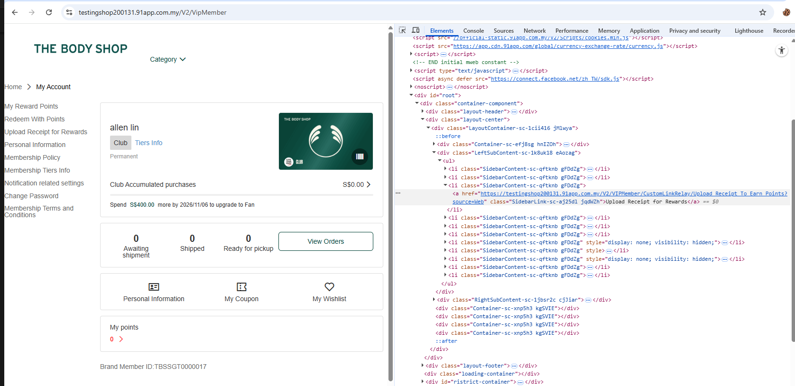

## 需求

https://91appinc.visualstudio.com/DailyResource/_workitems/edit/545381

ShopId : 200130,200131 (the Body Shop Demo, the Body Shop)
Market : MY

因客戶已切換了新的POS系統，不再使用此Custom Link功能
- CustomLink 功能 : 上传收据储积分
- Customlink - 自訂連結API: https://api-hksc.91app.hk/thebodyshop-sg/v1/customlink/offline_order_import/access

 

要讓按鈕不見

## 官網

demo : https://testingshop200131.91app.com.my/
正式 : https://www.thebodyshop.com.sg/

## 參考 PRs

VSTS473717 - 新增CustomLink by ShopId85

https://bitbucket.org/nineyi/nineyi.database.operation/pull-requests/21220/diff

VSTS470312 - 新增正式環境測試店 CustomLink

https://bitbucket.org/nineyi/nineyi.database.operation/pull-requests/21053

VSTS540195 - 移除 Customlink

https://bitbucket.org/nineyi/nineyi.database.operation/pull-requests/23718/diff

## MY 申請移除-Customlink_(200130)-the-Body-Shop-&-(200131)-the-Body-Shop-Demo

PR : https://bitbucket.org/nineyi/nineyi.database.operation/pull-requests/23895