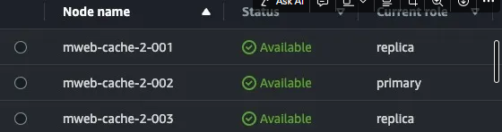

# Adidas 搶購活動

## 目錄
1. [活動資訊](#1-活動資訊)
2. [機器升級](#2-機器升級)
3. [開啟商品選項清快取](#3-開啟商品選項清快取)
4. [需要關注流量的站台](#4-需要關注流量的站台)
5. [確認訂單狀態](#5-確認訂單狀態)
6. [IMS 確認](#6-ims-確認)

 

---

## 1. 活動資訊

**商店**：(41571) Adidas

 

**活動時間**：2/23 11:00

 

**活動名稱**：PNS SUPERSTAR x CLOT聯名搶購

 

**活動連結**：https://www.adidas.com.tw/SalePage/Index/9470643

 

**商品頁序號**：9470643

 

**庫存**：50雙

 

**導流來源**：品牌社群、廣編稿

 

**銷售通路**：官網獨賣（門市、平台都不會賣，有放貨給部分經銷商）

 

---

## 2. 機器升級

三中心 明早10點提升等級

 

**G1**：30, c6i.4xlarge

 

**G2**：10, c6i.4xlarge

 

---

## 3. 開啟商品選項清快取

### 3.1 原因

目前商品選項是隱藏的，因為其中幾個sku沒貨，為不讓消費者，品牌希望10:58 開啟商品選項，開啟後會需要團隊清快取

 

### 3.2 因活動升級調整配置

@macsung 協助加開(前台) mweb-cache replication Node

 

mweb-cache-2 replication node 已加到 2

 

 

---

## 4. 需要關注流量的站台

- 三中心
- 前台
- Salepage Collection Service
- Tag Service
- Member Service

 

---

## 5. 確認訂單狀態

查看 OSM 訂單都是已成立，沒有待付款訂單，IMS在確認訂單是否都有進IMS

 

---

## 6. IMS 確認

確認訂單都有進IMS，IMS啟動可賣量滾算同步，排程預計10分執行

 

---