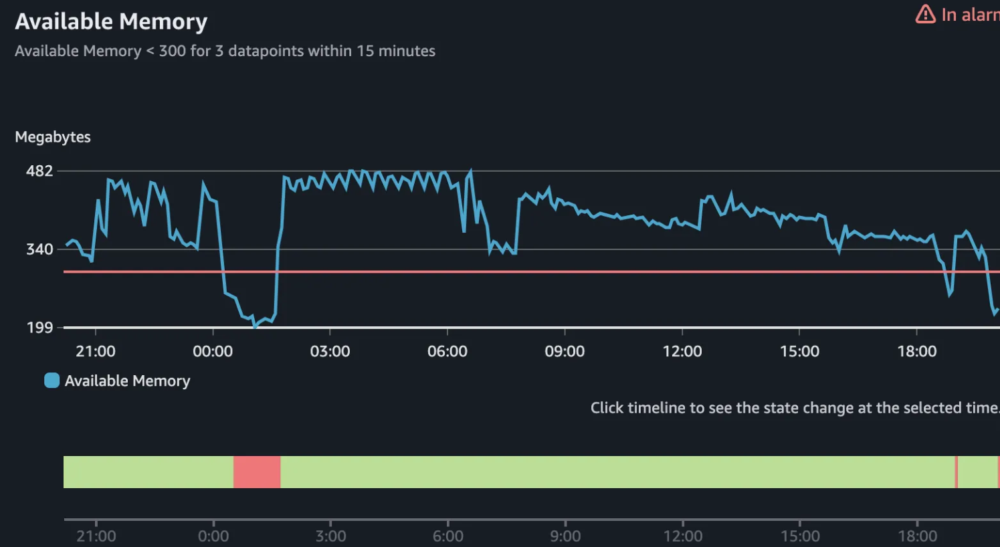

# 效能異常

## 目錄
1. [DB CPU High](#1-db-cpu-high)
2. [頁面時間比平常時間久](#2-頁面時間比平常時間久)
3. [Pod Memory High](#3-pod-memory-high)
4. [SG-MY-OSMWEB3 Low-Availability-Memory](#4-sg-my-osmweb3-low-availability-memory)
5. [機器記憶體非常低](#5-機器記憶體非常低)

<br>

---

## 1. DB CPU High

### 1.1 確認時間區間

<br>

### 1.2 確認 QUERY

<br>

### 1.3 確認 Elmah

<br>

---

## 2. 頁面時間比平常時間久

後台狀況是否穩定?

<br>

### 2.1 測試不同商店

<br>

### 2.2 APP / Web 是否都正常

<br>

### 2.3 詢問操作情境

<br>

### 2.4 CloudWatch / Dashboards / HK-OSM


<br>

---

## 3. Pod Memory High

### 3.1 Dashboard

https://monitoring-dashboard.91app.io/d/kJHAWhwVk/promotion-service-monitor?orgId=2&refresh=10s&from=now-24h&to=now&viewPanel=182

<br>

TW-Prod-Prometheus / prod-promotion-service / TW-Prod-CloudWatch / backend-redis-2-001

<br>

### 3.2 觀察 backend-redis-001 Pod memory

約 55%

<br>


<br>

### 3.3 哪個 group api


<br>

### 3.4 確認時間區間 哪隻 api

大宗都是 "/api/promotion-rules/get"

<br>

```
sum by(_props_RequestPath) ( count_over_time(
{service="prod-promotion-service",container="promotion-web-api"}
| json
|  line_format "{{._props_RequestPath}}" [1m])
)
```

<br>


<br>

---

## 4. SG-MY-OSMWEB3 Low-Availability-Memory



<br>

### 4.1 目前是 SMS IIS 吃最多資源


<br>

### 4.2 OSM Web CPU CloudWatch


<br>

### 4.3 處理

OSM Web ASG 調整由1->2

<br>

OSM Web3 下服務重啟後再上線

<br>

---

## 5. 機器記憶體非常低


<br>


<br>

### 5.1 Dump 檔案路徑

\\10.50.12.51\qa

<br>


<br>


<br>

### 5.2 Memory 後續分析

OSMWeb3 重啟服務後再上alb，並把 ASG 還原由2->1

<br>

IIS 重啓後

<br>


<br>

---