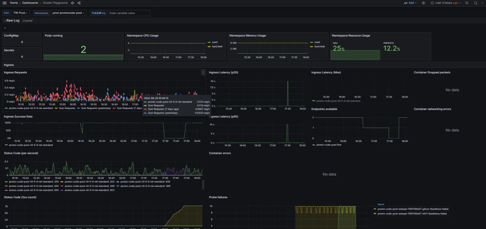
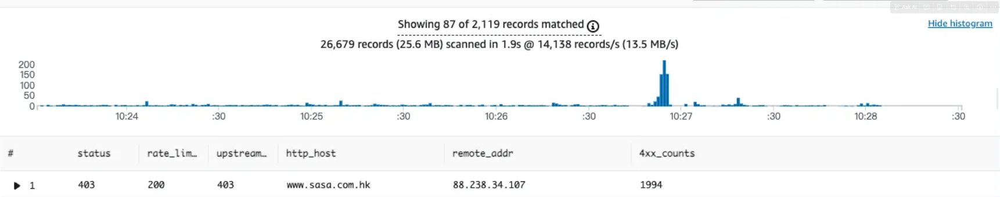

# 上線異常

## 目錄
1. [基本確認項目](#1-基本確認項目)
2. [影響範圍分析](#2-影響範圍分析)
3. [PCPS 優惠券異常](#3-pcps-優惠券異常)
4. [機器異常](#4-機器異常)
5. [監控到 IP 攻擊](#5-監控到-ip-攻擊)

<br>

---

## 1. 基本確認項目

- 如何復現
- 可否 rollback
- 不同環境(tw/hk/my)試驗

<br>

---

## 2. 影響範圍分析

### 2.1 由點到面

- 哪些地方會用到這個方法
- 哪些情景會用到這段程式碼
- 哪些訂單受到影響

<br>

### 2.2 驗證與擴散性檢查

- 請 QA 人員協助驗證情境
- 如果有一間店發生一樣的事情，其他商店會不會也有一樣的事情發生

<br>

---

## 3. PCPS 優惠券異常

### 3.1 Grafana - 服務狀態

prod-promocode-pool

<br>



<br>

### 3.2 Grafana - 細節

https://monitoring-dashboard.91app.io/explore?schemaVersion=1&panes=%7B%22clc%22:%7B%22data[…]om%22:%22now-1h%22,%22to%22:%22now%22%7D%7D%7D&orgId=2

<br>

Amazon.Runtime.AmazonClientException: Error calling AssumeRole for role arn:aws:iam::941374844028:role/Prod-TW-NKP-eks-promocode-pool

<br>

### 3.3 Elmah

三個市場都有 許多 500 error

<br>

HK：http://elmahdashboard.91app.hk/Log/Details/21c12d5a-f3f7-46e7-ae7d-57458a967d58

<br>

TW：http://elmahdashboard.qa.91dev.tw/Log/0/Details/a635ad2f-c1f6-48e9-a7ca-38d62fc8e60e

<br>

### 3.4 錯誤時間

TW /Api/ECoupon/InsertECoupon 17:47:15.640 最後一筆相同錯誤

<br>

HK /Api/ECoupon/InsertECoupon 17:43 最後一筆相同錯誤

<br>

---

## 4. 機器異常

flushdns 並重起 IIS

<br>

```
ipconfig /flushdns
```

<br>

---

## 5. 監控到 IP 攻擊

**Slack 連結**：https://91app.slack.com/archives/G06A3GDC7/p1721874185486219

<br>

@icot [HK Prod] 前台監控到有 IP 試圖攻擊，請協助阻擋

<br>

目前監控到蠻多Elmah錯誤

<br>

**IP**：88.238.34.107

<br>

**Host**：https://www.sasa.com.hk/

<br>

HTTP_X_REAL_IP：88.238.34.107q

<br>



<br>

---