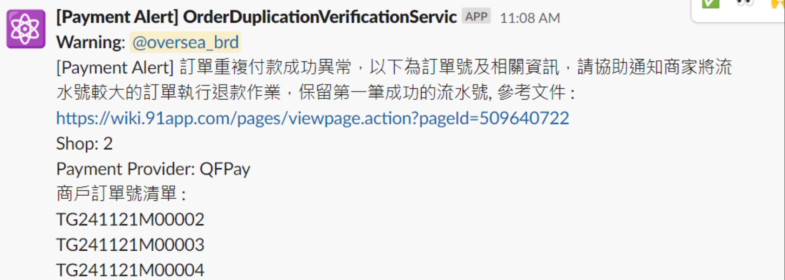
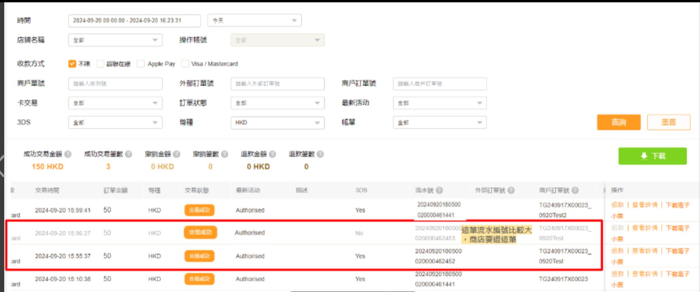
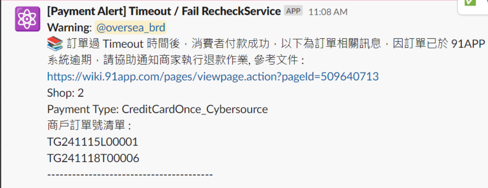
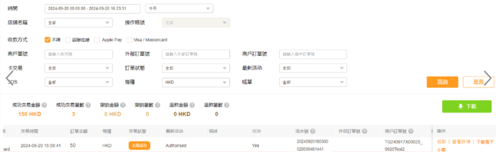

# Alert 文件

## 目錄
1. [HK 退款異常統計](#1-hk-退款異常統計)
2. [HK Prod 第三方付款成功但大表狀態異常](#2-hk-prod-第三方付款成功但大表狀態異常)
3. [30分鐘仍在待付款狀態](#3-30分鐘仍在待付款狀態)
4. [付款成功率](#4-付款成功率)
5. [OrderDuplicationVerification 訂單重複成功付款檢查](#5-orderduplicationverification-訂單重複成功付款檢查)
6. [TimeoutRecheck 檢查](#6-timeoutrecheck-檢查)

<br>

---

## 1. HK 退款異常統計

<br>

撈取 RefundRequestFail , RefundRequestGrouping 確認 TG , Paytype

<br>

---

## 2. HK Prod 第三方付款成功但大表狀態異常

<br>

**排程：** ☘️ Monitor_PaymentSuccessOrderSlaveFlowHide

<br>

### SQL 查詢的條件（邏輯重點）：

<br>

- 最近 4 小時內（BETWEEN @startTime AND @endTime）
- 第三方付款記錄為成功（StatusDef = 'Success'）但其關聯的大表 OrderSlaveFlow 裡面狀態卻是 StatusForSCMDef = 'Hide'（代表這筆訂單處於異常隱藏狀態）

<br>

只要符合這三個條件的任一筆資料存在，就會產生 alert：

<br>

- 第三方付款成功（例如 TapPay、QFPay 回傳成功）
- 該訂單對應的資料還被標記為 隱藏狀態（StatusForSCMDef = 'Hide'）
- 查詢時間區間是 近 4 小時內

<br>

---

## 3. 30分鐘仍在待付款狀態

<br>

[HK] 有 11 筆訂單超過30分鐘仍在待付款狀態，請確認 Payment Middleware Console 是否正常運作

<br>

```
TradesOrderThirdPartyPayment_TypeDef              : AliPayHK_EftPay
TradesOrderThirdPartyPayment_ShopId               : 17
TradesOrderThirdPartyPayment_TradesOrderGroupCode : TG250616B00009
TradesOrderThirdPartyPayment_TotalPayment         : 1685.10
```

<br>

### 三方表資訊確認

<br>

```
TG : TG250616B00009
Table : TradesOrderThirdPartyPayment
TradesOrderThirdPartyPayment_StatusDef : Success
TradesOrderThirdPartyPayment_UpdatedDateTime : 2025-06-16 01:10:28.033
```

<br>

看起來是付款完成後 更新DB 資料失敗

<br>

### 補更新大表狀態

<br>

PR : https://bitbucket.org/nineyi/nineyi.database.operation/pull-requests/22271/overview

<br>

### 更新後大表確認

<br>

OrderSlaveFlow_StatusDef = WaitingToShipping

<br>

### 相關連結

<br>

VSTS : https://91appinc.visualstudio.com/G11n/_workitems/edit/499919

<br>

---

## 4. 付款成功率

ETL : Flow_CheckThirdPartyPaymentOrders

<br>

為 ETL, ShopEtlFlow_Name = Flow_CheckThirdPartyPaymentOrders

<br>

### 修改成功率水位語法

<br>

```sql
USE EtlDB
GO

DECLARE
@flowId BIGINT = (SELECT Top 1 ShopEtlFlow_Id FROM dbo.ShopEtlFlow(NOLOCK) WHERE ShopEtlFlow_ValidFlag = 1 AND ShopEtlFlow_Name = 'Flow_CheckThirdPartyPaymentOrders'),
@serviceId BIGINT = (SELECT Top 1 EtlService_Id FROM dbo.EtlService(NOLOCK) WHERE EtlService_ValidFlag = 1 AND EtlService_Name = 'CheckThirdPartyPaymentBaseService'),
@stepId BIGINT = (SELECT TOP 1 ShopEtlFlowStep_Id FROM ShopEtlFlowStep(NOLOCK) WHERE ShopEtlFlowStep_ValidFlag = 1 AND ShopEtlFlowStep_InitialData = N'{"MonitorInterval":30,"PayType":"CreditCardOnce_Stripe","Threshold":{"OrderAmount":10,"OrderSuccessRate":0.1}}'), -- CreditCardOnce_Stripe
@updateUser VARCHAR(50) = 'VSTS492573',
@now DATETIME = GETDATE()

-- Query
SELECT *
FROM dbo.ShopEtlFlowStep WITH(NOLOCK)
WHERE ShopEtlFlowStep_ValidFlag = 1
AND ShopEtlFlowStep_ShopEtlFlowId = @flowId
AND ShopEtlFlowStep_EtlServiceId = @serviceId
AND ShopEtlFlowStep_Id = @stepId

-- Backup
SELECT *
INTO MATempDB.dbo.tmpEtlDB_ShopEtlFlowStep_VSTS492573_TEST1
FROM dbo.ShopEtlFlowStep WITH(NOLOCK)

-- update 修改付款成功率水位需為 0.6
-- original :　{"MonitorInterval":60,"PayType":"CreditCardOnce_Stripe","Threshold":{"OrderAmount":10,"OrderSuccessRate":0.5}}
UPDATE dbo.ShopEtlFlowStep
SET ShopEtlFlowStep_InitialData = N'{"MonitorInterval":60,"PayType":"CreditCardOnce_Stripe","Threshold":{"OrderAmount":10,"OrderSuccessRate":0.6}}',
ShopEtlFlowStep_UpdatedTimes = ShopEtlFlowStep_UpdatedTimes + 1,
ShopEtlFlowStep_UpdatedUser = @updateUser,
ShopEtlFlowStep_UpdatedDateTime = @now
WHERE ShopEtlFlowStep_ValidFlag = 1
AND ShopEtlFlowStep_ShopEtlFlowId = @flowId
AND ShopEtlFlowStep_EtlServiceId = @serviceId
AND ShopEtlFlowStep_Id = @stepId

-- verify
SELECT *
FROM dbo.ShopEtlFlowStep WITH(NOLOCK)
WHERE ShopEtlFlowStep_ValidFlag = 1
AND ShopEtlFlowStep_ShopEtlFlowId = @flowId
AND ShopEtlFlowStep_EtlServiceId = @serviceId
AND ShopEtlFlowStep_Id = @stepId
```

<br>

### 手動查詢付款成功率語法

<br>

```sql
use WebStoreDB;

WITH A AS(
select Dateadd(SECOND,58,DATEADD(MINUTE,1,DATEADD(HOUR,DATEDIFF(HOUR,0,TradesOrderThirdPartyPayment_CreatedDateTime),0))) AS HOURLY,
	   Sum(CASE WHEN TradesOrderThirdPartyPayment_StatusDef != 'WaitingToPay' AND TradesOrderThirdPartyPayment_StatusDef != 'Hidden' then 1 else 0 end) AS Total_Count,
	   Sum(CASE WHEN TradesOrderThirdPartyPayment_StatusDef = 'Success' or 
					 TradesOrderThirdPartyPayment_StatusDef = 'RePaySuccess' or 
					 TradesOrderThirdPartyPayment_StatusDef = 'AuthSuccess' or 
					 TradesOrderThirdPartyPayment_StatusDef = 'CancelAfterSuccess' THEN 1 ELSE 0 END) AS Success_Count,
	   Sum(CASE WHEN TradesOrderThirdPartyPayment_StatusDef = 'Fail' then 1 else 0 end) AS Fail_Count,
	   Sum(CASE WHEN TradesOrderThirdPartyPayment_StatusDef = 'Timeout' then 1 else 0 end) AS Timeout_Count,
	   Sum(CASE WHEN TradesOrderThirdPartyPayment_StatusDef = 'CancelRequest' then 1 else 0 end) AS CancelRequest_Count
from TradesOrderThirdPartyPayment(nolock)
where TradesOrderThirdPartyPayment_ValidFlag = 1
and TradesOrderThirdPartyPayment_TypeDef = 'CreditCardOnce_Stripe'
and TradesOrderThirdPartyPayment_DateTime BETWEEN '2025-01-01' AND '2025-05-20'
GROUP BY Dateadd(SECOND,58,DATEADD(MINUTE,1,DATEADD(HOUR,DATEDIFF(HOUR,0,TradesOrderThirdPartyPayment_CreatedDateTime),0))))
SELECT HOURLY,
       Total_Count,
	   Success_Count,
	   Fail_Count,
	   Timeout_Count,
	   CancelRequest_Count,
	   Cast(Success_Count*100 / Total_Count as VARCHAR(20)) + '%' AS Etl_Define_SuccessRate
FROM A
```

<br>

```sql
use WebStoreDB;

--EWallet_PayMe
--CreditCardOnce_Stripe
DECLARE @payType VARCHAR(30) = 'CreditCardOnce_Stripe';

WITH a AS (
    SELECT 
        DATEADD(HOUR, DATEDIFF(HOUR, 0, DATEADD(SECOND,-35,DATEADD(MINUTE, -23, TradesOrderThirdPartyPayment_CreatedDateTime))), 0) AS CustomHourly,
        SUM(CASE WHEN TradesOrderThirdPartyPayment_StatusDef NOT IN ('WaitingToPay','Hidden') THEN 1 ELSE 0 END) AS Total_Count,
        SUM(CASE WHEN TradesOrderThirdPartyPayment_StatusDef IN ('Success','RePaySuccess','AuthSuccess','CancelAfterSuccess') THEN 1 ELSE 0 END) AS Success_Count,
        SUM(CASE WHEN TradesOrderThirdPartyPayment_StatusDef = 'Fail' THEN 1 ELSE 0 END) AS Fail_Count,
        SUM(CASE WHEN TradesOrderThirdPartyPayment_StatusDef = 'Timeout' THEN 1 ELSE 0 END) AS Timeout_Count,
        SUM(CASE WHEN TradesOrderThirdPartyPayment_StatusDef = 'CancelRequest' THEN 1 ELSE 0 END) AS CancelRequest_Count
    FROM TradesOrderThirdPartyPayment (NOLOCK)
    WHERE TradesOrderThirdPartyPayment_TypeDef = @payType
      AND TradesOrderThirdPartyPayment_ValidFlag = 1
      AND TradesOrderThirdPartyPayment_CreatedDateTime > '2025-03-25'
      AND TradesOrderThirdPartyPayment_CreatedDateTime < '2025-06-25'
    GROUP BY DATEADD(HOUR, DATEDIFF(HOUR, 0, DATEADD(SECOND,-35,DATEADD(MINUTE, -23, TradesOrderThirdPartyPayment_CreatedDateTime))), 0)
)
SELECT *,
       CAST(CAST(Success_Count * 100.0 / Total_Count AS DECIMAL(10,2)) AS VARCHAR(30)) + '%' AS SuccessRate,
	   cast(Cast(Success_Count*100 / Total_Count as DECIMAL(10,2)) as VARCHAR(30)) + '%' as SuccessRate2,
	   CAST(CAST(Fail_Count * 100.0 / Total_Count AS DECIMAL(10,2)) AS VARCHAR(30)) + '%' AS FailRate,
       DATEADD(SECOND,35,DATEADD(MINUTE, 23, CustomHourly)) AS StartTime,
       DATEADD(SECOND,35,DATEADD(MINUTE, 23 + 60, CustomHourly)) AS EndTime
FROM a
--WHERE Total_Count > 10 
--AND (Success_Count * 1.0 / NULLIF(Total_Count,0)) < 0.6
--AND (Success_Count * 1.0 / NULLIF(Total_Count,0)) > 0.5
ORDER BY CustomHourly;
```

<br>

---

## 5. OrderDuplicationVerification 訂單重複成功付款檢查

<br>

### 說明

<br>

每天撈取前一天 "Timeout", "Success" 訂單，向 QFPay 確認該筆訂單的成功付款比數

<br>



<br>

### 商店協助處理事項

<br>

請商家協助至後台同一筆商戶訂單號較新的流水號執行退款，只保留地一筆成功付款流水號

<br>



<br>

---

## 6. TimeoutRecheck 檢查

<br>

### 說明

<br>

每天撈取前一天 Timeout 訂單，向 QFPay 確認該筆訂單的狀態

<br>



<br>

### 商店協助處理事項

<br>

請協助至後台對該筆商戶訂單號執行退款

<br>



<br>