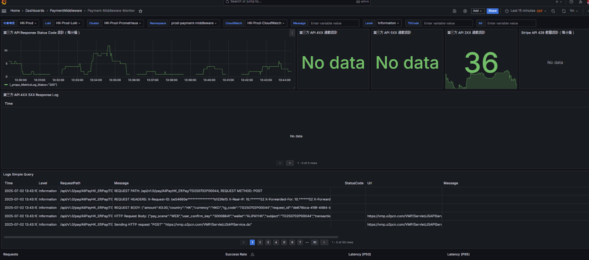

# Payment Middleware 文件

## 目錄
1. [Domain](#1-domain)
2. [Pay](#2-pay)
3. [Query](#3-query)
4. [Refund](#4-refund)
5. [RefundQuery](#5-refundquery)
6. [Unhandled](#6-unhandled)
7. [ErrorCode](#7-errorcode)
8. [狀態](#8-狀態)
9. [Dashboard](#9-dashboard)

 

---

## 1. Domain

**HK_QA**

 

https://payment-middleware-api-internal.qa1.hk.91dev.tw

 

**HK_PROD**

 

https://payment-middleware-api-internal.hk.91app.io

 

---

## 2. Pay

/api/v1.0/pay/TwoCTwoP/TG250617Q00046

 

---

## 3. Query

/api/v1.0/QueryPayment/CreditCardOnce_Stripe

 

---

## 4. Refund

/api/v1.0/Refund/TwoCTwoP/TG240229K00030

 

---

## 5. RefundQuery

有分退後Query 以及 退前的 Query

 

/api/v1.0/RefundQuery/TwoCTwoP

 

---

## 6. Unhandled

如果是開發時在 paymentmiddleware 測試過程 unhandled 的情況就需要到paymentmiddleware 看 Grafana log

 

---

## 7. ErrorCode

4003 => Pending

 

3000 => Failed

 

---

## 8. 狀態

RefundRequestGrouping

 

RefundRequestProcessing

 

RefundRequestFail

 

---

## 9. Dashboard

https://monitoring-dashboard.91app.io/d/Wc3ALtv4k/payment-middleware-monitor?orgId=2&refresh=1m

 

 