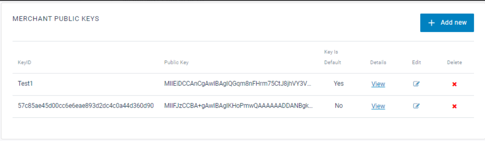

# 2C2P 文件

## 目錄
1. [資料表 Paytype](#1-資料表-paytype)
2. [退款 NMQ](#2-退款-nmq)
3. [錯誤紀錄](#3-錯誤紀錄)
4. [退款方式](#4-退款方式)
5. [商戶後台](#5-商戶後台)
6. [文件](#6-文件)
7. [Channel Code](#7-channel-code)
8. [VSTS 測試紀錄](#8-vsts-測試紀錄)
9. [Error Code](#9-error-code)
10. [商戶公私鑰設定步驟](#10-商戶公私鑰設定步驟)

<br>

---


## 1. 資料表 Paytype

TwoCTwoP

<br>

---

## 2. 退款 NMQ

**Job_Id:** 440

<br>

**Job_Name:** TwoCTwoPRefundRequestFinish

<br>

**Job_Description:** PaymentMiddleware退款完成

<br>

**Job_ClassName:** NineYi.SCM.Frontend.NMQV2.ThirdPartyPayments.PaymentMiddleWareRefundRequestFinishProcess

<br>

**Task Data:**
```json
{"RefundRequestIds":[121537],"TradesOrderGroupId":1476443,"PayType":"TwoCTwoP"}
```

<br>

---

## 3. 錯誤紀錄

### 3.1 餘額不足無法退款

**訊息:** 46,Insufficient funds to perform refund.

<br>

paymentmilldeware : "46" => ReturnCodes.RefundPending

<br>

會待下一次再確認

<br>

---

## 4. 退款方式

執行退款前，會先跑 this.Refund，確認該筆交易訂單已經是 Settled 狀態

<br>

status = "S"，才會進行退款否則會等待下一輪再確認

<br>

---

## 5. 商戶後台

**正式登入連結**：https://demo2.2c2p.com/My2C2P/client/2.0/Login
**QA 登入連結**：https://my.2c2p.com/2.0/Login

<br>

---

## 6. 文件

**API Payment Inquiry Response Parameter**：https://developer.2c2p.com/docs/api-payment-inquiry-response-parameter


**官網** : https://2c2p.com/accept-payments
**API 文件入口  : https://developer.2c2p.com/docs/general

**測試環境** : https://developer.2c2p.com/docs/sandbox

**測試卡號** : https://developer.2c2p.com/docs/reference-testing-information

**Response Code** : https://developer.2c2p.com/docs/response-code-payment

**正流程** : https://developer.2c2p.com/docs/redirect-api-integrate-with-payment

**逆流程** : https://developer.2c2p.com/docs/payment-maintenance-refund-guide

**專案規劃** : https://docs.google.com/presentation/d/1X5YyfOXTNJGXxA7C3gZutQVGzCJRJbZ-Z1A-gQqcDsY/edit#slide=id.gb6f87d9610_0_87

**設計稿** : https://www.figma.com/design/dF3hNNEAnUVSa3EwQ9Hp5S/2C2P-%E4%B8%B2%E6%8E%A5?node-id=1-74&node-type=canvas&t=GBCfmMCM3kTsrNWk-0
<br>

**上線說明文件** : https://docs.google.com/presentation/d/12z62hP0xSCkXpiHids7RYZa2fNn9xnEVXHVZ57sTgTg/edit#slide=id.g875f5f0135_0_10

**Knight 小筆記** : https://docs.google.com/document/d/1C0QRosNhyH0WT-70F13AmrlE0ZrzkGZybtCNvqBwcT4/edit

**串接問題清單** : https://docs.google.com/spreadsheets/d/1RN1Bt3v42LvgZy7nAQyssHfBvhYqFFLbxRA46ekTA4k/edit?gid=1983093337#gid=1983093337
---

## 7. Channel Code

**Reference Codes Payment Scheme**：https://developer.2c2p.com/docs/reference-codes-payment-scheme

<br>

---

## 8. VSTS 測試紀錄

**VSTS 連結**：https://91appinc.visualstudio.com/G11n/_workitems/edit/345544

<br>

**測試內容**：目前測試過有紀錄分辨信用卡一次付清、信用卡分期、ALIPAY 回傳值的差異

<br>

**說明**：目前將會在 ERP 第三方金流付款查詢紀錄的欄位（根據『信用卡一次付清』、『信用卡分期付款』、『AlipayHK』）

<br>

---

## 9. Error Code

### 9.1 Pay & Query

**Response Code Payment**：https://developer.2c2p.com/docs/response-code-payment

<br>

| Code | Description | 說明 |
|------|-------------|------|
| 0000 | Successful | 付款成功 |
| 2001 | Transaction in progress | 取得付款連結 |
| 0003 | Transaction is cancelled | 2C2P 付款選擇頁按取消 |
| 4081 | Unable to Authenticate Card Holder | 3D 驗證頁案取消 |

<br>

### 9.2 Payment Maintenance Result Codes (Refund & Cancel)

**Response Code Payment Maintenance**：https://developer.2c2p.com/docs/response-code-payment-maintenance-result-code

<br>

| Code | Description | 說明 |
|------|-------------|------|
| 00 | Successful | Success |
| 12 | Transaction in progress | Transaction status is not valid to perform your action. |
| 99 | Unable to Authenticate Card Holder | 3D 驗證失敗 |

<br>

---

## 10. 商戶公私鑰設定步驟

### 10.1 Step1. 產生公私鑰

<br>

**方法一：下載並執行 Key Generation**

<br>

使用官方提供的 Key Generation 工具：https://developer.2c2p.com/docs/certificate-generation-guide

<br>

**方法二：使用 OpenSSL**

<br>

下載 OpenSSL 後，在 PowerShell 執行以下語法：

<br>

- `.key` 檔為商戶私鑰
- `.crt` 檔為商戶公鑰

<br>

```powershell
# 請一行一行執行並輸入每個 Command 所需資訊
# 僅識別使用 KeyName = $"S{SupplierId}S{ShopId}"
$KeyName="S12S34"
  
# 產生 key (這就是商戶私鑰)
&"C:\Program Files\OpenSSL-Win64\bin\openssl.exe" genrsa -out "$KeyName.key" 2048
  
# 產生 csr (後續相關參數可以直接 Enter 跳過)
# 相關參數說明可以參考 https://blog.miniasp.com/post/2022/06/14/How-to-request-new-tls-certificate-using-OpenSSL
&"C:\Program Files\OpenSSL-Win64\bin\openssl.exe" req -new -key "$KeyName.key" -out "$KeyName.csr"
  
# 產生 crt(這就是商戶公鑰)
&"C:\Program Files\OpenSSL-Win64\bin\openssl.exe" x509 -req -in "$KeyName.csr" -signkey "$KeyName.key" -out "$KeyName.crt" -days 365
 
# 產生 cer
&"C:\Program Files\OpenSSL-Win64\bin\openssl.exe" x509 -inform PEM -in "$KeyName.crt" -outform DER -out "$KeyName.cer"
 
# 產生 pem
&"C:\Program Files\OpenSSL-Win64\bin\openssl.exe" x509 -pubkey -in "$KeyName.cer" -noout > "$KeyName.pem"
```

<br>

### 10.2 Step2. 上傳 Public Key

<br>

**設定項目**：

<br>

- **KeyId**：可任意取適合的名字
- **Public Key**：這裡填入公鑰

<br>



<br>

---