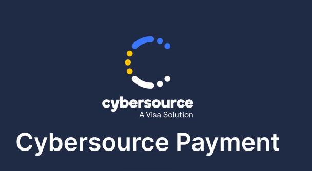

# Cybersource 文件



採用 Hosted Payment Service 模式，透過 Payment Middleware 組裝付款網址供前端跳轉使用

## 目錄

1. [文件與聯絡資訊](#文件與聯絡資訊)
2. [整合架構](#整合架構)
3. [環境配置](#環境配置)
4. [付款結果判斷](#付款結果判斷)
5. [退款結果判斷](#退款結果判斷)
6. [退款查詢判斷](#退款查詢判斷)
7. [異常紀錄與疑難排解](#異常紀錄與疑難排解)

<br>

## 文件與聯絡資訊

**PayMethod**: `CreditCardOnce_Cybersource`

#### 內部設定文件

| 文件名稱 | 用途 | 連結 |
|----------|------|------|
| **API Key 設定指南** | 基本配置說明 | [Wiki 文件](https://wiki.91app.com/pages/viewpage.action?pageId=484048926) |
| **API Key 設定進階** | 詳細配置步驟 | [Google 文件](https://docs.google.com/document/d/13EJhLch6NtPvpSt2RBOGj5wxfeeCvkH7h6tODjdHAwA/edit?tab=t.0) |

<br>

#### 官方技術文件

| 資源類型 | 說明 | 連結 |
|----------|------|------|
| **開發者文件** | 完整 API 文件與指南 | [Developer Portal](https://developer.cybersource.com/) |
| **API 參考** | REST API 完整規格 | [API Reference](https://developer.cybersource.com/api-reference-assets/index.html) |
| **Hosted Checkout** | 託管付款頁面文件 | [PDF 指南](https://developer.cybersource.com/library/documentation/dev_guides/Secure_Acceptance_Hosted_Checkout/Secure_Acceptance_Hosted_Checkout.pdf) |
| **測試卡資訊** | 開發測試用卡號 | [Test Cards](https://developer.cybersource.com/docs/cybs/en-us/tms/developer/ctv/rest/tms/tms-create-request/tms-test-cards.html) |
| **錯誤代碼說明** | Reason Code 查詢 | [錯誤代碼表](https://ebc2test.cybersource.com/content/ebc/help/cybs/zh-tw/business-center/user/all/cybs/ebc2_olh/trns_mngmt_intro/view_details/details/reason_code_descriptions.html) |

<br>

#### 聯絡窗口

| 聯絡人 | 職責 | Email |
|--------|------|-------|
| **Jackie Leung** | 業務聯絡人 | jackie.leung@globalpay.com |
| **IT Team** | 技術支援團隊 | apecommerce@globalpay.com |

<br>
<br>

## 整合架構

<br>

### 付款流程說明

<br>

#### 付款發起
- PMW 回傳 ReturnUrl 給前端
- 前端跳轉至 Cybersource 付款填卡頁

<br>

#### 付款完成回調
當 Cybersource 付款完成後，系統執行以下步驟

| 步驟 | 端點 | 說明 |
|------|------|------|
| **回調接收** | `PayChannel/ReturnPost/{payMethod}/{payChannel}` | 接收第三方金流回傳資料 |
| **自動轉導** | 伺服器端動態組裝 | 產生 HTML 表單包含跳轉參數 |
| **最終跳轉** | `/V2/PayChannel/CreditCardOnce/Cybersource/{tgCode}` | 帶入 shopId 和 uniqueKey 參數 |

<br>
<br>

## 環境配置

### API 端點設定

| 端點類型 | URL | 用途 |
|----------|-----|------|
| **基礎 API** | `https://api.cybersource.com` | API 呼叫基礎網址 |
| **付款頁面** | `https://secureacceptance.cybersource.com/pay` | 託管付款頁面網址 |

<br>

## 付款結果判斷

### 狀態判別邏輯

| 結果狀態 | 判斷條件 | 說明 |
|----------|----------|------|
| **成功** | • `_embedded.transactionSummaries.applicationInformation.applications.name` = `"ics_bill"`<br>• `reasonCode` = `"100"` | 付款交易完成 |
| **失敗** | • `Embedded.TransactionSummaries.ReasonCode` ≠ `"100"`<br>• `rFlag` = `"ESYSTEM"` | 付款交易失敗 |
| **待付款** | 其他所有情況 | 狀態同步延遲或處理中 |

### 成功付款回應範例

<br>

```json
{
  "_links": {
    "self": {
      "href": "https://api.cybersource.com/tss/v2/searches/62064e83-efc6-4664-8a54-e5cf79a88144",
      "method": "GET"
    }
  },
  "searchId": "62064e83-efc6-4664-8a54-e5cf79a88144",
  "save": false,
  "query": "clientReferenceInformation.code:TG250619Z00085",
  "count": 3,
  "totalCount": 3,
  "limit": 20,
  "offset": 0,
  "timezone": "GMT",
  "submitTimeUtc": "2025-06-19T16:00:10Z",
  "_embedded": {
    "transactionSummaries": [
      {
        "id": "7503486675756718803616",
        "submitTimeUtc": "2025-06-19T15:57:47Z",
        "merchantId": "gphk000048256113",
        "applicationInformation": {
          "applications": [
            {
              "name": "ics_bill",
              "reasonCode": "100",
              "rCode": "1",
              "rFlag": "SOK",
              "reconciliationId": "7503486675756718803616",
              "rMessage": "Request was processed successfully.",
              "returnCode": "1260000"
            },
            {
              "name": "ics_pa_validate",
              "reasonCode": "100",
              "rCode": "1",
              "rFlag": "SOK",
              "reconciliationId": "7503486675756718803616",
              "rMessage": "ics_pa_validate service was successful",
              "returnCode": "1050001"
            },
            {
              "name": "ics_auth",
              "reasonCode": "100",
              "rCode": "1",
              "rFlag": "SOK",
              "reconciliationId": "7503486675756718803616",
              "rMessage": "Request was processed successfully.",
              "returnCode": "1010000"
            }
          ],
          "reasonCode": "100",
          "rCode": "1",
          "rFlag": "SOK"
        },
        "buyerInformation": {},
        "clientReferenceInformation": {
          "code": "TG250619Z00085",
          "applicationName": "Secure Acceptance Web/Mobile",
          "partner": {}
        },
        "consumerAuthenticationInformation": {
          "transactionId": "212JSW4nA8kwuQhymGU1",
          "eciRaw": "2"
        },
        "deviceInformation": {
          "ipAddress": "124.217.189.178"
        },
        "fraudMarkingInformation": {},
        "merchantInformation": {
          "resellerId": "cybsgpap"
        },
        "orderInformation": {
          "billTo": {
            "address1": "軒尼詩道130號",
            "state": "N/A",
            "city": "灣仔",
            "country": "HK",
            "postalCode": "N/A",
            "email": "annwkwong@ymail.com",
            "firstName": "WAI KUEN",
            "lastName": "WONG"
          },
          "shipTo": {},
          "amountDetails": {
            "totalAmount": "402.50",
            "currency": "HKD"
          }
        },
        "paymentInformation": {
          "paymentType": {
            "type": "credit card",
            "method": "MC"
          },
          "customer": {},
          "card": {
            "suffix": "1279",
            "prefix": "528946",
            "type": "002"
          }
        },
        "processingInformation": {
          "commerceIndicator": "6",
          "commerceIndicatorLabel": "spa",
          "authorizationOptions": {
            "authIndicator": "1"
          }
        },
        "processorInformation": {
          "processor": {
            "name": "vdchsbcbank"
          },
          "approvalCode": "385869",
          "eventStatus": "Pending",
          "retrievalReferenceNumber": "517015918327"
        },
        "pointOfSaleInformation": {
          "partner": {},
          "emv": {}
        },
        "riskInformation": {
          "providers": {
            "fingerPrint": {}
          }
        },
        "_links": {
          "transactionDetail": {
            "href": "https://api.cybersource.com/tss/v2/transactions/7503486675756718803616",
            "method": "GET"
          }
        },
        "installmentInformation": {},
        "errorInformation": {}
      },
      {
        "id": "7503486126686712803598",
        "submitTimeUtc": "2025-06-19T15:56:52Z",
        "merchantId": "gphk000048256113",
        "applicationInformation": {
          "applications": [
            {
              "name": "ics_bill"
            },
            {
              "name": "ics_auth"
            },
            {
              "name": "ics_arc"
            },
            {
              "name": "ics_pa_enroll",
              "reasonCode": "475",
              "rCode": "0",
              "rFlag": "DAUTHENTICATE",
              "rMessage": "The cardholder is enrolled in Payer Authentication.  Please authenticate before proceeding with authorization.",
              "returnCode": "1052000"
            }
          ],
          "reasonCode": "475",
          "rCode": "0",
          "rFlag": "DAUTHENTICATE"
        },
        "buyerInformation": {},
        "clientReferenceInformation": {
          "code": "TG250619Z00085",
          "applicationName": "Secure Acceptance Web/Mobile",
          "partner": {}
        },
        "consumerAuthenticationInformation": {
          "transactionId": "212JSW4nA8kwuQhymGU1"
        },
        "deviceInformation": {
          "ipAddress": "124.217.189.178"
        },
        "fraudMarkingInformation": {},
        "merchantInformation": {
          "resellerId": "cybsgpap"
        },
        "orderInformation": {
          "billTo": {
            "address1": "軒尼詩道130號",
            "state": "N/A",
            "city": "灣仔",
            "country": "HK",
            "postalCode": "N/A",
            "email": "annwkwong@ymail.com",
            "firstName": "WAI KUEN",
            "lastName": "WONG"
          },
          "shipTo": {},
          "amountDetails": {}
        },
        "paymentInformation": {
          "paymentType": {
            "type": "credit card",
            "method": "MC"
          },
          "customer": {},
          "card": {
            "suffix": "1279",
            "prefix": "528946",
            "type": "002"
          }
        },
        "processingInformation": {},
        "processorInformation": {
          "processor": {}
        },
        "pointOfSaleInformation": {
          "partner": {},
          "emv": {}
        },
        "riskInformation": {
          "providers": {
            "fingerPrint": {}
          }
        },
        "_links": {
          "transactionDetail": {
            "href": "https://api.cybersource.com/tss/v2/transactions/7503486126686712803598",
            "method": "GET"
          }
        },
        "installmentInformation": {},
        "errorInformation": {}
      },
      {
        "id": "7503486015566714703225",
        "submitTimeUtc": "2025-06-19T15:56:41Z",
        "merchantId": "gphk000048256113",
        "applicationInformation": {
          "applications": [
            {
              "name": "ics_pa_setup",
              "reasonCode": "100",
              "rCode": "1",
              "rFlag": "SOK",
              "rMessage": "Setup complete.",
              "returnCode": "1865000"
            }
          ],
          "reasonCode": "100",
          "rCode": "1",
          "rFlag": "SOK"
        },
        "buyerInformation": {},
        "clientReferenceInformation": {
          "code": "TG250619Z00085",
          "applicationName": "Secure Acceptance Web/Mobile",
          "partner": {}
        },
        "consumerAuthenticationInformation": {},
        "deviceInformation": {},
        "fraudMarkingInformation": {},
        "merchantInformation": {
          "resellerId": "cybsgpap"
        },
        "orderInformation": {
          "billTo": {},
          "shipTo": {},
          "amountDetails": {}
        },
        "paymentInformation": {
          "paymentType": {
            "type": "credit card",
            "method": "MC"
          },
          "customer": {},
          "card": {
            "suffix": "1279",
            "prefix": "528946",
            "type": "002"
          }
        },
        "processingInformation": {},
        "processorInformation": {
          "processor": {}
        },
        "pointOfSaleInformation": {
          "partner": {},
          "emv": {}
        },
        "riskInformation": {
          "providers": {
            "fingerPrint": {}
          }
        },
        "_links": {
          "transactionDetail": {
            "href": "https://api.cybersource.com/tss/v2/transactions/7503486015566714703225",
            "method": "GET"
          }
        },
        "installmentInformation": {},
        "errorInformation": {}
      }
    ]
  }
}
```

## 退款結果判斷

### 退款狀態對應表

| API 回應 Status | 系統狀態 | 說明 |
|-----------------|----------|------|
| `"PENDING"` | `RefundPending` | 退款處理中 |
| `"500"` | `RefundFailed` | 退款失敗 |
| **其他值** | `Exception` | 系統異常 |

<br>

## 退款查詢判斷

### 查詢狀態對應表

| ApplicationInformation.Status | 系統狀態 | 說明 |
|------------------------------|----------|------|
| `"PENDING"` | `RefundPending` | 退款處理中 |
| `"TRANSMITTED"` | `Success` | 退款已傳送成功 |
| ApplicationInformation.ReasonCode = `"100"` | `RefundPending` | 退款處理中（原因碼 100） |
| **其他值** | `RefundRejected` | 退款被拒絕 |

<br>

## 異常紀錄與疑難排解

### 1. RefundQuery 查詢循環異常

#### 問題描述
退款請求完成後，系統持續進行 RefundQuery 查詢直到逾時中斷

#### 異常流程
| 步驟 | 狀態 | 說明 |
|------|------|------|
| 1 | 執行 Refund | 發起退款請求 |
| 2 | RefundProcessing | 每小時執行 RefundQuery 查詢 |
| 3 | Pending 4003 | 最後一次查詢結果仍為處理中 |
| 4 | 系統 Redo | 因逾時重新處理 |
| 5 | Transmitted | 最終退款狀態為成功 |

#### 根本原因
**Cybersource 退款查詢回應時間較長**，可能需要數小時才能取得最終結果

<br>

### 2. 退款失敗異常處理

#### 案例參考
[Slack 討論串](https://91app.slack.com/archives/C7T5CTALV/p1758171601964099)

#### 錯誤訊息分析

**退款回應錯誤**
```json
{
  "id": "7581686318736754003851",
  "submitTimeUtc": "2025-09-18T04:10:32Z",
  "status": "201",
  "errorInformation": {
    "reason": "UNAUTHORIZED_CARD",
    "message": "Decline - Inactive card or card not authorized for card-not-present transactions."
  }
}
```

**查詢回應錯誤**
```json
{
  "request_id": "checkRefundStatus",
  "transaction_id": "7581686318736754003851",
  "return_code": "4002",
  "return_message": "Closed Account",
  "extend_info": {}
}
```

#### 處理方式
**聯繫 AM 進行線下退款處理**

<br>

### 3. 付款查詢 401 權限異常

#### 問題分析
- **現象**：付款流程完成但無法查詢訂單狀態
- **影響**：可能導致付款成功但系統判定為 Timeout
- **參考**：[Slack 討論串](https://91app.slack.com/archives/C01BRM657TN/p1731381407624779)

#### 解決流程
1. **通報 AM** 並提供受影響的訂單號碼
2. **請 Cybersource 釐清** 系統狀態與查詢結果
3. **監控機制** 定期檢查失敗與逾期訂單的付款狀態

<br>

### 4. 狀態判定異常修正

#### DCARDREFUSED 狀態處理修正

| 項目 | 詳細資訊 |
|------|----------|
| **問題** | 付款顯示 Timeout/Fail 但實際付款成功 |
| **原因** | DCARDREFUSED 狀態被錯誤歸類為 Fail |
| **修正** | 調整為 Timeout 狀態，透過 30 分鐘 Recheck 自動確認 |
| **發布日期** | 2024/11/19 |
| **追蹤** | [VSTS #442003](https://91appinc.visualstudio.com/DailyResource/_workitems/edit/442003) |

<br>

### 5. 退款 SYSTEM_ERROR 處理

#### 錯誤特徵
- **狀態代碼**：`SYSTEM_ERROR`
- **常見原因**：店家線下退費未同步狀態

#### 處理方式
**請 HK 團隊協助更新退款單狀態**